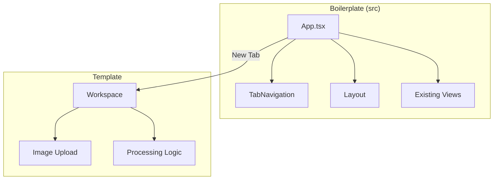
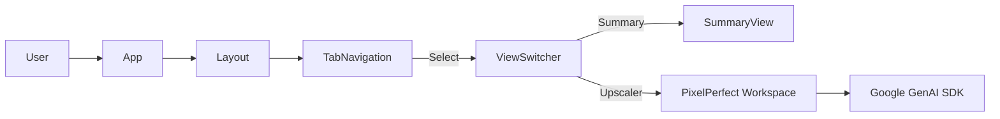
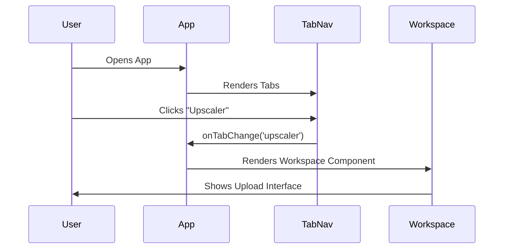

# PixelPerfect AI Integration PRD

## User Review Required

> [!IMPORTANT] > **React Version Conflict:** The `template` uses React v19, while the boilerplate (`src`) uses React v18. We will proceed with React v18 to maintain stability of the existing boilerplate. Some `template` features might need adjustment if they rely on v19 specifics (unlikely for standard UI components).

> [!WARNING] > **Styling Conflicts:** The boilerplate uses DaisyUI, while the template uses raw Tailwind. We will namespace or carefully integrate the template components to avoid visual regressions.

## Proposed Changes

### 1. Context Analysis

#### 1.1 Files Analyzed

- `template/App.tsx`
- `template/package.json`
- `src/App.tsx`
- `src/main.tsx`
- `src/package.json` (Root)
- `vite.config.ts`
- `index.html`

#### 1.2 Component & Dependency Overview



#### 1.3 Current Behavior Summary

- **Boilerplate (`src`):** A Vite+React app with DaisyUI, Supabase Auth, and tab-based navigation (`Summary`, `CategoryView`).
- **Template:** A standalone Vite+React app for Image Upscaling (`PixelPerfect AI`), containing a landing page and a main `Workspace` component.

#### 1.4 Problem Statement

Integrate the `PixelPerfect AI` functionality (specifically the `Workspace`) into the boilerplate without disrupting existing authentication, routing, or styling.

---

### 2. Proposed Solution

#### 2.1 Architecture Summary

- **Component Migration:** Move `template/components` to `src/components/pixelperfect`.
- **Dependency Merge:** Add `@google/genai`, `jszip` to root `package.json`. Ensure `lucide-react` compatibility.
- **Routing Integration:** Add a new "Upscaler" (or similar) tab to `src/App.tsx` and `src/mocks/data.ts`.
- **Auth Protection:** The new tab will inherit the existing `Layout` and `AuthErrorHandler` protection.

#### 2.2 Architecture Diagram



#### 2.3 Key Technical Decisions

- **React 18:** Stick to React 18 (Boilerplate standard).
- **Path Aliases:** Update template imports to use relative paths or new aliases if needed.
- **Styling:** Keep template's Tailwind classes but verify against DaisyUI defaults.

#### 2.4 Data Model Changes

- Update `src/mocks/data.ts` to include the new category/tab.

---

### 2.5 Runtime Execution Flow



---

### 3. Detailed Implementation Spec

#### A. `package.json` (Root)

- **Changes Needed:** Add dependencies from `template/package.json`.
- **New Dependencies:**
  - `@google/genai`
  - `jszip`
  - Check `lucide-react` version (align with boilerplate if possible, or upgrade boilerplate).

#### B. `src/components/pixelperfect/`

- **Action:** Copy `template/components/*` to this directory.
- **Refactor:** Update imports in these files to point to correct locations.
- **File Mapping:**
  - `template/components/Workspace/*` -> `src/components/pixelperfect/Workspace/*`
  - `template/components/ui/*` -> `src/components/pixelperfect/ui/*` (if any)

#### C. `src/mocks/data.ts`

- **Changes Needed:** Add "Upscaler" to `categories`.

#### D. `src/App.tsx`

- **Changes Needed:**
  - Import `Workspace` from `@components/pixelperfect/Workspace/Workspace`.
  - Add conditional rendering for the new tab.
- **Pseudo-code:**

```typescript
// ... imports
import Workspace from './components/pixelperfect/Workspace/Workspace';

export const App = (): JSX.Element => {
  // ... state
  return (
    // ... theme & layout
        <main className="flex-1">
          {activeTab === 'summary' ? (
            <SummaryView assets={assets} />
          ) : activeTab === 'upscaler' ? (
             <Workspace />
          ) : (
            <CategoryView ... />
          )}
        </main>
    // ...
  );
};
```

#### E. `src/types.ts` (Optional)

- If `Workspace` needs specific types, migrate them from `template/types.ts`.

---

### 4. Step-by-Step Execution Plan

#### Phase 1: Preparation & Dependencies

- [ ] Backup `package.json`.
- [ ] Install `@google/genai` and `jszip`.
- [ ] Verify `lucide-react` compatibility.

#### Phase 2: Component Migration

- [ ] Create `src/components/pixelperfect`.
- [ ] Copy `template/components/Workspace` to `src/components/pixelperfect/Workspace`.
- [ ] Copy shared components/hooks/utils from template if needed.
- [ ] Fix imports in migrated files.

#### Phase 3: Integration

- [ ] Update `src/mocks/data.ts` to add the new tab category.
- [ ] Update `src/App.tsx` to render `Workspace`.

#### Phase 4: Verification

- [ ] Run `npm run dev` (or `vite`).
- [ ] Verify "Upscaler" tab appears.
- [ ] Verify `Workspace` functionality (upload, processing).
- [ ] Check for styling conflicts.

---

### 5. Testing Strategy

#### Unit Tests

- Verify `Workspace` component renders without crashing.

#### Integration Tests

- Test the flow: Open App -> Click Upscaler Tab -> Upload Image.

#### Edge Cases

| Scenario | Expected Behavior |
| paper | ----------------- |
| Missing API Key | Graceful error in Workspace |
| React 19 feature usage | Identify and polyfill/refactor |

---

### 6. Acceptance Criteria

- [ ] App builds successfully.
- [ ] "Upscaler" tab is visible and accessible.
- [ ] `Workspace` component loads within the boilerplate layout.
- [ ] No console errors related to missing dependencies.
- [ ] Existing auth and navigation remain functional.

---

### 7. Verification & Rollback

- **Success Criteria:** The app runs locally, and the new feature is usable.
- **Rollback Plan:** Revert changes to `src` and `package.json`.
