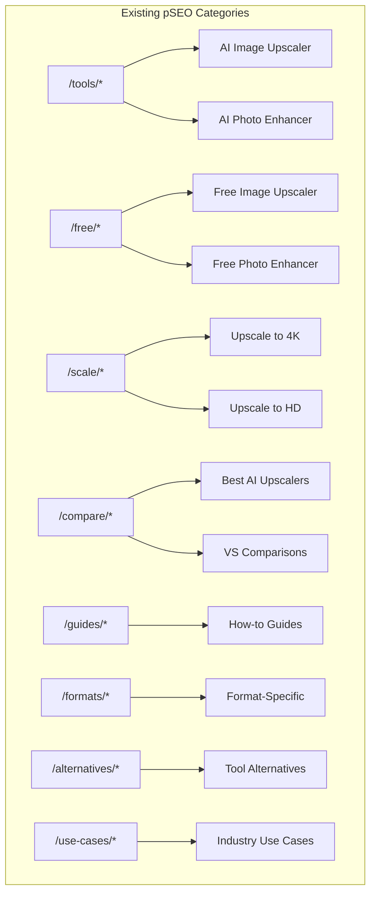
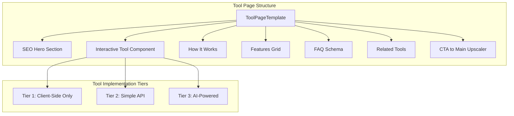

# pSEO Expansion Plan: Traffic-Driving Tool Pages

## 1. Context Analysis

### 1.1 Files Analyzed

- `/home/joao/projects/myimageupscaler.com/app/seo/keywords.csv`
- `/home/joao/projects/myimageupscaler.com/app/seo/top_keywords.csv`
- `/home/joao/projects/myimageupscaler.com/app/seo/data/tools.json`
- `/home/joao/projects/myimageupscaler.com/lib/seo/keyword-mappings.ts`
- `/home/joao/projects/myimageupscaler.com/lib/seo/data-loader.ts`
- `/home/joao/projects/myimageupscaler.com/app/(pseo)/*/[slug]/page.tsx`

### 1.2 Current pSEO Architecture



### 1.3 Current Keyword Coverage

| Category | Pages      | High-Volume Keywords Covered                |
| -------- | ---------- | ------------------------------------------- |
| /tools   | 2          | ai image upscaler, ai photo enhancer        |
| /free    | 5 (mapped) | free image upscaler, free ai photo enhancer |
| /scale   | 2 (mapped) | upscale to 4k, upscale to hd                |
| /compare | 3 (mapped) | best ai upscaler, vs pages                  |
| /guides  | 2 (mapped) | how to upsize/upscale images                |

### 1.4 Problem Statement

The current pSEO strategy focuses on informational and comparison content, missing **high-intent interactive tool pages** that can capture "tool seekers" - users who want to perform specific image operations immediately.

---

## 2. Proposed Solution: Interactive Tool Pages

### 2.1 Strategy Overview

Create **lightweight interactive tool pages** that:

1. Target specific long-tail keywords with clear transactional intent
2. Provide **free, no-signup-required** functionality (limited usage)
3. Funnel users to the main upscaler for more complex needs
4. Generate backlinks through utility value

### 2.2 Why Interactive Tools Work for SEO

- **High engagement signals**: Users spend time on page, interact with tool
- **Backlink magnets**: Useful tools get linked naturally
- **Lower bounce rate**: Users complete a task vs. just reading
- **Conversion funnel**: Free taste → paid conversion

---

## 3. New pSEO Tool Categories

### Category A: Image Dimension Tools

| Tool                    | Target Keywords                             | Monthly Searches | Intent        |
| ----------------------- | ------------------------------------------- | ---------------- | ------------- |
| Image Resizer           | image resizer, resize image online          | 500K+            | Transactional |
| Image Cropper           | image cropper, crop image online            | 200K+            | Transactional |
| Aspect Ratio Calculator | aspect ratio calculator, image aspect ratio | 100K+            | Informational |
| DPI Converter           | dpi converter, change image dpi             | 50K+             | Transactional |
| Image Compressor        | image compressor, compress image online     | 300K+            | Transactional |

### Category B: Format Conversion Tools

| Tool           | Target Keywords                 | Monthly Searches | Intent        |
| -------------- | ------------------------------- | ---------------- | ------------- |
| PNG to JPG     | png to jpg, convert png to jpeg | 200K+            | Transactional |
| JPG to PNG     | jpg to png, convert jpeg to png | 150K+            | Transactional |
| WebP Converter | webp to png, webp to jpg        | 100K+            | Transactional |
| HEIC to JPG    | heic to jpg, convert heic       | 100K+            | Transactional |
| SVG to PNG     | svg to png converter            | 50K+             | Transactional |

### Category C: Photo Utilities

| Tool                | Target Keywords                          | Monthly Searches | Intent        |
| ------------------- | ---------------------------------------- | ---------------- | ------------- |
| Background Remover  | remove background, background eraser     | 500K+            | Transactional |
| Image to PDF        | image to pdf, convert jpg to pdf         | 200K+            | Transactional |
| Photo Collage Maker | photo collage, collage maker             | 150K+            | Transactional |
| Passport Photo Tool | passport photo, id photo maker           | 100K+            | Transactional |
| Image Color Picker  | color picker from image, eyedropper tool | 50K+             | Transactional |

### Category D: Technical/Pro Tools

| Tool                    | Target Keywords                              | Monthly Searches | Intent        |
| ----------------------- | -------------------------------------------- | ---------------- | ------------- |
| Metadata Viewer         | image metadata, exif viewer                  | 50K+             | Informational |
| Image Comparison Slider | before after slider, image compare           | 30K+             | Commercial    |
| Blur Detector           | check if image is blurry                     | 20K+             | Informational |
| Print Size Calculator   | photo print size, image resolution for print | 30K+             | Informational |
| Thumbnail Generator     | thumbnail maker, youtube thumbnail           | 100K+            | Transactional |

### Category E: AI Enhancement Tools (Upsell Path)

| Tool                  | Target Keywords                           | Monthly Searches | Intent        |
| --------------------- | ----------------------------------------- | ---------------- | ------------- |
| AI Face Enhancer      | face enhancer, enhance face in photo      | 50K+             | Transactional |
| AI Old Photo Restorer | restore old photos, old photo restoration | 50K+             | Transactional |
| AI Noise Reducer      | remove noise from image, denoise photo    | 30K+             | Transactional |
| AI Sharpen Image      | sharpen blurry image, image sharpener     | 50K+             | Transactional |
| AI Color Correction   | auto color correct, fix photo colors      | 30K+             | Transactional |

---

## 4. Implementation Architecture

### 4.1 URL Structure

```
/tools/[category]/[tool-slug]

Examples:
/tools/resize/image-resizer
/tools/convert/png-to-jpg
/tools/utilities/background-remover
/tools/ai/face-enhancer
```

### 4.2 Component Architecture



### 4.3 Implementation Tiers

| Tier | Implementation           | Examples                        | Complexity |
| ---- | ------------------------ | ------------------------------- | ---------- |
| 1    | Client-side Canvas API   | Resize, Crop, Compress, Convert | Low        |
| 2    | Simple server processing | PDF generation, Batch ops       | Medium     |
| 3    | AI API calls             | Background removal, Enhancement | High       |

---

## 5. Prioritized Implementation Plan

### Phase 1: Quick Wins (Client-Side Tools)

**Priority: P0 - Implement First**

These tools require **no backend** and can be built with Canvas API:

1. **Image Resizer** - Highest search volume
2. **Image Compressor** - High volume, simple implementation
3. **PNG to JPG / JPG to PNG** - Format conversion
4. **Aspect Ratio Calculator** - Pure client-side math
5. **Image Cropper** - Canvas-based cropping

**Estimated impact**: 1M+ monthly keyword coverage

### Phase 2: Format Converters

**Priority: P0**

1. **WebP to PNG/JPG** - Growing format adoption
2. **HEIC to JPG** - iPhone users searching constantly
3. **SVG to PNG** - Designer/developer traffic
4. **Image to PDF** - Requires simple lib (jsPDF)

### Phase 3: AI-Powered Tools (Upsell)

**Priority: P1**

1. **Background Remover** - Can use existing AI infra or API (remove.bg)
2. **AI Old Photo Restorer** - Natural upsell to main enhancer
3. **AI Face Enhancer** - Subset of main functionality
4. **AI Noise Reducer** - Specialized use case

### Phase 4: Niche Utilities

**Priority: P2**

1. **Passport Photo Tool** - Specific dimensions, clear use case
2. **Thumbnail Generator** - YouTube creator traffic
3. **Print Size Calculator** - Educational, linkable
4. **Color Picker** - Developer traffic

---

## 6. Technical Specifications

### 6.1 Client-Side Tool Template

```typescript
// /components/tools/ClientSideTool.tsx
interface IClientSideToolProps {
  toolType: 'resize' | 'compress' | 'convert' | 'crop';
  maxInputSize: number; // MB
  outputFormats: string[];
  freeTierLimit: number; // Images per session
}
```

### 6.2 Data Schema Extension

```typescript
// Add to /lib/seo/pseo-types.ts
interface IInteractiveTool extends IBasePSEOPage {
  category: 'interactive-tools';
  toolType: 'resize' | 'convert' | 'compress' | 'crop' | 'ai';
  inputFormats: string[];
  outputFormats: string[];
  freeTierLimit: number;
  requiresAPI: boolean;
  relatedUpscalerFeature?: string;
}
```

### 6.3 SEO Schema for Tools

```json
{
  "@type": "WebApplication",
  "name": "Free Image Resizer",
  "applicationCategory": "MultimediaApplication",
  "operatingSystem": "Web Browser",
  "offers": {
    "@type": "Offer",
    "price": "0",
    "priceCurrency": "USD"
  }
}
```

---

## 7. Keyword Research Additions

### High-Volume Keywords Not Currently Targeted

| Keyword             | Monthly Volume | Current Ranking | Opportunity    |
| ------------------- | -------------- | --------------- | -------------- |
| image resizer       | 500K+          | Not ranking     | New tool page  |
| compress image      | 300K+          | Not ranking     | New tool page  |
| png to jpg          | 200K+          | Not ranking     | Converter page |
| remove background   | 500K+          | Not ranking     | AI tool page   |
| heic to jpg         | 100K+          | Not ranking     | Converter page |
| crop image online   | 100K+          | Not ranking     | New tool page  |
| resize image online | 300K+          | Not ranking     | New tool page  |
| jpg to pdf          | 200K+          | Not ranking     | Utility page   |

---

## 8. Content Strategy for Tool Pages

### 8.1 Page Structure Template

1. **H1**: "{Tool Name} - Free Online {Action} Tool"
2. **Interactive Tool** (above fold)
3. **How to Use** (3-4 steps)
4. **Why Use Our {Tool}** (features)
5. **Use Cases** (3-4 examples)
6. **FAQ** (6-8 questions, schema markup)
7. **Related Tools** (internal linking)
8. **CTA**: "Need more? Try our AI Image Upscaler"

### 8.2 Word Count Targets

| Tool Tier       | Min Words | Sections | FAQs |
| --------------- | --------- | -------- | ---- |
| Tier 1 (Simple) | 800       | 5        | 5    |
| Tier 2 (Medium) | 1200      | 6        | 6    |
| Tier 3 (AI)     | 1500      | 7        | 8    |

---

## 9. Success Metrics

| Metric                            | Target (6 months) |
| --------------------------------- | ----------------- |
| Organic traffic increase          | +50%              |
| Tool page conversions to upscaler | 5%                |
| Average time on tool pages        | >2 minutes        |
| Tool completion rate              | >60%              |
| Backlinks from tool pages         | 100+              |

---

## 10. Risk Assessment

| Risk                                | Mitigation                              |
| ----------------------------------- | --------------------------------------- |
| Cannibalizing main upscaler traffic | Clear differentiation, CTAs to upscaler |
| Tool abuse/spam                     | Rate limiting, session limits           |
| Performance impact                  | Client-side processing, lazy loading    |
| Maintenance burden                  | Reusable component architecture         |

---

## 11. Next Steps

1. [ ] Validate keyword volumes with fresh Google Keyword Planner data
2. [ ] Create reusable `InteractiveToolTemplate` component
3. [ ] Implement Image Resizer as proof of concept
4. [ ] Set up analytics tracking for tool usage
5. [ ] Create A/B test for tool → upscaler conversion CTAs

---

## Appendix: Competitive Analysis

| Competitor | Interactive Tools  | Monthly Traffic |
| ---------- | ------------------ | --------------- |
| iLoveIMG   | 20+ tools          | 50M+            |
| TinyPNG    | Compress + Convert | 10M+            |
| Remove.bg  | Background removal | 20M+            |
| Canva      | Full suite         | 100M+           |

**Opportunity**: None of these competitors have MyImageUpscaler's AI upscaling quality. Interactive tools serve as traffic magnets that funnel to our differentiated core product.
