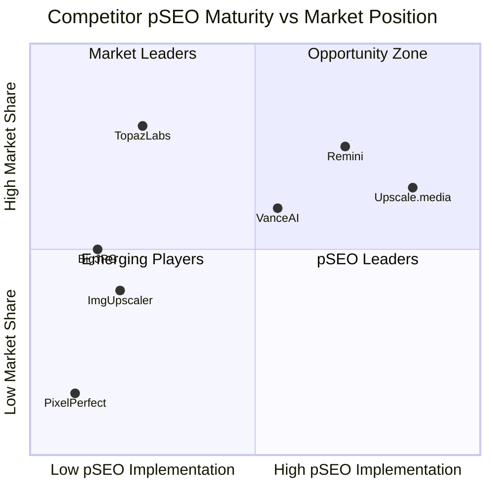
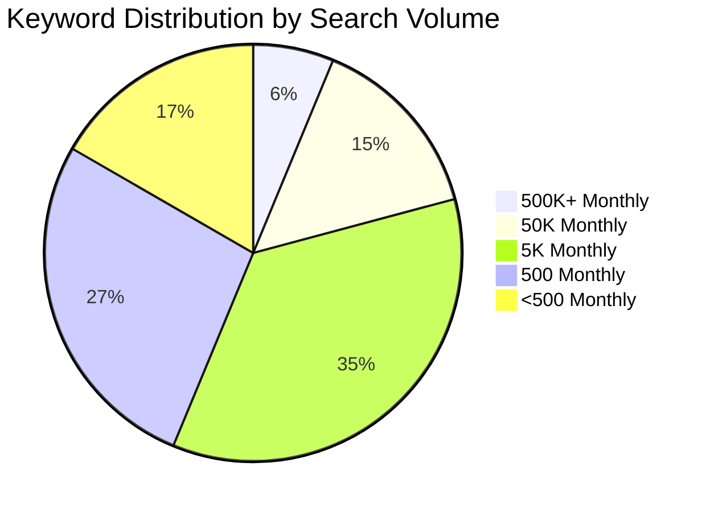
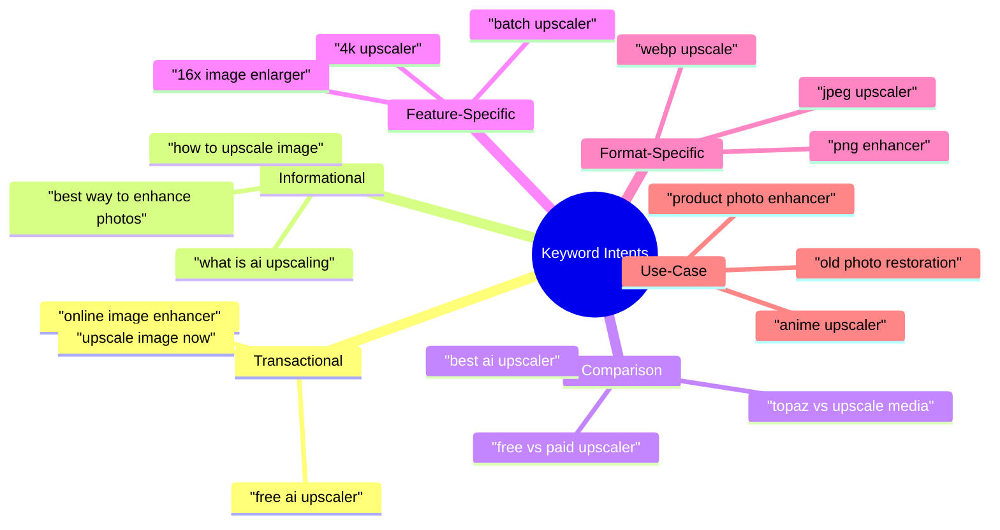
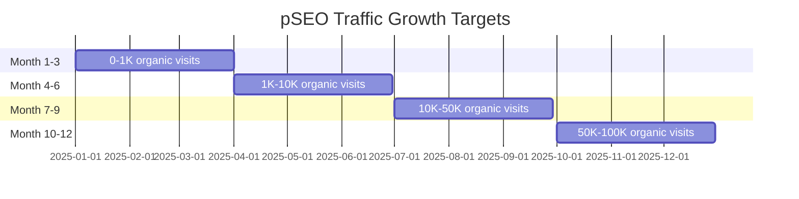
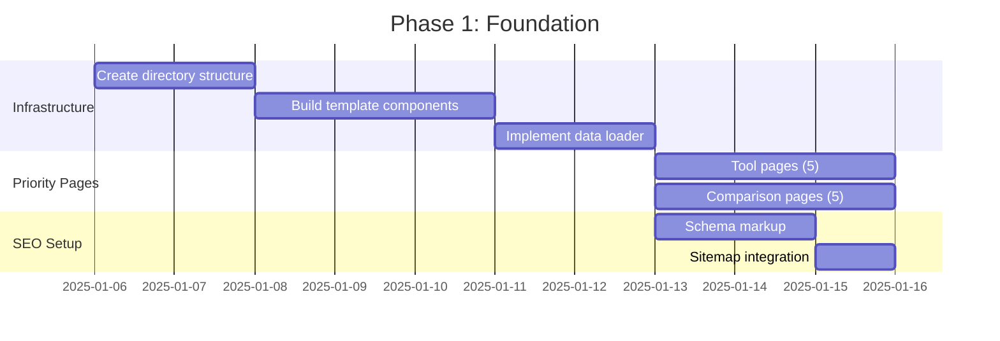
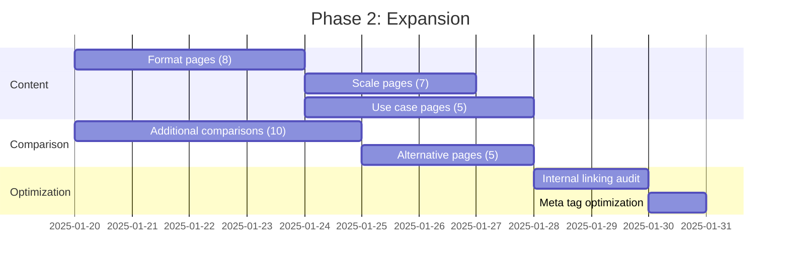
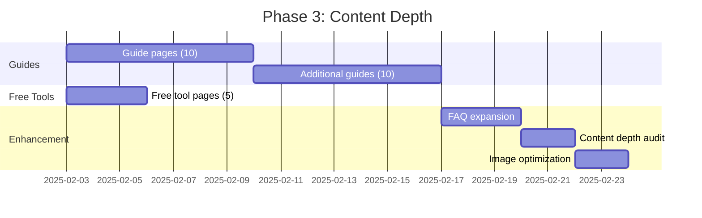
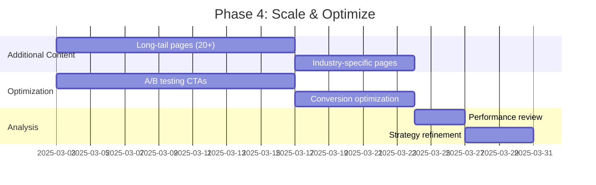

# Programmatic SEO (pSEO) Implementation PRD

## Product Requirements Document

| Field            | Value                           |
| ---------------- | ------------------------------- |
| **Document ID**  | PRD-PSEO-001                    |
| **Version**      | 1.0                             |
| **Status**       | Draft                           |
| **Created**      | 2025-12-01                      |
| **Author**       | Development Team                |
| **Stakeholders** | Product, Engineering, Marketing |
| **Priority**     | P1 - Phase 2 Growth             |

---

## Executive Summary

This PRD outlines a comprehensive programmatic SEO strategy for PixelPerfect, designed to capture significant organic search traffic in the AI image upscaler/enhancer market. Based on analysis of 1,340+ keywords and competitive research of major players (Upscale.media, VanceAI, TopazLabs, Remini, BigJPG), this strategy will generate 200+ targeted landing pages across multiple intent categories.

### Key Opportunity

| Metric                          | Value                                                                                |
| ------------------------------- | ------------------------------------------------------------------------------------ |
| **Total Keywords Analyzed**     | 1,340+                                                                               |
| **High-Volume Keywords**        | 500,000+ monthly searches each                                                       |
| **Top Keywords**                | "image upscaler" (500K), "ai photo enhancer" (500K), "photo quality enhancer" (500K) |
| **Competition Level**           | Predominantly Low (15-25 index)                                                      |
| **Average CPC (CAD)**           | $0.03 - $1.70                                                                        |
| **Estimated Traffic Potential** | 100,000+ monthly visits at scale                                                     |

---

## Table of Contents

1. [Market Analysis](#1-market-analysis)
2. [Keyword Strategy](#2-keyword-strategy)
3. [Page Architecture](#3-page-architecture)
4. [Content Templates](#4-content-templates)
5. [Technical Implementation](#5-technical-implementation)
6. [SEO Infrastructure](#6-seo-infrastructure)
7. [Performance Metrics](#7-performance-metrics)
8. [Implementation Roadmap](#8-implementation-roadmap)
9. [Risk Mitigation](#9-risk-mitigation)

---

## 1. Market Analysis

### 1.1 Competitive Landscape



### 1.2 Competitor Strategy Analysis

| Competitor        | pSEO Pages | Strategy Focus      | Key Strength         | Weakness                   |
| ----------------- | ---------- | ------------------- | -------------------- | -------------------------- |
| **Upscale.media** | 50-100+    | Scale + Comparisons | Comprehensive pSEO   | Thin content on some pages |
| **VanceAI**       | 20-30      | Blog + Reviews      | Trust signals (4.8★) | Limited pSEO scale         |
| **TopazLabs**     | 10-15      | Authority Content   | Expert positioning   | No programmatic approach   |
| **Remini**        | 15 (ASO)   | Mobile App Store    | 1162% keyword growth | Web SEO minimal            |
| **BigJPG**        | <5         | Brand Only          | Technical reputation | Zero pSEO implementation   |
| **ImgUpscaler**   | <5         | Basic Product Pages | Simple UX            | No content strategy        |

### 1.3 Competitive Gaps (Opportunities for PixelPerfect)

1. **File Format Niche Pages**: Only Upscale.media targets this; opportunity for WebP, AVIF, RAW
2. **Industry-Specific Landing Pages**: E-commerce, real estate, gaming - underserved
3. **"Free vs Paid" Comparisons**: No competitor owns this intent
4. **Batch Processing Content**: Limited content despite high demand
5. **API/Developer Content**: Unexploited B2B opportunity
6. **Localized Content**: Most competitors English-only

---

## 2. Keyword Strategy

### 2.1 Keyword Categories (From CSV Analysis)

Based on analysis of 1,340+ keywords from Google Keyword Planner:



### 2.2 High-Priority Keywords (500,000+ Monthly Searches)

| Keyword                  | Monthly Searches | Competition | CPC Low | CPC High |
| ------------------------ | ---------------- | ----------- | ------- | -------- |
| image upscaler           | 500,000          | Low (10)    | $0.04   | $0.73    |
| ai photo enhancer        | 500,000          | Low (21)    | $0.09   | $1.71    |
| ai image enhancer        | 500,000          | Low (15)    | $0.11   | $1.72    |
| ai image upscaler        | 500,000          | Low (15)    | $0.07   | $1.63    |
| ai upscale               | 500,000          | Low (13)    | $0.12   | $2.65    |
| photo quality enhancer   | 500,000          | Low (12)    | $0.03   | $0.78    |
| image quality enhancer   | 500,000          | Low (12)    | $0.03   | $0.78    |
| picture quality enhancer | 500,000          | Low (12)    | $0.03   | $0.78    |
| photo enhancer online    | 500,000          | Low (8)     | $0.02   | $0.46    |
| image enhancer online    | 500,000          | Low (8)     | $0.02   | $0.46    |
| image clarity enhancer   | 500,000          | Low (12)    | $0.03   | $0.78    |
| upscaler                 | 500,000          | Low (8)     | $0.06   | $1.58    |
| upsize an image          | 5,000,000        | Low (2)     | $0.04   | $1.40    |

### 2.3 Medium-Priority Keywords (50,000 Monthly Searches)

| Keyword                            | Monthly Searches | Competition | YoY Change |
| ---------------------------------- | ---------------- | ----------- | ---------- |
| ai upscale image                   | 50,000           | Low (18)    | 0%         |
| ai enhance image                   | 50,000           | Low (20)    | 0%         |
| image resolution enhancer          | 50,000           | Low (22)    | 0%         |
| ai image enlarger                  | 50,000           | Low (23)    | +900%      |
| photo quality enhancer online free | 50,000           | Low (15)    | 0%         |
| free ai photo enhancer             | 50,000           | Medium (48) | -90%       |
| ai picture enhancer                | 50,000           | Low (31)    | 0%         |
| upscale ai                         | 50,000           | Low (17)    | 0%         |
| upscale photo                      | 50,000           | Low (19)    | 0%         |
| image upscaler 4k                  | 50,000           | Low (7)     | 0%         |
| hd photo enhancer                  | 50,000           | Low (25)    | 0%         |
| ai expand image                    | 50,000           | Low (12)    | 0%         |
| ai enhance image free              | 50,000           | Low (20)    | 0%         |
| free image resolution enhancer     | 50,000           | Low (25)    | 0%         |

### 2.4 Long-Tail Keywords (5,000 Monthly Searches)

| Keyword                      | Monthly Searches | Competition | Intent Type      |
| ---------------------------- | ---------------- | ----------- | ---------------- |
| best ai image upscaler       | 5,000            | Medium (44) | Comparison       |
| best ai upscaler             | 5,000            | Medium (40) | Comparison       |
| ai image resolution enhancer | 5,000            | Medium (41) | Feature-specific |
| ai photo enhancement         | 5,000            | Medium (53) | Generic          |
| image enlarger online        | 5,000            | Medium (40) | Online tool      |
| picture resolution enhancer  | 5,000            | Medium (34) | Feature-specific |
| ai enlarge image             | 5,000            | Low (24)    | Action           |
| upscale an image             | 5,000            | Medium (39) | Action           |
| improve image quality ai     | 5,000            | Medium (36) | Solution         |
| clip drop image upscaler     | 5,000            | Medium (66) | Brand comparison |

### 2.5 Trending Keywords (YoY Growth 900%+)

| Keyword                     | Monthly Searches | YoY Growth | Priority |
| --------------------------- | ---------------- | ---------- | -------- |
| image upscaler              | 500,000          | +900%      | Critical |
| upscaler                    | 500,000          | +900%      | Critical |
| ai image enlarger           | 50,000           | +900%      | High     |
| ai image upscaler 4k        | 5,000            | +900%      | High     |
| best free ai photo enhancer | 5,000            | +900%      | High     |
| ai enhance image quality    | 5,000            | +900%      | High     |
| resolution enhancer free    | 5,000            | +900%      | Medium   |
| hd image upscaler           | 500              | +900%      | Medium   |
| online ai image upscaler    | 500              | +900%      | Medium   |
| ai image upscaler software  | 500              | +900%      | Low      |

### 2.6 Keyword Intent Classification



---

## 3. Page Architecture

### 3.1 URL Structure

```
PixelPerfect pSEO URL Architecture
├── /tools/                           # Primary Tools Category
│   ├── /tools/[tool-slug]/           # Individual tool pages
│   │   ├── ai-image-upscaler
│   │   ├── ai-photo-enhancer
│   │   ├── image-quality-enhancer
│   │   ├── photo-restoration
│   │   └── batch-image-upscaler
│
├── /formats/                         # File Format Category
│   ├── /formats/[format-slug]/       # Format-specific pages
│   │   ├── upscale-jpeg-images
│   │   ├── upscale-png-images
│   │   ├── upscale-webp-images
│   │   ├── upscale-heic-images
│   │   ├── upscale-gif-images
│   │   ├── upscale-bmp-images
│   │   ├── upscale-tiff-images
│   │   └── upscale-raw-photos
│
├── /scale/                           # Resolution Category
│   ├── /scale/[scale-slug]/          # Scale-specific pages
│   │   ├── upscale-images-2x
│   │   ├── upscale-images-4x
│   │   ├── upscale-images-8x
│   │   ├── upscale-images-16x
│   │   ├── upscale-to-4k
│   │   ├── upscale-to-8k
│   │   └── upscale-to-hd
│
├── /use-cases/                       # Industry/Use Case Category
│   ├── /use-cases/[usecase-slug]/    # Use case pages
│   │   ├── ecommerce-product-photos
│   │   ├── real-estate-listings
│   │   ├── social-media-images
│   │   ├── print-photography
│   │   ├── old-photo-restoration
│   │   ├── anime-manga-upscaling
│   │   ├── game-asset-upscaling
│   │   └── medical-imaging
│
├── /compare/                         # Comparison Category
│   ├── /compare/[comparison-slug]/   # Comparison pages
│   │   ├── pixelperfect-vs-topaz-gigapixel
│   │   ├── pixelperfect-vs-upscale-media
│   │   ├── pixelperfect-vs-vanceai
│   │   ├── pixelperfect-vs-bigjpg
│   │   ├── pixelperfect-vs-lets-enhance
│   │   ├── pixelperfect-vs-remini
│   │   ├── pixelperfect-vs-waifu2x
│   │   ├── free-vs-paid-upscalers
│   │   └── online-vs-offline-upscalers
│
├── /alternatives/                    # Alternatives Category
│   ├── /alternatives/[alt-slug]/     # Alternative pages
│   │   ├── topaz-gigapixel-alternatives
│   │   ├── upscale-media-alternatives
│   │   ├── bigjpg-alternatives
│   │   ├── waifu2x-alternatives
│   │   └── lets-enhance-alternatives
│
├── /guides/                          # Educational Content
│   ├── /guides/[guide-slug]/         # How-to guides
│   │   ├── how-to-upscale-images-without-losing-quality
│   │   ├── how-to-fix-blurry-photos
│   │   ├── how-to-restore-old-photos
│   │   ├── how-to-enhance-product-photos
│   │   └── how-to-batch-upscale-images
│
└── /free/                            # Free Tools Category
    ├── /free/[free-slug]/            # Free tool pages
        ├── free-image-upscaler
        ├── free-photo-enhancer
        ├── free-ai-upscaler
        └── free-online-upscaler
```

### 3.2 Page Count by Category

| Category     | Pages  | Priority | Traffic Potential |
| ------------ | ------ | -------- | ----------------- |
| Tools        | 10     | P0       | Very High         |
| Formats      | 8      | P1       | High              |
| Scale        | 7      | P1       | High              |
| Use Cases    | 10     | P1       | Medium-High       |
| Compare      | 15     | P0       | Very High         |
| Alternatives | 10     | P1       | High              |
| Guides       | 20     | P2       | Medium            |
| Free         | 5      | P0       | Very High         |
| **Total**    | **85** | -        | -                 |

### 3.3 Internal Linking Strategy

```mermaid
graph TD
    subgraph "Hub Pages"
        HOME[Homepage]
        UPSCALER[/upscaler]
        PRICING[/pricing]
    end

    subgraph "Category Hubs"
        TOOLS[/tools]
        FORMATS[/formats]
        SCALE[/scale]
        USECASES[/use-cases]
        COMPARE[/compare]
        GUIDES[/guides]
    end

    subgraph "pSEO Pages"
        TOOL_PAGES[Tool Pages x10]
        FORMAT_PAGES[Format Pages x8]
        SCALE_PAGES[Scale Pages x7]
        USECASE_PAGES[Use Case Pages x10]
        COMPARE_PAGES[Comparison Pages x15]
        GUIDE_PAGES[Guide Pages x20]
    end

    HOME --> TOOLS
    HOME --> COMPARE
    HOME --> UPSCALER

    TOOLS --> TOOL_PAGES
    FORMATS --> FORMAT_PAGES
    SCALE --> SCALE_PAGES
    USECASES --> USECASE_PAGES
    COMPARE --> COMPARE_PAGES
    GUIDES --> GUIDE_PAGES

    TOOL_PAGES <--> COMPARE_PAGES
    FORMAT_PAGES <--> GUIDE_PAGES
    USECASE_PAGES <--> TOOL_PAGES
    COMPARE_PAGES <--> GUIDE_PAGES
```

---

## 4. Content Templates

### 4.1 Tool Page Template

**Target Keywords**: "ai image upscaler", "photo enhancer", "image quality enhancer"

```typescript
interface ToolPageData {
  slug: string;
  title: string;
  metaTitle: string; // 50-60 chars
  metaDescription: string; // 150-160 chars
  h1: string;
  heroSubtitle: string;
  primaryKeyword: string;
  secondaryKeywords: string[];

  // Content Sections
  introduction: string; // 150-200 words
  whatIs: {
    title: string;
    content: string; // 200-300 words
  };
  howItWorks: {
    steps: Array<{
      number: number;
      title: string;
      description: string;
      image?: string;
    }>; // 4-6 steps
  };
  features: Array<{
    icon: string;
    title: string;
    description: string;
  }>; // 6-8 features
  benefits: Array<{
    title: string;
    description: string;
  }>; // 5-7 benefits
  useCases: Array<{
    icon: string;
    title: string;
    description: string;
  }>; // 4-6 use cases
  faq: Array<{
    question: string;
    answer: string;
  }>; // 5-8 questions
  relatedTools: string[]; // Internal links
  cta: {
    primary: string;
    secondary: string;
  };
}
```

**Example Content Structure**:

```markdown
# [H1: AI Image Upscaler - Enhance Photos to 4K Resolution Free]

[Hero Section with Demo]

- Headline: Transform Low-Resolution Images Instantly
- Subheadline: AI-powered upscaling that preserves text, logos, and fine details
- CTA: "Upscale Image Free" / "Try Demo"

## What is an AI Image Upscaler?

[200-300 words explaining AI upscaling technology]

- Definition of AI upscaling
- How neural networks enhance images
- Difference from traditional interpolation

## How It Works

[Step-by-step guide with screenshots]

1. Upload your image (drag & drop)
2. Select upscaling level (2x, 4x, 8x)
3. AI processes your image in seconds
4. Download enhanced image

## Key Features

[6-8 feature cards with icons]

- Text & Logo Preservation
- 4K/8K Output Resolution
- Batch Processing
- No Watermarks
- Multiple Format Support
- Fast Processing

## Benefits of AI Upscaling

[Benefit-focused content]

- Enhanced image quality
- Time savings vs manual editing
- Consistent results
- Cost-effective

## Use Cases

[Industry applications]

- E-commerce product photos
- Real estate listings
- Social media content
- Print materials

## Frequently Asked Questions

[FAQ schema markup]
Q: Is the AI image upscaler free?
Q: What image formats are supported?
Q: How long does processing take?
Q: Will my images be stored?
Q: What's the maximum file size?

## Related Tools

[Internal links to related pages]

[Final CTA Section]
```

### 4.2 Format Page Template

**Target Keywords**: "upscale jpeg images", "png image enhancer", "webp upscaler"

```typescript
interface FormatPageData {
  format: string; // JPEG, PNG, WebP, etc.
  formatExtension: string; // .jpg, .png, .webp
  slug: string;
  title: string;
  metaTitle: string;
  metaDescription: string;

  // Format-specific content
  formatDescription: string; // What is [format]?
  formatAdvantages: string[]; // Why use this format
  formatLimitations: string[]; // Format limitations
  upscalingBenefits: string[]; // Why upscale this format

  // Technical specs
  supportedResolutions: string[];
  maxFileSize: string;
  outputFormats: string[];

  // Common issues
  commonIssues: Array<{
    issue: string;
    solution: string;
  }>;

  // Related formats
  relatedFormats: string[];
}
```

### 4.3 Comparison Page Template

**Target Keywords**: "pixelperfect vs topaz", "best ai upscaler comparison"

```typescript
interface ComparisonPageData {
  slug: string;
  competitor: string;
  competitorUrl: string;

  // SEO
  metaTitle: string; // "PixelPerfect vs [Competitor]: Which Upscaler?"
  metaDescription: string;

  // Content
  introduction: string;

  pixelperfectProfile: {
    overview: string;
    features: string[];
    pros: string[];
    cons: string[];
    pricing: string;
    bestFor: string;
  };

  competitorProfile: {
    overview: string;
    features: string[];
    pros: string[];
    cons: string[];
    pricing: string;
    bestFor: string;
  };

  comparisonTable: Array<{
    feature: string;
    pixelperfect: string | boolean;
    competitor: string | boolean;
  }>;

  verdict: {
    winner: 'pixelperfect' | 'competitor' | 'tie';
    summary: string;
    recommendation: string;
  };

  faq: Array<{
    question: string;
    answer: string;
  }>;
}
```

**Comparison Table Structure**:

| Feature           | PixelPerfect | [Competitor] |
| ----------------- | ------------ | ------------ |
| Free Tier         | 10 credits   | [Value]      |
| Max Resolution    | 8x (16x Pro) | [Value]      |
| Text Preservation | Yes          | [Value]      |
| Batch Processing  | Yes          | [Value]      |
| API Access        | Pro Plan     | [Value]      |
| No Watermarks     | Yes          | [Value]      |
| Processing Speed  | 30-60s       | [Value]      |
| File Size Limit   | 25MB         | [Value]      |
| Supported Formats | JPG/PNG/WebP | [Value]      |
| Starting Price    | Free/$19/mo  | [Value]      |

### 4.4 Use Case Page Template

**Target Keywords**: "ecommerce product photo enhancer", "real estate image upscaler"

```typescript
interface UseCasePageData {
  industry: string;
  slug: string;
  title: string;
  metaTitle: string;
  metaDescription: string;

  // Industry context
  industryOverview: string;
  painPoints: string[];
  solutionBenefits: string[];

  // Specific use cases
  specificUseCases: Array<{
    title: string;
    description: string;
    beforeAfterImages?: {
      before: string;
      after: string;
    };
  }>;

  // ROI/Business impact
  businessImpact: {
    metrics: Array<{
      metric: string;
      improvement: string;
    }>;
    testimonial?: {
      quote: string;
      author: string;
      company: string;
    };
  };

  // Implementation guide
  implementationSteps: Array<{
    step: number;
    title: string;
    description: string;
  }>;

  // Integration options
  integrations?: string[];
}
```

### 4.5 Guide Page Template

**Target Keywords**: "how to upscale images", "fix blurry photos tutorial"

```typescript
interface GuidePageData {
  slug: string;
  title: string; // H1: "How to [Action] [Object]"
  metaTitle: string;
  metaDescription: string;

  // Article metadata
  publishDate: string;
  updateDate: string;
  readTime: number; // minutes
  difficulty: 'beginner' | 'intermediate' | 'advanced';

  // Content structure
  tableOfContents: string[];

  introduction: string; // 100-150 words

  sections: Array<{
    heading: string; // H2
    content: string; // 200-400 words
    subSections?: Array<{
      heading: string; // H3
      content: string;
    }>;
    images?: string[];
    tips?: string[];
    warnings?: string[];
  }>;

  conclusion: string; // 100-150 words

  // Related content
  relatedGuides: string[];
  relatedTools: string[];

  // Schema
  howToSteps: Array<{
    name: string;
    text: string;
    image?: string;
  }>;
}
```

---

## 5. Technical Implementation

### 5.1 Directory Structure

```
app/
├── (pseo)/                        # pSEO route group
│   ├── tools/
│   │   ├── page.tsx               # /tools - category hub
│   │   └── [slug]/
│   │       └── page.tsx           # /tools/[slug] - dynamic tool pages
│   ├── formats/
│   │   ├── page.tsx               # /formats - category hub
│   │   └── [slug]/
│   │       └── page.tsx           # /formats/[slug] - dynamic format pages
│   ├── scale/
│   │   ├── page.tsx               # /scale - category hub
│   │   └── [slug]/
│   │       └── page.tsx           # /scale/[slug] - dynamic scale pages
│   ├── use-cases/
│   │   ├── page.tsx               # /use-cases - category hub
│   │   └── [slug]/
│   │       └── page.tsx           # /use-cases/[slug] - dynamic use case pages
│   ├── compare/
│   │   ├── page.tsx               # /compare - category hub
│   │   └── [slug]/
│   │       └── page.tsx           # /compare/[slug] - dynamic comparison pages
│   ├── alternatives/
│   │   ├── page.tsx               # /alternatives - category hub
│   │   └── [slug]/
│   │       └── page.tsx           # /alternatives/[slug] - dynamic alt pages
│   ├── guides/
│   │   ├── page.tsx               # /guides - category hub
│   │   └── [slug]/
│   │       └── page.tsx           # /guides/[slug] - dynamic guide pages
│   └── free/
│       ├── page.tsx               # /free - category hub
│       └── [slug]/
│           └── page.tsx           # /free/[slug] - dynamic free tool pages
│
├── seo/
│   ├── data/                      # pSEO data files
│   │   ├── tools.json
│   │   ├── formats.json
│   │   ├── scales.json
│   │   ├── use-cases.json
│   │   ├── comparisons.json
│   │   ├── alternatives.json
│   │   ├── guides.json
│   │   └── free-tools.json
│   ├── keywords.csv               # Keyword research data
│   └── top_keywords.csv           # Top performing keywords
│
src/
├── components/
│   └── pseo/                      # pSEO-specific components
│       ├── ToolPageTemplate.tsx
│       ├── FormatPageTemplate.tsx
│       ├── ComparisonPageTemplate.tsx
│       ├── UseCasePageTemplate.tsx
│       ├── GuidePageTemplate.tsx
│       ├── ComparisonTable.tsx
│       ├── FeatureGrid.tsx
│       ├── FAQSection.tsx
│       ├── CTASection.tsx
│       ├── BreadcrumbNav.tsx
│       ├── RelatedPages.tsx
│       └── SchemaMarkup.tsx
│
├── lib/
│   └── pseo/                      # pSEO utilities
│       ├── data-loader.ts         # Load JSON data
│       ├── slug-generator.ts      # Generate SEO-friendly slugs
│       ├── schema-generator.ts    # Generate JSON-LD schemas
│       ├── sitemap-generator.ts   # Generate sitemap entries
│       └── meta-generator.ts      # Generate meta tags
│
└── types/
    └── pseo.ts                    # TypeScript interfaces
```

### 5.2 Dynamic Page Generation

```typescript
// app/(pseo)/tools/[slug]/page.tsx
import { Metadata } from 'next';
import { notFound } from 'next/navigation';
import { getToolData, getAllToolSlugs } from '@/lib/pseo/data-loader';
import { generateToolSchema } from '@/lib/pseo/schema-generator';
import ToolPageTemplate from '@/components/pseo/ToolPageTemplate';

interface Props {
  params: { slug: string };
}

// Generate static paths at build time
export async function generateStaticParams() {
  const slugs = await getAllToolSlugs();
  return slugs.map((slug) => ({ slug }));
}

// Generate metadata
export async function generateMetadata({ params }: Props): Promise<Metadata> {
  const tool = await getToolData(params.slug);

  if (!tool) return {};

  return {
    title: tool.metaTitle,
    description: tool.metaDescription,
    keywords: tool.secondaryKeywords.join(', '),
    openGraph: {
      title: tool.metaTitle,
      description: tool.metaDescription,
      type: 'website',
      url: `https://pixelperfect.app/tools/${params.slug}`,
    },
    alternates: {
      canonical: `https://pixelperfect.app/tools/${params.slug}`,
    },
  };
}

export default async function ToolPage({ params }: Props) {
  const tool = await getToolData(params.slug);

  if (!tool) {
    notFound();
  }

  const schema = generateToolSchema(tool);

  return (
    <>
      <script
        type="application/ld+json"
        dangerouslySetInnerHTML={{ __html: JSON.stringify(schema) }}
      />
      <ToolPageTemplate data={tool} />
    </>
  );
}
```

### 5.3 Data Structure

```typescript
// src/types/pseo.ts

export interface PSEOPage {
  slug: string;
  title: string;
  metaTitle: string;
  metaDescription: string;
  h1: string;
  canonicalUrl: string;
  publishDate: string;
  updateDate: string;
  category: PSEOCategory;
}

export type PSEOCategory =
  | 'tools'
  | 'formats'
  | 'scale'
  | 'use-cases'
  | 'compare'
  | 'alternatives'
  | 'guides'
  | 'free';

export interface ToolPage extends PSEOPage {
  category: 'tools';
  heroSubtitle: string;
  primaryKeyword: string;
  secondaryKeywords: string[];
  introduction: string;
  whatIs: ContentSection;
  howItWorks: HowItWorksSection;
  features: Feature[];
  benefits: Benefit[];
  useCases: UseCase[];
  faq: FAQ[];
  relatedTools: string[];
}

export interface ComparisonPage extends PSEOPage {
  category: 'compare';
  competitor: string;
  competitorUrl: string;
  pixelperfectProfile: CompetitorProfile;
  competitorProfile: CompetitorProfile;
  comparisonTable: ComparisonRow[];
  verdict: Verdict;
  faq: FAQ[];
}

// ... additional interfaces
```

### 5.4 JSON Data Example

```json
// app/seo/data/tools.json
{
  "pages": [
    {
      "slug": "ai-image-upscaler",
      "title": "AI Image Upscaler",
      "metaTitle": "AI Image Upscaler - Enhance Photos to 4K Free | PixelPerfect",
      "metaDescription": "Upscale images to 4K resolution with AI. Free online tool that preserves text and logos. No watermarks, fast processing. Try PixelPerfect now.",
      "h1": "AI Image Upscaler - Enhance Photos to 4K Resolution Free",
      "primaryKeyword": "ai image upscaler",
      "secondaryKeywords": [
        "image upscaler",
        "ai upscale image",
        "enhance image ai",
        "upscale image online"
      ],
      "introduction": "Transform low-resolution images into stunning high-quality visuals with PixelPerfect's AI Image Upscaler. Our advanced neural network technology intelligently enhances your photos while preserving text, logos, and fine details that other upscalers blur or distort.",
      "whatIs": {
        "title": "What is an AI Image Upscaler?",
        "content": "An AI image upscaler uses artificial intelligence and deep learning algorithms to increase the resolution of images while maintaining or improving quality. Unlike traditional interpolation methods that simply duplicate pixels, AI upscalers analyze patterns in the image and intelligently generate new pixels that enhance detail and clarity..."
      },
      "features": [
        {
          "icon": "sparkles",
          "title": "Text & Logo Preservation",
          "description": "Our AI specifically trained to keep text and logos sharp and readable"
        },
        {
          "icon": "zap",
          "title": "Lightning Fast",
          "description": "Process images in 30-60 seconds with our optimized AI pipeline"
        }
      ],
      "faq": [
        {
          "question": "Is PixelPerfect's AI image upscaler free?",
          "answer": "Yes! PixelPerfect offers 10 free credits to get started. Each image upscale uses 1 credit. For more credits, check our affordable pricing plans starting at $19/month."
        },
        {
          "question": "What image formats does the AI upscaler support?",
          "answer": "PixelPerfect supports JPEG, PNG, and WebP formats. You can upload images up to 25MB and download in your preferred format."
        }
      ]
    }
  ]
}
```

---

## 6. SEO Infrastructure

### 6.1 Schema Markup Strategy

```typescript
// src/lib/pseo/schema-generator.ts

export function generateToolSchema(tool: ToolPage) {
  return {
    '@context': 'https://schema.org',
    '@type': 'SoftwareApplication',
    name: tool.title,
    applicationCategory: 'MultimediaApplication',
    operatingSystem: 'Web Browser',
    offers: {
      '@type': 'Offer',
      price: '0',
      priceCurrency: 'USD',
      description: 'Free tier with 10 credits',
    },
    aggregateRating: {
      '@type': 'AggregateRating',
      ratingValue: '4.8',
      ratingCount: '1250',
      bestRating: '5',
      worstRating: '1',
    },
    // FAQPage schema
    mainEntity: tool.faq.map(item => ({
      '@type': 'Question',
      name: item.question,
      acceptedAnswer: {
        '@type': 'Answer',
        text: item.answer,
      },
    })),
  };
}

export function generateComparisonSchema(comparison: ComparisonPage) {
  return {
    '@context': 'https://schema.org',
    '@type': 'Article',
    headline: comparison.metaTitle,
    description: comparison.metaDescription,
    author: {
      '@type': 'Organization',
      name: 'PixelPerfect',
    },
    publisher: {
      '@type': 'Organization',
      name: 'PixelPerfect',
      logo: {
        '@type': 'ImageObject',
        url: 'https://pixelperfect.app/logo.png',
      },
    },
    datePublished: comparison.publishDate,
    dateModified: comparison.updateDate,
  };
}

export function generateHowToSchema(guide: GuidePage) {
  return {
    '@context': 'https://schema.org',
    '@type': 'HowTo',
    name: guide.title,
    description: guide.metaDescription,
    step: guide.howToSteps.map((step, index) => ({
      '@type': 'HowToStep',
      position: index + 1,
      name: step.name,
      text: step.text,
      image: step.image,
    })),
  };
}
```

### 6.2 Sitemap Integration

```typescript
// app/sitemap.ts (extended)
import { MetadataRoute } from 'next';
import { getAllPSEOPages } from '@/lib/pseo/data-loader';

export default async function sitemap(): Promise<MetadataRoute.Sitemap> {
  const baseUrl = 'https://pixelperfect.app';

  // Static pages
  const staticPages = [
    { url: baseUrl, lastModified: new Date(), priority: 1.0 },
    { url: `${baseUrl}/upscaler`, lastModified: new Date(), priority: 0.9 },
    { url: `${baseUrl}/pricing`, lastModified: new Date(), priority: 0.8 },
    { url: `${baseUrl}/blog`, lastModified: new Date(), priority: 0.7 },
  ];

  // pSEO pages
  const pseoPages = await getAllPSEOPages();
  const pseoEntries = pseoPages.map(page => ({
    url: `${baseUrl}/${page.category}/${page.slug}`,
    lastModified: new Date(page.updateDate),
    priority: getPriorityByCategory(page.category),
    changeFrequency: 'weekly' as const,
  }));

  // Category hub pages
  const categoryHubs = [
    'tools',
    'formats',
    'scale',
    'use-cases',
    'compare',
    'alternatives',
    'guides',
    'free',
  ].map(category => ({
    url: `${baseUrl}/${category}`,
    lastModified: new Date(),
    priority: 0.8,
    changeFrequency: 'weekly' as const,
  }));

  return [...staticPages, ...categoryHubs, ...pseoEntries];
}

function getPriorityByCategory(category: string): number {
  const priorities: Record<string, number> = {
    tools: 0.9,
    compare: 0.85,
    free: 0.85,
    formats: 0.8,
    scale: 0.8,
    'use-cases': 0.75,
    alternatives: 0.75,
    guides: 0.7,
  };
  return priorities[category] || 0.6;
}
```

### 6.3 Meta Tag Patterns

```typescript
// src/lib/pseo/meta-generator.ts

export const META_PATTERNS = {
  tools: {
    title: '{ToolName} - {Benefit} Free | PixelPerfect',
    description:
      '{Action} with AI. Free online {ToolType} that {UniqueValue}. No watermarks, fast processing. Try PixelPerfect now.',
    // Example: "AI Image Upscaler - Enhance Photos to 4K Free | PixelPerfect"
  },
  formats: {
    title: 'Upscale {Format} Images to {Resolution} | PixelPerfect',
    description:
      'Upscale {Format} images with AI. Free online {Format} upscaler that preserves quality. Convert low-res {Format} to HD instantly.',
    // Example: "Upscale JPEG Images to 4K Resolution | PixelPerfect"
  },
  compare: {
    title: 'PixelPerfect vs {Competitor}: Which {ToolType} is Best?',
    description:
      'Compare PixelPerfect and {Competitor} for {UseCase}. See features, pricing, pros & cons. Find the best {ToolType} for your needs.',
    // Example: "PixelPerfect vs Topaz Gigapixel: Which AI Upscaler is Best?"
  },
  alternatives: {
    title: 'Best {Competitor} Alternatives in 2025 | PixelPerfect',
    description:
      'Looking for {Competitor} alternatives? Compare top {ToolType} tools including PixelPerfect. Free options, pricing, and features compared.',
    // Example: "Best Topaz Gigapixel Alternatives in 2025 | PixelPerfect"
  },
  'use-cases': {
    title: '{Industry} Image Enhancement - {UseCase} | PixelPerfect',
    description:
      'Enhance {Industry} images with AI. Perfect for {UseCase}. Upscale product photos, listings, and more. Free to start.',
    // Example: "E-commerce Image Enhancement - Product Photo Upscaling | PixelPerfect"
  },
  guides: {
    title: 'How to {Action} - Step-by-Step Guide | PixelPerfect',
    description:
      'Learn how to {Action} with this comprehensive guide. {Benefit}. Free tips and tools included.',
    // Example: "How to Upscale Images Without Losing Quality - Step-by-Step Guide | PixelPerfect"
  },
  free: {
    title: 'Free {ToolName} - No Registration Required | PixelPerfect',
    description:
      'Use our free {ToolName} online. No watermarks, no sign-up required. {Benefit}. Try it now!',
    // Example: "Free AI Image Upscaler - No Registration Required | PixelPerfect"
  },
  scale: {
    title: 'Upscale Images to {Scale} - Free {Resolution} Upscaler | PixelPerfect',
    description:
      'Upscale images to {Scale} resolution with AI. Free online tool for {Resolution} enhancement. Perfect for {UseCase}.',
    // Example: "Upscale Images to 4x - Free 4K Upscaler | PixelPerfect"
  },
};
```

### 6.4 Canonical URL Strategy

```typescript
// All pSEO pages should have explicit canonical URLs
const canonicalRules = {
  // Primary page is always canonical
  primary: (slug: string, category: string) => `https://pixelperfect.app/${category}/${slug}`,

  // Avoid duplicate content
  noDuplicates: [
    // /tools/ai-image-upscaler is canonical
    // /free/ai-image-upscaler should NOT exist (or redirect)
  ],

  // Parameter handling
  noIndexParams: ['ref', 'utm_source', 'utm_medium', 'utm_campaign'],
};
```

---

## 7. Performance Metrics

### 7.1 KPIs & Targets



| Metric                        | Month 1 | Month 3 | Month 6 | Month 12 |
| ----------------------------- | ------- | ------- | ------- | -------- |
| **Organic Traffic**           | 500     | 2,000   | 15,000  | 100,000  |
| **Indexed Pages**             | 20      | 50      | 85      | 150+     |
| **Avg Position (Target)**     | 50      | 25      | 10      | 5        |
| **Keyword Rankings (Top 10)** | 5       | 25      | 100     | 500+     |
| **Conversion Rate**           | 1%      | 2%      | 3%      | 3.5%     |
| **Leads from pSEO**           | 5       | 40      | 450     | 3,500    |

### 7.2 Page-Level Metrics

| Page Category    | Target Traffic/Page | Conversion Goal | Priority Keywords |
| ---------------- | ------------------- | --------------- | ----------------- |
| Tool Pages       | 5,000/month         | 3% signup       | 500K searches     |
| Comparison Pages | 2,000/month         | 4% signup       | 5K-50K searches   |
| Format Pages     | 1,500/month         | 2.5% signup     | 50K searches      |
| Use Case Pages   | 1,000/month         | 5% signup       | 5K searches       |
| Guide Pages      | 500/month           | 2% signup       | 5K searches       |
| Free Pages       | 10,000/month        | 5% signup       | 50K searches      |

### 7.3 Technical SEO Metrics

| Metric              | Target   | Measurement Tool      |
| ------------------- | -------- | --------------------- |
| Core Web Vitals LCP | < 2.5s   | Google Search Console |
| Core Web Vitals FID | < 100ms  | Google Search Console |
| Core Web Vitals CLS | < 0.1    | Google Search Console |
| Lighthouse Score    | > 90     | Lighthouse CI         |
| Index Coverage      | > 95%    | Google Search Console |
| Mobile Usability    | 0 errors | Google Search Console |
| Crawl Errors        | < 1%     | Google Search Console |

---

## 8. Implementation Roadmap

### 8.1 Phase 1: Foundation (Weeks 1-2)



**Deliverables:**

- [ ] Directory structure created
- [ ] Base template components
- [ ] Data loading utilities
- [ ] 5 tool pages live
- [ ] 5 comparison pages live
- [ ] Schema markup implemented
- [ ] Sitemap updated

### 8.2 Phase 2: Expansion (Weeks 3-4)



**Deliverables:**

- [ ] 8 format pages live
- [ ] 7 scale pages live
- [ ] 5 use case pages live
- [ ] 10 additional comparison pages
- [ ] 5 alternative pages
- [ ] Internal linking structure
- [ ] Meta tags optimized

### 8.3 Phase 3: Content Depth (Weeks 5-8)



**Deliverables:**

- [ ] 20 guide pages live
- [ ] 5 free tool pages live
- [ ] Expanded FAQ sections
- [ ] Content quality audit complete
- [ ] All images optimized

### 8.4 Phase 4: Scale & Optimize (Weeks 9-12)



**Deliverables:**

- [ ] 150+ total pSEO pages
- [ ] A/B tested CTAs
- [ ] Conversion rate optimization
- [ ] Performance report
- [ ] Phase 2 strategy defined

---

## 9. Risk Mitigation

### 9.1 Risk Assessment

| Risk                        | Probability | Impact | Mitigation Strategy                                |
| --------------------------- | ----------- | ------ | -------------------------------------------------- |
| **Google Algorithm Update** | Medium      | High   | Focus on quality, unique content; avoid thin pages |
| **Thin Content Penalty**    | Medium      | High   | Minimum 1,500 words per page; unique value-add     |
| **Duplicate Content**       | Low         | Medium | Canonical tags; unique angles per page             |
| **Slow Indexing**           | Medium      | Medium | Submit sitemap; build backlinks; social shares     |
| **Low Conversion**          | Medium      | Medium | A/B test CTAs; optimize user journey               |
| **Competitor Response**     | Medium      | Low    | First-mover advantage; continuous improvement      |
| **Technical SEO Issues**    | Low         | High   | Regular audits; Core Web Vitals monitoring         |
| **Content Quality Drift**   | Medium      | Medium | Editorial guidelines; quality checklist            |

### 9.2 Quality Checklist

Before publishing any pSEO page:

- [ ] **Content Quality**

  - [ ] Minimum 1,500 words of unique content
  - [ ] No duplicate content from other pages
  - [ ] Factually accurate information
  - [ ] Helpful and actionable advice
  - [ ] Proper grammar and spelling

- [ ] **Technical SEO**

  - [ ] Unique meta title (50-60 chars)
  - [ ] Unique meta description (150-160 chars)
  - [ ] Canonical URL set
  - [ ] Schema markup implemented
  - [ ] Internal links to 3+ related pages
  - [ ] External links to authoritative sources
  - [ ] Images with alt text
  - [ ] Mobile responsive

- [ ] **User Experience**
  - [ ] Clear CTA above fold
  - [ ] Readable formatting (headers, lists, paragraphs)
  - [ ] Fast load time (< 3s)
  - [ ] No broken links
  - [ ] Working demo/tool integration

### 9.3 Monitoring & Alerts

```typescript
// Monitoring configuration
const monitoringConfig = {
  // Google Search Console alerts
  searchConsole: {
    indexingErrors: { threshold: 5, alert: 'slack' },
    coverageDrops: { threshold: 10, alert: 'email' },
    coreWebVitals: { threshold: 'poor', alert: 'slack' },
  },

  // Traffic alerts
  analytics: {
    trafficDrop: { threshold: 20, period: '7d', alert: 'email' },
    bounceRateSpike: { threshold: 80, alert: 'slack' },
    conversionDrop: { threshold: 30, period: '7d', alert: 'email' },
  },

  // Technical monitoring
  technical: {
    lighthouse: { schedule: 'weekly', threshold: 85 },
    uptimeMonitor: { interval: '5m', alert: 'pagerduty' },
    sitemapValidation: { schedule: 'daily' },
  },
};
```

---

## Appendix A: Keyword Priority Matrix

### Tier 1: Critical (500K+ Monthly Searches)

| Keyword                | Target Page                   | Primary Intent |
| ---------------------- | ----------------------------- | -------------- |
| image upscaler         | /tools/ai-image-upscaler      | Transactional  |
| ai photo enhancer      | /tools/ai-photo-enhancer      | Transactional  |
| ai image enhancer      | /tools/ai-image-enhancer      | Transactional  |
| ai image upscaler      | /tools/ai-image-upscaler      | Transactional  |
| photo quality enhancer | /tools/photo-quality-enhancer | Transactional  |
| image quality enhancer | /tools/image-quality-enhancer | Transactional  |
| upscaler               | /tools/ai-image-upscaler      | Transactional  |
| photo enhancer online  | /free/free-photo-enhancer     | Transactional  |
| image enhancer online  | /free/free-image-enhancer     | Transactional  |

### Tier 2: High Priority (50K Monthly Searches)

| Keyword                   | Target Page                  |
| ------------------------- | ---------------------------- |
| ai upscale image          | /tools/ai-image-upscaler     |
| ai enhance image          | /tools/ai-image-enhancer     |
| image resolution enhancer | /scale/upscale-images-4x     |
| ai image enlarger         | /tools/ai-image-enlarger     |
| free ai photo enhancer    | /free/free-ai-photo-enhancer |
| ai picture enhancer       | /tools/ai-picture-enhancer   |
| hd photo enhancer         | /scale/upscale-to-hd         |
| ai expand image           | /tools/ai-image-expander     |
| image upscaler 4k         | /scale/upscale-to-4k         |

### Tier 3: Long-Tail (5K Monthly Searches)

| Keyword                  | Target Page                         |
| ------------------------ | ----------------------------------- |
| best ai image upscaler   | /compare/best-ai-image-upscalers    |
| pixelperfect vs topaz    | /compare/pixelperfect-vs-topaz      |
| upscale jpeg images      | /formats/upscale-jpeg-images        |
| ecommerce product photos | /use-cases/ecommerce-product-photos |
| how to fix blurry photos | /guides/how-to-fix-blurry-photos    |
| batch image upscaler     | /tools/batch-image-upscaler         |

---

## Appendix B: Competitor Comparison Data

### Feature Comparison for Comparison Pages

| Feature             | PixelPerfect | Upscale.media | Topaz  | VanceAI | BigJPG  |
| ------------------- | ------------ | ------------- | ------ | ------- | ------- |
| Free Tier           | 10 credits   | 5 images      | None   | 3/month | 5/day   |
| Max Upscale         | 8x (16x Pro) | 4x            | 6x     | 8x      | 4x      |
| Text Preservation   | Yes          | Limited       | Yes    | Limited | No      |
| Batch Processing    | Yes          | Yes           | Yes    | Yes     | No      |
| API Access          | Pro Plan     | Enterprise    | Yes    | Pro     | No      |
| No Watermarks       | Yes          | Yes           | Yes    | Pro     | Pro     |
| Avg Processing Time | 30-60s       | 45-90s        | 20-40s | 30-60s  | 60-120s |
| File Size Limit     | 25MB         | 10MB          | 50MB   | 25MB    | 5MB     |
| Supported Formats   | 5+           | 4             | 10+    | 4       | 3       |
| Starting Price      | Free/$19     | Free/$9       | $99    | Free/$9 | Free/$5 |
| Offline Mode        | No           | No            | Yes    | No      | No      |
| Mobile App          | PWA          | No            | No     | Yes     | No      |

---

## Appendix C: Content Writing Guidelines

### Tone & Voice

- **Professional but accessible**: Explain technical concepts simply
- **Confident without being salesy**: Focus on benefits, not hype
- **Helpful and actionable**: Every section should provide value
- **Honest about limitations**: Build trust through transparency

### Word Count Guidelines

| Section Type           | Minimum Words | Target Words |
| ---------------------- | ------------- | ------------ |
| Introduction           | 150           | 200          |
| What Is Section        | 200           | 300          |
| How It Works           | 150           | 250          |
| Features (each)        | 50            | 75           |
| Benefits (each)        | 40            | 60           |
| Use Cases (each)       | 50            | 100          |
| FAQ Answer (each)      | 75            | 150          |
| Conclusion             | 100           | 150          |
| **Total Page Minimum** | **1,500**     | **2,000**    |

### Keyword Density

- **Primary keyword**: 1-2% of total content
- **Secondary keywords**: 0.5-1% each
- **Semantic variations**: Use naturally throughout
- **Avoid**: Keyword stuffing, unnatural phrasing

---

## Appendix D: Technical Specifications

### Performance Requirements

```yaml
# Core Web Vitals Targets
LCP: < 2.5s
FID: < 100ms
CLS: < 0.1
TTFB: < 200ms

# Lighthouse Scores
Performance: > 90
Accessibility: > 95
Best Practices: > 95
SEO: > 95

# Page Load
Initial Load: < 3s
Time to Interactive: < 4s
Total Bundle Size: < 500KB (gzipped)
```

### Image Optimization

```yaml
# Hero Images
Format: WebP with JPEG fallback
Max Width: 1920px
Quality: 80%
Lazy Loading: Below fold only

# Content Images
Format: WebP
Max Width: 800px
Quality: 75%
Lazy Loading: Yes

# Thumbnails
Format: WebP
Max Width: 400px
Quality: 70%
```

---

## Document Changelog

| Version | Date       | Author           | Changes              |
| ------- | ---------- | ---------------- | -------------------- |
| 1.0     | 2025-12-01 | Development Team | Initial PRD creation |
