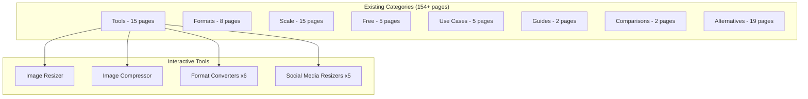
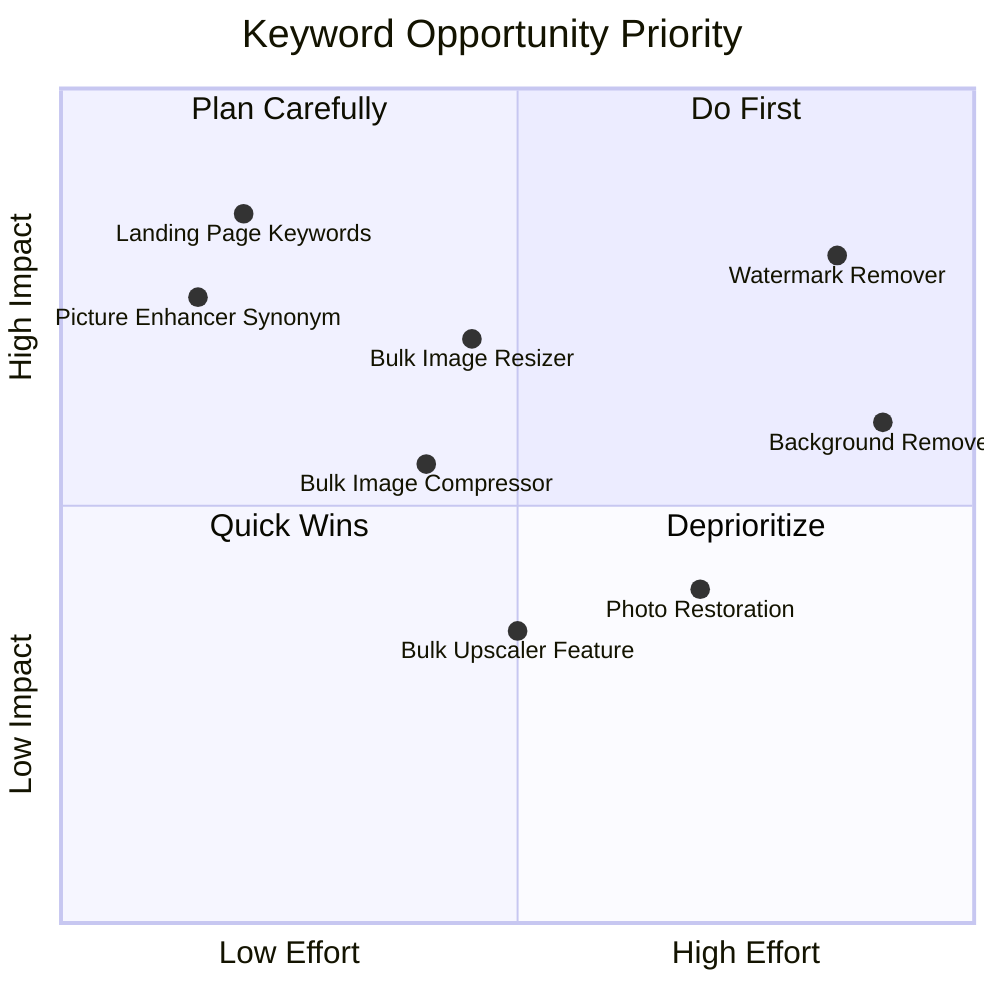

# pSEO Keyword Opportunities PRD 2025

## Overview

**Project:** pSEO Expansion Based on Keyword Research
**Date:** 2025-12-26
**Version:** 1.0
**Status:** Draft
**Source:** Google Ads Demand Sniffer Report (62 opportunities)

---

## 1. Context Analysis

### 1.1 Files Analyzed

- `/docs/SEO/opportunities.pdf` - Google Ads keyword research report
- `/app/seo/data/interactive-tools.json` - Existing interactive tools (13 pages)
- `/app/seo/data/tools.json` - Existing tool pages
- `/docs/PRDs/pseo-expansion-strategy.md` - Previous pSEO strategy
- `/lib/seo/pseo-types.ts` - pSEO type definitions
- `/app/page.tsx` - Landing page metadata
- `/client/components/pages/HomePageClient.tsx` - Landing page content

### 1.2 Current pSEO Coverage



### 1.3 Keyword Research Summary

From the 62 keywords in the report, after removing duplicates and filtering by relevance:

| Relevance                     | Keywords | Total Monthly Volume |
| ----------------------------- | -------- | -------------------- |
| High (Direct Match)           | 7        | ~180,000             |
| Medium (New Tool Opportunity) | 18       | ~15,000              |
| Low (Competitor/External)     | 12       | N/A                  |

### 1.4 Problem Statement

Many high-volume keywords represent features we can implement as new pSEO tool pages (bulk resize, watermark removal, photo restoration), but currently have no coverage.

---

## 2. Keyword Analysis & Recommendations

### 2.1 Keywords Already Covered (Verify Optimization)

| Keyword           | Volume | Score | Current Coverage    | Action              |
| ----------------- | ------ | ----- | ------------------- | ------------------- |
| ai upscale        | 33,100 | 89    | Landing page, tools | Optimize landing H1 |
| ai image upscaler | 27,100 | 85    | Multiple pages      | Good coverage       |
| image enhancer    | 49,500 | 84    | Partial             | Add as H2 synonym   |
| picture enhancer  | 49,500 | 84    | NOT covered         | Add as synonym/page |
| ai image enhancer | 22,200 | 83    | Tool page           | Good coverage       |
| ai upscale image  | 8,100  | 82    | Various             | Good coverage       |

### 2.2 NEW TOOL OPPORTUNITIES - Bulk/Batch Operations

**Priority: HIGH** - These represent significant gaps with real search volume.

| Keyword                 | Volume | Score | Recommendation                |
| ----------------------- | ------ | ----- | ----------------------------- |
| bulk resize             | 1,300  | 62    | NEW interactive tool page     |
| resize in bulk          | 1,300  | 62    | Synonym for above             |
| bulk image resizer      | 2,900  | 60    | NEW interactive tool page     |
| bulk picture resizer    | 2,900  | 60    | Synonym redirect              |
| mass resize photos      | 2,900  | 60    | Synonym redirect              |
| bulk image compressor   | 480    | 53    | NEW interactive tool page     |
| bulk image upscaler     | 90     | 43    | Feature highlight on existing |
| bulk image optimization | 40     | 46    | Combine with compressor       |

**Proposed New Pages:**

1. `/tools/resize/bulk-image-resizer` - Batch resize multiple images
2. `/tools/compress/bulk-image-compressor` - Batch compress multiple images

### 2.3 NEW TOOL OPPORTUNITIES - Background Removal

**Priority: MEDIUM** - New feature vertical, requires new AI capability.

| Keyword                 | Volume | Score | Recommendation    |
| ----------------------- | ------ | ----- | ----------------- |
| bulk background remover | 320    | 42    | NEW tool category |
| bulk remove background  | 110    | 43    | Synonym           |
| remove background bulk  | 70     | 52    | Synonym           |
| background removal api  | 50     | 42    | API landing page  |
| background remover api  | 70     | 42    | API landing page  |

**Proposed New Pages (if feature implemented):**

1. `/tools/background-remover` - AI background removal tool
2. `/tools/bulk-background-remover` - Batch background removal

### 2.4 NEW TOOL OPPORTUNITIES - Watermark Removal

**Priority: HIGH** - Very high volume, existing AI capability could support.

| Keyword              | Volume | Score | Recommendation |
| -------------------- | ------ | ----- | -------------- |
| ai watermark remover | 12,100 | 74    | NEW tool page  |
| watermark remover ai | 2,400  | 56    | Synonym        |

**Note:** Watermark removal is ethically complex. Consider:

- Only remove watermarks from user's own images
- Clear disclaimer about copyright
- Focus on "remove watermarks from your own photos"

**Proposed New Page:**

1. `/tools/watermark-remover` - AI watermark removal (with ethical guidelines)

### 2.5 NEW TOOL OPPORTUNITIES - Photo Restoration

**Priority: MEDIUM** - Aligns with "enhance" positioning, moderate volume.

| Keyword                       | Volume | Score | Recommendation        |
| ----------------------------- | ------ | ----- | --------------------- |
| ai photo restoration online   | 30     | 48    | NEW tool/guide page   |
| online ai photo restoration   | 70     | 47    | Synonym               |
| ai photo restoration software | 110    | 45    | Comparison page       |
| face restoration ai           | 40     | 43    | Specific feature page |

**Proposed New Pages:**

1. `/tools/photo-restoration` - AI photo restoration tool
2. `/use-cases/photo-restoration` - Use case landing page

### 2.6 EXCLUDED Keywords (Not Relevant)

| Keyword                         | Volume | Reason for Exclusion                |
| ------------------------------- | ------ | ----------------------------------- |
| watermarkremover io             | 6,600  | Competitor brand name               |
| pixelbin watermark remover      | 1,900  | Competitor brand name               |
| topaz photo ai batch processing | 50     | Competitor product feature          |
| lightroom batch editing         | 480    | Adobe Lightroom (external tool)     |
| batch process in lightroom      | 50     | Adobe Lightroom (external tool)     |
| batch in photoshop              | 260    | Adobe Photoshop (external tool)     |
| batch process in photoshop      | 260    | Adobe Photoshop (external tool)     |
| jpg to ai                       | 260    | Adobe Illustrator format (.ai file) |
| jpg to ai format                | 260    | Adobe Illustrator format            |
| jpg to ai illustrator           | 260    | Adobe Illustrator format            |
| adobe illustrator to jpeg       | 30     | Adobe product conversion            |
| adobe illustrator to jpg        | 30     | Adobe product conversion            |

---

## 3. Landing Page Keyword Optimization

### 3.1 Current Landing Page Analysis

**Current Meta Title:** `{APP_NAME} | Image Upscaling & Enhancement`
**Current H1:** `Upscale Images For Professional Use`
**Current Description:** `Transform your images with cutting-edge AI. Upscale, enhance, and restore details with professional quality.`

### 3.2 Recommended Landing Page Changes

#### A. Meta Title Optimization

**Current:**

```
MyImageUpscaler | Image Upscaling & Enhancement
```

**Recommended:**

```
AI Image Upscaler | Enhance & Upscale Photos Online Free
```

**Rationale:** Includes high-volume keywords "AI Image Upscaler" (27,100/mo) and "Upscale Photos" while keeping it under 60 characters.

#### B. Meta Description Optimization

**Current:**

```
Transform your images with cutting-edge AI. Upscale, enhance, and restore details with professional quality.
```

**Recommended:**

```
Free AI image upscaler and picture enhancer. Upscale images up to 4x, enhance photo quality, and restore details. No signup required for basic features.
```

**Rationale:** Includes "AI image upscaler", "picture enhancer", "upscale images", and "enhance photo" - all high-volume keywords.

#### C. H1 Optimization

**Current:**

```html
Upscale Images For Professional Use
```

**Recommended:**

```html
AI Image Upscaler & Photo Enhancer
```

**Rationale:** Direct keyword match for "AI Image Upscaler" (27,100/mo) and "Photo Enhancer" (49,500/mo).

#### D. Subheadline/H2 Addition

**Current:**

```
Enhance resolution, remove noise, and restore details in seconds.
```

**Recommended:**

```
Free AI-Powered Image Enhancement & Upscaling
Enhance resolution, remove noise, and restore details in seconds.
```

**Rationale:** Adds "AI-Powered Image Enhancement" as an H2 for secondary keyword targeting.

#### E. Additional Keyword Integration (Body Copy)

Add these keyword variations naturally in landing page sections:

- "picture enhancer" (49,500/mo) - Currently missing
- "ai upscale" (33,100/mo) - Use as verb form
- "image enhancer" (49,500/mo) - Add as synonym
- "enhance photo quality" - Long-tail variation

---

## 4. Proposed Implementation Plan

### Phase 1: Landing Page Optimization (Quick Wins)

- [ ] Update `app/page.tsx` metadata (title, description)
- [ ] Update `HomePageClient.tsx` H1 and subheadline
- [ ] Add "picture enhancer" and "image enhancer" synonyms to body copy
- [ ] Update `schema-generator.ts` with new keywords

### Phase 2: New Interactive Tool Pages (Bulk Operations)

#### A. Bulk Image Resizer (`/tools/resize/bulk-image-resizer`)

**Target Keywords:**

- bulk resize (1,300/mo)
- bulk image resizer (2,900/mo)
- bulk picture resizer (2,900/mo)
- mass resize photos (2,900/mo)

**Page Structure:**

```typescript
{
  slug: "bulk-image-resizer",
  title: "Bulk Image Resizer",
  metaTitle: "Free Bulk Image Resizer - Resize Multiple Photos at Once | MyImageUpscaler",
  metaDescription: "Resize multiple images at once with our free bulk image resizer. Mass resize photos to any dimension. Works in your browser - no upload required.",
  h1: "Free Bulk Image Resizer - Mass Resize Photos Instantly",
  primaryKeyword: "bulk image resizer",
  secondaryKeywords: ["bulk resize", "mass resize photos", "resize multiple images", "bulk picture resizer", "batch resize images"],
  toolComponent: "BulkImageResizer", // New component needed
  features: [
    "Resize up to 20 images at once",
    "Apply same dimensions to all",
    "Maintain aspect ratio option",
    "Download as ZIP file",
    "100% browser-based - no uploads"
  ]
}
```

#### B. Bulk Image Compressor (`/tools/compress/bulk-image-compressor`)

**Target Keywords:**

- bulk image compressor (480/mo)
- bulk image optimization (40/mo)
- batch image compressor (90/mo)

**Page Structure:**

```typescript
{
  slug: "bulk-image-compressor",
  title: "Bulk Image Compressor",
  metaTitle: "Free Bulk Image Compressor - Compress Multiple Images | MyImageUpscaler",
  metaDescription: "Compress multiple images at once. Reduce file sizes by up to 80% with our free bulk image compressor. Browser-based, no upload required.",
  h1: "Free Bulk Image Compressor - Optimize Multiple Photos",
  primaryKeyword: "bulk image compressor",
  secondaryKeywords: ["batch image compressor", "bulk image optimization", "compress multiple images", "mass image compression"],
  toolComponent: "BulkImageCompressor" // New component needed
}
```

### Phase 3: New Feature Pages (Requires New Capabilities)

These require actual feature implementation, not just pSEO pages:

#### A. Watermark Remover (If Implemented)

**Target Keywords:** ai watermark remover (12,100/mo)

**Ethical Considerations:**

- Prominent disclaimer: "Remove watermarks from YOUR OWN images only"
- Terms of service update required
- Consider limiting to specific use cases

#### B. Background Remover (If Implemented)

**Target Keywords:** bulk background remover (320/mo)

**Technical Considerations:**

- Requires new AI model (e.g., RemBG, Segment Anything)
- Browser-based option possible with TensorFlow.js
- Could integrate with existing upscaler workflow

#### C. Photo Restoration (If Implemented)

**Target Keywords:** ai photo restoration online (100/mo combined)

**Current Capability Assessment:**

- Existing upscaler may already handle some restoration
- Could position existing enhance feature for this keyword
- Create use-case page highlighting restoration capabilities

---

## 5. Data Structure for New Pages

### 5.1 Bulk Tools Type Extension

Add to `/lib/seo/pseo-types.ts`:

```typescript
export interface IBulkToolPage extends IBasePSEOPage {
  toolName: string;
  toolComponent: string;
  maxFiles: number;
  acceptedFormats: string[];
  features: IFeature[];
  useCases: IUseCase[];
  benefits: IBenefit[];
  howItWorks: IStep[];
  faq: IFAQ[];
  limitations: string[];
  outputFormat: 'zip' | 'individual';
}
```

### 5.2 New Data File

Create `/app/seo/data/bulk-tools.json`:

```json
{
  "category": "bulk-tools",
  "pages": [
    {
      "slug": "bulk-image-resizer",
      "title": "Bulk Image Resizer"
      // ... full page data
    },
    {
      "slug": "bulk-image-compressor",
      "title": "Bulk Image Compressor"
      // ... full page data
    }
  ]
}
```

---

## 6. Priority Matrix



### Priority Ranking

1. **Immediate (This Week):**
   - Landing page meta optimization
   - Add "picture enhancer" and "image enhancer" synonyms

2. **Short-term (1-2 Weeks):**
   - Create bulk-image-resizer pSEO page + component
   - Create bulk-image-compressor pSEO page + component

3. **Medium-term (1 Month):**
   - Evaluate watermark remover feasibility
   - Create photo restoration use-case page

4. **Long-term (Consider):**
   - Background removal feature
   - API landing pages for developer keywords

---

## 7. Success Metrics

### 7.1 Keyword Ranking Targets

| Keyword               | Current Rank | Target (3mo) | Target (6mo) |
| --------------------- | ------------ | ------------ | ------------ |
| ai image upscaler     | Top 20       | Top 10       | Top 5        |
| picture enhancer      | Not ranking  | Top 50       | Top 20       |
| bulk image resizer    | Not ranking  | Top 30       | Top 15       |
| bulk image compressor | Not ranking  | Top 30       | Top 15       |

### 7.2 Traffic Goals

- **Immediate:** +10% organic traffic from landing page optimizations
- **Short-term:** +25% organic traffic from new bulk tool pages
- **Medium-term:** +50% organic traffic overall

### 7.3 Conversion Metrics

- Track tool usage to signup conversion rate
- Monitor pSEO page to main upscaler CTR
- A/B test CTA placements on new pages

---

## 8. Technical Considerations

### 8.1 Cloudflare Workers Compatibility

Bulk tools processing multiple images must:

- Run entirely client-side (browser Canvas API)
- NOT exceed 10ms CPU limit per request
- Use Web Workers for parallel processing
- Implement proper progress indicators

### 8.2 New Components Required

```
client/components/tools/
├── BulkImageResizer.tsx      # NEW - multi-file resize
├── BulkImageCompressor.tsx   # NEW - multi-file compress
└── shared/
    ├── MultiFileUpload.tsx   # NEW - drag & drop multiple
    ├── ProgressBar.tsx       # Existing
    └── ZipDownloader.tsx     # NEW - create ZIP output
```

### 8.3 Dependencies

```json
{
  "jszip": "^3.10.1" // For ZIP file creation
}
```

---

## 9. Appendix

### A. Full Keyword Data (Deduplicated & Sorted by Score)

| Rank | Keyword                       | Volume | Score | Relevance |
| ---- | ----------------------------- | ------ | ----- | --------- |
| 1    | ai upscale                    | 33,100 | 89    | HIGH      |
| 2    | ai image upscaler             | 27,100 | 85    | HIGH      |
| 3    | image enhancer                | 49,500 | 84    | HIGH      |
| 4    | picture enhancer              | 49,500 | 84    | HIGH      |
| 5    | ai image enhancer             | 22,200 | 83    | HIGH      |
| 6    | ai upscale image              | 8,100  | 82    | HIGH      |
| 7    | ai watermark remover          | 12,100 | 74    | MEDIUM    |
| 8    | bulk resize                   | 1,300  | 62    | MEDIUM    |
| 9    | bulk image resizer            | 2,900  | 60    | MEDIUM    |
| 10   | watermark remover ai          | 2,400  | 56    | MEDIUM    |
| 11   | batch image compressor        | 90     | 55    | MEDIUM    |
| 12   | bulk image compressor         | 480    | 53    | MEDIUM    |
| 13   | remove background bulk        | 70     | 52    | MEDIUM    |
| 14   | ai photo restoration online   | 30     | 48    | MEDIUM    |
| 15   | bulk image optimization       | 40     | 46    | MEDIUM    |
| 16   | ai photo restoration software | 110    | 45    | MEDIUM    |
| 17   | bulk image upscaler           | 90     | 43    | MEDIUM    |
| 18   | bulk remove background        | 110    | 43    | MEDIUM    |
| 19   | face restoration ai           | 40     | 43    | MEDIUM    |
| 20   | bulk background remover       | 320    | 42    | MEDIUM    |

### B. Competitor Keywords (Excluded but Monitor)

These keywords target specific competitors. Consider creating "alternatives" pages:

- `watermarkremover io` (6,600/mo) → `/alternatives/watermarkremover-io`
- `pixelbin watermark remover` (1,900/mo) → `/alternatives/pixelbin`
- `topaz photo ai` → Already have alternatives pages

---

## Document Status

**Status:** Ready for Review
**Next Steps:**

1. Stakeholder approval for landing page changes
2. Decision on bulk tools implementation
3. Evaluate watermark remover ethical/legal considerations
4. Resource allocation for new component development
