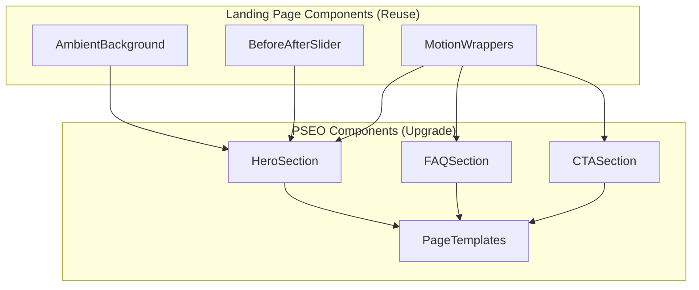

# PRD: PSEO UI Quality Improvements

**Date:** 2025-01-14
**Status:** Planning
**Priority:** High
**Complexity:** MEDIUM (score: 6)

---

## Step 0: Complexity Assessment

**COMPLEXITY SCORE:** 6 → **MEDIUM mode**

| Factor | Score |
|--------|-------|
| Touches 6-10 files | +2 |
| Multiple templates to update | +1 |
| Visual/UI changes (manual checkpoint) | +2 |
| Reuses existing landing components | +1 |

---

## 1. Context

**Problem:** PSEO (programmatic SEO) pages have poor visual quality compared to the landing page, resulting in lower engagement and conversion rates.

**Files Analyzed:**

- `client/components/pages/HomePageClient.tsx` - Landing page reference
- `app/(pseo)/_components/pseo/templates/AlternativePageTemplate.tsx` - PSEO template
- `app/(pseo)/_components/pseo/sections/HeroSection.tsx` - PSEO hero
- `app/(pseo)/_components/pseo/sections/FAQSection.tsx` - PSEO FAQ
- `app/(pseo)/_components/pseo/sections/CTASection.tsx` - PSEO CTA
- `app/(pseo)/_components/pseo/ui/FAQAccordion.tsx` - PSEO FAQ accordion
- `client/components/landing/AmbientBackground.tsx` - Reusable background
- `client/components/landing/HeroBeforeAfter.tsx` - Before/after slider
- `client/components/ui/BeforeAfterSlider.tsx` - Slider component

**Current Behavior:**

- PSEO pages use plain solid backgrounds (`bg-base`, `bg-surface-light`)
- Basic FadeIn animations only
- Simple cards with minimal styling
- No ambient background effects
- Smaller, less prominent typography
- Missing interactive elements (before/after slider)
- Less visual hierarchy and depth

**Landing Page Has:**

- `AmbientBackground` component with animated orbs
- `HeroBeforeAfter` interactive slider
- Framer Motion animations with variants
- Glass effects (`glass-strong`, `glass-card-2025`)
- Rich section backgrounds with gradients/patterns
- Better typography (larger, bolder headings)
- Engaging CTAs with hover/active states

---

## 2. Solution

**Approach:**

1. Reuse existing landing page components (AmbientBackground, BeforeAfterSlider) in PSEO pages
2. Upgrade PSEO section components with Framer Motion animations
3. Add glass effects, gradient text, and improved backgrounds
4. Enhance typography hierarchy for better visual impact
5. Add before/after slider to hero sections where applicable

**Key Decisions:**

- **Library:** Reuse `framer-motion` (already in project)
- **Components:** Reuse `AmbientBackground`, `BeforeAfterSlider` from landing
- **Styling:** Use existing Tailwind classes: `glass-strong`, `glass-card-2025`, `gradient-text-primary`
- **Animation:** Use Framer Motion with variants and `whileHover`/`whileTap`
- **Checkpoint:** Manual verification required for visual changes

**Data Changes:** None

---

## 3. Architecture



---

## 4. Execution Phases

### Phase 1: Upgrade HeroSection with Ambient Background and Motion

**User-visible outcome:** PSEO hero sections have animated background and smooth entrance animations.

**Files (max 5):**

- `app/(pseo)/_components/pseo/sections/HeroSection.tsx` - Add AmbientBackground, Framer Motion
- `app/[locale]/(pseo)/_components/pseo/sections/HeroSection.tsx` - Same changes for i18n

**Implementation:**

- [ ] Import `AmbientBackground` from `@client/components/landing/AmbientBackground`
- [ ] Import `motion` from `framer-motion`
- [ ] Add `AmbientBackground variant="hero"` to section
- [ ] Wrap content in `motion.div` with variants for stagger animation
- [ ] Add `whileHover={{ scale: 1.02 }}` to CTA button
- [ ] Add `whileTap={{ scale: 0.98 }}` to CTA button
- [ ] Update badge to use `glass-strong` class
- [ ] Update section background to use `hero-gradient-2025` class
- [ ] Increase H1 size: `text-6xl sm:text-7xl md:text-8xl`
- [ ] Add gradient text for subtitle highlight

**Tests Required:**
| Test File | Test Name | Assertion |
|-----------|-----------|-----------|
| N/A (visual) | Manual verification | Hero has animated orbs and smooth animations |

**User Verification (Manual):**

1. Visit any PSEO page (e.g., `/alternatives/vs-bigjpg/`)
2. **Expected:** Hero section has animated gradient orbs in background
3. **Expected:** Content fades in smoothly on load
4. **Expected:** CTA button scales on hover

---

### Phase 2: Add Before/After Slider to Hero

**User-visible outcome:** PSEO hero sections show interactive before/after image comparison.

**Files (max 5):**

- `app/(pseo)/_components/pseo/sections/HeroSection.tsx` - Add slider component
- `app/[locale]/(pseo)/_components/pseo/sections/HeroSection.tsx` - Same for i18n

**Implementation:**

- [ ] Import `HeroBeforeAfter` from `@client/components/landing/HeroBeforeAfter`
- [ ] Add `HeroBeforeAfter` component after CTA, wrapped in `motion.div`
- [ ] Add entrance animation: `initial={{ opacity: 0, y: 40 }} animate={{ opacity: 1, y: 0 }}`
- [ ] Set transition delay: 0.7s
- [ ] Wrap in `div` with `mt-12` class

**Tests Required:**
| Test File | Test Name | Assertion |
|-----------|-----------|-----------|
| N/A (visual) | Manual verification | Slider appears and is interactive |

**User Verification (Manual):**

1. Visit any PSEO page
2. **Expected:** Before/after slider appears below CTA
3. **Expected:** Slider animates in smoothly
4. **Expected:** Dragging slider shows before/after comparison

---

### Phase 3: Upgrade FAQSection with Glass Effects and Motion

**User-visible outcome:** FAQ section has glass cards and smoother animations.

**Files (max 5):**

- `app/(pseo)/_components/pseo/sections/FAQSection.tsx` - Add motion, glass effects
- `app/(pseo)/_components/pseo/ui/FAQAccordion.tsx` - Upgrade card styling
- `app/[locale]/(pseo)/_components/pseo/sections/FAQSection.tsx` - Same for i18n
- `app/[locale]/(pseo)/_components/pseo/ui/FAQAccordion.tsx` - Same for i18n

**Implementation:**

**FAQSection.tsx:**
- [ ] Import `motion` from `framer-motion`
- [ ] Add `AmbientBackground variant="section"` to section
- [ ] Update section class: `py-24` (from `py-12`)
- [ ] Update H2: `text-4xl sm:text-5xl font-black text-white`
- [ ] Wrap title in `motion.div` with fade animation
- [ ] Update container to use `StaggerContainer` with `staggerDelay={0.05}`

**FAQAccordion.tsx:**
- [ ] Update card class: `glass-card-2025 animated-border-violet`
- [ ] Add motion wrapper with `whileHover={{ y: -2 }}`
- [ ] Update button hover state with transition

**Tests Required:**
| Test File | Test Name | Assertion |
|-----------|-----------|-----------|
| N/A (visual) | Manual verification | FAQ cards have glass effect and hover animation |

**User Verification (Manual):**

1. Visit any PSEO page with FAQ section
2. **Expected:** FAQ section has ambient orb in background
3. **Expected:** FAQ cards have glass effect with violet border
4. **Expected:** Cards lift slightly on hover
5. **Expected:** FAQ items stagger in on scroll

---

### Phase 4: Upgrade CTASection with Better Styling

**User-visible outcome:** CTA section matches landing page quality with better visual effects.

**Files (max 5):**

- `app/(pseo)/_components/pseo/sections/CTASection.tsx` - Upgrade styling
- `app/[locale]/(pseo)/_components/pseo/sections/CTASection.tsx` - Same for i18n

**Implementation:**

- [ ] Import `motion` from `framer-motion`
- [ ] Update section class: `py-24` (from `py-20`)
- [ ] Add `section-glow-top` class to section
- [ ] Update H2: `text-4xl sm:text-6xl font-black text-white`
- [ ] Add gradient text to highlight span in title
- [ ] Wrap CTA button in `motion.button` with `whileHover`/`whileTap`
- [ ] Update trust indicators to match landing page style
- [ ] Add bottom ambient orb decoration

**Tests Required:**
| Test File | Test Name | Assertion |
|-----------|-----------|-----------|
| N/A (visual) | Manual verification | CTA has rich background and interactive button |

**User Verification (Manual):**

1. Visit any PSEO page, scroll to bottom CTA
2. **Expected:** CTA section has gradient background with glow effect
3. **Expected:** Title is large and bold with gradient text
4. **Expected:** Button scales on hover/tap

---

### Phase 5: Upgrade Page Template Backgrounds and Layout

**User-visible outcome:** PSEO pages have consistent background and better spacing throughout.

**Files (max 5):**

- `app/(pseo)/_components/pseo/templates/AlternativePageTemplate.tsx` - Update layout
- `app/(pseo)/_components/pseo/templates/DeviceUsePageTemplate.tsx` - Update layout
- `app/(pseo)/_components/pseo/templates/ScalePageTemplate.tsx` - Update layout
- `app/(pseo)/_components/pseo/templates/FormatPageTemplate.tsx` - Update layout
- `app/(pseo)/_components/pseo/templates/ToolPageTemplate.tsx` - Update layout

**Implementation:**

- [ ] Update main container: `min-h-screen bg-main` (from `bg-base`)
- [ ] Add subtle grid pattern background (from landing page)
- [ ] Add ambient background orbs at page level
- [ ] Update section spacing: `py-12` → `py-16`
- [ ] Update cards to use `glass-card-2025`
- [ ] Ensure consistent max-width containers

**Tests Required:**
| Test File | Test Name | Assertion |
|-----------|-----------|-----------|
| N/A (visual) | Manual verification | Page has consistent dark theme and spacing |

**User Verification (Manual):**

1. Visit various PSEO pages
2. **Expected:** All pages use dark theme (`bg-main`)
3. **Expected:** Subtle grid pattern visible in background
4. **Expected:** Consistent spacing throughout

---

## 5. Checkpoint Protocol

**ALL phases require manual checkpoint verification** due to visual nature of changes.

### Manual Checkpoint Template

After each phase, provide:

```
## PHASE [N] COMPLETE - CHECKPOINT

**Files changed:**
- `path/to/file.tsx`
- ...

**Manual verification needed:**
1. [ ] [Specific test action → expected result]
2. [ ] [Specific test action → expected result]

**Reply "continue" to proceed to Phase [N+1], or report issues.**
```

---

## 6. Acceptance Criteria

- [ ] All 5 phases complete
- [ ] PSEO pages match landing page visual quality
- [ ] Ambient backgrounds render correctly on all PSEO pages
- [ ] Before/after slider is functional on hero sections
- [ ] All animations are smooth (60fps)
- [ ] No console errors
- [ ] Mobile responsive maintained

---

## 7. Risk Mitigation

| Risk | Mitigation |
|------|------------|
| Performance impact from animations | Use CSS transforms only, lazy-load below-fold |
| Breaking existing analytics | Preserve all analytics tracking calls |
| i18n pages out of sync | Make identical changes to both `/app/(pseo)/` and `/app/[locale]/(pseo)/` |
| Before/after images not available for all tools | Add prop to optionally enable/disable slider |

---

## 8. Definition of Done

- [ ] All phases implemented
- [ ] Manual visual verification passed on:
  - [ ] Alternative pages (e.g., `/alternatives/vs-bigjpg/`)
  - [ ] Tool pages (e.g., `/tools/image-upscaler/`)
  - [ ] Format pages (e.g., `/formats/jpg-upscaler/`)
  - [ ] Device pages (e.g., `/device-use/iphone-upscaler/`)
- [ ] No regression in existing functionality
- [ ] Code review approved
