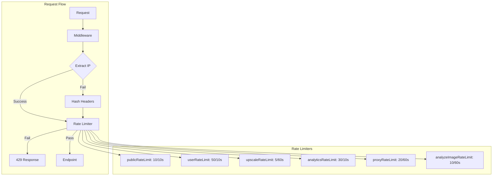
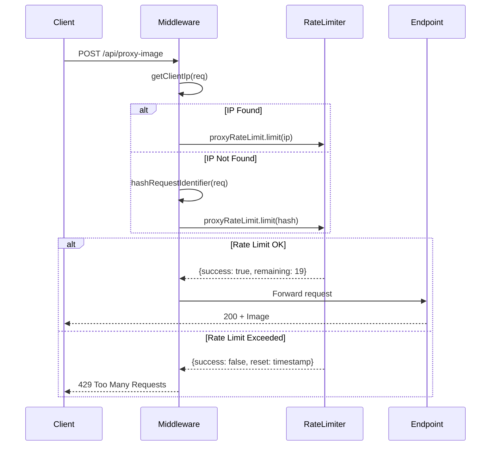

# PRD: Rate Limiting Hardening

**Priority:** P0 - Critical
**Estimated Effort:** 1-2 days
**Author:** Engineering Team
**Date:** 2025-12-29

---

## 1. Context Analysis

### 1.1 Files Analyzed

- `lib/middleware/rateLimit.ts`
- `server/rateLimit.ts`
- `app/api/analyze-image/route.ts`
- `app/api/analytics/event/route.ts`
- `app/api/proxy-image/route.ts`
- `middleware.ts`

### 1.2 Component & Dependency Overview

```mermaid
graph TD
    subgraph "Current Rate Limiting"
        A[middleware.ts] --> B[lib/middleware/rateLimit.ts]
        B --> C[server/rateLimit.ts]
        C --> D[In-Memory Map]
    end

    subgraph "Bypass Vectors"
        E[sk_test_ key check] -->|"BYPASS"| B
        F[/api/analytics/event] -->|"NO LIMIT"| G[Direct Access]
        H[/api/proxy-image] -->|"NO LIMIT"| G
        I[unknown IP fallback] -->|"SHARED BUCKET"| C
    end

    style E fill:#f99
    style F fill:#f99
    style H fill:#f99
    style I fill:#f99
```

### 1.3 Current Behavior Summary

- **Test Environment Check:** `isTestEnvironment()` in `rateLimit.ts:53-62` checks if `STRIPE_SECRET_KEY.startsWith('sk_test_')` - this bypasses rate limiting in production when using test Stripe keys
- **Missing Rate Limits:** `/api/analytics/event` and `/api/proxy-image` have no rate limiting applied
- **Unknown IP Fallback:** When IP extraction fails, all requests share the `'unknown'` identifier bucket
- **Analyze-Image:** No rate limiting, relies only on authentication
- **In-Memory Storage:** Each Cloudflare Worker instance has isolated storage (documented limitation)

### 1.4 Problem Statement

Rate limiting can be bypassed via test Stripe keys in production, and several public endpoints lack rate limiting entirely, creating abuse vectors for flooding and bandwidth consumption.

---

## 2. Proposed Solution

### 2.1 Architecture Summary

1. **Remove Stripe key check** from `isTestEnvironment()` - only use explicit `ENV` variable
2. **Add rate limiting** to `/api/analytics/event`, `/api/proxy-image`, and `/api/analyze-image`
3. **Use request hash** instead of 'unknown' for unidentified IPs
4. **Create endpoint-specific rate limiters** with appropriate limits

**Alternatives Considered:**

- Cloudflare KV for distributed rate limiting: Deferred - adds complexity and cost, current in-memory is acceptable for MVP
- WAF rules: Complementary but not a replacement for application-level limits

### 2.2 Architecture Diagram



### 2.3 Key Technical Decisions

| Decision                     | Rationale                                                         |
| ---------------------------- | ----------------------------------------------------------------- |
| Remove `sk_test_` check      | Test keys should NOT affect production rate limiting              |
| Keep in-memory rate limiting | Documented trade-off; Cloudflare KV is future enhancement         |
| Hash-based fallback          | Prevents shared bucket abuse while maintaining some rate limiting |
| Endpoint-specific limits     | Different endpoints have different abuse potential                |

### 2.4 Data Model Changes

**No Data Changes.** This is purely application code.

---

### 2.5 Runtime Execution Flow



---

## 3. Detailed Implementation Spec

### A. `lib/middleware/rateLimit.ts`

**Changes Needed:**

- Remove `STRIPE_SECRET_KEY` check from `isTestEnvironment()`
- Add `hashRequestIdentifier()` function for fallback identification
- Update `getClientIp()` to use hash fallback

**Pseudo-code:**

```typescript
/**
 * Check if rate limiting should be skipped (test environment)
 * SECURITY FIX: Removed Stripe key check - only use explicit ENV
 */
export function isTestEnvironment(): boolean {
  return (
    serverEnv.ENV === 'test' || serverEnv.NODE_ENV === 'test' || serverEnv.PLAYWRIGHT_TEST === '1'
  );
  // REMOVED: sk_test_ check, NEXT_PUBLIC_SUPABASE_URL check, AMPLITUDE_API_KEY check
}

/**
 * Generate a hash-based identifier when IP extraction fails
 * Uses User-Agent + Accept-Language + Accept-Encoding as fingerprint
 */
function hashRequestIdentifier(req: NextRequest): string {
  const ua = req.headers.get('user-agent') || '';
  const lang = req.headers.get('accept-language') || '';
  const encoding = req.headers.get('accept-encoding') || '';

  // Simple hash for rate limiting (not cryptographic)
  const combined = `${ua}:${lang}:${encoding}`;
  let hash = 0;
  for (let i = 0; i < combined.length; i++) {
    const char = combined.charCodeAt(i);
    hash = (hash << 5) - hash + char;
    hash = hash & hash; // Convert to 32bit integer
  }
  return `hash_${Math.abs(hash).toString(36)}`;
}

/**
 * Get the client IP address, with hash fallback
 */
export function getClientIp(req: NextRequest): string {
  const cfConnectingIp = req.headers.get('cf-connecting-ip');
  if (cfConnectingIp) return cfConnectingIp;

  const xForwardedFor = req.headers.get('x-forwarded-for');
  if (xForwardedFor) {
    const firstIp = xForwardedFor.split(',')[0]?.trim();
    if (firstIp) return firstIp;
  }

  const xRealIp = req.headers.get('x-real-ip');
  if (xRealIp) return xRealIp;

  // SECURITY FIX: Use hash instead of shared 'unknown' bucket
  return hashRequestIdentifier(req);
}
```

**Justification:** Removes production bypass and prevents shared bucket abuse.

---

### B. `server/rateLimit.ts`

**Changes Needed:**

- Add new rate limiters for unprotected endpoints

**Pseudo-code:**

```typescript
/**
 * Rate limiter for analytics event endpoint
 * 30 requests per 10 seconds (moderate - high volume expected)
 */
export const analyticsRateLimit = {
  limit: createRateLimiter(30, 10 * 1000),
};

/**
 * Rate limiter for image proxy endpoint
 * 20 requests per 60 seconds (bandwidth-heavy)
 */
export const proxyRateLimit = {
  limit: createRateLimiter(20, 60 * 1000),
};

/**
 * Rate limiter for image analysis endpoint
 * 10 requests per 60 seconds (LLM API calls are expensive)
 */
export const analyzeImageRateLimit = {
  limit: createRateLimiter(10, 60 * 1000),
};
```

**Justification:** Provides appropriate limits based on endpoint cost and expected usage.

---

### C. `app/api/analytics/event/route.ts`

**Changes Needed:**

- Add rate limiting at the start of the POST handler

**Pseudo-code:**

```typescript
import { analyticsRateLimit } from '@server/rateLimit';
import { getClientIp, isTestEnvironment } from '@lib/middleware/rateLimit';

export async function POST(req: NextRequest): Promise<NextResponse> {
  // Apply rate limiting (IP-based for public endpoint)
  if (!isTestEnvironment()) {
    const ip = getClientIp(req);
    const { success, remaining, reset } = await analyticsRateLimit.limit(ip);

    if (!success) {
      return NextResponse.json(
        { error: 'Too many analytics requests' },
        {
          status: 429,
          headers: {
            'X-RateLimit-Remaining': remaining.toString(),
            'Retry-After': Math.ceil((reset - Date.now()) / 1000).toString(),
          },
        }
      );
    }
  }

  // ... existing handler logic
}
```

---

### D. `app/api/proxy-image/route.ts`

**Changes Needed:**

- Add rate limiting at the start of the GET handler

**Pseudo-code:**

```typescript
import { proxyRateLimit } from '@server/rateLimit';
import { getClientIp, isTestEnvironment } from '@lib/middleware/rateLimit';

export async function GET(req: NextRequest): Promise<NextResponse> {
  // Apply rate limiting
  if (!isTestEnvironment()) {
    const ip = getClientIp(req);
    const { success, remaining, reset } = await proxyRateLimit.limit(ip);

    if (!success) {
      return NextResponse.json(
        { error: 'Too many proxy requests' },
        {
          status: 429,
          headers: {
            'X-RateLimit-Remaining': remaining.toString(),
            'Retry-After': Math.ceil((reset - Date.now()) / 1000).toString(),
          },
        }
      );
    }
  }

  // ... existing handler logic
}
```

---

### E. `app/api/analyze-image/route.ts`

**Changes Needed:**

- Add rate limiting after authentication check

**Pseudo-code:**

```typescript
import { analyzeImageRateLimit } from '@server/rateLimit';
import { isTestEnvironment } from '@lib/middleware/rateLimit';

export async function POST(req: NextRequest): Promise<NextResponse> {
  // ... existing auth check ...

  // Apply rate limiting (user-based since authenticated)
  if (!isTestEnvironment()) {
    const { success, remaining, reset } = await analyzeImageRateLimit.limit(userId);

    if (!success) {
      const { body, status } = createErrorResponse(
        ErrorCodes.RATE_LIMITED,
        'Too many analysis requests. Please wait before trying again.',
        429,
        { retryAfter: Math.ceil((reset - Date.now()) / 1000) }
      );
      return NextResponse.json(body, { status });
    }
  }

  // ... existing handler logic
}
```

---

## 4. Step-by-Step Execution Plan

### Phase 1: Core Rate Limiting Fixes (Independent)

- [ ] Update `isTestEnvironment()` to remove non-ENV checks
- [ ] Implement `hashRequestIdentifier()` function
- [ ] Update `getClientIp()` to use hash fallback
- [ ] Add unit tests for `isTestEnvironment()` changes

### Phase 2: New Rate Limiters (Independent)

- [ ] Add `analyticsRateLimit` to `server/rateLimit.ts`
- [ ] Add `proxyRateLimit` to `server/rateLimit.ts`
- [ ] Add `analyzeImageRateLimit` to `server/rateLimit.ts`

### Phase 3: Endpoint Integration (Depends on Phase 2)

- [ ] Add rate limiting to `/api/analytics/event`
- [ ] Add rate limiting to `/api/proxy-image`
- [ ] Add rate limiting to `/api/analyze-image`
- [ ] Add appropriate error responses with headers

### Phase 4: Testing

- [ ] Test that `sk_test_` no longer bypasses rate limits
- [ ] Test rate limiting on each new endpoint
- [ ] Test hash-based fallback behavior
- [ ] Verify Playwright tests still pass with `ENV=test`

---

## 5. Testing Strategy

### Unit Tests

| Function                  | Test Cases                                                             |
| ------------------------- | ---------------------------------------------------------------------- |
| `isTestEnvironment()`     | Returns true only for ENV=test, NODE_ENV=test, PLAYWRIGHT_TEST=1       |
| `hashRequestIdentifier()` | Consistent hash for same headers, different hash for different headers |
| `getClientIp()`           | CF header priority, hash fallback when no IP                           |
| Rate limiters             | Correct limits and window sizes                                        |

### Integration Tests

- Hit each endpoint repeatedly to verify 429 response
- Verify rate limit headers in responses
- Confirm tests pass with proper test environment flags

### Edge Cases

| Scenario                     | Expected Behavior                    |
| ---------------------------- | ------------------------------------ |
| Production with sk*test* key | Rate limiting ENABLED (fix verified) |
| No IP headers at all         | Hash-based identifier used           |
| Same UA from different IPs   | Different rate limit buckets         |
| Playwright tests             | Rate limiting skipped (ENV=test)     |

---

## 6. Acceptance Criteria

- [ ] `isTestEnvironment()` returns false in production regardless of Stripe key
- [ ] `/api/analytics/event` returns 429 after 30 requests in 10 seconds
- [ ] `/api/proxy-image` returns 429 after 20 requests in 60 seconds
- [ ] `/api/analyze-image` returns 429 after 10 requests in 60 seconds
- [ ] No requests share the 'unknown' identifier
- [ ] All 429 responses include `X-RateLimit-Remaining` and `Retry-After` headers
- [ ] Existing tests pass with `ENV=test` or `PLAYWRIGHT_TEST=1`

---

## 7. Verification & Rollback

### Success Criteria

- No 429 errors from legitimate users in production logs
- Abuse attempts blocked (visible in rate limit metrics)
- Test suite passes without modification

### Rollback Plan

1. **Immediate:** Revert `isTestEnvironment()` changes if legitimate users blocked
2. **Gradual:** Increase rate limits if too restrictive
3. **Feature Flag:** Add `RATE_LIMIT_ENABLED=false` env var for emergency disable

```typescript
// Emergency disable
if (serverEnv.RATE_LIMIT_ENABLED === 'false') {
  return null; // Skip rate limiting
}
```
