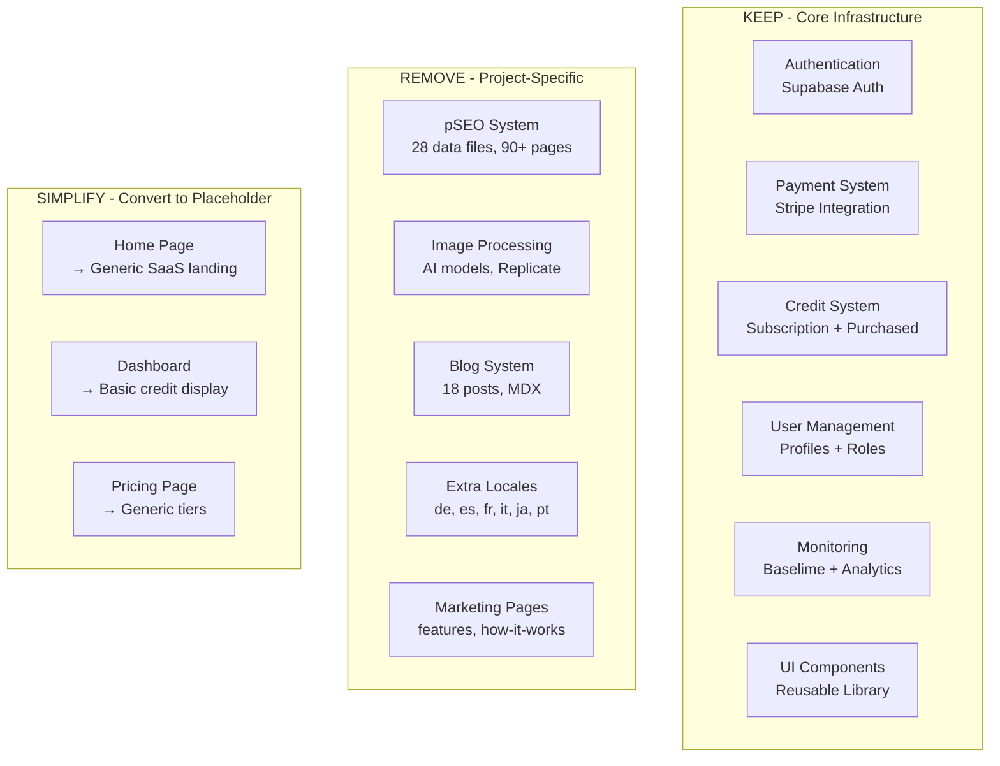

# PRD: SaaS Boilerplate Extraction

**Complexity: 9 → HIGH mode** (10+ directories touched, multi-package changes, major refactor)

---

## 1. Context

**Problem:** Transform the MyImageUpscaler codebase into a reusable SaaS boilerplate by removing all project-specific functionality while preserving core infrastructure.

**Files Analyzed:**
- `/app/` - 90+ page files, API routes
- `/client/components/` - 22 component directories
- `/server/services/` - 14 service files
- `/lib/seo/` - 18 SEO-related files
- `/app/seo/data/` - 28 pSEO data files
- `/locales/` - 7 language directories (de, en, es, fr, it, ja, pt)
- `/content/blog/` - 18 blog posts
- `/tests/` - 11 test directories

**Current State:**
- Full-featured image upscaling SaaS with pSEO pages
- 7 locales supported with extensive translations
- Complex image processing with multiple AI models
- Credit system with subscription tiers
- Comprehensive test suite including pSEO tests

---

## 2. Solution

**Approach:**
1. Remove all MyImageUpscaler-specific features (image processing, pSEO, blog)
2. Keep only English locale (en) as the base template
3. Preserve core SaaS infrastructure (auth, payments, credits, user management)
4. Simplify to a "credits-based API SaaS" template
5. Create placeholder pages for customization

**Architecture (After Extraction):**



**Key Decisions:**
- [x] Keep only English (en) locale - other locales can be added per-project
- [x] Remove all image processing - this is project-specific
- [x] Remove pSEO system entirely - each project has different SEO needs
- [x] Keep credit system - universal for API-based SaaS
- [x] Keep Stripe integration - standard payment processing
- [x] Keep admin panel structure - useful for any SaaS
- [x] Remove blog system - each project has different content needs

**Data Changes:**
- Remove 28 pSEO data files from `/app/seo/data/`
- Remove 6 locale directories (keep `/locales/en/`)
- Remove blog content and compiled data
- Keep database migrations (they're infrastructure)

---

## 3. Detailed Removal/Keep Analysis

### 3.1 Directories to REMOVE Completely

| Directory | Size | Reason |
|-----------|------|--------|
| `/app/(pseo)/` | ~50 pages | pSEO routes for image upscaler |
| `/app/[locale]/(pseo)/` | ~40 pages | Localized pSEO routes |
| `/app/seo/data/` | 28 files | pSEO content data |
| `/locales/de/` | ~25 files | German translations |
| `/locales/es/` | ~25 files | Spanish translations |
| `/locales/fr/` | ~25 files | French translations |
| `/locales/it/` | ~25 files | Italian translations |
| `/locales/ja/` | ~25 files | Japanese translations |
| `/locales/pt/` | ~25 files | Portuguese translations |
| `/content/blog/` | 18 files | Blog MDX posts |
| `/client/components/pseo/` | All | pSEO UI components |
| `/lib/seo/` | 18 files | pSEO infrastructure |
| `/tests/pseo/` | All | pSEO tests |
| `/tests/seo/` | All | SEO-specific tests |

### 3.2 Files/Directories to REMOVE

#### Server Services (Image Processing)
| File | Reason |
|------|--------|
| `/server/services/image-generation.service.ts` | Image processing |
| `/server/services/image-processor.factory.ts` | Image processing |
| `/server/services/image-processor.interface.ts` | Image processing |
| `/server/services/llm-image-analyzer.ts` | Image analysis |
| `/server/services/llm-image-analyzer.types.ts` | Image analysis |
| `/server/services/model-registry.ts` | AI model management |
| `/server/services/model-registry.types.ts` | AI model management |
| `/server/services/replicate.service.ts` | Replicate integration |

#### API Routes (Image-Specific)
| Directory | Reason |
|-----------|--------|
| `/app/api/upscale/` | Image upscale API |
| `/app/api/credit-estimate/` | Image cost estimation |
| `/app/api/analyze-image/` | Image analysis API |
| `/app/api/models/` | AI model listing API |
| `/app/api/proxy-image/` | Image proxy API |
| `/app/api/pseo/` | pSEO health API |

#### App Pages (Product-Specific)
| Directory | Reason |
|-----------|--------|
| `/app/[locale]/how-it-works/` | Product-specific page |
| `/app/[locale]/features/` | Product-specific page |
| `/app/[locale]/blog/` | Blog pages |

#### Client Components (Image/Product-Specific)
| Directory | Reason |
|-----------|--------|
| `/client/components/pages/HomePageClient.tsx` | Product-specific home |
| `/client/components/blog/` | Blog components |
| `/client/components/tools/` | Image tools UI |
| `/client/components/features/image-processing/` | Image dropzone, comparison |
| `/client/components/features/workspace/` | Batch processing workspace |
| `/client/components/features/landing/` | Product-specific landing sections |
| `/client/components/seo/` | SEO meta components (product-specific) |

#### Client Utilities (Image-Specific)
| File | Reason |
|------|--------|
| `/client/utils/bulk-processing.ts` | Batch image processing |
| `/client/utils/image-compression.ts` | Image compression |
| `/client/utils/image-preprocessing.ts` | Image preprocessing |
| `/client/utils/file-validation.ts` | Image file validation |
| `/client/utils/prompt-utils.ts` | AI prompt utilities |
| `/client/utils/zip-download.ts` | Batch download (may keep simplified) |

#### Client Hooks (Image-Specific)
| File | Reason |
|------|--------|
| `/client/hooks/useBatchQueue.ts` | Batch image queue |
| `/client/hooks/useLowCreditWarning.ts` | Keep but simplify |

#### Shared Config (Image-Specific)
| File | Reason |
|------|--------|
| `/shared/validation/upscale.schema.ts` | Image validation schema |
| `/shared/config/model-costs.config.ts` | AI model cost config |
| `/shared/config/credits.config.ts` | Needs heavy simplification |

#### Content
| Path | Reason |
|------|--------|
| `/content/blog/` | 18 MDX blog posts |
| `/content/blog-data.json` | Compiled blog data |

#### Sitemap Files (~47 files)
| Pattern | Reason |
|---------|--------|
| `/app/sitemap-*.xml` | All pSEO sitemaps |
| Keep only: `sitemap.xml`, `sitemap-static.xml` | Core sitemaps |

#### Scripts (pSEO/Blog-Specific)
| File | Reason |
|------|--------|
| `/scripts/build-blog.ts` | Blog compilation |
| `/scripts/pseo-audit.ts` | pSEO audit |
| `/scripts/seo-crawl-site.ts` | SEO crawl |
| `/scripts/seo-i18n-audit.ts` | SEO i18n audit |
| `/scripts/seo-pagespeed-check.ts` | PageSpeed check |
| `/scripts/seo-serp-analysis.ts` | SERP analysis |
| `/scripts/seo-technical-audit.ts` | Technical SEO audit |
| `/scripts/validate-sitemap-urls.ts` | Sitemap validation (simplify) |
| `/scripts/validate-sitemap-structure.ts` | Sitemap structure (simplify) |

#### Test Files (Image/pSEO-Specific)
| File/Directory | Reason |
|----------------|--------|
| `/tests/pseo/` | pSEO tests |
| `/tests/seo/` | SEO tests |
| `/tests/e2e/upscaler.e2e.spec.ts` | Upscaler E2E |
| `/tests/e2e/upscaler.e2e.clean.spec.ts` | Upscaler E2E |
| `/tests/e2e/upscaler.e2e.refactored.spec.ts` | Upscaler E2E |
| `/tests/e2e/bulk-image-compressor.e2e.spec.ts` | Bulk compressor |
| `/tests/e2e/bulk-image-resizer.e2e.spec.ts` | Bulk resizer |
| `/tests/e2e/model-selection.e2e.spec.ts` | Model selection |
| `/tests/e2e/pseo-locale-rendering.e2e.spec.ts` | pSEO rendering |
| `/tests/e2e/pseo-new-categories.e2e.spec.ts` | pSEO categories |
| `/tests/e2e/landing-page-seo.e2e.spec.ts` | Landing SEO |
| `/tests/e2e/seo-redirects.e2e.spec.ts` | SEO redirects |
| `/tests/pages/UpscalerPage.ts` | Page object |
| `/tests/pages/UpscalerPage.enhanced.ts` | Enhanced page object |
| `/tests/pages/BulkImageCompressorPage.ts` | Page object |
| `/tests/pages/BulkImageResizerPage.ts` | Page object |
| `/tests/helpers/upscaler-test-helper.ts` | Test helper |
| `/tests/unit/multi-model-edge-cases.unit.spec.ts` | Model tests |
| `/tests/unit/tier-restriction.unit.spec.ts` | Tier tests |
| `/tests/unit/getBatchLimit.unit.spec.ts` | Batch tests |
| `/tests/unit/bugfixes/credit-cost-calculation.unit.spec.ts` | Credit calc |

#### Claude Skills (Project-Specific)
| Skill | Reason |
|-------|--------|
| `/.claude/skills/add-ai-model/` | AI model skill |
| `/.claude/skills/blog-writing/` | Blog skill |
| `/.claude/skills/pseo-system/` | pSEO skill |

#### Documentation (Project-Specific)
| Directory | Reason |
|-----------|--------|
| `/docs/SEO/` | SEO documentation |
| `/docs/business-model-canvas/` | Business docs |
| `/docs/features/` | Feature docs |
| `/docs/hiring/` | Hiring docs |
| `/docs/marketing/` | Marketing docs |
| `/docs/plans/` | Project plans |
| `/docs/research/` | Research docs |
| `/docs/seo/` | More SEO docs |
| `/docs/audits/` | Audit reports |

### 3.3 Directories to KEEP (Core Infrastructure)

| Directory | Purpose |
|-----------|---------|
| `/server/stripe/` | Payment processing |
| `/server/supabase/` | Database client |
| `/server/middleware/` | Auth, rate limiting |
| `/server/monitoring/` | Logging, analytics |
| `/server/services/SubscriptionCredits.ts` | Credit management |
| `/server/services/batch-limit.service.ts` | Rate limiting |
| `/server/services/subscription-sync.service.ts` | Stripe sync |
| `/shared/utils/` | Core utilities |
| `/shared/config/` | Configuration (mostly) |
| `/shared/repositories/` | Data access |
| `/shared/types/` | Type definitions |
| `/client/components/ui/` | UI library |
| `/client/components/common/` | Common components |
| `/client/components/auth/` | Auth components |
| `/client/components/dashboard/` | Dashboard (simplify) |
| `/client/components/admin/` | Admin panel |
| `/client/components/stripe/` | Payment components |
| `/client/components/modal/` | Modal system |
| `/client/components/form/` | Form components |
| `/client/components/layout/` | Layout components |
| `/client/components/navigation/` | Navigation |
| `/client/components/errors/` | Error boundaries |
| `/client/store/` | State management |
| `/client/hooks/` | Custom hooks |
| `/i18n/` | i18n infrastructure |
| `/locales/en/` | English translations |
| `/supabase/migrations/` | Database schema |
| `/app/api/webhooks/stripe/` | Stripe webhooks |
| `/app/api/checkout/` | Checkout API |
| `/app/api/subscription/` | Subscription API |
| `/app/api/portal/` | Billing portal API |
| `/app/api/credits/` | Credit APIs |
| `/app/api/admin/` | Admin APIs |
| `/app/[locale]/dashboard/` | Dashboard pages |
| `/app/[locale]/pricing/` | Pricing page |
| `/app/[locale]/auth/` | Auth pages |
| `/app/[locale]/success/` | Checkout success |
| `/app/[locale]/canceled/` | Checkout canceled |
| `/app/[locale]/privacy/` | Privacy policy |
| `/app/[locale]/terms/` | Terms of service |
| `/app/[locale]/help/` | Help page |
| `/tests/api/` | API tests |
| `/tests/e2e/` | E2E tests (filter) |
| `/tests/unit/` | Unit tests (filter) |
| `/tests/integration/` | Integration tests |

### 3.4 Files to MODIFY (Simplify/Genericize)

| File | Changes Needed |
|------|----------------|
| `/shared/config/credits.config.ts` | Generic credit tiers |
| `/app/[locale]/page.tsx` | Generic landing page |
| `/client/components/landing/` | Generic hero, features |
| `/locales/en/*.json` | Remove image-specific text |
| `/i18n/config.ts` | Only English locale |
| `/next.config.js` | Remove pSEO rewrites |
| `/package.json` | Remove unused deps |
| `/CLAUDE.md` | Update for template |

---

## 4. Execution Phases

### Phase 1: Remove pSEO System
**User-visible outcome:** pSEO pages no longer exist, sitemap simplified

**Files (5 directories):**
- `/app/(pseo)/` - DELETE entirely
- `/app/[locale]/(pseo)/` - DELETE entirely
- `/app/seo/data/` - DELETE entirely
- `/lib/seo/` - DELETE entirely
- `/client/components/pseo/` - DELETE entirely

**Implementation:**
- [ ] Remove `/app/(pseo)/` directory tree
- [ ] Remove `/app/[locale]/(pseo)/` directory tree
- [ ] Remove `/app/seo/data/` directory (28 JSON files)
- [ ] Remove `/lib/seo/` directory (18 files)
- [ ] Remove `/client/components/pseo/` directory

**Tests Required:**
| Test File | Test Name | Assertion |
|-----------|-----------|-----------|
| Manual | Build succeeds | `yarn build` completes |
| Manual | No pSEO routes | `/tools/*` returns 404 |

**User Verification:**
- Action: Run `yarn build`
- Expected: Build completes without pSEO-related errors

---

### Phase 2: Remove Extra Locales
**User-visible outcome:** Only English locale remains, i18n still works

**Files (6 directories):**
- `/locales/de/` - DELETE
- `/locales/es/` - DELETE
- `/locales/fr/` - DELETE
- `/locales/it/` - DELETE
- `/locales/ja/` - DELETE
- `/locales/pt/` - DELETE

**Implementation:**
- [ ] Remove all non-English locale directories
- [ ] Update `/i18n/config.ts` to only include English
- [ ] Update middleware locale detection
- [ ] Remove locale-specific rewrites from `next.config.js`

**Tests Required:**
| Test File | Test Name | Assertion |
|-----------|-----------|-----------|
| `tests/unit/i18n/` | `should default to English` | Default locale is 'en' |
| Manual | Pages load | English pages render correctly |

**User Verification:**
- Action: Visit `/dashboard`
- Expected: Page loads with English text, no locale errors

---

### Phase 3: Remove Image Processing Services
**User-visible outcome:** No image-related API endpoints or services

**Files (5):**
- `/server/services/image-generation.service.ts` - DELETE
- `/server/services/image-processor.factory.ts` - DELETE
- `/server/services/image-processor.interface.ts` - DELETE
- `/server/services/replicate.service.ts` - DELETE
- `/server/services/model-registry.ts` - DELETE

**Implementation:**
- [ ] Delete image processing service files
- [ ] Delete model registry files
- [ ] Remove Replicate-related imports
- [ ] Update service exports/index files

**Tests Required:**
| Test File | Test Name | Assertion |
|-----------|-----------|-----------|
| Manual | TypeScript compiles | `yarn tsc` passes |
| Manual | No import errors | No missing module errors |

**User Verification:**
- Action: Run `yarn tsc`
- Expected: No TypeScript errors related to removed services

---

### Phase 4: Remove Image APIs and LLM Services
**User-visible outcome:** Clean API routes without image-specific endpoints

**Files (5):**
- `/app/api/upscale/` - DELETE directory
- `/app/api/credit-estimate/` - DELETE directory
- `/server/services/llm-image-analyzer.ts` - DELETE
- `/server/services/llm-image-analyzer.types.ts` - DELETE
- `/server/services/model-registry.types.ts` - DELETE

**Implementation:**
- [ ] Delete upscale API route directory
- [ ] Delete credit-estimate API directory
- [ ] Delete LLM analyzer files
- [ ] Delete model registry types

**Tests Required:**
| Test File | Test Name | Assertion |
|-----------|-----------|-----------|
| Manual | Build passes | `yarn build` completes |
| API test | `/api/upscale` returns 404 | Route no longer exists |

**User Verification:**
- Action: Run `yarn build && curl localhost:3000/api/upscale`
- Expected: Build succeeds, API returns 404

---

### Phase 5: Remove Blog System
**User-visible outcome:** No blog pages or content

**Files (5):**
- `/content/blog/` - DELETE directory (18 MDX files)
- `/content/blog-data.json` - DELETE
- `/app/[locale]/blog/` - DELETE directory
- `/client/components/blog/` - DELETE directory
- Blog build scripts - DELETE

**Implementation:**
- [ ] Delete blog content directory
- [ ] Delete compiled blog data
- [ ] Delete blog page routes
- [ ] Delete blog components
- [ ] Remove blog build script from package.json

**Tests Required:**
| Test File | Test Name | Assertion |
|-----------|-----------|-----------|
| Manual | Build passes | `yarn build` completes |
| Manual | `/blog` returns 404 | Blog route removed |

**User Verification:**
- Action: Run `yarn build`
- Expected: Build completes without blog-related errors

---

### Phase 6: Remove Product-Specific Pages
**User-visible outcome:** No features/how-it-works pages

**Files (4):**
- `/app/[locale]/features/` - DELETE
- `/app/[locale]/how-it-works/` - DELETE
- `/client/components/features/` - DELETE
- `/client/components/tools/` - DELETE

**Implementation:**
- [ ] Delete features page directory
- [ ] Delete how-it-works page directory
- [ ] Delete features components
- [ ] Delete tools components (image upload, processing UI)

**Tests Required:**
| Test File | Test Name | Assertion |
|-----------|-----------|-----------|
| Manual | Build passes | `yarn build` completes |
| Manual | `/features` returns 404 | Route removed |

**User Verification:**
- Action: Visit `/features` and `/how-it-works`
- Expected: Both return 404

---

### Phase 7: Remove pSEO Tests
**User-visible outcome:** Test suite runs without pSEO tests

**Files (3):**
- `/tests/pseo/` - DELETE directory
- `/tests/seo/` - DELETE directory
- pSEO-related test files in other directories - DELETE

**Implementation:**
- [ ] Delete `/tests/pseo/` directory
- [ ] Delete `/tests/seo/` directory
- [ ] Remove pSEO imports from test helpers
- [ ] Update test configuration if needed

**Tests Required:**
| Test File | Test Name | Assertion |
|-----------|-----------|-----------|
| Manual | Test suite runs | `yarn test` passes |

**User Verification:**
- Action: Run `yarn test`
- Expected: All remaining tests pass

---

### Phase 8: Simplify English Translations
**User-visible outcome:** Translation files contain only generic SaaS text

**Files (1 directory):**
- `/locales/en/` - MODIFY (remove image-specific keys)

**Implementation:**
- [ ] Remove image-specific translation keys from all en/*.json
- [ ] Remove pSEO-related translation files (pseo.json, tools.json, formats.json, etc.)
- [ ] Keep generic: auth, dashboard, pricing, errors, modal, checkout, subscription
- [ ] Update remaining translations to be generic

**Files to DELETE in `/locales/en/`:**
- `pseo.json` - pSEO translations
- `tools.json` - Image tools
- `tools-ui.json` - Tools UI
- `formats.json` - Image formats
- `platforms.json` - Platform-specific
- `scale.json` - Scale options
- `compare.json` - Comparison page
- `comparison.json` - Comparison content
- `alternatives.json` - Alternatives page
- `guides.json` - Guide content
- `howItWorks.json` - How it works page
- `features.json` - Features page
- `blog.json` - Blog translations

**Files to KEEP in `/locales/en/`:**
- `auth.json` - Authentication
- `dashboard.json` - Dashboard (modify)
- `pricing.json` - Pricing (modify)
- `checkout.json` - Checkout
- `subscription.json` - Subscriptions
- `errors.json` - Error messages
- `modal.json` - Modal text
- `admin.json` - Admin panel
- `privacy.json` - Privacy policy
- `terms.json` - Terms of service
- `help.json` - Help page
- `i18n.json` - i18n config

**Tests Required:**
| Test File | Test Name | Assertion |
|-----------|-----------|-----------|
| `tests/unit/i18n/` | `translations load` | No missing keys |
| Manual | Pages render | No translation errors in console |

**User Verification:**
- Action: Visit `/dashboard`, `/pricing`
- Expected: Pages render without missing translation warnings

---

### Phase 9: Simplify Credits Config
**User-visible outcome:** Generic credit configuration for any API service

**Files (2):**
- `/shared/config/credits.config.ts` - MODIFY
- `/shared/validation/upscale.schema.ts` - DELETE

**Implementation:**
- [ ] Delete upscale validation schema
- [ ] Simplify credits.config.ts:
  - Remove image-specific credit costs
  - Remove model multipliers
  - Keep subscription tiers
  - Keep credit pack pricing
  - Add generic "API_CALL" cost placeholder
- [ ] Update any imports of upscale schema

**New credits.config.ts structure:**
```typescript
export const CREDIT_COSTS = {
  API_CALL: 1,  // Base cost per API call
} as const;

// Keep subscription tiers and packs unchanged
```

**Tests Required:**
| Test File | Test Name | Assertion |
|-----------|-----------|-----------|
| `tests/unit/credits/` | `credit costs defined` | CREDIT_COSTS.API_CALL === 1 |
| Manual | TypeScript compiles | No type errors |

**User Verification:**
- Action: Run `yarn tsc`
- Expected: No errors related to credit config

---

### Phase 10: Create Generic Landing Page
**User-visible outcome:** Template landing page for any SaaS

**Files (3):**
- `/app/[locale]/page.tsx` - MODIFY
- `/client/components/pages/HomePageClient.tsx` - REPLACE
- `/client/components/landing/` - MODIFY

**Implementation:**
- [ ] Replace HomePageClient with generic SaaS template
- [ ] Update landing components for generic use
- [ ] Remove image-specific hero sections
- [ ] Add placeholder sections:
  - Hero with app name/tagline (from env)
  - Feature highlights (configurable)
  - Pricing preview
  - CTA to sign up

**Tests Required:**
| Test File | Test Name | Assertion |
|-----------|-----------|-----------|
| `tests/e2e/landing.spec.ts` | `home page loads` | Page renders without errors |
| Manual | Visual check | Landing page looks professional |

**User Verification:**
- Action: Visit `/`
- Expected: Generic SaaS landing page renders

---

### Phase 11: Clean Up Unused Dependencies
**User-visible outcome:** Smaller package.json, faster installs

**Files (1):**
- `/package.json` - MODIFY

**Implementation:**
Remove these dependencies:
- [ ] `replicate` - Image processing
- [ ] `next-mdx-remote` - Blog MDX (if not needed)
- [ ] `@mdx-js/*` - MDX processing
- [ ] `marked` - Markdown (if not needed)
- [ ] `gray-matter` - Blog frontmatter
- [ ] `reading-time` - Blog reading time
- [ ] Any other image-processing specific deps

**Tests Required:**
| Test File | Test Name | Assertion |
|-----------|-----------|-----------|
| Manual | Install succeeds | `yarn install` completes |
| Manual | Build succeeds | `yarn build` completes |

**User Verification:**
- Action: Run `rm -rf node_modules && yarn install && yarn build`
- Expected: Clean install and build

---

### Phase 12: Update Configuration Files
**User-visible outcome:** Clean configuration for template use

**Files (4):**
- `/next.config.js` - MODIFY (remove pSEO rewrites)
- `/CLAUDE.md` - MODIFY (update for template)
- `/.env.client.example` - MODIFY (remove image-specific vars)
- `/.env.api.example` - MODIFY (remove image-specific vars)

**Implementation:**
- [ ] Remove pSEO-related rewrites from next.config.js
- [ ] Update CLAUDE.md for boilerplate usage
- [ ] Remove REPLICATE_API_TOKEN from env examples
- [ ] Remove GEMINI_API_KEY from env examples
- [ ] Remove MODEL_VERSION_* from env examples
- [ ] Add placeholder for "YOUR_API_SERVICE" variables

**Tests Required:**
| Test File | Test Name | Assertion |
|-----------|-----------|-----------|
| Manual | Build succeeds | `yarn build` completes |
| Manual | Env validation | No missing required vars |

**User Verification:**
- Action: Run `yarn build`
- Expected: Build completes with clean config

---

### Phase 13: Final Cleanup and Documentation
**User-visible outcome:** Ready-to-use SaaS boilerplate

**Files (5):**
- `/docs/PRDs/` - Move old PRDs to archive
- `/docs/` - Clean up project-specific docs
- `/README.md` - UPDATE for boilerplate
- `/.claude/skills/` - Remove image-specific skills
- Remove any remaining image references

**Implementation:**
- [ ] Archive old PRDs to `/docs/PRDs/archive/`
- [ ] Remove image-specific documentation
- [ ] Update README with boilerplate instructions
- [ ] Remove skills: pseo-system (or convert to generic)
- [ ] Final grep for "upscale", "image", "myimageupscaler" references
- [ ] Remove or update any remaining references

**Tests Required:**
| Test File | Test Name | Assertion |
|-----------|-----------|-----------|
| Manual | Full test suite | `yarn test` passes |
| Manual | Full verify | `yarn verify` passes |
| Manual | Grep check | No "myimageupscaler" references |

**User Verification:**
- Action: Run `yarn verify && grep -r "myimageupscaler" --include="*.ts" --include="*.tsx" --include="*.json"`
- Expected: Verify passes, grep returns empty

---

## 5. Acceptance Criteria

Binary done checks:

- [ ] All 13 phases complete
- [ ] `yarn verify` passes
- [ ] `yarn test` passes (remaining tests)
- [ ] No "myimageupscaler" references in code
- [ ] No "upscale" references in code (except generic)
- [ ] Only English locale remains
- [ ] No pSEO pages exist
- [ ] No blog system exists
- [ ] No image processing services exist
- [ ] Landing page is generic
- [ ] Credits config is simplified
- [ ] Package.json has no unused deps
- [ ] README documents boilerplate usage

---

## 6. Post-Extraction Template Features

After extraction, the boilerplate will include:

### Authentication
- Supabase Auth (Google, Azure, Email/Password)
- Protected routes
- Auth state management (Zustand)

### Payments
- Stripe integration (subscriptions + one-time)
- Webhook handlers with idempotency
- Billing portal access

### Credit System
- Subscription credits with rollover
- Purchased credits (no expiry)
- Credit packs
- Transaction history

### User Management
- User profiles
- Admin roles
- User repository pattern

### Infrastructure
- Rate limiting
- Error handling
- Monitoring (Baselime)
- Analytics (Amplitude, GA4)

### UI
- Component library (ui/, common/)
- Modal system
- Toast notifications
- Form components
- Dashboard layout

### Database
- Supabase migrations
- RLS policies
- RPC functions

### Testing
- Unit tests (Vitest)
- E2E tests (Playwright)
- API tests

### i18n
- next-intl setup
- English translations
- Easy to add locales

---

## 7. Files Summary

### Total Removals
- **Directories:** ~25
- **Files:** ~200+
- **Lines of Code:** ~15,000+

### Estimated Build Size Reduction
- Before: ~X MB
- After: ~X MB (estimated 40-50% reduction)

### Key Metrics After Extraction
- Locales: 1 (en)
- Pages: ~15 (from 90+)
- API Routes: ~10 (from 15+)
- Services: ~5 (from 14)
- Tests: ~50% of original (relevant ones)
