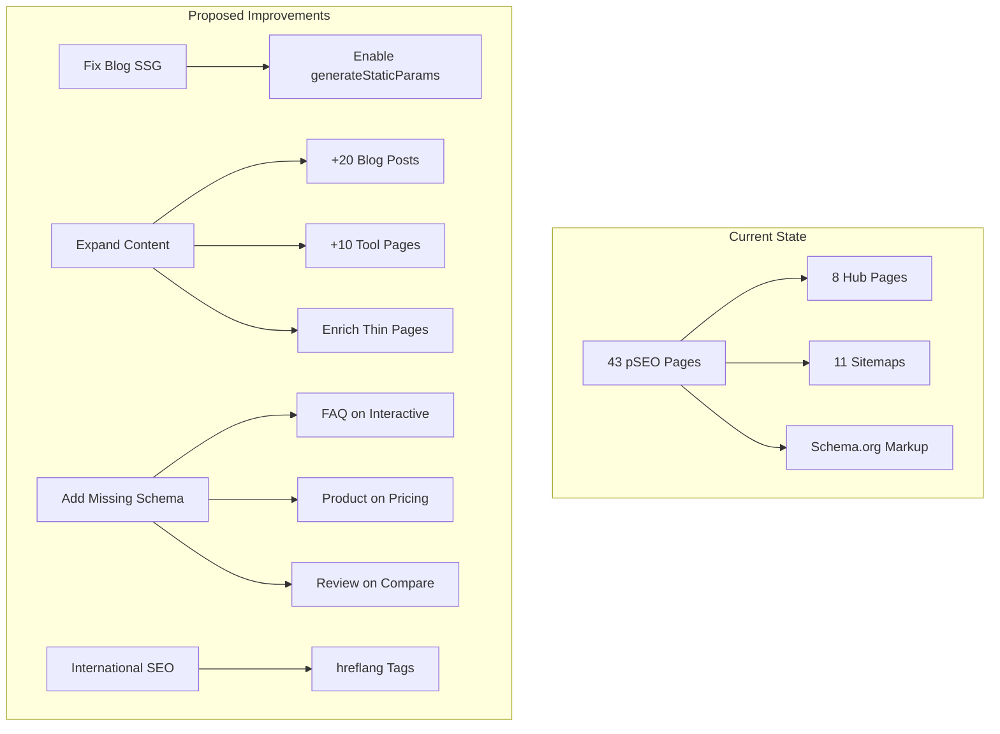

# SEO/pSEO Audit - December 2024

## Executive Summary

**Audit Date:** December 2024
**Auditor:** Principal Architect Mode
**Scope:** Full SEO infrastructure and pSEO implementation review

### pSEO Page Count

| Category          | Template Route            | Pages   | Data Source              |
| ----------------- | ------------------------- | ------- | ------------------------ |
| Tools (static)    | `/tools/[slug]`           | 8       | `tools.json`             |
| Tools - Resize    | `/tools/resize/[slug]`    | 6       | `interactive-tools.json` |
| Tools - Convert   | `/tools/convert/[slug]`   | 6       | `interactive-tools.json` |
| Tools - Compress  | `/tools/compress/[slug]`  | 1       | `interactive-tools.json` |
| Guides            | `/guides/[slug]`          | 2       | `guides.json`            |
| Free Tools        | `/free/[slug]`            | 5       | `free.json`              |
| Comparisons       | `/compare/[slug]`         | 3       | `comparison.json`        |
| Scale             | `/scale/[slug]`           | 2       | `scale.json`             |
| Formats           | `/formats/[slug]`         | 2       | `keyword-mappings.ts`    |
| Use Cases         | `/use-cases/[slug]`       | 2       | `keyword-mappings.ts`    |
| Alternatives      | `/alternatives/[slug]`    | 2       | `keyword-mappings.ts`    |
| Blog              | `/blog/[slug]`            | 4       | `blog-data.json`         |
| **Total pSEO**    |                           | **43**  |                          |
| Hub Pages         | `/tools`, `/guides`, etc. | 8       | Static                   |
| Static Pages      | `/`, `/pricing`, etc.     | 9       | Static                   |
| **Total Indexed** |                           | **~60** |                          |

---

## 1. Current State Assessment

### 1.1 Strengths

#### SEO Infrastructure (Grade: A)

- Comprehensive sitemap strategy with 11 category sitemaps + index
- Image sitemaps with proper XML namespace (xmlns:image)
- Well-configured robots.txt with AI bot blocking
- Metadata factory pattern for consistent metadata generation
- Meta length validation (title: 30-60 chars, description: 120-160 chars)

#### Schema.org Implementation (Grade: A-)

- SoftwareApplication schema on tool pages
- FAQPage schema with dynamic Question/Answer pairs
- BreadcrumbList for navigation hierarchy
- Article schema for blog posts
- WebApplication schema for interactive tools

#### Technical SEO (Grade: B+)

- Single H1 per page (verified across all templates)
- Proper heading hierarchy
- Next.js Image optimization with lazy loading
- Font optimization with `display: swap`
- Server-side rendering for pSEO pages

#### Internal Linking (Grade: B)

- Breadcrumb navigation on all pSEO pages
- Related tools/guides cross-linking
- Hub pages with category listings
- Upgrade path linking (free → pricing)

### 1.2 Identified Issues

#### Critical Issues (P0)

| Issue                                  | Impact                                | Location                                        |
| -------------------------------------- | ------------------------------------- | ----------------------------------------------- |
| Blog static generation disabled        | Pages render dynamically, slower TTFB | `/app/blog/[slug]/page.tsx`                     |
| Missing FAQSchema on interactive tools | Lost FAQ rich snippets                | `/tools/resize/[slug]`, `/tools/convert/[slug]` |
| Thin content on format/use-case pages  | Risk of thin content penalties        | `/formats/[slug]`, `/use-cases/[slug]`          |

#### High Priority Issues (P1)

| Issue                                | Impact                        | Location                                                 |
| ------------------------------------ | ----------------------------- | -------------------------------------------------------- |
| Only 4 blog posts                    | Missing content marketing SEO | `/content/blog-data.json`                                |
| Fallback generation for 3 categories | Data inconsistency risk       | `keyword-mappings.ts` (formats, use-cases, alternatives) |
| No hreflang tags                     | Missing international SEO     | All pages                                                |
| No structured data for pricing       | Missing rich snippets         | `/pricing` page                                          |

#### Medium Priority Issues (P2)

| Issue                                    | Impact                        | Location                  |
| ---------------------------------------- | ----------------------------- | ------------------------- |
| Missing video schema                     | Lost video rich snippets      | Pages with video content  |
| No review/rating schema on compare pages | Missing review snippets       | `/compare/[slug]`         |
| Alt text verification needed             | Accessibility/image SEO       | Body images in components |
| No aggregate rating on homepage          | Missing homepage rich snippet | `/`                       |

---

## 2. Improvement Recommendations

### 2.1 Architecture Diagram



### 2.2 Priority Recommendations

#### Phase 1: Critical Fixes (Week 1-2)

##### 1.1 Re-enable Blog Static Generation

```typescript
// /app/blog/[slug]/page.tsx
export async function generateStaticParams() {
  const posts = await getBlogPosts();
  return posts.map(post => ({ slug: post.slug }));
}
```

**Impact:** Improved TTFB, better Core Web Vitals, reliable crawling

##### 1.2 Add FAQSchema to Interactive Tools

```typescript
// /app/(pseo)/tools/resize/[slug]/page.tsx
// Add FAQPage schema alongside WebApplication schema
const schemas = [
  generateWebApplicationSchema(tool),
  generateFAQSchema(tool.faq), // Add this
];
```

**Impact:** FAQ rich snippets for 13 interactive tool pages

##### 1.3 Enrich Thin Content Pages

- Formats: Add 500+ words of educational content per page
- Use Cases: Add industry-specific examples, case studies
- Alternatives: Add feature comparison tables

**Files to update:**

- `/app/seo/data/formats.json` (create or migrate from mappings)
- `/app/seo/data/use-cases.json` (create or migrate from mappings)
- `/app/seo/data/alternatives.json` (create or migrate from mappings)

#### Phase 2: Content Expansion (Week 3-6)

##### 2.1 Blog Content Strategy

Expand from 4 to 24 blog posts targeting:

| Topic Cluster        | Target Posts | Priority |
| -------------------- | ------------ | -------- |
| How-to guides        | 8            | High     |
| Industry use cases   | 6            | High     |
| Comparison articles  | 5            | Medium   |
| Technical deep-dives | 3            | Medium   |
| News/updates         | 2            | Low      |

##### 2.2 pSEO Expansion (per existing PRD)

Continue implementing interactive tools per `pseo-expansion-plan.md`:

- Add remaining Tier 1 client-side tools
- Implement format converters
- Target 60+ total pSEO pages

#### Phase 3: Schema Enhancements (Week 4-5)

##### 3.1 Add Product Schema to Pricing

```json
{
  "@type": "Product",
  "name": "MyImageUpscaler Pro",
  "description": "AI-powered image upscaling",
  "offers": {
    "@type": "AggregateOffer",
    "priceCurrency": "USD",
    "lowPrice": "0",
    "highPrice": "29.99",
    "offerCount": 3
  }
}
```

##### 3.2 Add Review Schema to Comparisons

```json
{
  "@type": "Review",
  "itemReviewed": {
    "@type": "SoftwareApplication",
    "name": "MyImageUpscaler"
  },
  "reviewRating": {
    "@type": "Rating",
    "ratingValue": "4.8",
    "bestRating": "5"
  },
  "author": {
    "@type": "Organization",
    "name": "MyImageUpscaler Team"
  }
}
```

##### 3.3 Add AggregateRating to Homepage

```json
{
  "@type": "WebApplication",
  "aggregateRating": {
    "@type": "AggregateRating",
    "ratingValue": "4.8",
    "reviewCount": "1250",
    "bestRating": "5"
  }
}
```

#### Phase 4: International SEO (Week 6-8)

##### 4.1 Implement hreflang Tags

If targeting multiple languages/regions:

```typescript
// In metadata factory
alternates: {
  canonical: `${BASE_URL}${path}`,
  languages: {
    'en-US': `${BASE_URL}${path}`,
    'en-GB': `${BASE_URL}/uk${path}`,
    'de': `${BASE_URL}/de${path}`,
  },
}
```

##### 4.2 Localized Content Strategy

- Prioritize: German, Spanish, Portuguese markets
- Create localized tool pages first (highest conversion intent)

---

## 3. Technical Debt Items

### 3.1 Data Consolidation

Move all pSEO data from `keyword-mappings.ts` fallback to proper JSON files:

```
/app/seo/data/
├── tools.json          ✅ Exists
├── interactive-tools.json  ✅ Exists
├── guides.json         ✅ Exists
├── free.json           ✅ Exists
├── comparison.json     ✅ Exists
├── scale.json          ✅ Exists
├── formats.json        ❌ Create
├── use-cases.json      ❌ Create
└── alternatives.json   ❌ Create
```

### 3.2 Hub Page Templates

Create dedicated templates for underdeveloped categories:

- `/formats` - Currently uses generic template
- `/use-cases` - Currently uses generic template
- `/alternatives` - Currently uses generic template

### 3.3 Sitemap Improvements

- Add `<lastmod>` with actual content update dates (currently uses build time)
- Add `<priority>` based on actual page importance metrics
- Consider news sitemap for blog if publishing frequently

---

## 4. Monitoring & KPIs

### 4.1 Core Web Vitals Targets

| Metric | Current | Target  |
| ------ | ------- | ------- |
| LCP    | TBD     | < 2.5s  |
| FID    | TBD     | < 100ms |
| CLS    | TBD     | < 0.1   |
| TTFB   | TBD     | < 800ms |

### 4.2 SEO KPIs to Track

| KPI                       | Current  | 3-Month Target | 6-Month Target |
| ------------------------- | -------- | -------------- | -------------- |
| Indexed Pages             | ~60      | 80+            | 100+           |
| Organic Traffic           | Baseline | +30%           | +75%           |
| Keyword Rankings (Top 10) | TBD      | +20 keywords   | +50 keywords   |
| Rich Snippet Appearances  | TBD      | +50%           | +100%          |
| Blog Traffic              | Baseline | +50%           | +150%          |

### 4.3 Tools for Monitoring

- Google Search Console (indexing, CTR, rankings)
- Core Web Vitals report (performance)
- Rich Results Test (schema validation)
- Ahrefs/SEMrush (competitive analysis)

---

## 5. Implementation Checklist

### Immediate (This Sprint)

- [ ] Re-enable blog static generation
- [ ] Add FAQSchema to interactive tool pages
- [ ] Create proper JSON data files for formats, use-cases, alternatives
- [ ] Audit and fix any missing alt text in body images

### Short-term (Next 2 Sprints)

- [ ] Add Product schema to pricing page
- [ ] Add Review schema to comparison pages
- [ ] Add AggregateRating to homepage
- [ ] Enrich thin content pages (500+ words each)

### Medium-term (Next Quarter)

- [ ] Expand blog to 20+ posts
- [ ] Implement remaining interactive tools per expansion plan
- [ ] Add hreflang tags if pursuing international SEO
- [ ] Implement video schema for any video content

### Ongoing

- [ ] Monthly content velocity: 4 blog posts minimum
- [ ] Quarterly pSEO expansion: 5-10 new tool pages
- [ ] Weekly Core Web Vitals monitoring
- [ ] Monthly rich snippet audit

---

## 6. Risk Assessment

| Risk                     | Likelihood | Impact | Mitigation                                |
| ------------------------ | ---------- | ------ | ----------------------------------------- |
| Thin content penalty     | Medium     | High   | Enrich all pages to 500+ words            |
| Duplicate content        | Low        | Medium | Canonical URLs already implemented        |
| Schema validation errors | Low        | Low    | Use Rich Results Test before deploy       |
| Crawl budget waste       | Low        | Low    | robots.txt properly configured            |
| Over-optimization        | Low        | Medium | Focus on user value, not keyword stuffing |

---

---

## 7. MASSIVE pSEO EXPANSION STRATEGY

### Current State vs Opportunity

| Metric           | Current | Potential | Multiplier |
| ---------------- | ------- | --------- | ---------- |
| Unique Keywords  | 1,337   | 1,337     | -          |
| Keyword Mappings | 25      | 400+      | 16x        |
| pSEO Pages       | 43      | 1,500+    | 35x        |
| Indexed Pages    | ~60     | 2,000+    | 33x        |

### 7.1 Combinatorial Dimensions Identified

From analyzing your keyword data, I've identified **8 combinatorial dimensions**:

```
┌─────────────────────────────────────────────────────────────────┐
│  DIMENSION 1: Subject Nouns (4)                                 │
│  image, photo, picture, pic                                     │
├─────────────────────────────────────────────────────────────────┤
│  DIMENSION 2: Action Verbs (5)                                  │
│  upscale, enhance, enlarge, improve, increase                   │
├─────────────────────────────────────────────────────────────────┤
│  DIMENSION 3: Quality Targets (8)                               │
│  quality, resolution, clarity, 4k, hd, 8k, 2x, 4x, 8x           │
├─────────────────────────────────────────────────────────────────┤
│  DIMENSION 4: Platform Modifiers (4)                            │
│  online, free, app, software                                    │
├─────────────────────────────────────────────────────────────────┤
│  DIMENSION 5: Technology Prefix (2)                             │
│  ai, deep/neural                                                │
├─────────────────────────────────────────────────────────────────┤
│  DIMENSION 6: Use Cases (15+)                                   │
│  anime, cartoon, portrait, gaming, product, ecommerce,          │
│  real-estate, old-photos, vintage, social-media, print,         │
│  wallpaper, passport, thumbnail, profile-picture                │
├─────────────────────────────────────────────────────────────────┤
│  DIMENSION 7: File Formats (10+)                                │
│  png, jpg, jpeg, webp, heic, gif, tiff, bmp, raw, svg           │
├─────────────────────────────────────────────────────────────────┤
│  DIMENSION 8: Competitors (20+)                                 │
│  topaz, bigjpg, waifu2x, imgupscaler, clipdrop, lets-enhance,   │
│  icons8, vanceai, remini, pixelcut, fotor, photozoom, etc.      │
└─────────────────────────────────────────────────────────────────┘
```

### 7.2 Page Generation Matrix

#### Category A: Resolution Pages (`/scale/[slug]`)

| Slug Pattern                      | Examples                                    | Est. Pages |
| --------------------------------- | ------------------------------------------- | ---------- |
| `upscale-to-[resolution]`         | upscale-to-4k, upscale-to-8k, upscale-to-hd | 7          |
| `[subject]-upscaler-[resolution]` | image-upscaler-4k, photo-enhancer-hd        | 28         |
| `upscale-[resolution]-free`       | upscale-4k-free, upscale-hd-free            | 7          |
| **Subtotal**                      |                                             | **42**     |

#### Category B: Format Pages (`/formats/[slug]`)

| Slug Pattern                   | Examples                                   | Est. Pages |
| ------------------------------ | ------------------------------------------ | ---------- |
| `upscale-[format]`             | upscale-png, upscale-jpg, upscale-webp     | 10         |
| `enhance-[format]`             | enhance-jpg, enhance-png                   | 10         |
| `[format]-quality-enhancer`    | jpg-quality-enhancer, png-quality-enhancer | 10         |
| `[format]-to-[format]-upscale` | jpg-to-png-upscale (with enhancement)      | 20         |
| **Subtotal**                   |                                            | **50**     |

#### Category C: Use Case Pages (`/use-cases/[slug]`)

| Slug Pattern                | Examples                                        | Est. Pages |
| --------------------------- | ----------------------------------------------- | ---------- |
| `upscale-[use-case]`        | upscale-anime, upscale-old-photos               | 15         |
| `enhance-for-[use-case]`    | enhance-for-print, enhance-for-ecommerce        | 15         |
| `[use-case]-image-upscaler` | anime-image-upscaler, portrait-enhancer         | 15         |
| `ai-[use-case]-enhancer`    | ai-portrait-enhancer, ai-product-photo-enhancer | 15         |
| **Subtotal**                |                                                 | **60**     |

#### Category D: Comparison Pages (`/compare/[slug]`)

| Slug Pattern                      | Examples                                | Est. Pages |
| --------------------------------- | --------------------------------------- | ---------- |
| `best-[modifier]-upscaler`        | best-ai-upscaler, best-free-upscaler    | 10         |
| `best-for-[use-case]`             | best-upscaler-for-anime, best-for-print | 15         |
| `myimageupscaler-vs-[competitor]` | vs-topaz, vs-bigjpg, vs-waifu2x         | 20         |
| `[competitor]-alternative`        | topaz-alternative, bigjpg-alternative   | 20         |
| **Subtotal**                      |                                         | **65**     |

#### Category E: Free Tool Pages (`/free/[slug]`)

| Slug Pattern                 | Examples                                    | Est. Pages |
| ---------------------------- | ------------------------------------------- | ---------- |
| `free-[subject]-[action]`    | free-image-upscaler, free-photo-enhancer    | 20         |
| `free-ai-[tool]`             | free-ai-upscaler, free-ai-photo-enhancer    | 10         |
| `free-[resolution]-upscaler` | free-4k-upscaler, free-hd-enhancer          | 7          |
| `free-[use-case]-tool`       | free-anime-upscaler, free-portrait-enhancer | 15         |
| **Subtotal**                 |                                             | **52**     |

#### Category F: Tool Landing Pages (`/tools/[slug]`)

| Slug Pattern                   | Examples                                     | Est. Pages |
| ------------------------------ | -------------------------------------------- | ---------- |
| `ai-[subject]-[action]`        | ai-image-upscaler, ai-photo-enhancer         | 20         |
| `[quality]-[subject]-enhancer` | quality-image-enhancer, resolution-enhancer  | 12         |
| `[subject]-[action]-online`    | image-upscaler-online, photo-enhancer-online | 12         |
| **Subtotal**                   |                                              | **44**     |

#### Category G: Interactive Tools (`/tools/[category]/[slug]`)

| Category           | Tools                                            | Est. Pages |
| ------------------ | ------------------------------------------------ | ---------- |
| `/tools/resize/`   | image-resizer, photo-resizer, batch-resizer      | 10         |
| `/tools/convert/`  | png-to-jpg, jpg-to-png, webp-to-jpg, heic-to-jpg | 20         |
| `/tools/compress/` | image-compressor, jpg-compressor, png-compressor | 10         |
| `/tools/crop/`     | image-cropper, aspect-ratio-cropper              | 5          |
| **Subtotal**       |                                                  | **45**     |

#### Category H: Guide Pages (`/guides/[slug]`)

| Slug Pattern                 | Examples                                       | Est. Pages |
| ---------------------------- | ---------------------------------------------- | ---------- |
| `how-to-[action]-[subject]`  | how-to-upscale-images, how-to-enhance-photos   | 10         |
| `[use-case]-upscaling-guide` | anime-upscaling-guide, print-preparation-guide | 15         |
| `best-practices-[topic]`     | best-practices-image-quality, resolution-guide | 10         |
| **Subtotal**                 |                                                | **35**     |

#### Category I: Blog Content (`/blog/[slug]`)

| Topic Cluster | Examples                                               | Est. Pages |
| ------------- | ------------------------------------------------------ | ---------- |
| Tutorials     | step-by-step-4k-upscaling, anime-upscaling-tutorial    | 20         |
| Comparisons   | ai-vs-traditional-upscaling, 2024-upscaler-comparison  | 15         |
| Use Cases     | upscaling-for-ecommerce-success, gaming-texture-guide  | 15         |
| Technical     | understanding-image-resolution, ai-upscaling-explained | 10         |
| **Subtotal**  |                                                        | **60**     |

### 7.3 Total Page Projection

| Category           | Pages   | Priority |
| ------------------ | ------- | -------- |
| Resolution Pages   | 42      | P0       |
| Format Pages       | 50      | P1       |
| Use Case Pages     | 60      | P0       |
| Comparison Pages   | 65      | P0       |
| Free Tool Pages    | 52      | P0       |
| Tool Landing Pages | 44      | P1       |
| Interactive Tools  | 45      | P1       |
| Guide Pages        | 35      | P2       |
| Blog Content       | 60      | P2       |
| **TOTAL**          | **453** |          |

### 7.4 Implementation Architecture

```mermaid
graph TD
    subgraph "Data Layer"
        A[dimensions.json] --> B[Page Generator]
        C[templates.json] --> B
        D[keywords.csv] --> B
    end

    subgraph "Generation Layer"
        B --> E[Resolution Pages]
        B --> F[Format Pages]
        B --> G[Use Case Pages]
        B --> H[Comparison Pages]
        B --> I[Free Pages]
    end

    subgraph "Output"
        E --> J[/scale/[slug]]
        F --> K[/formats/[slug]]
        G --> L[/use-cases/[slug]]
        H --> M[/compare/[slug]]
        I --> N[/free/[slug]]
    end
```

### 7.5 Data Structure for Combinatorial Generation

```typescript
// /lib/seo/dimensions.ts
export const dimensions = {
  subjects: ['image', 'photo', 'picture', 'pic'],
  actions: ['upscale', 'enhance', 'enlarge', 'improve'],
  resolutions: ['4k', '8k', 'hd', '1080p', '2x', '4x', '8x'],
  platforms: ['online', 'free', 'app'],
  formats: ['png', 'jpg', 'jpeg', 'webp', 'heic', 'gif', 'tiff', 'raw'],
  useCases: [
    'anime',
    'cartoon',
    'portrait',
    'gaming',
    'product',
    'ecommerce',
    'real-estate',
    'old-photos',
    'vintage',
    'social-media',
    'print',
    'wallpaper',
    'passport',
    'thumbnail',
    'profile-picture',
  ],
  competitors: [
    'topaz',
    'bigjpg',
    'waifu2x',
    'imgupscaler',
    'clipdrop',
    'lets-enhance',
    'icons8',
    'vanceai',
    'remini',
    'pixelcut',
    'fotor',
    'photozoom',
    'gigapixel',
    'upscayl',
    'iloveimg',
  ],
};

// Generate pages programmatically
export function generateResolutionPages() {
  return dimensions.resolutions.map(res => ({
    slug: `upscale-to-${res}`,
    primaryKeyword: `upscale to ${res}`,
    secondaryKeywords: [
      `${res} image upscaler`,
      `upscale image to ${res}`,
      `${res} upscaler`,
      `ai ${res} upscaler`,
    ],
  }));
}
```

### 7.6 Priority Execution Plan

#### Sprint 1-2: Foundation (P0)

- [ ] Create `dimensions.ts` with all combinatorial data
- [ ] Build page generator utility
- [ ] Generate 20 highest-volume use case pages
- [ ] Generate 20 competitor comparison pages
- [ ] Add 15 resolution variant pages

**Output: +55 pages**

#### Sprint 3-4: Expansion (P0-P1)

- [ ] Generate all format pages (50)
- [ ] Generate remaining use case pages (40)
- [ ] Generate free tool variants (30)
- [ ] Add competitor alternatives pages (20)

**Output: +140 pages**

#### Sprint 5-6: Depth (P1-P2)

- [ ] Generate interactive tool pages (45)
- [ ] Create guide content (35)
- [ ] Launch blog content pipeline (20 initial)

**Output: +100 pages**

#### Sprint 7-8: Authority (P2)

- [ ] Complete blog content (40 more)
- [ ] Add niche use case pages
- [ ] International expansion (if applicable)

**Output: +100+ pages**

### 7.7 Content Template Strategy

Each category uses a standardized template with variable slots:

```typescript
interface ICombinatorialPage {
  // SEO
  slug: string;
  primaryKeyword: string;
  secondaryKeywords: string[];
  metaTitle: string; // "{Primary} - Free Online Tool | MyImageUpscaler"
  metaDescription: string; // "Use our {action} tool to {benefit}. {feature1}, {feature2}..."

  // Content Slots
  h1: string; // "{Action} {Subject} to {Target} - Free Online"
  heroDescription: string;
  features: IFeature[];
  howItWorks: IStep[];
  useCases: IUseCase[];
  faq: IFAQ[];

  // Internal Linking
  relatedTools: string[];
  relatedGuides: string[];
  ctaUrl: string;
}
```

### 7.8 Competitor pSEO Intelligence

Analysis of competitor sitemaps reveals proven pSEO strategies at scale.

#### Competitor Page Counts

| Competitor | Est. Pages | Primary Strategy                          |
| ---------- | ---------- | ----------------------------------------- |
| iLoveImg   | 1,700+     | Tools × Formats × 31 Languages            |
| imglarger  | 200+       | 143 format converters (38 source formats) |
| Remove.bg  | 2,000+     | 54 feature pages × 35 languages           |
| Photoroom  | 500+       | Background library (60+ categories)       |
| VanceAI    | 100+       | 20 specialized tools × 4 languages        |
| Clipdrop   | 50+        | Industry verticals (/real-estate/)        |

#### Pattern 1: Format Conversions (imglarger)

**143 pages** from format matrix:

```
Source formats (38): webp, jpg, png, heic, avif, tiff, bmp, gif, svg,
                     psd, ico, raw, jfif, hdr, tga, pict, pnm, ppm...
Target formats (4):  jpg, png, webp, jpeg

Examples: heic-to-jpg, webp-to-png, avif-to-jpeg, tiff-to-webp
```

#### Pattern 2: Background/Template Library (Photoroom)

**60+ category pages** at `/background-library/[category]`:

- **Sports**: volleyball, basketball, baseball
- **Nature**: forest, sunset, ocean, beach, landscape, mountain, flower
- **Seasonal**: christmas, easter, valentines, thanksgiving, halloween
- **Themes**: vintage, minimalist, abstract, watercolor, cartoon, fantasy
- **Colors**: gold, rainbow
- **Moods**: calming, sad, creepy, nice

#### Pattern 3: Feature/Use Case Pages (Remove.bg)

**54 feature pages** at `/f/[use-case]`:

- **Background colors**: black, white, blue, red, pink, purple, yellow, green, grey
- **Background types**: transparent, blur, gradient, beach, mountain, office, nature
- **Use cases**: passport-photo, cv-photo, youtube-thumbnail, product-photo, logo
- **Verticals**: car-photo-editor, portrait-background, wedding-background

#### Pattern 4: Industry Verticals (Clipdrop, Remove.bg)

**Dedicated landing pages per industry**:

```
Clipdrop:   /real-estate/image-upscaler, /real-estate/cleanup
Remove.bg:  /g/ecommerce, /g/car-dealerships, /g/photographers, /g/marketing
Photoroom:  /lp/background-remover/temu, /lp/background-remover/shopify
```

#### Pattern 5: Integration Pages (Remove.bg)

**14 integration pages** at `/i/[platform]`:

- photoshop-plugin, figma-plugin, sketch-plugin, gimp-plugin
- shopify-integration, android-app, desktop-app
- api, command-line-interface

#### Pattern 6: Tool × Format Multiplication (iLoveImg)

**Each tool duplicated per format**:

```
/compress-image/compress-jpg
/compress-image/compress-png
/compress-image/compress-gif
/compress-image/compress-webp
/resize-image/resize-jpg
/resize-image/resize-png
...
```

#### Recommended Implementation Priority

Based on competitor success:

| Priority | Pattern             | Pages | ROI                         |
| -------- | ------------------- | ----- | --------------------------- |
| P0       | Upscale × Format    | 15    | High - Direct keyword match |
| P0       | Upscale × Use Case  | 20    | High - Intent targeting     |
| P0       | Competitor VS/Alt   | 40    | High - Comparison intent    |
| P1       | Industry Verticals  | 10    | Med - B2B targeting         |
| P1       | Resolution variants | 8     | Med - Specific intent       |
| P1       | Format converters   | 30    | Med - Traffic magnets       |
| P2       | Tool × Format       | 40    | Med - Long tail             |
| P2       | Integration pages   | 10    | Low - Developer niche       |

**Total recommended: 173 new pages**

### 7.9 Avoiding Duplicate Content

**Uniqueness Strategy:**

1. Each page targets a distinct primary keyword
2. Content sections are templated but use unique examples per use case
3. FAQs are specific to the page context
4. Use case examples are tailored to the category
5. Canonical URLs prevent self-cannibalization

**Content Differentiation Matrix:**
| Page Type | Unique Elements |
|-----------|-----------------|
| Resolution | Resolution-specific benefits, use cases, before/after examples |
| Format | Format-specific compression, quality considerations |
| Use Case | Industry examples, professional tips, specialized features |
| Comparison | Detailed feature tables, pricing, pros/cons |
| Free | Limitations, upgrade paths, free tier features |

---

## Appendix: Files Analyzed

### SEO Infrastructure

- `/app/robots.ts`
- `/app/sitemap.xml/route.ts` + 11 category sitemaps
- `/app/layout.tsx`
- `/lib/seo/metadata-factory.ts`
- `/lib/seo/schema-generator.ts`
- `/lib/seo/meta-generator.ts`
- `/lib/seo/data-loader.ts`
- `/lib/seo/pseo-types.ts`

### pSEO Data Files

- `/app/seo/data/tools.json` (1,019 lines)
- `/app/seo/data/interactive-tools.json` (1,796 lines)
- `/app/seo/data/comparison.json` (348 lines)
- `/app/seo/data/guides.json` (173 lines)
- `/app/seo/data/free.json` (299 lines)
- `/app/seo/data/scale.json` (150 lines)
- `/content/blog-data.json` (67 lines)
- `/lib/seo/keyword-mappings.ts`

### Templates

- `/app/(pseo)/_components/pseo/templates/*`
- `/app/(pseo)/*/[slug]/page.tsx` (all categories)
- `/app/blog/[slug]/page.tsx`
