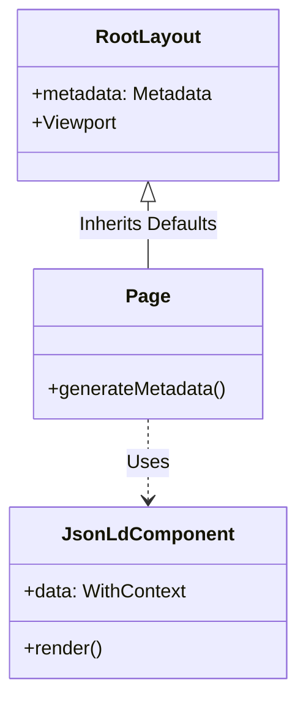
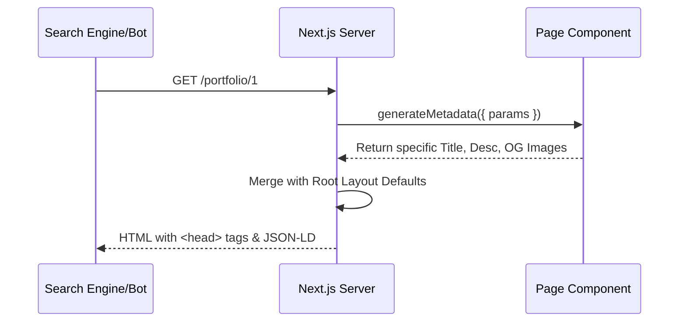

# Planning Document: Basic SEO Structure

🧠 **Principal Architect Mode: Engaged. Analyzing codebase constraints...**

## 1. Context Analysis

### 1.1 Files Analyzed

- `file:///home/joao/projects/pixelperfect/app/layout.tsx`
- `file:///home/joao/projects/pixelperfect/app/robots.ts`
- `file:///home/joao/projects/pixelperfect/app/sitemap.ts`
- `file:///home/joao/projects/pixelperfect/package.json`

### 1.2 Component & Dependency Overview

```mermaid
graph TD
    A[Next.js App Router] --> B[Root Layout (app/layout.tsx)]
    B --> C[Metadata API]
    C --> D[Robots.txt (app/robots.ts)]
    C --> E[Sitemap.xml (app/sitemap.ts)]
    B --> F[Dynamic Pages (app/portfolio/[id])]
    F --> G[generateMetadata]
```

### 1.3 Current Behavior Summary

- **Metadata**: Basic `title` and `description` defined in `app/layout.tsx`.
- **Robots**: `robots.ts` allows all agents and points to sitemap.
- **Sitemap**: `sitemap.ts` generates URLs for static pages and dynamic portfolio categories.
- **Missing**: OpenGraph tags, Twitter cards, Canonical URLs, JSON-LD structured data, Favicon configuration, Manifest.

### 1.4 Problem Statement

The application lacks a comprehensive SEO foundation, missing critical metadata for social sharing (OG/Twitter), structured data for search engines (JSON-LD), and canonicalization, limiting its visibility and shareability.

---

## 2. Proposed Solution

### 2.1 Architecture Summary

- **Centralized Configuration**: Define a robust `metadataBase` and default `openGraph`/`twitter` configuration in `app/layout.tsx`.
- **Dynamic Metadata**: Implement `generateMetadata` in dynamic routes (e.g., `app/portfolio/[id]/page.tsx`) to override defaults with specific content.
- **Structured Data**: Create a reusable `JsonLd` component to inject `application/ld+json` scripts for rich results.
- **Manifest**: Add `app/manifest.ts` for PWA installability and better mobile integration.

### 2.2 Architecture Diagram



### 2.3 Key Technical Decisions

- **Next.js Metadata API**: Native solution, no external libraries needed for meta tags.
- **Schema.org**: Use standard schemas (WebSite, Organization, CollectionPage) for JSON-LD.
- **Canonicalization**: Enforce canonical URLs to prevent duplicate content issues.

### 2.4 Data Model Changes

- **No Database Changes**.
- **New Types**: May define TypeScript interfaces for structured data props if not using a library like `schema-dts` (will use standard object types).

---

## 2.5 Runtime Execution Flow



---

## 3. Detailed Implementation Spec

### A. `app/layout.tsx`

- **Changes Needed**: Update `metadata` export.
- **New Properties**:
  - `metadataBase`: Set to `process.env.NEXT_PUBLIC_BASE_URL`.
  - `openGraph`: Type, siteName, locale.
  - `twitter`: Card type, site, creator.
  - `alternates`: Canonical URL.
  - `icons`: Favicon, apple-touch-icon.
- **Pseudo-code**:

```typescript
export const metadata: Metadata = {
  metadataBase: new URL(process.env.NEXT_PUBLIC_BASE_URL || 'http://localhost:3000'),
  title: {
    default: 'PixelPerfect - Portfolio Management',
    template: '%s | PixelPerfect',
  },
  openGraph: {
    type: 'website',
    locale: 'en_US',
    siteName: 'PixelPerfect',
    // ...
  },
  // ...
};
```

### B. `src/components/seo/JsonLd.tsx` (New File)

- **Purpose**: Render JSON-LD script safely.
- **Pseudo-code**:

```typescript
export function JsonLd({ data }: { data: Record<string, any> }) {
  return (
    <script
      type="application/ld+json"
      dangerouslySetInnerHTML={{ __html: JSON.stringify(data) }}
    />
  );
}
```

### C. `app/manifest.ts` (New File)

- **Purpose**: Web App Manifest.
- **Content**: Name, short_name, start_url, display, background_color, theme_color, icons.

### D. `app/portfolio/[id]/page.tsx` (Target for Dynamic SEO)

- **Changes**: Add `generateMetadata`.
- **Logic**: Fetch category data, return title/description/OG based on category.

---

## 4. Step-by-Step Execution Plan

### Phase 1: Foundation (Root Layout)

- [ ] Update `app/layout.tsx` with comprehensive `metadata` object.
- [ ] Create `app/manifest.ts`.
- [ ] Ensure `NEXT_PUBLIC_BASE_URL` is configured.

### Phase 2: Structured Data

- [ ] Create `src/components/seo/JsonLd.tsx`.
- [ ] Add `WebSite` or `Organization` schema to `app/layout.tsx`.

### Phase 3: Dynamic Pages

- [ ] Implement `generateMetadata` in `app/portfolio/[id]/page.tsx` (if exists) or placeholder.
- [ ] Add `JsonLd` with `CollectionPage` schema to dynamic pages.

---

## 5. Testing Strategy

### Unit Tests

- Verify `JsonLd` component renders correct script tag.
- Verify `generateMetadata` returns expected object for mock data.

### Integration Tests

- **Build Test**: Run `npm run build` to ensure no type errors in metadata.
- **Runtime Check**: Start app, inspect `<head>` for:
  - `<title>`
  - `<meta name="description">`
  - `<meta property="og:title">`
  - `<link rel="canonical">`
  - `<script type="application/ld+json">`

### Edge Cases

| Scenario                     | Expected Behavior                               |
| :--------------------------- | :---------------------------------------------- |
| Missing Environment Variable | Fallback to `localhost:3000` for `metadataBase` |
| Dynamic Data Failure         | Fallback to default title/description           |

---

## 6. Acceptance Criteria

- [ ] `metadataBase` is defined.
- [ ] OpenGraph and Twitter tags are present on all pages.
- [ ] Canonical URLs are self-referencing by default.
- [ ] JSON-LD is present and valid (test with Google Rich Results Test).
- [ ] `sitemap.xml` and `robots.txt` remain functional.
- [ ] `manifest.json` is generated.

---

## 7. Verification & Rollback

- **Success Criteria**: Passing Google Rich Results Test, correct preview on `opengraph.xyz`.
- **Rollback Plan**: Revert changes to `layout.tsx` and delete new files.
