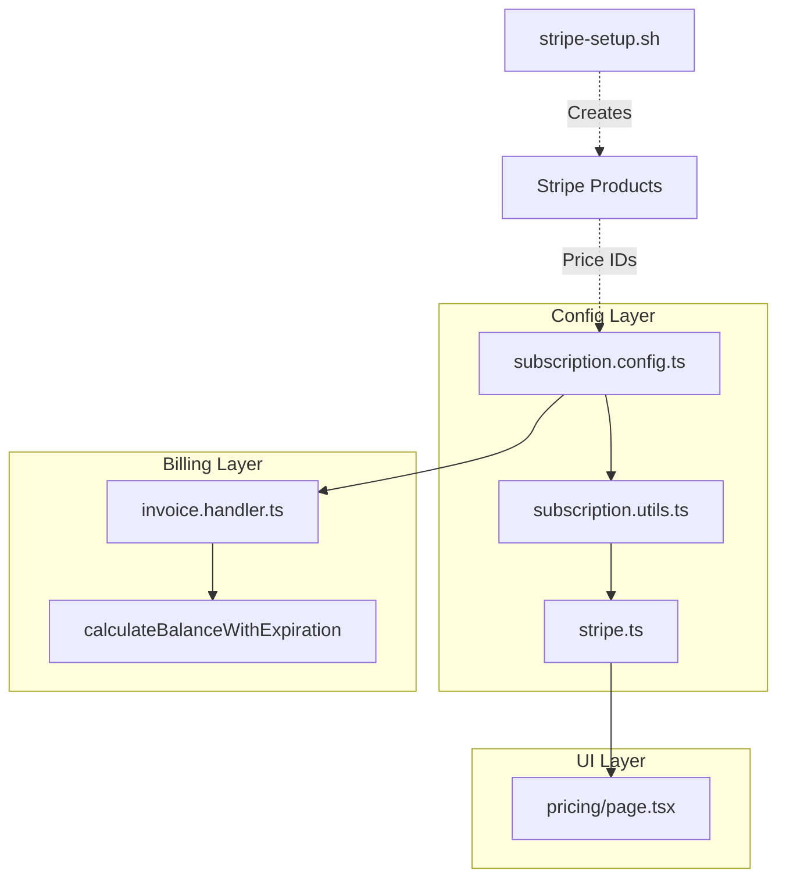
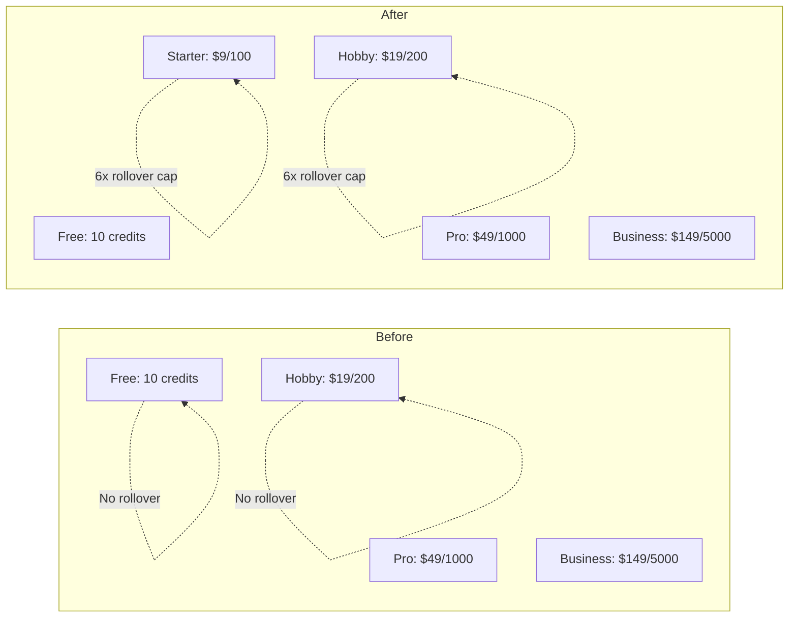
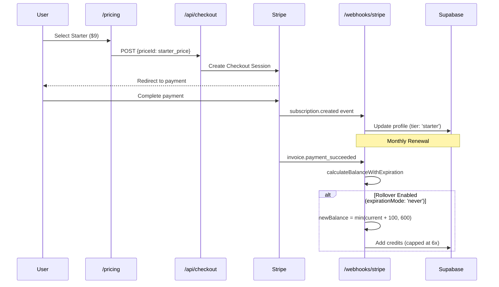

# PRD: Starter Tier & Credit Rollover Implementation

**Version:** 1.0
**Status:** Draft
**Date:** December 18, 2025
**Author:** Principal Architect
**Related Audit:** `docs/audits/free-paid-plan-audit-12-18-25.md`

---

## Executive Summary

Address critical market positioning issues identified in the subscription audit: (1) add a **$9/mo Starter tier** to match market entry points, and (2) **enable credit rollover** which was planned but disabled.

### Business Impact

| Metric             | Current          | After Implementation | Impact                |
| ------------------ | ---------------- | -------------------- | --------------------- |
| Entry Price        | $19/mo           | $9/mo                | -53% (market aligned) |
| Credit Rollover    | Disabled         | 6x cap               | Reduced churn         |
| Conversion Barrier | 2.1x competitors | Matched              | Higher conversion     |
| Margin at $9 tier  | N/A              | 97.6%                | Excellent             |

### Key Changes Summary

| Area            | Current State                  | Required State                       |
| --------------- | ------------------------------ | ------------------------------------ |
| Entry Tier      | $19 Hobby (200 credits)        | $9 Starter (100 credits) + $19 Hobby |
| Rollover        | `maxRollover: null` (disabled) | `maxRollover: creditsPerCycle * 6`   |
| Stripe Products | 3 subscription plans           | 4 subscription plans                 |
| Pricing Page    | 3 cards + free                 | 4 cards + free                       |

---

## 1. Context Analysis

### 1.1 Files Analyzed

```
/home/joao/projects/pixelperfect/shared/config/subscription.config.ts
/home/joao/projects/pixelperfect/shared/config/subscription.types.ts
/home/joao/projects/pixelperfect/shared/config/subscription.utils.ts
/home/joao/projects/pixelperfect/shared/config/stripe.ts
/home/joao/projects/pixelperfect/shared/config/credits.config.ts
/home/joao/projects/pixelperfect/app/pricing/page.tsx
/home/joao/projects/pixelperfect/app/api/webhooks/stripe/handlers/invoice.handler.ts
/home/joao/projects/pixelperfect/scripts/stripe-setup.sh
/home/joao/projects/pixelperfect/docs/audits/free-paid-plan-audit-12-18-25.md
```

### 1.2 Component & Dependency Overview



### 1.3 Current Behavior Summary

**Subscription Configuration (`subscription.config.ts`):**

- Plans: hobby ($19/200), pro ($49/1000), business ($149/5000)
- All plans have `maxRollover: null` - credits **do not** roll over
- All plans have `rolloverMultiplier: 6` but it's **ignored** when maxRollover is null
- `creditsExpiration.mode: 'end_of_cycle'` causes credits to reset each billing cycle

**Credit Renewal Logic (`invoice.handler.ts`):**

- Uses `calculateBalanceWithExpiration()` which respects `expirationMode`
- Currently hardcoded to `'end_of_cycle'` which expires all credits
- The rollover logic exists but is bypassed by the expiration mode

**Pricing Page (`pricing/page.tsx`):**

- Displays 3 subscription cards (Hobby, Pro, Business)
- Uses `SUBSCRIPTION_PLANS` and `STRIPE_PRICES` from stripe.ts
- Dynamically renders cards based on plan configuration

### 1.4 Problem Statement

PixelPerfect's entry tier ($19) is 2.1x more expensive than the market standard ($9), and credit rollover is disabled despite being a planned feature, leading to higher churn and lower conversion rates.

---

## 2. Proposed Solution

### 2.1 Architecture Summary

1. **Add Starter plan** to `subscription.config.ts` at $9/100 credits
2. **Enable rollover** by setting `maxRollover` to calculated values (creditsPerCycle \* 6)
3. **Change expiration mode** from `'end_of_cycle'` to `'never'` for rollover plans
4. **Update Stripe setup script** to create Starter product/price
5. **Update pricing page** to display 4 subscription tiers

**Alternatives Considered:**

1. **Keep $19 entry, add $9 as "lite"** - Rejected: Confusing naming, doesn't address market positioning
2. **Annual-only $9 tier** - Rejected: User requested to skip annual billing complexity
3. **Dynamic expiration per-plan** - Rejected: Over-engineering; all plans should have consistent rollover behavior

### 2.2 Architecture Diagram



### 2.3 Key Technical Decisions

| Decision               | Choice                      | Rationale                               |
| ---------------------- | --------------------------- | --------------------------------------- |
| Starter credits        | 100/month                   | Matches Let's Enhance, VanceAI at $9    |
| Rollover multiplier    | 6x                          | Already configured, just needs enabling |
| Expiration mode        | `'never'`                   | Enables rollover with cap               |
| Batch limit (Starter)  | 5 images                    | Conservative for entry tier             |
| Model access (Starter) | Basic (real-esrgan, gfpgan) | Differentiates from higher tiers        |

### 2.4 Data Model Changes

**No Database Schema Changes.** The `profiles` table already supports subscription tiers as strings.

The `subscription_tier` column accepts any string value - adding 'starter' requires no migration.

---

## 2.5 Runtime Execution Flow



---

## 3. Detailed Implementation Spec

### A. `shared/config/credits.config.ts`

**Changes Needed:** Add STARTER_MONTHLY_CREDITS constant.

**Add after line 33:**

```typescript
// Subscription credit amounts
STARTER_MONTHLY_CREDITS: 100,
HOBBY_MONTHLY_CREDITS: 200,
PRO_MONTHLY_CREDITS: 1000,
BUSINESS_MONTHLY_CREDITS: 5000,
```

**Justification:** Centralized credit constants for consistency.

---

### B. `shared/config/subscription.config.ts`

**Changes Needed:**

1. Add Starter plan configuration
2. Enable rollover by setting `maxRollover` values
3. Change `creditsExpiration.mode` to `'never'`

**Add Starter plan (insert before hobby plan, lines 20-57):**

```typescript
{
  key: 'starter',
  name: 'Starter',
  stripePriceId: 'price_STARTER_PLACEHOLDER', // Updated by stripe-setup.sh
  priceInCents: 900, // $9.00
  currency: 'usd',
  interval: 'month',
  creditsPerCycle: CREDIT_COSTS.STARTER_MONTHLY_CREDITS,
  maxRollover: CREDIT_COSTS.STARTER_MONTHLY_CREDITS * 6, // 600 credits max
  rolloverMultiplier: 6,
  trial: {
    enabled: false,
    durationDays: 0,
    trialCredits: null,
    requirePaymentMethod: true,
    allowMultipleTrials: false,
    autoConvertToPaid: true,
  },
  creditsExpiration: {
    mode: 'never', // Credits roll over with cap
    gracePeriodDays: 0,
    sendExpirationWarning: false,
    warningDaysBefore: 0,
  },
  features: [
    '100 credits per month',
    'Credits roll over (up to 600)',
    'Email support',
    'Basic AI models',
    'Batch upload up to 5 images',
  ],
  recommended: false,
  description: 'Perfect for getting started',
  displayOrder: 0,
  enabled: true,
  batchLimit: 5,
},
```

**Update existing plans (hobby, pro, business):**

For each plan, change:

```typescript
// FROM:
maxRollover: null,
creditsExpiration: {
  mode: 'end_of_cycle',
  // ...
},

// TO:
maxRollover: CREDIT_COSTS.{PLAN}_MONTHLY_CREDITS * 6,
creditsExpiration: {
  mode: 'never',
  gracePeriodDays: 0,
  sendExpirationWarning: false,
  warningDaysBefore: 0,
},
```

Specific values:

- Hobby: `maxRollover: 1200` (200 \* 6)
- Pro: `maxRollover: 6000` (1000 \* 6)
- Business: `maxRollover: 30000` (5000 \* 6)

**Update features arrays** to reflect rollover:

```typescript
features: [
  '200 credits per month',
  'Credits roll over (up to 1,200)',  // Changed from "Credits reset monthly"
  // ... rest unchanged
],
```

**Update displayOrder:**

- Starter: 0
- Hobby: 1
- Pro: 2
- Business: 3

---

### C. `shared/config/stripe.ts`

**Changes Needed:** Update types to include STARTER_MONTHLY.

**Update STRIPE_PRICES type (lines 52-61):**

```typescript
export const STRIPE_PRICES = buildStripePrices() as {
  // Subscription plans
  STARTER_MONTHLY: string; // Added
  HOBBY_MONTHLY: string;
  PRO_MONTHLY: string;
  BUSINESS_MONTHLY: string;
  // Credit packs
  SMALL_CREDITS: string;
  MEDIUM_CREDITS: string;
  LARGE_CREDITS: string;
};
```

**Update SUBSCRIPTION_PLANS type (lines 100-134):**

Add STARTER_MONTHLY to the type definition:

```typescript
export const SUBSCRIPTION_PLANS = buildSubscriptionPlans() as {
  STARTER_MONTHLY: {
    name: string;
    description: string;
    price: number;
    interval: 'month' | 'year';
    creditsPerMonth: number;
    maxRollover: number;
    key: string;
    features: readonly string[];
    recommended?: boolean;
  };
  HOBBY_MONTHLY: {
    /* ... */
  };
  PRO_MONTHLY: {
    /* ... */
  };
  BUSINESS_MONTHLY: {
    /* ... */
  };
};
```

---

### D. `app/api/webhooks/stripe/handlers/invoice.handler.ts`

**Changes Needed:** Use plan's expiration mode instead of hardcoded value.

**Update lines 153-160:**

```typescript
// FROM:
const expirationMode = 'end_of_cycle'; // Default expiration mode from config

// TO:
// Get expiration mode from plan config (defaults to 'never' for rollover)
const planConfig = getPlanByPriceId(priceId);
const expirationMode = planConfig?.creditsExpiration?.mode ?? 'never';
```

**Add import at top:**

```typescript
import { getPlanByPriceId } from '@shared/config/subscription.utils';
```

**Justification:** Respects per-plan expiration configuration instead of global hardcode.

---

### E. `scripts/stripe-setup.sh`

**Changes Needed:** Add Starter subscription product/price creation.

**Add after line 120 (before "Creating Hobby Monthly"):**

```bash
echo "Creating Starter Monthly..."
STARTER_PRODUCT_ID=$(create_product "Starter Plan" "For getting started - 100 credits per month")
STARTER_PRICE_ID=$(create_price "$STARTER_PRODUCT_ID" "900" "month" "metadata[credits_per_month]=100")
echo -e "${GREEN}✅ Starter Monthly: $STARTER_PRICE_ID${NC}"
```

**Update the output section (around line 145):**

Add Starter to the generated stripe.ts file:

```bash
  // Subscriptions (Recurring payments)
  STARTER_MONTHLY: '$STARTER_PRICE_ID', // \$9/month for 100 credits
  HOBBY_MONTHLY: '$HOBBY_PRICE_ID',     // \$19/month for 200 credits
```

**Update SUBSCRIPTION_PLANS section:**

Add after HOMEPAGE_TIERS definition:

```bash
  STARTER_MONTHLY: {
    name: 'Starter',
    description: 'Perfect for getting started',
    price: 9,
    interval: 'month' as const,
    creditsPerMonth: 100,
    features: [
      '100 credits per month',
      'Credits roll over (up to 600)',
      'Email support',
      'Basic AI models',
    ],
  },
```

---

### F. `app/pricing/page.tsx`

**Changes Needed:** Add fourth PricingCard for Starter tier.

**Update imports (add STARTER_MONTHLY):**

The imports already use `SUBSCRIPTION_PLANS` and `STRIPE_PRICES` which will automatically include the new plan.

**Update grid layout (line 216):**

```typescript
// FROM:
<div className="grid md:grid-cols-3 gap-8 max-w-5xl mx-auto">

// TO:
<div className="grid md:grid-cols-2 lg:grid-cols-4 gap-6 max-w-6xl mx-auto">
```

**Add Starter card before Hobby (after line 225, before first PricingCard):**

```typescript
<PricingCard
  name={SUBSCRIPTION_PLANS.STARTER_MONTHLY.name}
  description={SUBSCRIPTION_PLANS.STARTER_MONTHLY.description}
  price={SUBSCRIPTION_PLANS.STARTER_MONTHLY.price}
  interval={SUBSCRIPTION_PLANS.STARTER_MONTHLY.interval}
  features={SUBSCRIPTION_PLANS.STARTER_MONTHLY.features}
  priceId={STRIPE_PRICES.STARTER_MONTHLY}
  disabled={
    subscription?.price_id === STRIPE_PRICES.STARTER_MONTHLY ||
    subscription?.scheduled_price_id === STRIPE_PRICES.STARTER_MONTHLY
  }
  scheduled={subscription?.scheduled_price_id === STRIPE_PRICES.STARTER_MONTHLY}
  onCancelScheduled={
    subscription?.scheduled_price_id === STRIPE_PRICES.STARTER_MONTHLY
      ? handleCancelScheduledChange
      : undefined
  }
  cancelingScheduled={cancelingSchedule}
  onSelect={
    subscription ? () => handlePlanSelect(STRIPE_PRICES.STARTER_MONTHLY) : undefined
  }
  currentSubscriptionPrice={currentSubscriptionPrice}
/>
```

**Update currentSubscriptionPrice useMemo (add Starter case):**

```typescript
const currentSubscriptionPrice = useMemo(() => {
  if (!subscription?.price_id) return null;

  if (subscription.price_id === STRIPE_PRICES.STARTER_MONTHLY) {
    return SUBSCRIPTION_PLANS.STARTER_MONTHLY.price;
  }
  if (subscription.price_id === STRIPE_PRICES.HOBBY_MONTHLY) {
    return SUBSCRIPTION_PLANS.HOBBY_MONTHLY.price;
  }
  // ... rest unchanged
}, [subscription?.price_id]);
```

---

## 4. Step-by-Step Execution Plan

### Phase 1: Configuration Updates

- [ ] Add `STARTER_MONTHLY_CREDITS: 100` to `credits.config.ts`
- [ ] Add Starter plan to `subscription.config.ts`
- [ ] Update Hobby/Pro/Business plans with `maxRollover` values
- [ ] Change `creditsExpiration.mode` from `'end_of_cycle'` to `'never'` for all plans
- [ ] Update feature strings to mention rollover
- [ ] Update `stripe.ts` types to include STARTER_MONTHLY

### Phase 2: Stripe Integration

- [ ] Update `stripe-setup.sh` to create Starter product
- [ ] Run `./scripts/stripe-setup.sh` to create Stripe products
- [ ] Update `subscription.config.ts` with new Starter price ID

### Phase 3: Invoice Handler Fix

- [ ] Update `invoice.handler.ts` to use plan's expiration mode
- [ ] Add import for `getPlanByPriceId`

### Phase 4: UI Updates

- [ ] Update grid layout in `pricing/page.tsx` for 4 columns
- [ ] Add Starter PricingCard component
- [ ] Update `currentSubscriptionPrice` useMemo

### Phase 5: Verification

- [ ] Run `yarn verify` - ensure no type errors
- [ ] Run `yarn test` - ensure tests pass
- [ ] Manual test: New user can subscribe to Starter tier
- [ ] Manual test: Existing subscriber can upgrade/downgrade to Starter
- [ ] Manual test: Credits roll over on renewal (verify in test mode)

---

## 5. Testing Strategy

### Unit Tests

**`subscription.config.unit.spec.ts`:**

- Starter plan exists with correct values (100 credits, $9)
- All plans have `maxRollover` set (not null)
- All plans have `expirationMode: 'never'`

**`subscription.utils.test.ts`:**

- `getPlanByKey('starter')` returns correct config
- `buildHomepageTiers()` includes Starter tier
- `calculateBalanceWithExpiration` with `'never'` mode rolls over correctly

### Integration Tests

**`billing-system.integration.spec.ts`:**

- Invoice payment adds credits with rollover cap
- Credits don't exceed 6x monthly allocation

### Edge Cases

| Scenario                                 | Expected Behavior                     |
| ---------------------------------------- | ------------------------------------- |
| User at 500 credits renews Starter (100) | Balance = 600 (capped at 6x)          |
| User at 600 credits renews Starter       | Balance = 600 (no increase, at cap)   |
| User at 0 credits renews Starter         | Balance = 100                         |
| Downgrade from Pro to Starter            | Credits preserved up to new cap (600) |
| Upgrade from Starter to Pro              | Credits preserved, new cap (6000)     |

---

## 6. Acceptance Criteria

### Starter Tier

- [ ] Starter plan visible on pricing page at $9/month
- [ ] Starter provides 100 credits per billing cycle
- [ ] Starter has 5 image batch limit
- [ ] Starter users can access basic models (real-esrgan, gfpgan)
- [ ] Checkout flow works for Starter subscription

### Credit Rollover

- [ ] Unused credits carry over to next billing cycle
- [ ] Balance capped at 6x monthly allocation
- [ ] Cap is plan-specific (Starter: 600, Hobby: 1200, Pro: 6000, Business: 30000)
- [ ] Invoice handler uses plan's expiration mode
- [ ] Feature strings on pricing page mention rollover

### Stripe Integration

- [ ] Starter product/price exists in Stripe dashboard
- [ ] Webhook handles Starter subscriptions correctly
- [ ] Plan upgrades/downgrades work with Starter

---

## 7. Verification & Rollback

### Success Criteria

- Conversion rate increases (measurable after 2-4 weeks)
- Churn rate decreases (measurable after 1-2 billing cycles)
- No payment processing errors in logs
- User feedback on pricing page is positive

### Rollback Plan

**Tier 1 (Config only - immediate):**

1. Set Starter plan `enabled: false` in subscription.config.ts
2. Revert `maxRollover` to `null` for all plans
3. Revert `expirationMode` to `'end_of_cycle'`
4. Deploy

**Tier 2 (Full rollback - 30 min):**

1. Revert all file changes
2. Archive Stripe Starter product (don't delete - existing subscribers)
3. Deploy

**Note:** Existing Starter subscribers would be grandfathered - no automatic cancellation.

---

## 8. Financial Analysis

### Starter Tier Economics

```
Revenue per Starter subscriber: $9.00/month
API cost (100 credits × $0.0017): $0.17
Infrastructure allocation: $0.05
Total COGS: $0.22
Gross Margin: 97.6%
```

### Rollover Impact

- **Positive:** Reduced churn from "use it or lose it" frustration
- **Negative:** Slight reduction in urgency to purchase packs
- **Net:** Positive - industry data shows rollover reduces churn by 15-25%

---

**Document End**

_Generated: December 18, 2025_
_Review Required: Engineering, Product_
_Related: docs/audits/free-paid-plan-audit-12-18-25.md_
