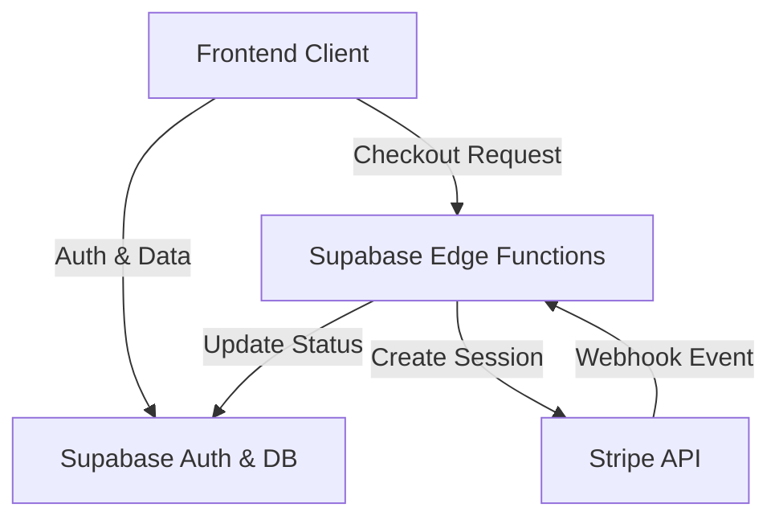
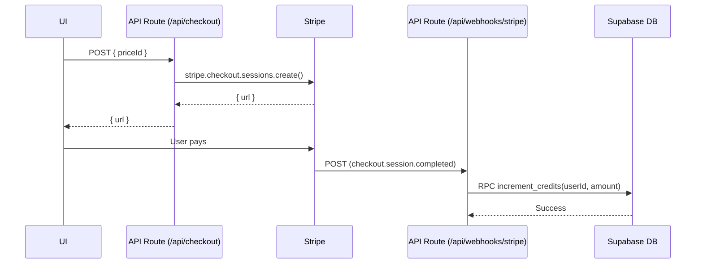

# Stripe Implementation PRD

🧠 Principal Architect Mode: Engaged. Analyzing codebase constraints...

## 1. Context Analysis

### 1.1 Files Analyzed

- `src/lib/supabase/supabaseClient.ts`
- `src/lib/supabase/supabaseUtils.ts`
- `src/types.ts`
- `src/types/authProviders.ts`

### 1.2 Component & Dependency Overview



### 1.3 Current Behavior Summary

- The application uses Supabase for authentication and data storage.
- There is currently **no payment infrastructure**.
- No user profile schema exists in the local types to support credits or subscriptions.

### 1.4 Problem Statement

The application requires a robust monetization system supporting **one-off purchases**, **recurring subscriptions**, and a **usage-based credit system**, integrated seamlessly with the existing Supabase backend.

---

## 2. Proposed Solution

### 2.1 Architecture Summary

- **Cloudflare Workers (Next.js API Routes)**: We will use standard Next.js API routes (`app/api/...`), which deploy as Cloudflare Workers via `@cloudflare/next-on-pages`. This keeps the backend logic unified with the frontend codebase.
- **Stripe Webhooks**: A dedicated API route will handle Stripe events, verifying signatures and updating Supabase.
- **Supabase Client**: The API routes will use the Supabase JS client (with Service Role key for webhooks, or Auth context for user actions) to interact with the database.
- **Database Triggers**: (Postgres) will handle automatic profile creation on user signup.

### 2.2 Architecture Diagram

```mermaid
flowchart LR
    Client[Frontend] -->|1. POST /api/checkout| API[Next.js API Route (Cloudflare)]
    API -->|2. Create Session| Stripe[Stripe API]
    Stripe -->>API: { url }
    API -->>Client: { url }
    Client ->> Stripe: Pays
    Stripe -->|3. Webhook| Webhook[Next.js API Route (Cloudflare)]
    Webhook -->|4. Upsert| DB[(Supabase DB)]
```

### 2.3 Key Technical Decisions

- **Next.js API Routes on Cloudflare**: Chosen over Supabase Edge Functions to unify the deployment pipeline and leverage Cloudflare's generous free tier (100k req/day vs Supabase's 500k/month).
- **Stripe Checkout**: Hosted UI for security/compliance.
- **Webhooks for Sync**: Critical for reliability.
- **Service Role Key**: Required in the Webhook route to bypass RLS and update user credits/subscriptions securely.

### 2.4 Data Model Changes

#### New Tables (Public Schema)

1.  **`profiles`** (extends `auth.users`)

    - `id` (uuid, PK, references `auth.users`)
    - `stripe_customer_id` (text, unique)
    - `credits_balance` (int, default 0)
    - `subscription_status` (enum: active, trialing, past_due, canceled, unpaid)
    - `subscription_tier` (text, nullable)

2.  **`subscriptions`** (Mirror of Stripe Subscriptions)

    - `id` (text, PK - Stripe Sub ID)
    - `user_id` (uuid, references `profiles.id`)
    - `status` (text)
    - `price_id` (text)
    - `current_period_end` (timestamptz)

3.  **`products` & `prices`** (Optional but recommended for syncing catalog)
    - Synced from Stripe to allow frontend to fetch pricing dynamically.

---

## 2.5 Runtime Execution Flow

### Scenario: Purchasing Credits



---

## 3. Detailed Implementation Spec

### A. Database Schema (SQL Migration)

- **Changes Needed:** Create tables and RLS policies.
- **Pseudo-code:**

```sql
-- Profiles table
create table profiles (
  id uuid references auth.users not null primary key,
  stripe_customer_id text,
  credits_balance int default 0
);

-- Secure credit increment function
create function increment_credits(user_id uuid, amount int)
returns void as $$
  update profiles
  set credits_balance = credits_balance + amount
  where id = user_id;
$$ language sql security definer;
```

### B. `app/api/checkout/route.ts` (Next.js API Route)

- **Runtime:** `edge` (Cloudflare Worker compatible)
- **Logic:**
  1.  Authenticate user via Supabase Auth helper.
  2.  Get or Create Stripe Customer.
  3.  Create Stripe Session.
  4.  Return URL.

### C. `app/api/webhooks/stripe/route.ts` (Next.js API Route)

- **Runtime:** `edge`
- **Logic:**
  1.  Verify Stripe Signature (critical security step).
  2.  Switch on event type:
      - `checkout.session.completed`: Grant credits or start sub.
      - `invoice.payment_succeeded`: Extend sub.
      - `customer.subscription.deleted`: Cancel sub.
  3.  Use `supabase-admin` client (Service Role) to write to DB.

### D. `src/lib/stripe/stripeService.ts` (Frontend)

- **Purpose:** Client-side wrapper.
- **Methods:**
  - `createCheckoutSession(priceId: string)`: Calls `/api/checkout`.
  - `getSubscriptionStatus()`: Calls Supabase directly (via RLS).

### E. Scheduled Tasks (Cloudflare Cron Triggers)

- **Purpose:** Automated maintenance and notifications.
- **Implementation:** Export a `scheduled` handler in a dedicated Worker or via Next.js instrumentation (if supported) or a separate worker script. For this project, we will use a separate `worker.ts` or similar entry point if Next.js doesn't natively support cron exports easily, OR simply use a separate Worker for crons to keep concerns separated.
- **Jobs:**
  1.  **Daily Reconciliation (0 0 \* \* \*):**
      - Fetch all "active" subscriptions from DB.
      - Verify status against Stripe API.
      - Flag discrepancies for manual review.
  2.  **Subscription Renewal Reminder (0 9 \* \* \*):**
      - Query subscriptions renewing in 3 days.
      - Send email notification (via Resend/SendGrid) to user.
  3.  **Trial Expiration Warning (0 9 \* \* \*):**
      - Query trials ending in 24 hours.
      - Notify user to upgrade.

---

## 4. Step-by-Step Execution Plan

### Phase 1: Database & Backend Foundation

- [ ] Create `profiles`, `subscriptions` tables in Supabase.
- [ ] Create `increment_credits` RPC function.
- [ ] Set up RLS policies.

### Phase 2: API Routes (Cloudflare)

- [ ] Install `stripe` SDK.
- [ ] Create `app/api/checkout/route.ts`.
- [ ] Create `app/api/webhooks/stripe/route.ts`.
- [ ] Configure `STRIPE_SECRET_KEY` and `STRIPE_WEBHOOK_SECRET` in `.env` and Cloudflare Dashboard.

### Phase 3: Frontend Integration

- [ ] Create `StripeService` in frontend.
- [ ] Add "Upgrade" / "Buy Credits" UI components.
- [ ] Integrate `createCheckoutSession`.

---

## 5. Testing Strategy

### Unit Tests

- **API Routes:** Mock Stripe and Supabase clients to verify logic.

### Integration Tests

- **Local Development:** Use `stripe listen` to forward webhooks to `localhost:3000/api/webhooks/stripe`.
- **End-to-End:** Complete a purchase in Stripe Test Mode and verify Supabase DB update.

### Edge Cases

| Scenario           | Expected Behavior                                   |
| :----------------- | :-------------------------------------------------- |
| Webhook fails      | Stripe retries. Route must be idempotent.           |
| Invalid Signature  | Return 400 Bad Request immediately.                 |
| Concurrent updates | Postgres atomic increments prevent race conditions. |

---

## 6. Acceptance Criteria

- [ ] User can purchase a one-off credit pack (Credits balance increases).
- [ ] User can subscribe to a plan (Subscription record created/active).
- [ ] User can cancel subscription (Status updates to canceled at period end).
- [ ] All Stripe events are verified with signing secret.
- [ ] RLS prevents users from modifying their own balance manually.

---

## 7. Verification & Rollback

- **Success Criteria:** Successful end-to-end purchase in Stripe Test Mode reflecting in Supabase DB.
- **Rollback Plan:** Revert Edge Function deployments; Drop tables (if early dev) or rollback migration.
