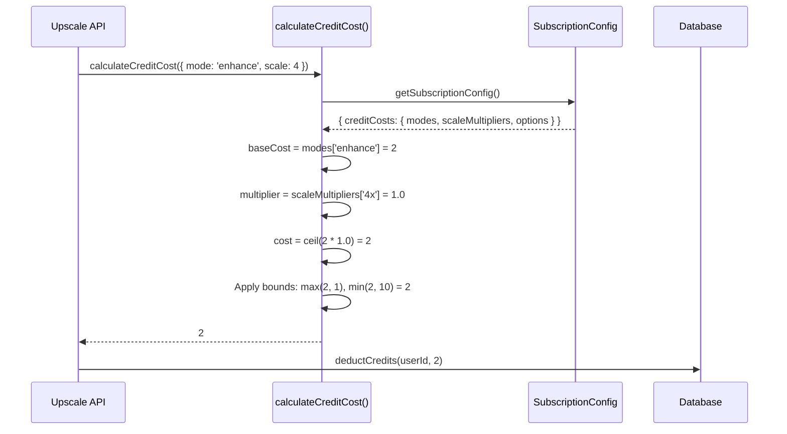

# Sub-PRD: Configurable Credit Costs

**Parent PRD:** [subscription-config-system.md](../subscription-config-system.md)
**Version:** 1.0
**Status:** Draft
**Priority:** P2
**Estimated Effort:** 1 day

---

## Overview

Move credit cost calculations from hardcoded switch statements to centralized configuration. This enables adjusting operation costs without code changes.

### Goals

1. Define credit costs per processing mode in config
2. Support scale-based cost multipliers (future)
3. Enable A/B testing different pricing structures
4. Maintain backward compatibility

---

## Configuration Schema

```typescript
interface ICreditCostConfig {
  /**
   * Base costs per processing mode
   * Current: upscale=1, enhance=2, both=2, custom=2
   */
  modes: Record<ProcessingMode, number>;

  /**
   * Multipliers for scale factors
   * Current: all 1.0 (no difference between 2x and 4x)
   * Future: could charge more for 4x upscaling
   */
  scaleMultipliers: Record<ScaleFactor, number>;

  /**
   * Additional costs for premium options
   */
  options: {
    /** Extra cost for custom prompt */
    customPrompt: number;

    /** Extra cost for priority processing (future) */
    priorityProcessing: number;

    /** Extra cost for batch processing per image (future) */
    batchPerImage: number;
  };

  /**
   * Minimum credit cost for any operation
   */
  minimumCost: number;

  /**
   * Maximum credit cost for any operation (safety cap)
   */
  maximumCost: number;
}

type ProcessingMode = 'upscale' | 'enhance' | 'both' | 'custom';
type ScaleFactor = '2x' | '4x';
```

### Example Configuration

```typescript
// shared/config/subscription.config.ts

creditCosts: {
  modes: {
    upscale: 1,    // Basic upscaling - cheapest
    enhance: 2,    // AI enhancement - more compute
    both: 2,       // Upscale + enhance - same as enhance alone
    custom: 2,     // Custom prompt - AI-intensive
  },

  scaleMultipliers: {
    '2x': 1.0,    // No extra cost for 2x
    '4x': 1.0,    // Currently same as 2x
    // Future: '4x': 1.5 for 50% more cost
  },

  options: {
    customPrompt: 0,         // Included in 'custom' mode
    priorityProcessing: 1,   // Future feature
    batchPerImage: 0,        // No extra cost per batch image
  },

  minimumCost: 1,   // At least 1 credit per operation
  maximumCost: 10,  // Safety cap
}
```

---

## Current Implementation

### Existing Code (server/services/image-generation.service.ts)

```typescript
export function calculateCreditCost(config: IUpscaleConfig): number {
  switch (config.mode) {
    case 'upscale':
      return 1;
    case 'enhance':
    case 'both':
    case 'custom':
      return 2;
    default:
      return 2; // Safe default
  }
}
```

### Problems with Current Approach

1. **Hardcoded values** - requires code changes to adjust pricing
2. **No scale differentiation** - 2x and 4x cost the same
3. **No option pricing** - can't charge extra for premium features
4. **Duplicated in tests** - test file has copy of the function

---

## Proposed Implementation

### New calculateCreditCost Function

```typescript
// shared/config/subscription.utils.ts

import { getSubscriptionConfig } from './subscription.config';
import type { IUpscaleConfig } from '@shared/validation/upscale.schema';

/**
 * Calculate credit cost based on configuration
 * Replaces hardcoded switch statement
 */
export function calculateCreditCost(config: IUpscaleConfig): number {
  const { creditCosts } = getSubscriptionConfig();

  // Base cost from mode
  let cost = creditCosts.modes[config.mode] ?? creditCosts.modes.enhance;

  // Apply scale multiplier
  const scaleKey = `${config.scale}x` as '2x' | '4x';
  const multiplier = creditCosts.scaleMultipliers[scaleKey] ?? 1.0;
  cost = Math.ceil(cost * multiplier);

  // Add option costs (future)
  if (config.mode === 'custom' && config.prompt) {
    cost += creditCosts.options.customPrompt;
  }

  // Apply bounds
  cost = Math.max(cost, creditCosts.minimumCost);
  cost = Math.min(cost, creditCosts.maximumCost);

  return cost;
}

/**
 * Get cost for a specific mode (for UI display)
 */
export function getCreditCostForMode(mode: ProcessingMode): number {
  const { creditCosts } = getSubscriptionConfig();
  return creditCosts.modes[mode] ?? creditCosts.minimumCost;
}

/**
 * Get all mode costs (for pricing display)
 */
export function getAllCreditCosts(): Record<ProcessingMode, number> {
  const { creditCosts } = getSubscriptionConfig();
  return { ...creditCosts.modes };
}
```

### Migration Path

```typescript
// server/services/image-generation.service.ts

// Before: local implementation
// export function calculateCreditCost(config: IUpscaleConfig): number {
//   switch (config.mode) {
//     case 'upscale': return 1;
//     ...
//   }
// }

// After: re-export from config utils
export { calculateCreditCost } from '@shared/config/subscription.utils';
```

---

## Execution Flow

### Credit Calculation with Config



---

## UI Integration

### Display Credit Costs on Upload Page

```typescript
// client/components/myimageupscaler.com/UploadForm.tsx

function CostDisplay({ selectedMode, selectedScale }: Props) {
  const costs = useCreditCosts(); // Hook that fetches config

  const baseCost = costs.modes[selectedMode];
  const multiplier = costs.scaleMultipliers[`${selectedScale}x`];
  const totalCost = Math.ceil(baseCost * multiplier);

  return (
    <div className="cost-display">
      <span>This will cost: </span>
      <strong>{totalCost} credit{totalCost !== 1 ? 's' : ''}</strong>
    </div>
  );
}

// Hook to get credit costs from config
function useCreditCosts() {
  // For server components: import directly
  // For client: could fetch from API or use env-injected config
  return getAllCreditCosts();
}
```

### Pricing Table in Docs/FAQ

```typescript
function CreditCostTable() {
  const costs = getAllCreditCosts();

  return (
    <table>
      <thead>
        <tr>
          <th>Mode</th>
          <th>Credits</th>
          <th>Description</th>
        </tr>
      </thead>
      <tbody>
        {Object.entries(costs).map(([mode, cost]) => (
          <tr key={mode}>
            <td>{mode}</td>
            <td>{cost}</td>
            <td>{getModeDescription(mode)}</td>
          </tr>
        ))}
      </tbody>
    </table>
  );
}
```

---

## Implementation Steps

### Phase 1: Configuration

- [ ] Add `ICreditCostConfig` to subscription types
- [ ] Add `creditCosts` section to subscription config
- [ ] Add Zod validation for credit costs
- [ ] Validate: all modes defined, costs > 0, min <= max

### Phase 2: Core Function

- [ ] Create `calculateCreditCost()` in subscription.utils.ts
- [ ] Create `getCreditCostForMode()` helper
- [ ] Create `getAllCreditCosts()` helper
- [ ] Add comprehensive unit tests

### Phase 3: Migration

- [ ] Update image-generation.service.ts to use new function
- [ ] Update app/api/upscale/route.ts imports
- [ ] Remove old calculateCreditCost implementation
- [ ] Update test file to use config-based function

### Phase 4: UI Updates

- [ ] Display cost per mode on upload form
- [ ] Update any hardcoded cost references in UI
- [ ] Add credits documentation page

---

## Testing Strategy

### Unit Tests

```typescript
describe('calculateCreditCost with config', () => {
  test('returns base cost for mode', () => {
    const cost = calculateCreditCost({ mode: 'upscale', scale: 2 });
    expect(cost).toBe(1);
  });

  test('applies scale multiplier', () => {
    // With config: scaleMultipliers['4x'] = 1.5
    const cost = calculateCreditCost({ mode: 'upscale', scale: 4 });
    expect(cost).toBe(2); // ceil(1 * 1.5)
  });

  test('respects minimum cost', () => {
    // Even with 0 base cost, returns minimumCost
    const cost = calculateCreditCost({ mode: 'unknown' as any, scale: 2 });
    expect(cost).toBeGreaterThanOrEqual(1);
  });

  test('respects maximum cost', () => {
    // Even with extreme multipliers, capped at maximumCost
    const cost = calculateCreditCost({ mode: 'custom', scale: 4 });
    expect(cost).toBeLessThanOrEqual(10);
  });
});
```

### Backward Compatibility Tests

```typescript
describe('backward compatibility', () => {
  test('upscale mode costs 1 credit (unchanged)', () => {
    expect(calculateCreditCost({ mode: 'upscale', scale: 2 })).toBe(1);
  });

  test('enhance mode costs 2 credits (unchanged)', () => {
    expect(calculateCreditCost({ mode: 'enhance', scale: 2 })).toBe(2);
  });

  test('both mode costs 2 credits (unchanged)', () => {
    expect(calculateCreditCost({ mode: 'both', scale: 2 })).toBe(2);
  });

  test('custom mode costs 2 credits (unchanged)', () => {
    expect(calculateCreditCost({ mode: 'custom', scale: 2 })).toBe(2);
  });
});
```

---

## Edge Cases

| Scenario                     | Expected Behavior           |
| ---------------------------- | --------------------------- |
| Unknown mode                 | Return minimum cost         |
| Negative base cost in config | Validation error at startup |
| Missing scale multiplier     | Default to 1.0              |
| Cost calculation = 0         | Apply minimum cost          |
| Extremely high multiplier    | Cap at maximum cost         |

---

## Acceptance Criteria

- [ ] Credit costs defined in subscription config
- [ ] `calculateCreditCost()` reads from config
- [ ] Existing cost structure maintained (backward compatible)
- [ ] UI displays correct costs per mode
- [ ] All existing tests pass unchanged
- [ ] Config validation catches invalid costs

---

## Future Enhancements

1. **Scale-based pricing:** Charge more for 4x upscaling
2. **Resolution-based pricing:** Charge based on output dimensions
3. **Priority queue:** Extra credits for faster processing
4. **Bulk discounts:** Lower per-image cost for batch operations
5. **Plan-specific costs:** Different costs per subscription tier

---

## Rollback Plan

1. Revert subscription.utils.ts to hardcoded implementation
2. Update imports back to local function
3. No config changes needed - it remains unused
