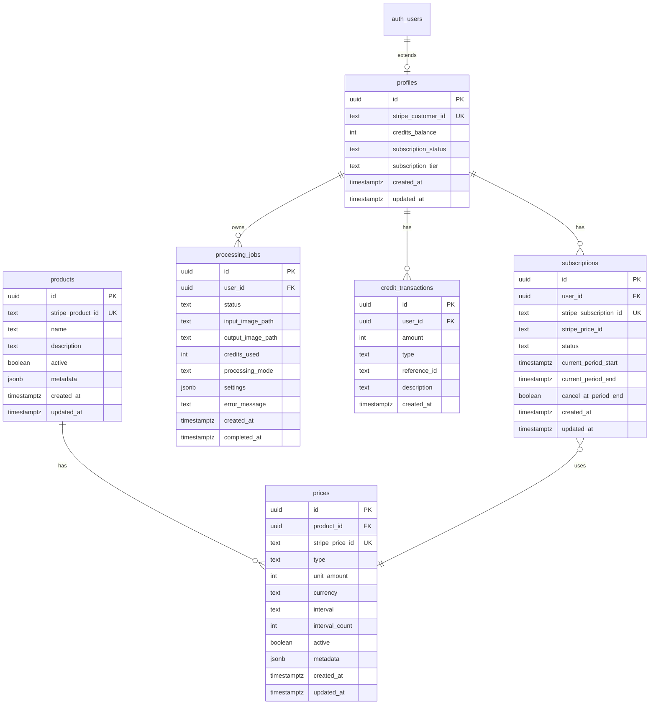
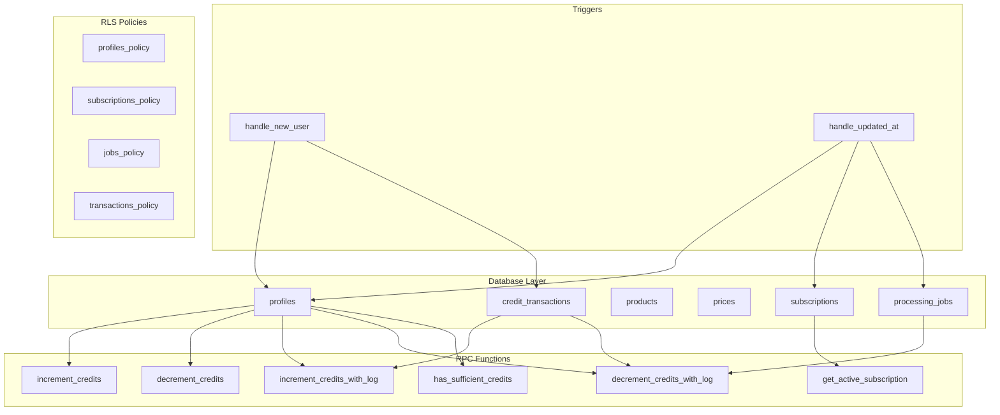

# PRD: Complete Supabase Setup & Configuration

> **Purpose:** Single-command setup for all Supabase infrastructure including database schema, RPC functions, RLS policies, and configuration.

## Executive Summary

| Metric              | Value                                          |
| ------------------- | ---------------------------------------------- |
| **Priority**        | P0 (Critical - foundational infrastructure)    |
| **Effort Estimate** | Low (automated via bash script)                |
| **Risk Level**      | Low (idempotent migrations, can re-run safely) |

### Quick Start

```bash
# Run complete Supabase setup
./scripts/setup-supabase.sh
```

This script will:

1. Verify environment variables
2. Apply all database migrations in order
3. Create tables, RPC functions, triggers, and RLS policies
4. Backfill any existing users with correct initial credits
5. Verify setup completion

---

## 1. Infrastructure Overview

### 1.1 Database Schema



### 1.2 Component Dependencies



---

## 2. Migration Files

### Migration Order (Critical)

Migrations must be applied in this exact order due to foreign key dependencies:

| Order | File                                            | Description                     |
| ----- | ----------------------------------------------- | ------------------------------- |
| 1     | `20250120_create_profiles_table.sql`            | Core profiles table + trigger   |
| 2     | `20250120_create_subscriptions_table.sql`       | Subscriptions, products, prices |
| 3     | `20250121_create_credit_transactions_table.sql` | Credit audit log                |
| 4     | `20250121_create_processing_jobs_table.sql`     | Job tracking                    |
| 5     | `20250120_create_rpc_functions.sql`             | Basic RPC functions             |
| 6     | `20250121_enhanced_credit_functions.sql`        | Logging RPC variants            |
| 7     | `20250121_fix_initial_credits.sql`              | Bug fix + backfill              |

---

## 3. Detailed Migration Specifications

### 3.1 Profiles Table (Migration 1)

**File:** `/supabase/migrations/20250120_create_profiles_table.sql`

```sql
-- Profiles table extending auth.users
CREATE TABLE IF NOT EXISTS public.profiles (
  id UUID PRIMARY KEY REFERENCES auth.users(id) ON DELETE CASCADE,
  stripe_customer_id TEXT UNIQUE,
  credits_balance INTEGER NOT NULL DEFAULT 10,
  subscription_status TEXT CHECK (subscription_status IN ('free', 'active', 'past_due', 'canceled', 'trialing')),
  subscription_tier TEXT CHECK (subscription_tier IN ('free', 'starter', 'pro', 'business')),
  created_at TIMESTAMPTZ NOT NULL DEFAULT NOW(),
  updated_at TIMESTAMPTZ NOT NULL DEFAULT NOW()
);

-- Indexes
CREATE INDEX IF NOT EXISTS idx_profiles_stripe_customer_id ON public.profiles(stripe_customer_id);
CREATE INDEX IF NOT EXISTS idx_profiles_subscription_status ON public.profiles(subscription_status);

-- Enable RLS
ALTER TABLE public.profiles ENABLE ROW LEVEL SECURITY;

-- RLS Policies
CREATE POLICY "Users can view own profile"
  ON public.profiles FOR SELECT
  USING (auth.uid() = id);

CREATE POLICY "Users can update own profile"
  ON public.profiles FOR UPDATE
  USING (auth.uid() = id);

CREATE POLICY "Service role has full access to profiles"
  ON public.profiles FOR ALL
  USING (auth.role() = 'service_role');

-- Updated at trigger
CREATE OR REPLACE FUNCTION public.handle_updated_at()
RETURNS TRIGGER AS $$
BEGIN
  NEW.updated_at = NOW();
  RETURN NEW;
END;
$$ LANGUAGE plpgsql;

CREATE TRIGGER on_profiles_updated
  BEFORE UPDATE ON public.profiles
  FOR EACH ROW EXECUTE FUNCTION public.handle_updated_at();
```

### 3.2 Subscriptions & Products Tables (Migration 2)

**File:** `/supabase/migrations/20250120_create_subscriptions_table.sql`

```sql
-- Products table (Stripe product cache)
CREATE TABLE IF NOT EXISTS public.products (
  id UUID PRIMARY KEY DEFAULT gen_random_uuid(),
  stripe_product_id TEXT UNIQUE NOT NULL,
  name TEXT NOT NULL,
  description TEXT,
  active BOOLEAN NOT NULL DEFAULT true,
  metadata JSONB DEFAULT '{}',
  created_at TIMESTAMPTZ NOT NULL DEFAULT NOW(),
  updated_at TIMESTAMPTZ NOT NULL DEFAULT NOW()
);

-- Prices table (Stripe price cache)
CREATE TABLE IF NOT EXISTS public.prices (
  id UUID PRIMARY KEY DEFAULT gen_random_uuid(),
  product_id UUID REFERENCES public.products(id) ON DELETE CASCADE,
  stripe_price_id TEXT UNIQUE NOT NULL,
  type TEXT CHECK (type IN ('one_time', 'recurring')),
  unit_amount INTEGER,
  currency TEXT DEFAULT 'usd',
  interval TEXT CHECK (interval IN ('day', 'week', 'month', 'year')),
  interval_count INTEGER DEFAULT 1,
  active BOOLEAN NOT NULL DEFAULT true,
  metadata JSONB DEFAULT '{}',
  created_at TIMESTAMPTZ NOT NULL DEFAULT NOW(),
  updated_at TIMESTAMPTZ NOT NULL DEFAULT NOW()
);

-- Subscriptions table
CREATE TABLE IF NOT EXISTS public.subscriptions (
  id UUID PRIMARY KEY DEFAULT gen_random_uuid(),
  user_id UUID NOT NULL REFERENCES public.profiles(id) ON DELETE CASCADE,
  stripe_subscription_id TEXT UNIQUE NOT NULL,
  stripe_price_id TEXT NOT NULL,
  status TEXT NOT NULL CHECK (status IN ('active', 'canceled', 'incomplete', 'incomplete_expired', 'past_due', 'trialing', 'unpaid')),
  current_period_start TIMESTAMPTZ,
  current_period_end TIMESTAMPTZ,
  cancel_at_period_end BOOLEAN DEFAULT false,
  created_at TIMESTAMPTZ NOT NULL DEFAULT NOW(),
  updated_at TIMESTAMPTZ NOT NULL DEFAULT NOW()
);

-- Indexes
CREATE INDEX IF NOT EXISTS idx_subscriptions_user_id ON public.subscriptions(user_id);
CREATE INDEX IF NOT EXISTS idx_subscriptions_status ON public.subscriptions(status);
CREATE INDEX IF NOT EXISTS idx_prices_product_id ON public.prices(product_id);

-- Enable RLS
ALTER TABLE public.products ENABLE ROW LEVEL SECURITY;
ALTER TABLE public.prices ENABLE ROW LEVEL SECURITY;
ALTER TABLE public.subscriptions ENABLE ROW LEVEL SECURITY;

-- Products RLS (publicly readable)
CREATE POLICY "Products are publicly readable"
  ON public.products FOR SELECT
  USING (true);

CREATE POLICY "Service role can manage products"
  ON public.products FOR ALL
  USING (auth.role() = 'service_role');

-- Prices RLS (publicly readable)
CREATE POLICY "Prices are publicly readable"
  ON public.prices FOR SELECT
  USING (true);

CREATE POLICY "Service role can manage prices"
  ON public.prices FOR ALL
  USING (auth.role() = 'service_role');

-- Subscriptions RLS
CREATE POLICY "Users can view own subscriptions"
  ON public.subscriptions FOR SELECT
  USING (auth.uid() = user_id);

CREATE POLICY "Service role has full access to subscriptions"
  ON public.subscriptions FOR ALL
  USING (auth.role() = 'service_role');

-- Updated at triggers
CREATE TRIGGER on_products_updated
  BEFORE UPDATE ON public.products
  FOR EACH ROW EXECUTE FUNCTION public.handle_updated_at();

CREATE TRIGGER on_prices_updated
  BEFORE UPDATE ON public.prices
  FOR EACH ROW EXECUTE FUNCTION public.handle_updated_at();

CREATE TRIGGER on_subscriptions_updated
  BEFORE UPDATE ON public.subscriptions
  FOR EACH ROW EXECUTE FUNCTION public.handle_updated_at();
```

### 3.3 Credit Transactions Table (Migration 3)

**File:** `/supabase/migrations/20250121_create_credit_transactions_table.sql`

```sql
-- Credit transactions audit log
CREATE TABLE IF NOT EXISTS public.credit_transactions (
  id UUID PRIMARY KEY DEFAULT gen_random_uuid(),
  user_id UUID NOT NULL REFERENCES public.profiles(id) ON DELETE CASCADE,
  amount INTEGER NOT NULL,
  type TEXT NOT NULL CHECK (type IN ('purchase', 'subscription', 'usage', 'refund', 'bonus')),
  reference_id TEXT,
  description TEXT,
  created_at TIMESTAMPTZ NOT NULL DEFAULT NOW()
);

-- Indexes
CREATE INDEX IF NOT EXISTS idx_credit_transactions_user_id ON public.credit_transactions(user_id);
CREATE INDEX IF NOT EXISTS idx_credit_transactions_type ON public.credit_transactions(type);
CREATE INDEX IF NOT EXISTS idx_credit_transactions_created_at ON public.credit_transactions(created_at DESC);
CREATE INDEX IF NOT EXISTS idx_credit_transactions_reference_id ON public.credit_transactions(reference_id);

-- Enable RLS
ALTER TABLE public.credit_transactions ENABLE ROW LEVEL SECURITY;

-- RLS Policies
CREATE POLICY "Users can view own transactions"
  ON public.credit_transactions FOR SELECT
  USING (auth.uid() = user_id);

CREATE POLICY "Service role has full access to transactions"
  ON public.credit_transactions FOR ALL
  USING (auth.role() = 'service_role');
```

### 3.4 Processing Jobs Table (Migration 4)

**File:** `/supabase/migrations/20250121_create_processing_jobs_table.sql`

```sql
-- Processing jobs table
CREATE TABLE IF NOT EXISTS public.processing_jobs (
  id UUID PRIMARY KEY DEFAULT gen_random_uuid(),
  user_id UUID NOT NULL REFERENCES public.profiles(id) ON DELETE CASCADE,
  status TEXT NOT NULL DEFAULT 'queued' CHECK (status IN ('queued', 'processing', 'completed', 'failed')),
  input_image_path TEXT NOT NULL,
  output_image_path TEXT,
  credits_used INTEGER NOT NULL DEFAULT 1,
  processing_mode TEXT NOT NULL DEFAULT 'standard' CHECK (processing_mode IN ('standard', 'enhanced', 'gentle', 'portrait', 'product')),
  settings JSONB DEFAULT '{}',
  error_message TEXT,
  created_at TIMESTAMPTZ NOT NULL DEFAULT NOW(),
  completed_at TIMESTAMPTZ,
  updated_at TIMESTAMPTZ NOT NULL DEFAULT NOW()
);

-- Indexes
CREATE INDEX IF NOT EXISTS idx_processing_jobs_user_id ON public.processing_jobs(user_id);
CREATE INDEX IF NOT EXISTS idx_processing_jobs_status ON public.processing_jobs(status);
CREATE INDEX IF NOT EXISTS idx_processing_jobs_created_at ON public.processing_jobs(created_at DESC);

-- Enable RLS
ALTER TABLE public.processing_jobs ENABLE ROW LEVEL SECURITY;

-- RLS Policies
CREATE POLICY "Users can view own jobs"
  ON public.processing_jobs FOR SELECT
  USING (auth.uid() = user_id);

CREATE POLICY "Users can create own jobs"
  ON public.processing_jobs FOR INSERT
  WITH CHECK (auth.uid() = user_id);

CREATE POLICY "Service role has full access to jobs"
  ON public.processing_jobs FOR ALL
  USING (auth.role() = 'service_role');

-- Updated at trigger
CREATE TRIGGER on_processing_jobs_updated
  BEFORE UPDATE ON public.processing_jobs
  FOR EACH ROW EXECUTE FUNCTION public.handle_updated_at();
```

### 3.5 Basic RPC Functions (Migration 5)

**File:** `/supabase/migrations/20250120_create_rpc_functions.sql`

```sql
-- Basic credit increment (no logging)
CREATE OR REPLACE FUNCTION public.increment_credits(
  target_user_id UUID,
  amount INTEGER
)
RETURNS void
LANGUAGE plpgsql
SECURITY DEFINER
SET search_path = public
AS $$
BEGIN
  UPDATE public.profiles
  SET credits_balance = credits_balance + amount
  WHERE id = target_user_id;
END;
$$;

-- Basic credit decrement with validation (no logging)
CREATE OR REPLACE FUNCTION public.decrement_credits(
  target_user_id UUID,
  amount INTEGER
)
RETURNS INTEGER
LANGUAGE plpgsql
SECURITY DEFINER
SET search_path = public
AS $$
DECLARE
  new_balance INTEGER;
BEGIN
  UPDATE public.profiles
  SET credits_balance = credits_balance - amount
  WHERE id = target_user_id AND credits_balance >= amount
  RETURNING credits_balance INTO new_balance;

  RETURN new_balance;
END;
$$;

-- Check sufficient credits
CREATE OR REPLACE FUNCTION public.has_sufficient_credits(
  target_user_id UUID,
  required_amount INTEGER
)
RETURNS BOOLEAN
LANGUAGE plpgsql
SECURITY DEFINER
SET search_path = public
AS $$
DECLARE
  current_balance INTEGER;
BEGIN
  SELECT credits_balance INTO current_balance
  FROM public.profiles
  WHERE id = target_user_id;

  RETURN COALESCE(current_balance >= required_amount, false);
END;
$$;

-- Get active subscription
CREATE OR REPLACE FUNCTION public.get_active_subscription(target_user_id UUID)
RETURNS TABLE (
  subscription_id UUID,
  status TEXT,
  price_id TEXT,
  current_period_end TIMESTAMPTZ,
  cancel_at_period_end BOOLEAN
)
LANGUAGE plpgsql
SECURITY DEFINER
SET search_path = public
AS $$
BEGIN
  RETURN QUERY
  SELECT
    s.id,
    s.status,
    s.stripe_price_id,
    s.current_period_end,
    s.cancel_at_period_end
  FROM public.subscriptions s
  WHERE s.user_id = target_user_id
    AND s.status IN ('active', 'trialing')
  ORDER BY s.created_at DESC
  LIMIT 1;
END;
$$;

-- Grant execute permissions
GRANT EXECUTE ON FUNCTION public.increment_credits TO authenticated;
GRANT EXECUTE ON FUNCTION public.increment_credits TO service_role;
GRANT EXECUTE ON FUNCTION public.decrement_credits TO authenticated;
GRANT EXECUTE ON FUNCTION public.decrement_credits TO service_role;
GRANT EXECUTE ON FUNCTION public.has_sufficient_credits TO authenticated;
GRANT EXECUTE ON FUNCTION public.has_sufficient_credits TO service_role;
GRANT EXECUTE ON FUNCTION public.get_active_subscription TO authenticated;
GRANT EXECUTE ON FUNCTION public.get_active_subscription TO service_role;
```

### 3.6 Enhanced Credit Functions with Logging (Migration 6)

**File:** `/supabase/migrations/20250121_enhanced_credit_functions.sql`

```sql
-- Increment credits with transaction logging
CREATE OR REPLACE FUNCTION public.increment_credits_with_log(
  target_user_id UUID,
  amount INTEGER,
  transaction_type TEXT DEFAULT 'purchase',
  ref_id TEXT DEFAULT NULL,
  description TEXT DEFAULT NULL
)
RETURNS INTEGER
LANGUAGE plpgsql
SECURITY DEFINER
SET search_path = public
AS $$
DECLARE
  new_balance INTEGER;
BEGIN
  -- Increment credits
  UPDATE public.profiles
  SET credits_balance = credits_balance + amount
  WHERE id = target_user_id
  RETURNING credits_balance INTO new_balance;

  IF new_balance IS NULL THEN
    RAISE EXCEPTION 'User not found: %', target_user_id;
  END IF;

  -- Log transaction
  INSERT INTO public.credit_transactions (user_id, amount, type, reference_id, description)
  VALUES (target_user_id, amount, transaction_type, ref_id, description);

  RETURN new_balance;
END;
$$;

-- Decrement credits with transaction logging (atomic with row lock)
CREATE OR REPLACE FUNCTION public.decrement_credits_with_log(
  target_user_id UUID,
  amount INTEGER,
  transaction_type TEXT DEFAULT 'usage',
  ref_id TEXT DEFAULT NULL,
  description TEXT DEFAULT NULL
)
RETURNS INTEGER
LANGUAGE plpgsql
SECURITY DEFINER
SET search_path = public
AS $$
DECLARE
  current_balance INTEGER;
  new_balance INTEGER;
BEGIN
  -- Lock row and check balance
  SELECT credits_balance INTO current_balance
  FROM public.profiles
  WHERE id = target_user_id
  FOR UPDATE;

  IF current_balance IS NULL THEN
    RAISE EXCEPTION 'User not found: %', target_user_id;
  END IF;

  IF current_balance < amount THEN
    RAISE EXCEPTION 'Insufficient credits. Required: %, Available: %', amount, current_balance;
  END IF;

  -- Decrement credits
  UPDATE public.profiles
  SET credits_balance = credits_balance - amount
  WHERE id = target_user_id
  RETURNING credits_balance INTO new_balance;

  -- Log transaction (negative amount for deduction)
  INSERT INTO public.credit_transactions (user_id, amount, type, reference_id, description)
  VALUES (target_user_id, -amount, transaction_type, ref_id, description);

  RETURN new_balance;
END;
$$;

-- Grant execute permissions
GRANT EXECUTE ON FUNCTION public.increment_credits_with_log TO authenticated;
GRANT EXECUTE ON FUNCTION public.increment_credits_with_log TO service_role;
GRANT EXECUTE ON FUNCTION public.decrement_credits_with_log TO authenticated;
GRANT EXECUTE ON FUNCTION public.decrement_credits_with_log TO service_role;
```

### 3.7 Initial Credits Fix & User Trigger (Migration 7)

**File:** `/supabase/migrations/20250121_fix_initial_credits.sql`

```sql
-- Fix handle_new_user trigger to include initial credits and logging
CREATE OR REPLACE FUNCTION public.handle_new_user()
RETURNS TRIGGER AS $$
BEGIN
  -- Create profile with 10 welcome credits
  INSERT INTO public.profiles (id, credits_balance, subscription_status, subscription_tier)
  VALUES (NEW.id, 10, 'free', 'free');

  -- Log the welcome bonus
  INSERT INTO public.credit_transactions (user_id, amount, type, description)
  VALUES (NEW.id, 10, 'bonus', 'Welcome bonus credits');

  RETURN NEW;
END;
$$ LANGUAGE plpgsql SECURITY DEFINER;

-- Ensure trigger exists
DROP TRIGGER IF EXISTS on_auth_user_created ON auth.users;
CREATE TRIGGER on_auth_user_created
  AFTER INSERT ON auth.users
  FOR EACH ROW EXECUTE FUNCTION public.handle_new_user();

-- Backfill existing users with 0 credits
DO $$
DECLARE
  updated_count INTEGER;
BEGIN
  UPDATE public.profiles
  SET credits_balance = 10
  WHERE credits_balance = 0;

  GET DIAGNOSTICS updated_count = ROW_COUNT;

  IF updated_count > 0 THEN
    RAISE NOTICE 'Backfilled % users with 10 credits', updated_count;
  END IF;
END;
$$;
```

---

## 4. Setup Script

**File:** `/scripts/setup-supabase.sh`

```bash
#!/bin/bash

# ============================================================================
# Supabase Complete Setup Script
# ============================================================================
# This script sets up all Supabase infrastructure for PixelPerfect
#
# Usage:
#   ./scripts/setup-supabase.sh [options]
#
# Options:
#   --dry-run     Show what would be executed without running
#   --skip-verify Skip verification step
#   --help        Show this help message
# ============================================================================

set -euo pipefail

# Colors for output
RED='\033[0;31m'
GREEN='\033[0;32m'
YELLOW='\033[1;33m'
BLUE='\033[0;34m'
NC='\033[0m' # No Color

# Configuration
SCRIPT_DIR="$(cd "$(dirname "${BASH_SOURCE[0]}")" && pwd)"
PROJECT_ROOT="$(dirname "$SCRIPT_DIR")"
MIGRATIONS_DIR="$PROJECT_ROOT/supabase/migrations"

# Flags
DRY_RUN=false
SKIP_VERIFY=false

# ============================================================================
# Helper Functions
# ============================================================================

log_info() {
    echo -e "${BLUE}[INFO]${NC} $1"
}

log_success() {
    echo -e "${GREEN}[SUCCESS]${NC} $1"
}

log_warning() {
    echo -e "${YELLOW}[WARNING]${NC} $1"
}

log_error() {
    echo -e "${RED}[ERROR]${NC} $1"
}

show_help() {
    head -25 "$0" | tail -22
    exit 0
}

# ============================================================================
# Parse Arguments
# ============================================================================

while [[ $# -gt 0 ]]; do
    case $1 in
        --dry-run)
            DRY_RUN=true
            shift
            ;;
        --skip-verify)
            SKIP_VERIFY=true
            shift
            ;;
        --help|-h)
            show_help
            ;;
        *)
            log_error "Unknown option: $1"
            show_help
            ;;
    esac
done

# ============================================================================
# Environment Validation
# ============================================================================

log_info "Checking environment variables..."

# Load environment files
if [[ -f "$PROJECT_ROOT/.env" ]]; then
    set -a
    source "$PROJECT_ROOT/.env"
    set +a
fi

if [[ -f "$PROJECT_ROOT/.env.prod" ]]; then
    set -a
    source "$PROJECT_ROOT/.env.prod"
    set +a
fi

# Required variables
REQUIRED_VARS=(
    "NEXT_PUBLIC_SUPABASE_URL"
    "SUPABASE_SERVICE_ROLE_KEY"
)

MISSING_VARS=()
for var in "${REQUIRED_VARS[@]}"; do
    if [[ -z "${!var:-}" ]]; then
        MISSING_VARS+=("$var")
    fi
done

if [[ ${#MISSING_VARS[@]} -gt 0 ]]; then
    log_error "Missing required environment variables:"
    for var in "${MISSING_VARS[@]}"; do
        echo "  - $var"
    done
    echo ""
    echo "Ensure these are set in .env and/or .env.prod"
    exit 1
fi

log_success "Environment variables validated"

# ============================================================================
# Supabase Connection Test
# ============================================================================

log_info "Testing Supabase connection..."

# Extract project ref from URL
SUPABASE_PROJECT_REF=$(echo "$NEXT_PUBLIC_SUPABASE_URL" | sed -E 's|https://([^.]+)\.supabase\.co.*|\1|')

if [[ -z "$SUPABASE_PROJECT_REF" ]]; then
    log_error "Could not extract project ref from SUPABASE_URL"
    exit 1
fi

# Test connection with a simple query
TEST_RESPONSE=$(curl -s -o /dev/null -w "%{http_code}" \
    "${NEXT_PUBLIC_SUPABASE_URL}/rest/v1/" \
    -H "apikey: ${SUPABASE_SERVICE_ROLE_KEY}" \
    -H "Authorization: Bearer ${SUPABASE_SERVICE_ROLE_KEY}")

if [[ "$TEST_RESPONSE" != "200" ]]; then
    log_error "Failed to connect to Supabase (HTTP $TEST_RESPONSE)"
    exit 1
fi

log_success "Connected to Supabase project: $SUPABASE_PROJECT_REF"

# ============================================================================
# Migration Files
# ============================================================================

# Define migrations in order
MIGRATIONS=(
    "20250120_create_profiles_table.sql"
    "20250120_create_subscriptions_table.sql"
    "20250121_create_credit_transactions_table.sql"
    "20250121_create_processing_jobs_table.sql"
    "20250120_create_rpc_functions.sql"
    "20250121_enhanced_credit_functions.sql"
    "20250121_fix_initial_credits.sql"
)

log_info "Found ${#MIGRATIONS[@]} migrations to apply"

# ============================================================================
# Apply Migrations
# ============================================================================

execute_sql() {
    local sql="$1"
    local description="$2"

    if [[ "$DRY_RUN" == "true" ]]; then
        log_info "[DRY-RUN] Would execute: $description"
        return 0
    fi

    local response
    response=$(curl -s -X POST \
        "${NEXT_PUBLIC_SUPABASE_URL}/rest/v1/rpc/exec_sql" \
        -H "apikey: ${SUPABASE_SERVICE_ROLE_KEY}" \
        -H "Authorization: Bearer ${SUPABASE_SERVICE_ROLE_KEY}" \
        -H "Content-Type: application/json" \
        -d "{\"query\": $(echo "$sql" | jq -Rs .)}" 2>&1)

    # Check if response contains error
    if echo "$response" | grep -qi "error"; then
        log_warning "Response: $response"
        return 1
    fi

    return 0
}

apply_migration_via_psql() {
    local migration_file="$1"
    local migration_name=$(basename "$migration_file")

    log_info "Applying migration: $migration_name"

    if [[ "$DRY_RUN" == "true" ]]; then
        log_info "[DRY-RUN] Would apply: $migration_file"
        return 0
    fi

    # Use Supabase CLI if available, otherwise use REST API
    if command -v supabase &> /dev/null; then
        supabase db push --file "$migration_file" 2>&1 || {
            log_warning "supabase db push failed, trying direct SQL execution..."
            # Fallback to REST API
            local sql_content
            sql_content=$(cat "$migration_file")

            curl -s -X POST \
                "${NEXT_PUBLIC_SUPABASE_URL}/rest/v1/rpc/" \
                -H "apikey: ${SUPABASE_SERVICE_ROLE_KEY}" \
                -H "Authorization: Bearer ${SUPABASE_SERVICE_ROLE_KEY}" \
                -H "Content-Type: application/json" \
                -H "Prefer: return=representation"
        }
    else
        log_warning "Supabase CLI not found. Please run migrations manually via Supabase Dashboard SQL Editor."
        echo ""
        echo "Migration file: $migration_file"
        echo ""
        return 1
    fi
}

# Check for Supabase CLI
if ! command -v supabase &> /dev/null; then
    log_warning "Supabase CLI not installed."
    echo ""
    echo "To install:"
    echo "  brew install supabase/tap/supabase   # macOS"
    echo "  scoop bucket add supabase https://github.com/supabase/scoop-bucket.git && scoop install supabase   # Windows"
    echo "  npm install -g supabase   # npm"
    echo ""
    echo "Alternatively, apply migrations manually via Supabase Dashboard SQL Editor."
    echo "Migration files are in: $MIGRATIONS_DIR"
    echo ""

    if [[ "$DRY_RUN" == "false" ]]; then
        read -p "Continue without CLI? Migrations will need manual application. [y/N] " -n 1 -r
        echo
        if [[ ! $REPLY =~ ^[Yy]$ ]]; then
            exit 1
        fi
    fi
fi

# Apply each migration
FAILED_MIGRATIONS=()
for migration in "${MIGRATIONS[@]}"; do
    migration_path="$MIGRATIONS_DIR/$migration"

    if [[ ! -f "$migration_path" ]]; then
        log_warning "Migration file not found: $migration_path"
        log_info "Creating migration file..."

        # The migration files should exist. If not, warn the user.
        log_error "Migration file missing. Please ensure all migrations exist in $MIGRATIONS_DIR"
        FAILED_MIGRATIONS+=("$migration")
        continue
    fi

    if command -v supabase &> /dev/null && [[ "$DRY_RUN" == "false" ]]; then
        # Link project if not already linked
        if [[ ! -f "$PROJECT_ROOT/supabase/.temp/project-ref" ]]; then
            log_info "Linking Supabase project..."
            cd "$PROJECT_ROOT" && supabase link --project-ref "$SUPABASE_PROJECT_REF"
        fi

        log_info "Applying: $migration"
        if supabase db push 2>&1; then
            log_success "Applied: $migration"
        else
            log_warning "Migration may have already been applied or failed: $migration"
        fi
    else
        log_info "[Manual] Apply migration: $migration_path"
    fi
done

# ============================================================================
# Verification
# ============================================================================

if [[ "$SKIP_VERIFY" == "false" && "$DRY_RUN" == "false" ]]; then
    log_info "Verifying setup..."

    echo ""
    echo "============================================"
    echo "VERIFICATION CHECKLIST"
    echo "============================================"
    echo ""
    echo "Please verify in Supabase Dashboard:"
    echo ""
    echo "1. Tables exist:"
    echo "   [ ] profiles"
    echo "   [ ] subscriptions"
    echo "   [ ] products"
    echo "   [ ] prices"
    echo "   [ ] credit_transactions"
    echo "   [ ] processing_jobs"
    echo ""
    echo "2. RPC Functions exist:"
    echo "   [ ] increment_credits"
    echo "   [ ] decrement_credits"
    echo "   [ ] increment_credits_with_log"
    echo "   [ ] decrement_credits_with_log"
    echo "   [ ] has_sufficient_credits"
    echo "   [ ] get_active_subscription"
    echo ""
    echo "3. Triggers exist:"
    echo "   [ ] on_auth_user_created (on auth.users)"
    echo "   [ ] on_profiles_updated (on profiles)"
    echo ""
    echo "4. RLS Policies enabled on all tables"
    echo ""
    echo "============================================"
fi

# ============================================================================
# Summary
# ============================================================================

echo ""
log_success "Setup complete!"
echo ""

if [[ ${#FAILED_MIGRATIONS[@]} -gt 0 ]]; then
    log_warning "Some migrations need manual attention:"
    for m in "${FAILED_MIGRATIONS[@]}"; do
        echo "  - $m"
    done
    echo ""
    echo "Apply them via Supabase Dashboard SQL Editor:"
    echo "  ${NEXT_PUBLIC_SUPABASE_URL//.supabase.co/.supabase.com}/project/$SUPABASE_PROJECT_REF/sql"
fi

echo ""
echo "Next steps:"
echo "  1. Verify tables and functions in Supabase Dashboard"
echo "  2. Enable Realtime on 'profiles' table for live updates"
echo "  3. Test by creating a new user - should receive 10 credits"
echo ""
```

---

## 5. Quick Manual Setup (Alternative)

If you prefer to run SQL manually via Supabase Dashboard:

### Step 1: Open SQL Editor

Navigate to: `https://supabase.com/dashboard/project/YOUR_PROJECT/sql`

### Step 2: Run Each Migration in Order

Copy and paste each migration file's content into the SQL Editor and run:

1. `20250120_create_profiles_table.sql`
2. `20250120_create_subscriptions_table.sql`
3. `20250121_create_credit_transactions_table.sql`
4. `20250121_create_processing_jobs_table.sql`
5. `20250120_create_rpc_functions.sql`
6. `20250121_enhanced_credit_functions.sql`
7. `20250121_fix_initial_credits.sql`

### Step 3: Enable Realtime

1. Go to Database > Replication
2. Enable replication for `profiles` table
3. Select: `INSERT`, `UPDATE`, `DELETE`

---

## 6. Verification Queries

Run these queries to verify setup:

```sql
-- Check all tables exist
SELECT table_name
FROM information_schema.tables
WHERE table_schema = 'public'
AND table_name IN ('profiles', 'subscriptions', 'products', 'prices', 'credit_transactions', 'processing_jobs');

-- Check RPC functions exist
SELECT routine_name
FROM information_schema.routines
WHERE routine_schema = 'public'
AND routine_type = 'FUNCTION';

-- Check triggers
SELECT trigger_name, event_object_table
FROM information_schema.triggers
WHERE trigger_schema = 'public';

-- Check RLS is enabled
SELECT tablename, rowsecurity
FROM pg_tables
WHERE schemaname = 'public';

-- Test initial credits (create a test and check)
SELECT id, credits_balance FROM profiles LIMIT 5;
```

---

## 7. Troubleshooting

### Issue: New users still get 0 credits

**Cause:** Trigger not updated or not firing

**Fix:**

```sql
-- Recreate the trigger
DROP TRIGGER IF EXISTS on_auth_user_created ON auth.users;
CREATE TRIGGER on_auth_user_created
  AFTER INSERT ON auth.users
  FOR EACH ROW EXECUTE FUNCTION public.handle_new_user();
```

### Issue: RPC function returns permission denied

**Cause:** Missing GRANT statements

**Fix:**

```sql
GRANT EXECUTE ON FUNCTION public.increment_credits_with_log TO authenticated;
GRANT EXECUTE ON FUNCTION public.increment_credits_with_log TO service_role;
-- Repeat for other functions
```

### Issue: RLS blocking service role

**Cause:** Missing service_role policy

**Fix:**

```sql
CREATE POLICY "Service role has full access"
  ON public.table_name FOR ALL
  USING (auth.role() = 'service_role');
```

### Issue: Foreign key constraint fails

**Cause:** Tables created out of order

**Fix:** Apply migrations in the exact order specified above.

---

## 8. Environment Variables Reference

### Required in `.env`:

```bash
NEXT_PUBLIC_SUPABASE_URL=https://your-project.supabase.co
NEXT_PUBLIC_SUPABASE_ANON_KEY=eyJ...
```

### Required in `.env.prod`:

```bash
SUPABASE_SERVICE_ROLE_KEY=eyJ...
```

---

## 9. Post-Setup Configuration

### Enable Realtime (Required for live credit updates)

1. Go to Supabase Dashboard > Database > Replication
2. Find `profiles` table
3. Enable: INSERT, UPDATE, DELETE
4. Save changes

### Configure Auth Providers (If not already done)

1. Go to Authentication > Providers
2. Enable desired providers (Google, GitHub, etc.)
3. Configure OAuth credentials

### Set up Stripe Webhook (If not already done)

1. Go to Stripe Dashboard > Developers > Webhooks
2. Add endpoint: `https://your-domain.com/api/webhooks/stripe`
3. Select events:
   - `checkout.session.completed`
   - `customer.subscription.created`
   - `customer.subscription.updated`
   - `customer.subscription.deleted`
   - `invoice.payment_succeeded`
   - `invoice.payment_failed`
4. Copy webhook signing secret to `.env.prod` as `STRIPE_WEBHOOK_SECRET`

---

## 10. Acceptance Criteria

- [ ] All 6 tables created with correct schemas
- [ ] All RLS policies active and working
- [ ] All RPC functions callable by authenticated users
- [ ] New user signup creates profile with 10 credits
- [ ] Welcome bonus logged in `credit_transactions`
- [ ] `increment_credits_with_log` creates transaction record
- [ ] `decrement_credits_with_log` creates transaction record and validates balance
- [ ] Existing users with 0 credits backfilled to 10
- [ ] Realtime enabled on profiles table
