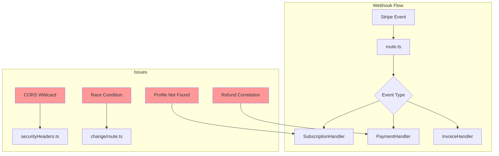
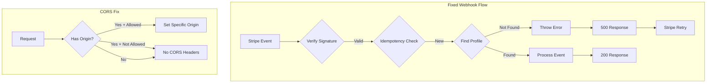
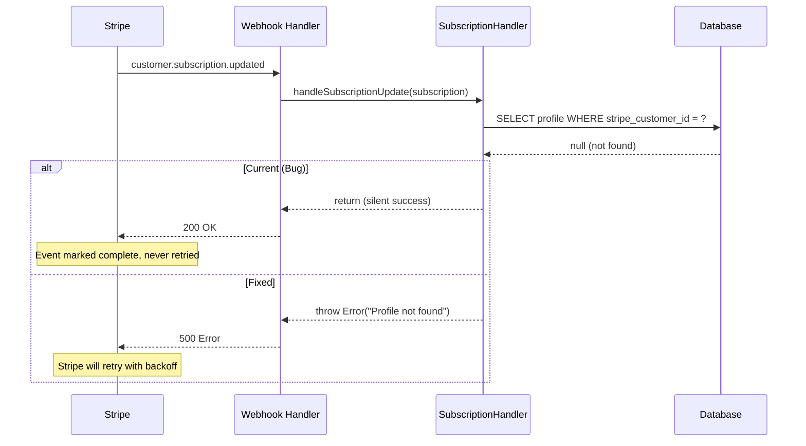
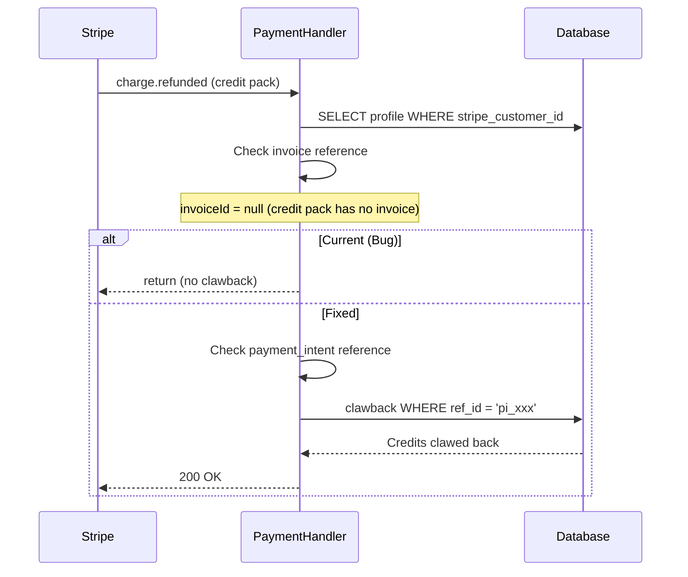

# PRD: Webhook Reliability

**Priority:** P1 - High
**Estimated Effort:** 1-2 days
**Author:** Engineering Team
**Date:** 2025-12-29

---

## 1. Context Analysis

### 1.1 Files Analyzed

- `lib/middleware/securityHeaders.ts`
- `app/api/webhooks/stripe/route.ts`
- `app/api/webhooks/stripe/handlers/subscription.handler.ts`
- `app/api/webhooks/stripe/handlers/payment.handler.ts`
- `app/api/subscription/change/route.ts`

### 1.2 Component & Dependency Overview



### 1.3 Current Behavior Summary

- **CORS Wildcard:** `applyCorsHeaders()` sets `Access-Control-Allow-Origin: *` when no Origin header is present
- **Race Condition:** `/api/subscription/change` updates DB before webhook, making `previous_attributes` potentially stale
- **Profile Not Found:** `handleSubscriptionUpdate()` returns silently when profile not found (line 89-91)
- **Refund Correlation:** `handleChargeRefunded()` only checks `invoice_` references, missing `session_` and `pi_` prefixes for credit pack refunds

### 1.4 Problem Statement

Webhook handlers have reliability gaps including silent failures when profiles aren't found, incomplete refund correlation for credit pack purchases, CORS misconfiguration for no-origin requests, and a documented race condition between plan changes and webhook processing.

---

## 2. Proposed Solution

### 2.1 Architecture Summary

1. **Fix CORS fallback** - Reject requests without Origin header instead of allowing wildcard
2. **Throw on profile not found** - Make webhook fail so Stripe retries
3. **Fix refund correlation** - Check all reference prefixes (invoice*, session*, pi\_)
4. **Document race condition** - Add defensive logging; full fix requires architectural change

**Alternatives Considered:**

- Synchronous plan change: Rejected - would slow down user experience
- WebSocket for plan changes: Over-engineering for edge case

### 2.2 Architecture Diagram



### 2.3 Key Technical Decisions

| Decision                   | Rationale                                                           |
| -------------------------- | ------------------------------------------------------------------- |
| Throw on missing profile   | Better than silent success - Stripe will retry                      |
| Log race condition details | Debugging aid; full fix is out of scope                             |
| Reject no-origin CORS      | Browsers always send Origin; no header = non-browser (ok to reject) |
| Multi-prefix refund lookup | Credit packs use `pi_` or `session_`, not `invoice_`                |

### 2.4 Data Model Changes

**No Data Changes.** This is purely application code.

---

### 2.5 Runtime Execution Flow

#### Profile Not Found Fix



#### Refund Correlation Fix



---

## 3. Detailed Implementation Spec

### A. `lib/middleware/securityHeaders.ts`

**Changes Needed:**

- Don't set wildcard CORS for missing Origin headers

**Pseudo-code:**

```typescript
/**
 * Apply CORS headers to API responses
 * SECURITY FIX: Don't allow wildcard for missing Origin
 */
export function applyCorsHeaders(res: NextResponse, origin?: string): void {
  // Only set CORS headers if origin is provided and allowed
  if (origin && ALLOWED_ORIGINS.includes(origin)) {
    res.headers.set('Access-Control-Allow-Origin', origin);
    res.headers.set('Access-Control-Allow-Methods', 'GET, POST, PUT, DELETE, OPTIONS');
    res.headers.set(
      'Access-Control-Allow-Headers',
      'Content-Type, Authorization, X-Requested-With'
    );
    res.headers.set('Access-Control-Allow-Credentials', 'true');
    res.headers.set('Access-Control-Max-Age', '86400');
  }
  // REMOVED: Wildcard fallback for missing origin
  // Non-browser clients (webhooks, APIs) don't need CORS headers
}
```

**Justification:** Browsers always send Origin header. No header means non-browser request which doesn't need CORS.

---

### B. `app/api/webhooks/stripe/handlers/subscription.handler.ts`

**Changes Needed:**

- Throw error when profile not found instead of silent return
- Add detailed logging for race condition debugging

**Pseudo-code:**

```typescript
static async handleSubscriptionUpdate(
  subscription: Stripe.Subscription,
  options?: { previousPriceId?: string | null }
): Promise<void> {
  const customerId = subscription.customer as string;

  const { data: profile } = await supabaseAdmin
    .from('profiles')
    .select('id, subscription_status, subscription_tier')
    .eq('stripe_customer_id', customerId)
    .maybeSingle();

  // FIX: Throw error instead of silent return - Stripe will retry
  if (!profile) {
    console.error(`[WEBHOOK_RETRY] No profile found for customer ${customerId}`, {
      subscriptionId: subscription.id,
      customerId,
      status: subscription.status,
    });
    throw new Error(`Profile not found for customer ${customerId} - webhook will retry`);
  }

  const userId = profile.id;

  // ... existing code ...

  // Add race condition logging
  const { data: existingSubscription } = await supabaseAdmin
    .from('subscriptions')
    .select('price_id, updated_at')
    .eq('id', subscription.id)
    .maybeSingle();

  const previousPriceId = options?.previousPriceId || existingSubscription?.price_id || null;

  // Log when we detect potential race condition
  if (options?.previousPriceId && existingSubscription?.price_id !== options.previousPriceId) {
    console.warn('[WEBHOOK_RACE] DB price_id differs from Stripe previous_attributes', {
      userId,
      subscriptionId: subscription.id,
      dbPriceId: existingSubscription?.price_id,
      stripePreviousPriceId: options.previousPriceId,
      currentPriceId: subscription.items.data[0]?.price.id,
      dbUpdatedAt: existingSubscription?.updated_at,
    });
  }

  // ... rest of handler ...
}
```

---

### C. `app/api/webhooks/stripe/handlers/payment.handler.ts`

**Changes Needed:**

- Check multiple reference prefixes for refund correlation
- Handle credit pack refunds (no invoice, has payment_intent)

**Pseudo-code:**

```typescript
/**
 * Handle charge refund - clawback credits
 * FIXED: Support multiple reference prefixes
 */
static async handleChargeRefunded(charge: IStripeChargeExtended): Promise<void> {
  const customerId = charge.customer;
  const refundAmount = charge.amount_refunded || 0;

  if (refundAmount === 0) {
    console.log(`Charge ${charge.id} has no refund amount, skipping`);
    return;
  }

  const { data: profile } = await supabaseAdmin
    .from('profiles')
    .select('id')
    .eq('stripe_customer_id', customerId)
    .maybeSingle();

  if (!profile) {
    console.error(`[REFUND] No profile found for customer ${customerId}`);
    throw new Error(`Profile not found for customer ${customerId} - webhook will retry`);
  }

  const userId = profile.id;
  const invoiceId = charge.invoice;
  const paymentIntentId = charge.payment_intent as string | null;

  console.log(`Processing refund for charge ${charge.id}:`, {
    userId,
    refundAmount,
    invoiceId,
    paymentIntentId,
  });

  // Try multiple reference formats to find the original transaction
  const referenceIds = [
    invoiceId ? `invoice_${invoiceId}` : null,
    paymentIntentId ? `pi_${paymentIntentId}` : null,
    `session_${charge.id}`, // Fallback: some old transactions used session ID
  ].filter(Boolean) as string[];

  let clawbackSucceeded = false;

  for (const refId of referenceIds) {
    try {
      const { data: result, error } = await supabaseAdmin.rpc('clawback_from_transaction_v2', {
        p_target_user_id: userId,
        p_original_ref_id: refId,
        p_reason: `Refund for charge ${charge.id} (${refundAmount} cents)`,
      });

      if (!error && result?.[0]?.success) {
        console.log(`Clawback succeeded with ref_id: ${refId}`, {
          creditsClawedBack: result[0].credits_clawed_back,
          newBalance: result[0].new_balance,
        });
        clawbackSucceeded = true;
        break;
      }
    } catch (err) {
      console.warn(`Clawback attempt failed for ref_id ${refId}:`, err);
    }
  }

  if (!clawbackSucceeded) {
    console.warn(`[REFUND] Could not correlate refund to any transaction`, {
      userId,
      chargeId: charge.id,
      attemptedRefIds: referenceIds,
    });
    // Don't throw - refund processed even if clawback fails
    // This avoids blocking legitimate refunds for old transactions
  }
}
```

---

### D. `app/api/webhooks/stripe/handlers/invoice.handler.ts` (if exists)

**Changes Needed:**

- Same profile-not-found fix as subscription handler

**Pattern to apply:**

```typescript
if (!profile) {
  console.error(`[WEBHOOK_RETRY] No profile found for customer ${customerId}`);
  throw new Error(`Profile not found for customer ${customerId} - webhook will retry`);
}
```

---

## 4. Step-by-Step Execution Plan

### Phase 1: CORS Fix (Independent)

- [ ] Update `applyCorsHeaders()` to not set wildcard for missing origin
- [ ] Test that API endpoints still work for browser requests
- [ ] Verify webhooks still work (no CORS needed)

### Phase 2: Profile Not Found Fix (Independent)

- [ ] Update `SubscriptionHandler.handleSubscriptionUpdate()` to throw
- [ ] Update `SubscriptionHandler.handleSubscriptionDeleted()` to throw
- [ ] Update `SubscriptionHandler.handleTrialWillEnd()` to throw
- [ ] Update `PaymentHandler.handleChargeRefunded()` to throw
- [ ] Update `InvoiceHandler` methods to throw
- [ ] Add consistent logging format

### Phase 3: Refund Correlation Fix (Independent)

- [ ] Update `handleChargeRefunded()` with multi-prefix lookup
- [ ] Add logging for correlation debugging
- [ ] Test with invoice-based refunds (subscriptions)
- [ ] Test with payment_intent-based refunds (credit packs)

### Phase 4: Race Condition Logging (Independent)

- [ ] Add race condition detection logging
- [ ] Document the behavior in code comments
- [ ] Add monitoring alert for race condition occurrences

---

## 5. Testing Strategy

### Unit Tests

| Function                     | Test Cases                                                  |
| ---------------------------- | ----------------------------------------------------------- |
| `applyCorsHeaders()`         | With allowed origin, with disallowed origin, with no origin |
| `handleSubscriptionUpdate()` | Profile found, profile not found (expect throw)             |
| `handleChargeRefunded()`     | Invoice ref found, PI ref found, no ref found               |

### Integration Tests

- Webhook with valid signature and existing profile → 200
- Webhook with valid signature and missing profile → 500 (Stripe will retry)
- Credit pack refund → Credits clawed back
- Subscription refund → Credits clawed back

### Edge Cases

| Scenario                              | Expected Behavior                             |
| ------------------------------------- | --------------------------------------------- |
| Profile created after webhook         | Stripe retry will succeed                     |
| Old transaction without proper ref_id | Log warning, don't crash                      |
| Race condition detected               | Log warning, use Stripe's previous_attributes |
| OPTIONS request without origin        | Return 200 (preflight still works)            |

---

## 6. Acceptance Criteria

- [ ] CORS headers not set for requests without Origin header
- [ ] Webhook returns 500 when profile not found (enabling Stripe retry)
- [ ] Credit pack refunds correctly correlate via `pi_` reference
- [ ] Race condition logged with diagnostic details
- [ ] All webhooks have consistent error handling pattern
- [ ] No silent failures in webhook handlers

---

## 7. Verification & Rollback

### Success Criteria

- Stripe webhook retry count increases initially (expected - catching previously silent failures)
- Retry count decreases over time as profiles sync
- Refund correlation success rate improves
- No legitimate webhooks permanently failing

### Rollback Plan

1. **Profile Not Found:** Revert to `return` instead of `throw` if too many retries
2. **CORS:** Can quickly revert if legitimate API clients break
3. **Refund Correlation:** Multi-prefix lookup is additive, no rollback needed
4. **Race Logging:** Logging only, no rollback needed

### Monitoring

```typescript
// Add to webhook handler
console.log('[WEBHOOK_METRICS]', {
  eventType: event.type,
  eventId: event.id,
  profileFound: !!profile,
  processingTimeMs: Date.now() - startTime,
  raceConditionDetected: /* boolean */,
});
```

Set up Baselime alerts for:

- High rate of 500 responses from webhook endpoint
- Race condition detection logs
- Profile not found errors
