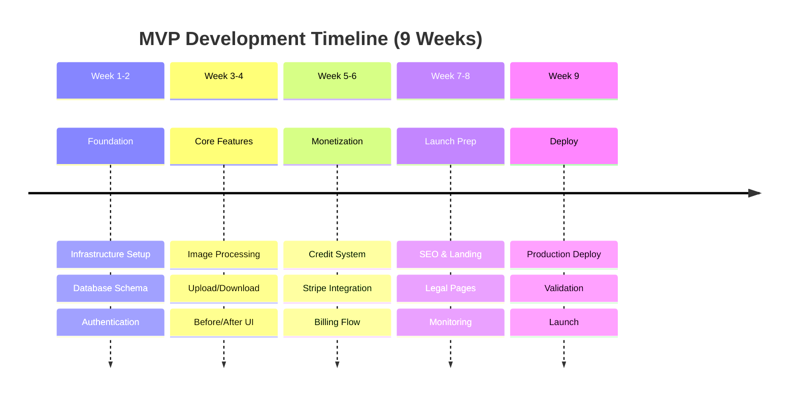
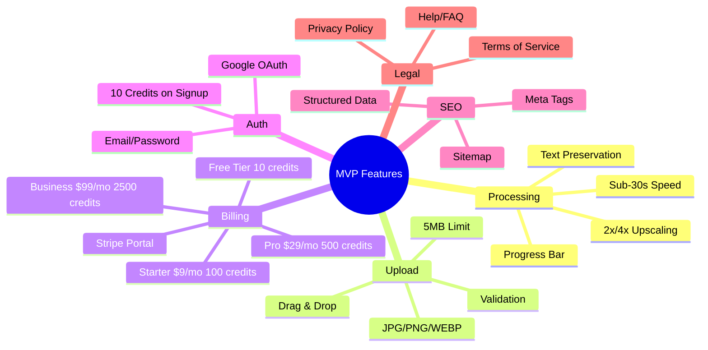

# MyImageUpscaler MVP Roadmap

Product development roadmap for MyImageUpscaler AI Image Enhancer & Upscaler MVP launch.

## Vision

Build the leading AI image enhancement tool for e-commerce sellers and content creators, differentiated by **text/logo preservation** and **prosumer pricing** ($9-29/month).

## Technical Stack

- **Primary Model**: Real-ESRGAN via Replicate API
  - Cost: **$0.0017/image** (T4 GPU) / $0.0026/image (A100 GPU)
  - Processing Speed: ~1.8s per image (T4) / ~0.7s (A100)
  - Quality: 9.2/10 benchmark score
- **Portrait Enhancement**: GFPGAN ($0.0025/run)
- **Gross Margins**: 95-98% at all tiers
- **Infrastructure**: Vercel + Supabase + Cloudflare R2

## MVP Timeline (Weeks 1-9)

---

## Phase 1: MVP (Weeks 1-9)

**Goal**: Launch working product, validate market, achieve first paying customers.

**Target Metrics**:

- 1,000 free users
- 20-50 paying customers (break-even at ~17 users)
- $500-1,500 MRR
- 2-5% freemium conversion rate
- <30 second average processing time
- CAC <$150 (organic/freemium focus)

**Pricing Tiers**:
| Plan | Price | Credits | $/Credit | Margin |
|------|-------|---------|----------|--------|
| Free | $0 | 10 | - | - |
| Starter | $9/mo | 100 | $0.09 | 98% |
| Pro | $29/mo | 500 | $0.058 | 97% |
| Business | $99/mo | 2,500 | $0.04 | 96% |

### Week 1-2: Foundation & Infrastructure

**Week 1: Project Setup**

- [x] **Next.js 15+ with App Router**
  - Initialize project with `create-next-app`
  - Configure `next.config.js`
  - Set up TypeScript strict mode
- [x] **Environment configuration**
  - Set up `.env.local` and `.env.example`
  - Document environment variables
- [x] **Development tooling**
  - Configure ESLint and Prettier
  - Add pre-commit hooks

**Week 2: Database & Auth**

- [x] **PostgreSQL schema**
  - Create `profiles` table with `credits_balance`
  - Create `subscriptions` table matching Stripe model
  - Set up RLS policies
- [x] **Supabase Auth**
  - Configure email/password authentication
  - Set up Google OAuth
  - Implement Auth Provider wrapper
- [x] **API Middleware**
  - Rate limiting (sliding window algorithm)
  - Security headers (CSP, X-Frame-Options)
  - Authentication middleware

### Week 3-4: Core Product Features

**Week 3: Image Upload & Processing**

- [x] **Image upload component**
  - Drag & drop interface
  - File type validation (JPG, PNG, WEBP)
  - Size validation (5MB limit for free tier)
- [x] **Real-ESRGAN API Integration** ✅ **Completed December 4, 2025**
  - Server-side `/api/upscale` endpoint via Replicate
  - 2x/4x upscaling modes with provider routing
  - Gemini fallback for creative enhancement modes
  - Error handling and automatic refunds
  - **Cost**: $0.0017/image (76x cheaper than Gemini)
  - **Margins**: 94-98% gross profit at full utilization

**Week 4: User Interface & Experience**

- [x] **Processing UI**
  - Progress indicator
  - Before/after comparison slider
  - Download functionality
- [x] **Responsive Design**
  - Mobile-optimized layout
  - Touch-friendly interactions
  - Cross-browser compatibility

### Week 5-6: Monetization & Credits

**Week 5: Credit System**

- [x] **Credit implementation**
  - RPC functions (increment/decrement credits)
  - Transaction logging (`credit_transactions` table)
  - Credit deduction in `/api/upscale`
- [x] **Initial credits**
  - 10 free credits on signup
  - Welcome bonus transaction logging

**Week 6: Stripe Integration**

- [x] **Payment flow**
  - Checkout API endpoint
  - Stripe checkout components
  - Success/canceled pages
- [x] **Webhook handlers**
  - `checkout.session.completed`
  - Subscription lifecycle events
  - Signature verification
- [x] **Customer portal**
  - Portal session creation
  - Billing management integration

### Week 7-8: Launch Preparation

**Week 7: SEO & Content**

- [x] **SEO foundation**
  - Meta tags and descriptions
  - Sitemap.xml and robots.txt
  - Structured data (JSON-LD)
- [x] **Landing page**
  - Hero section with CTA
  - Features and benefits
  - Interactive demo

**Week 8: Legal & Compliance**

- [x] **Legal pages**
  - Privacy Policy
  - Terms of Service
  - Help & FAQ
- [x] **Footer**
  - Legal links
  - Contact information
  - Navigation

### Week 9: Deployment & Launch

**Week 9: Production Deploy**

- [x] **Build optimization**
  - Production build configuration
  - Bundle size optimization
  - Asset optimization
- [ ] **Cloudflare Pages setup**
  - Connect GitHub repository
  - Configure production variables
  - Set up custom domain
- [ ] **Monitoring & Analytics**
  - Baselime error tracking
  - Amplitude + GA4 analytics
  - Health check endpoint

## MVP Feature Summary

## Priority Classification (MVP)

### P0 - Must Have (Launch Blockers)

Core functionality required for MVP launch.

| Feature                | Week | Description                      |
| ---------------------- | ---- | -------------------------------- |
| 2x/4x Upscaling        | 3    | Core AI processing functionality |
| Text/Logo Preservation | 3    | Key differentiator               |
| Drag & Drop Upload     | 3    | Basic UX requirement             |
| Credit System          | 5    | Monetization foundation          |
| Stripe Billing         | 6    | Payment processing               |
| Authentication         | 2    | User management                  |
| SEO Foundation         | 7    | Discoverability                  |

### P1 - Should Have (Launch Goals)

Important for competitive positioning.

| Feature              | Week | Description          |
| -------------------- | ---- | -------------------- |
| Google OAuth         | 2    | Reduced friction     |
| Before/After Compare | 4    | Result visualization |
| Mobile Responsive    | 4    | 40%+ traffic         |
| No Watermark         | 3    | Differentiator       |
| Customer Portal      | 6    | Self-service billing |

## Success Metrics

### User Metrics

- Free users: 1,000
- Paid customers: 20-50 (break-even at ~17)
- Conversion rate: 2-5%
- Daily active users: 50+

### Revenue Metrics

- MRR: $500-1,500
- ARPU: $30-35 (blended)
- LTV: ~$400 average
- LTV:CAC > 3:1
- Payback period: 4-5 months

### Technical Metrics

- Processing time: <30 seconds (Real-ESRGAN ~1.8s on T4)
- Uptime: 99.5%
- Lighthouse scores: >80
- Error rate: <1%

### Unit Economics

- Cost per image: $0.0017 (T4) / $0.0026 (A100)
- Gross margin: 95-98%
- Infrastructure cost: $100-200/month

## Risk Mitigation

| Risk                              | Impact      | Mitigation                                                  |
| --------------------------------- | ----------- | ----------------------------------------------------------- |
| Replicate API price increase      | High        | Multi-provider strategy (Stability AI, Hugging Face backup) |
| Quality inconsistency             | High        | User feedback system, rating system, refund policy          |
| Low conversion                    | High        | A/B testing, funnel optimization, upgrade prompts           |
| Processing delays                 | Medium      | Queue management, status page                               |
| Competitor adds text preservation | Medium-High | Move fast, build brand first                                |

## Validation

For detailed pre-deployment validation checklists, see: **[PRE_DEPLOYMENT_VALIDATION_CHECKLIST.md](./PRE_DEPLOYMENT_VALIDATION_CHECKLIST.md)**

## Launch Checklist

### Week 9 Final Tasks

- [ ] Complete all validation tests
- [ ] Configure production environment
- [ ] Set up monitoring alerts
- [ ] Prepare launch assets
- [ ] Test payment flows in live mode
- [ ] Deploy to production
- [ ] Verify all systems operational
- [ ] Launch announcement

## Changelog

| Date       | Version | Changes                                                                                                                    |
| ---------- | ------- | -------------------------------------------------------------------------------------------------------------------------- |
| 2025-12-01 | 1.0     | Extracted MVP roadmap from main ROADMAP.md                                                                                 |
| 2025-12-04 | 1.1     | Updated with business model canvas: Real-ESRGAN via Replicate, pricing tiers ($9/$29/$99), unit economics, success metrics |

---

**Next Steps**: After MVP launch, see **[POST_MVP_ROADMAP.md](./POST_MVP_ROADMAP.md)** for growth and scaling plans.
