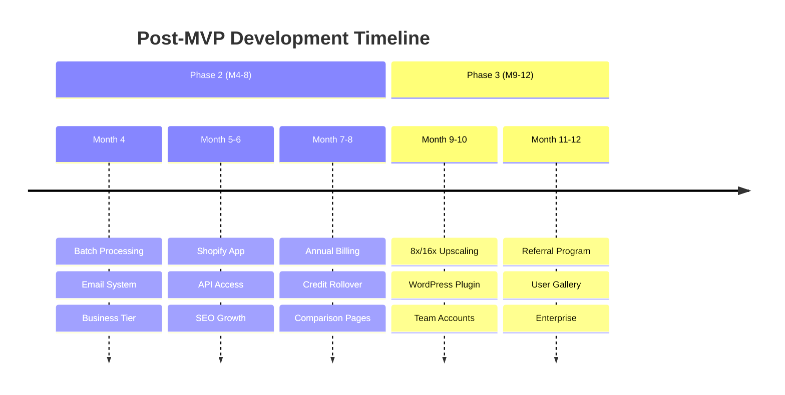
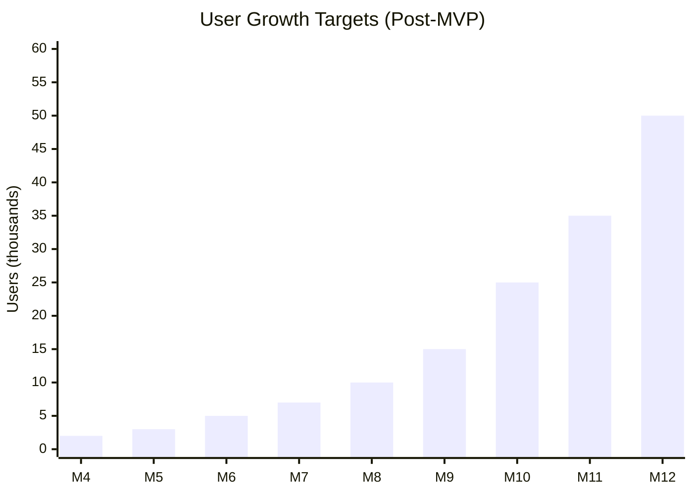

# PixelPerfect Post-MVP Roadmap

Product development roadmap for PixelPerfect after MVP launch - focusing on growth, scaling, and market expansion.

## Vision

Build the leading AI image enhancement tool for e-commerce sellers and content creators, differentiated by **text/logo preservation** and **prosumer pricing** ($9-29/month).

## Post-MVP Timeline (Months 4-12)

---

## Phase 2: Growth (Months 4-8)

**Goal**: Scale user base, launch integrations, achieve break-even.

**Target Metrics**:
- 10,000 free users
- 200-500 paying customers
- $5K-15K MRR
- 100+ Shopify app installs
- Break-even achieved

### Month 4: Enhanced Processing & Communication

**Batch Processing (P1)**
- [ ] **Multi-image upload**
  - Up to 50 images simultaneously
  - Progress tracking for batch
  - ZIP download of results
- [ ] **Processing modes**
  - Portrait mode enhancement
  - Product/e-commerce mode
  - Automatic mode detection
- [ ] **Format support**
  - HEIC support (iPhone photos)
  - TIFF support (professional photographers)

**Email System (P2)**
- [ ] **Resend + React Email setup**
  - Custom email templates
  - Transactional email service
  - Email preference management
- [ ] **Notification types**
  - Low credit alerts
  - Processing completion emails
  - Monthly usage summaries
  - Welcome series

### Month 5: Business Features & API

**Business Tier (P2)**
- [ ] **Enterprise plan ($149/mo)**
  - 5,000 credits per month
  - Priority processing queue
  - API access included
  - Dedicated support
- [ ] **API Development**
  - RESTful API endpoints
  - API key management
  - Rate limiting by tier
  - Comprehensive documentation

**Advanced Features**
- [ ] **Credit rollover**
  - Up to 6x monthly cap
  - Rollover tracking
  - Clear expiration notifications
- [ ] **Usage analytics**
  - Processing history dashboard
  - Cost per image tracking
  - Usage insights

### Month 6-7: Platform Integrations

**Shopify App (P2)**
- [ ] **OAuth integration**
  - Shopify app development kit
  - OAuth flow implementation
  - Merchant onboarding
- [ ] **Bulk operations**
  - Sync product images
  - Batch processing API
  - Automatic image updates
- [ ] **App store listing**
  - App store submission
  - Documentation and guides
  - Merchant support

**WordPress Plugin (P3)**
- [ ] **Plugin development**
  - WordPress coding standards
  - Media library integration
  - Bulk image enhancement
- [ ] **Plugin distribution**
  - WordPress.org submission
  - Premium version with features
  - Automatic updates

### Month 8: SEO & Content Strategy

**Content Marketing**
- [ ] **Blog expansion**
  - 2 blog posts per week
  - SEO-optimized content
  - Video tutorials
- [ ] **Comparison pages** (10 pages)
  - PixelPerfect vs Topaz Gigapixel
  - PixelPerfect vs Magnific AI
  - PixelPerfect vs Upscale.media
  - And 7 more competitors

**Use Case Pages** (5 pages)
- [ ] `/use-cases/ecommerce`
- [ ] `/use-cases/real-estate`
- [ ] `/use-cases/photographers`
- [ ] `/use-cases/print`
- [ ] `/use-cases/content-creators`

**SEO Improvements**
- [ ] **Advanced schema markup**
  - LocalBusiness schema
  - Review aggregation
  - FAQ schema
- [ ] **Backlink campaign**
  - Guest posting
  - Partner outreach
  - Digital PR

## Phase 3: Scale (Months 9-12)

**Goal**: Market leadership, profitability, enterprise readiness.

**Target Metrics**:
- 50,000+ free users
- 1,000+ paying customers
- $25K-50K MRR
- Self-sustaining profitability
- 99.9% uptime

### Month 9-10: Advanced Processing & Expansion

**Enhanced Upscaling**
- [ ] **8x upscaling** (P2)
  - GPU-optimized processing
  - Quality vs speed options
  - Preview before full processing
- [ ] **16x upscaling** (P3)
  - Professional photographer tier
  - Print-ready outputs
  - Custom resolution targeting
- [ ] **Processing queue**
  - Priority queue for paid tiers
  - Queue status tracking
  - Processing time estimates

**Platform Expansion**
- [ ] **Browser extensions**
  - Chrome extension for right-click enhance
  - Firefox extension
  - Safari extension (macOS)
- [ ] **Mobile apps**
  - iOS app prototype
  - Android app prototype
  - Core photo library integration

### Month 11: Team & Enterprise Features

**Multi-User Accounts**
- [ ] **Team management**
  - Invite team members
  - Role-based permissions
  - Shared credit pools
  - Team usage analytics
- [ ] **Admin dashboard**
  - Organization management
  - Billing administration
  - Usage monitoring

**Enterprise Features**
- [ ] **Custom AI models**
  - Fine-tuned models for specific use cases
  - White-label solutions
  - On-premise deployment options
- [ ] **Advanced security**
  - SSO integration
  - SOC 2 compliance
  - Advanced audit logs

### Month 12: Growth Engine

**Referral Program**
- [ ] **Referral system**
  - 10-20% commission incentives
  - Referral tracking dashboard
  - Automated payouts via Stripe
  - Marketing materials for affiliates

**Community & Social Proof**
- [ ] **User showcase gallery**
  - Before/after gallery
  - User testimonials
  - Success stories
  - Community forum
- [ ] **Video content**
  - YouTube channel
  - Tutorial videos
  - Case study videos
  - Live demonstrations

**Advanced Analytics**
- [ ] **User behavior tracking**
  - Funnel analysis
  - Cohort retention
  - Feature usage tracking
- [ ] **Business intelligence**
  - Revenue analytics
  - Customer lifetime value
  - Churn prediction

## SEO & Growth Roadmap

### Phase 1: Foundation (Complete)
- Technical SEO setup
- 4 foundation blog posts
- Google Analytics 4 setup

### Phase 2: Growth (Months 4-8)
- 2 blog posts/week
- 10 competitor comparison pages
- 5 use case landing pages
- Backlink outreach campaign
- Schema markup expansion

### Phase 3: Authority (Months 9-12)
- Guest posting campaign
- User showcase/gallery
- 3-5 case studies
- Industry partnerships
- Video content (YouTube)

## SEO Metrics

| Metric | Phase 1 | Phase 2 | Phase 3 |
|--------|---------|---------|---------|
| Organic traffic | 500/mo | 5,000/mo | 20,000/mo |
| Indexed pages | 10 | 50 | 100+ |
| Domain authority | 10 | 25 | 40 |
| Keyword rankings (top 10) | 5 | 25 | 100 |
| Backlinks | 20 | 100 | 500 |

## Technology Roadmap

### Infrastructure Evolution
- **Phase 2**: GPU clustering for batch processing
- **Phase 3**: Custom AI model hosting, CDN optimization

### API Development
- **Month 5**: Core API v1 with authentication
- **Month 7**: Webhook system for integrations
- **Month 10**: GraphQL API for complex queries

### Performance Optimizations
- **Month 6**: Edge processing for quick previews
- **Month 9**: Progressive image loading
- **Month 11**: Real-time processing queue

## Success Metrics

### User Growth

### Revenue Targets
| Phase | MRR Target | Infrastructure Cost | Net Margin |
|-------|------------|--------------------|------------|
| Phase 2 | $5K-15K | $50-200/mo | 90%+ |
| Phase 3 | $25K-50K | $200-500/mo | 95%+ |

### Product Metrics
| Metric | Target | Measurement |
|--------|--------|-------------|
| Processing Speed | <30s | End-to-end time |
| Uptime | 99.9% | Monitoring |
| API Response | <50ms | Excluding processing |
| NPS Score | 60-70 | User surveys |

## Risk Mitigation

| Risk | Phase | Mitigation |
|------|-------|------------|
| Competition intensifies | 2 | Feature differentiation, brand building |
| AI model costs increase | 2 | Multi-provider strategy, optimization |
| Platform saturation | 3 | Diversify platforms, enterprise focus |
| Talent acquisition | 3 | Remote-first culture, competitive packages |

## Resource Planning

### Hiring Timeline
- **Month 5**: Backend Engineer (Scale)
- **Month 7**: Frontend Engineer (UI/UX)
- **Month 9**: DevOps Engineer (Infrastructure)
- **Month 11**: Customer Success Manager

### Budget Allocation
- **Phase 2**: 60% Engineering, 20% Marketing, 20% Operations
- **Phase 3**: 50% Engineering, 30% Marketing, 20% Operations

## Launch Checklist

### Phase 2 Completion (Month 8)
- [ ] Shopify App launched
- [ ] API v1 released
- [ ] Business tier active
- [ ] 20 blog posts published
- [ ] 5 comparison pages live
- [ ] Break-even achieved

### Phase 3 Completion (Month 12)
- [ ] 8x/16x upscaling available
- [ ] WordPress plugin launched
- [ ] Team accounts feature
- [ ] Referral program active
- [ ] $25K+ MRR achieved
- [ ] Profitability sustained

## Changelog

| Date | Version | Changes |
|------|---------|---------|
| 2025-12-01 | 1.0 | Extracted post-MVP roadmap from main ROADMAP.md |

---

**Previous Phase**: See **[MVP_ROADMAP.md](./MVP_ROADMAP.md)** for MVP launch details.