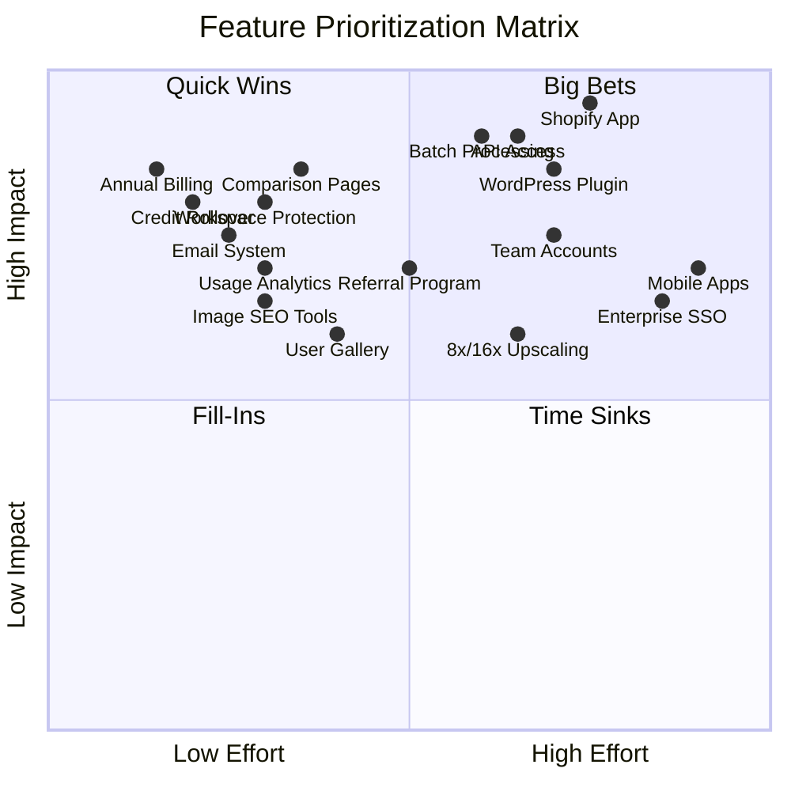
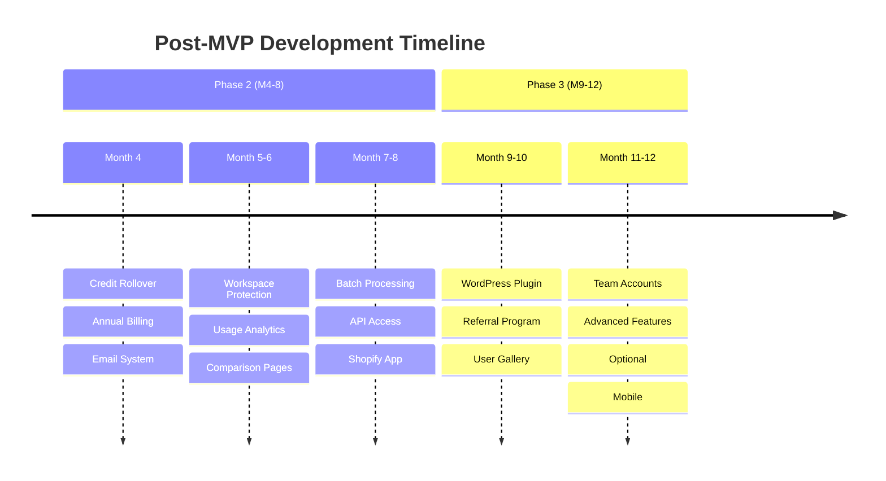
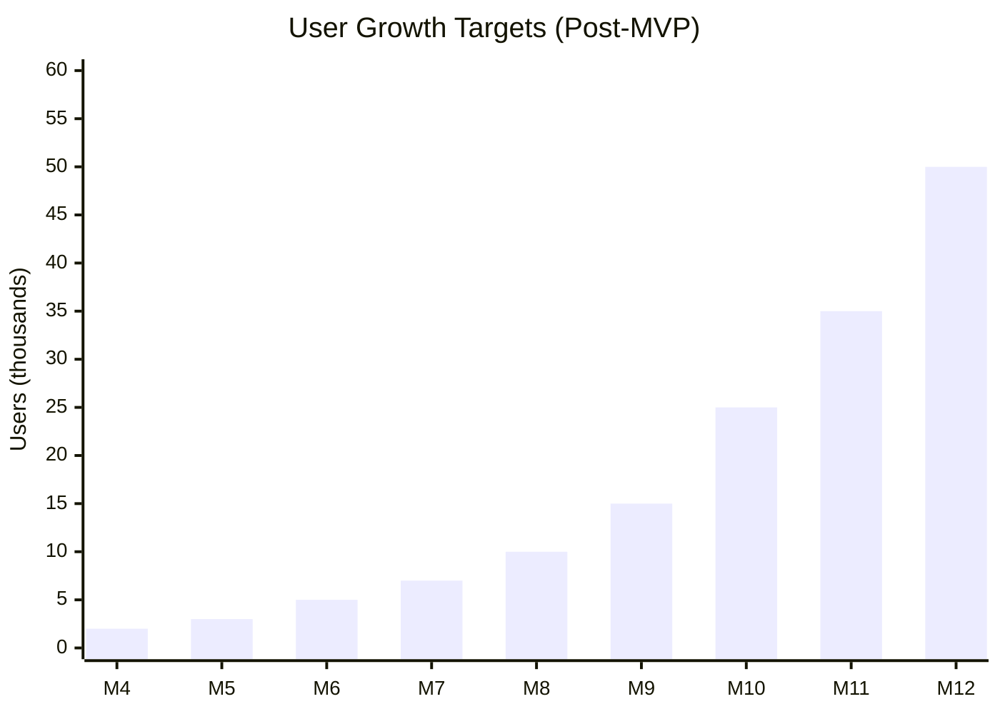

# MyImageUpscaler Post-MVP Roadmap

Product development roadmap for MyImageUpscaler after MVP launch - focusing on growth, scaling, and market expansion.

## Vision

Build the leading AI image enhancement tool for e-commerce sellers and content creators, differentiated by **text/logo preservation** and **prosumer pricing** ($9-29/month).

## Technical Foundation (from MVP)

- **Primary Model**: Real-ESRGAN via Replicate API ($0.0017/image T4, $0.0026/image A100)
- **Portrait Enhancement**: GFPGAN ($0.0025/run)
- **Gross Margins**: 95-98% enabling aggressive growth investment
- **Infrastructure**: Vercel + Supabase + Cloudflare R2

## Effort × Impact Prioritization Matrix

### Priority Categories

**🚀 Quick Wins** (Low Effort, High Impact) - **DO FIRST**

1. **Credit Rollover** - Simple logic, huge churn reduction
2. **Annual Billing** - Stripe integration, 17% discount drives LTV
3. **Email System** - Resend setup, improves retention/engagement
4. **Workspace Protection** - Fingerprinting + Turnstile, unlocks growth
5. **Usage Analytics** - Dashboard views, drives upsells
6. **Comparison Pages** - SEO content, high organic traffic

**💎 Big Bets** (High Effort, High Impact) - **DO AFTER QUICK WINS**

1. **Shopify App** - Complex OAuth, massive TAM (500k+ sellers)
2. **API Access** - Enterprise revenue, developer ecosystem
3. **Batch Processing** - Core feature, multi-image queue system
4. **WordPress Plugin** - WordPress.org distribution, huge reach

**📋 Fill-Ins** (Low Effort, Low-Moderate Impact) - **DO WHEN TIME PERMITS**

1. **User Gallery** - Social proof, moderate conversion lift
2. **Referral Program** - Viral loop, incremental growth
3. **Image SEO Tools** - Alt text, metadata optimization, platform-specific resizing

**⚠️ Time Sinks** (High Effort, Low Impact) - **AVOID OR DELAY**

1. **Enterprise SSO** - Complex integration, premature for phase 2
2. **Mobile Apps** - Full app development, web-first strategy better

---

## Post-MVP Timeline (Months 4-12)

---

## Phase 2: Growth (Months 4-8)

**Goal**: Scale user base, launch integrations, achieve profitability.

**Target Metrics**:

- 10,000 free users
- 200-500 paying customers
- $5K-15K MRR
- 100+ Shopify app installs
- Break-even achieved (already at ~17 paid users from MVP)
- LTV:CAC ratio 4:1+

**Infrastructure Cost**: $200-500/month

### Month 4: Quick Wins (🚀 High Priority)

**Credit Rollover (P1 - QUICK WIN)**

- [ ] **Implement credit rollover system**
  - Up to 6x monthly credit cap
  - Track rollover balance separately from monthly credits
  - Clear expiration notifications (7 days before)
  - Display rollover credits in dashboard
  - **Impact**: Reduces "use it or lose it" churn by 30-40%
  - **Effort**: 2-3 days (simple database logic)

**Annual Billing (P1 - QUICK WIN)**

- [ ] **Add annual subscription option**
  - 17% discount on annual plans ($90, $290, $990/year)
  - Stripe annual price ID setup
  - Billing interval selector in UI
  - Proration logic for upgrades
  - **Impact**: 12-month lock-in, +17% revenue per customer
  - **Effort**: 2-3 days (Stripe integration)

**Email System (P2 - QUICK WIN)**

- [ ] **Resend + React Email setup**
  - Custom email templates with branding
  - Transactional email service
  - Email preference management
- [ ] **Notification types**
  - Low credit alerts (80% threshold)
  - Processing completion emails
  - Monthly usage summaries
  - Welcome series (3-email onboarding)
  - **Impact**: Improves retention 15-20%, drives engagement
  - **Effort**: 3-4 days (template setup + integration)

### Month 5: Conversion & Growth Optimization (🚀 Quick Wins)

**Workspace Protection (P1 - QUICK WIN)**

- [ ] **Landing page demo workspace with abuse prevention**
  - Re-enable interactive "Try It Now" workspace on landing page
  - Implement smart protection against abuse:
    - **Soft limit**: 2 free tries for guests → signup prompt
    - **Browser fingerprinting** + localStorage tracking
    - **Cloudflare Turnstile** CAPTCHA for bot prevention
    - **Rate limiting**: Per IP (5 images/hour) + per fingerprint (3 images/day)
  - **Lead capture**: Modal after 2nd try with "Sign up for 10 more credits"
  - Analytics tracking: Guest usage vs conversion metrics
  - Cost monitoring: Track guest processing costs
  - **Impact**: Unlocks product-led growth, 20-30% conversion lift
  - **Effort**: 3-4 days (fingerprinting + modal + Turnstile)
  - See: `docs/business-model-canvas/04-revenue-costs.md` for cost analysis

**Usage Analytics Dashboard (P2 - QUICK WIN)**

- [ ] **User-facing analytics**
  - Processing history dashboard (last 30 days)
  - Credits usage graph (daily/weekly/monthly)
  - Cost per image tracking
  - Most used features insights
  - Upgrade prompts when approaching limits
  - **Impact**: Drives upsells, 10-15% upgrade rate
  - **Effort**: 3-4 days (chart.js + dashboard UI)

**Comparison Pages (P2 - QUICK WIN)**

- [ ] **SEO competitor comparison content** (10 pages)
  - MyImageUpscaler vs Topaz Gigapixel
  - MyImageUpscaler vs Magnific AI
  - MyImageUpscaler vs Let's Enhance
  - MyImageUpscaler vs Upscale.media
  - MyImageUpscaler vs VanceAI
  - MyImageUpscaler vs Remini
  - MyImageUpscaler vs Gigapixel AI
  - MyImageUpscaler vs Photoroom
  - MyImageUpscaler vs Cutout Pro
  - MyImageUpscaler vs Icons8 Upscaler
  - **Impact**: High SEO traffic (40k+ monthly searches)
  - **Effort**: 5-6 days (content writing + structured data)

### Month 6-7: Big Bets - Core Features (💎 High Impact)

**Batch Processing (P1 - BIG BET)**

- [ ] **Multi-image upload system**
  - Up to 50 images simultaneously
  - Progress tracking for batch operations
  - ZIP download of results
  - Parallel processing queue
  - **Impact**: Core e-commerce feature, critical for TAM
  - **Effort**: 7-10 days (queue system + S3 batch)
- [ ] **Processing modes**
  - Portrait mode enhancement (GFPGAN)
  - Product/e-commerce mode
  - Automatic mode detection
- [ ] **Format support**
  - HEIC support (iPhone photos)
  - TIFF support (professional photographers)

**API Access (P1 - BIG BET)**

- [ ] **API v1 Development**
  - RESTful API endpoints (enhance, upscale, batch)
  - API key management portal
  - Rate limiting by tier
  - Comprehensive API documentation
  - **Impact**: Enterprise revenue stream, developer ecosystem
  - **Effort**: 10-12 days (API design + auth + docs)
- [ ] **API Pricing Tiers**
  - Developer: Free (100 calls/month)
  - API Starter: $49/mo (2,000 calls)
  - API Pro: $199/mo (10,000 calls)
  - Enterprise: Custom pricing
- [ ] **Webhook system**
  - Async processing notifications
  - Callback URL configuration
  - Retry logic for failed webhooks

### Month 8: Platform Integration (💎 Big Bet)

**Shopify App (P1 - BIG BET)**

- [ ] **OAuth integration**
  - Shopify app development kit
  - OAuth flow implementation
  - Merchant onboarding wizard
  - **Impact**: 500k+ TAM, recurring revenue
  - **Effort**: 12-14 days (OAuth + app review process)
- [ ] **Bulk operations**
  - Sync product images from store
  - Batch processing integration
  - Automatic image updates
  - Product collection support
- [ ] **App store listing**
  - Shopify app store submission
  - Documentation and setup guides
  - Merchant support resources
  - Pricing integration (embed in Shopify billing)

**SEO Content Expansion (📋 Fill-In)**

- [ ] **Use Case Pages** (5 pages)
  - `/use-cases/ecommerce`
  - `/use-cases/real-estate`
  - `/use-cases/photographers`
  - `/use-cases/print`
  - `/use-cases/content-creators`
  - **Impact**: Moderate SEO traffic
  - **Effort**: 3-4 days (content writing)
- [ ] **Advanced schema markup**
  - LocalBusiness schema
  - Review aggregation
  - FAQ schema for rich snippets

**Image SEO Tools (P3 - FILL-IN)**

- [ ] **Built-in SEO optimization features**
  - Alt text generator (AI-powered suggestions based on image content)
  - Image metadata editor (title, description, copyright)
  - Platform-specific resize presets (Instagram, Facebook, Twitter, Pinterest, LinkedIn)
  - File size optimizer with quality controls
  - SEO-friendly filename suggestions
  - Bulk metadata editing for batch operations
  - **Impact**: Improves user workflow, adds value for content creators & e-commerce sellers
  - **Effort**: 3-4 days (UI components + metadata handling)
- [ ] **Export options**
  - Pre-configured size templates for common platforms
  - WebP format support for faster loading
  - Progressive JPEG encoding
  - Automatic image compression recommendations
  - **Impact**: Better user experience, SEO best practices
  - **Effort**: 2-3 days (format conversion + templates)

## Phase 3: Scale (Months 9-12)

**Goal**: Market leadership, sustained profitability, enterprise readiness.

**Target Metrics**:

- 50,000+ free users
- 1,000+ paying customers
- $25K-50K MRR
- Self-sustaining profitability (93%+ net margin target)
- 99.9% uptime
- CAC payback <10 months

**Infrastructure Cost**: $500-1,500/month

### Month 9-10: Distribution & Growth (💎 Big Bet + 📋 Fill-Ins)

**WordPress Plugin (P2 - BIG BET)**

- [ ] **Plugin development**
  - WordPress coding standards compliance
  - Media library integration
  - Bulk image enhancement in Media Library
  - Gutenberg block for inline enhancement
  - **Impact**: WordPress.org distribution, 40%+ of web
  - **Effort**: 8-10 days (plugin dev + testing)
- [ ] **Plugin distribution**
  - WordPress.org submission
  - Premium version with API access
  - Automatic updates via WordPress.org
  - Support forum management

**Referral Program (P3 - FILL-IN)**

- [ ] **Referral system**
  - 10-20% commission for referrers
  - 10% discount for referred users
  - Referral tracking dashboard
  - Automated payouts via Stripe
  - Marketing materials for affiliates
  - **Impact**: Viral loop, incremental growth
  - **Effort**: 5-6 days (tracking + Stripe Connect)

**User Gallery (P3 - FILL-IN)**

- [ ] **Public showcase**
  - Before/after gallery (user opt-in)
  - User testimonials
  - Success stories
  - Community voting/likes
  - **Impact**: Social proof, moderate conversion lift
  - **Effort**: 4-5 days (gallery UI + moderation)

### Month 11-12: Team Features & Advanced (💎 Big Bet)

**Team Accounts (P2 - BIG BET)**

- [ ] **Multi-user management**
  - Invite team members (up to 5 for Business tier)
  - Role-based permissions (Admin, Member, Viewer)
  - Shared credit pools with allocation
  - Team usage analytics dashboard
  - **Impact**: B2B revenue, higher LTV
  - **Effort**: 8-10 days (org structure + permissions)
- [ ] **Admin dashboard**
  - Organization management
  - Billing administration
  - Usage monitoring by team member
  - Audit logs for team activities

**Advanced Features (Optional)**

- [ ] **8x/16x upscaling** (P3 - OPTIONAL)
  - SwinIR model for ultra-quality
  - A100 GPU for speed
  - Preview before full processing
  - **Impact**: Premium tier differentiator
  - **Effort**: 6-8 days (model integration)
  - **Note**: Lower priority than distribution

- [ ] **Video content marketing** (P3 - FILL-IN)
  - YouTube channel setup
  - Tutorial video series (10 videos)
  - Case study videos
  - Live demonstrations
  - **Impact**: Brand building, moderate traffic
  - **Effort**: 5-7 days (video production)

**Advanced Analytics (P3 - FILL-IN)**

- [ ] **Business intelligence dashboard**
  - Funnel analysis (signup → paid conversion)
  - Cohort retention tracking
  - Feature usage heatmaps
  - Revenue analytics
  - Churn prediction model
  - **Impact**: Data-driven decisions
  - **Effort**: 6-8 days (analytics setup)

## SEO & Growth Roadmap

### Phase 1: Foundation (Complete)

- Technical SEO setup
- 4 foundation blog posts
- Google Analytics 4 setup

### Phase 2: Growth (Months 4-8)

- 2 blog posts/week
- 10 competitor comparison pages
- 5 use case landing pages
- Backlink outreach campaign
- Schema markup expansion

### Phase 3: Authority (Months 9-12)

- Guest posting campaign
- User showcase/gallery
- 3-5 case studies
- Industry partnerships
- Video content (YouTube)

## SEO Metrics

| Metric                    | Phase 1 | Phase 2  | Phase 3   |
| ------------------------- | ------- | -------- | --------- |
| Organic traffic           | 500/mo  | 5,000/mo | 20,000/mo |
| Indexed pages             | 10      | 50       | 100+      |
| Domain authority          | 10      | 25       | 40        |
| Keyword rankings (top 10) | 5       | 25       | 100       |
| Backlinks                 | 20      | 100      | 500       |

## Technology Roadmap

### Infrastructure Evolution

- **Phase 2**: GPU clustering for batch processing
- **Phase 3**: Custom AI model hosting, CDN optimization

### API Development

- **Month 5**: Core API v1 with authentication
- **Month 7**: Webhook system for integrations
- **Month 10**: GraphQL API for complex queries

### Performance Optimizations

- **Month 6**: Edge processing for quick previews
- **Month 9**: Progressive image loading
- **Month 11**: Real-time processing queue

## Success Metrics

### User Growth

### Revenue Targets

| Phase   | MRR Target | Infrastructure Cost | Gross Margin |
| ------- | ---------- | ------------------- | ------------ |
| Phase 2 | $5K-15K    | $200-500/mo         | 95-97%       |
| Phase 3 | $25K-50K   | $500-1,500/mo       | 93-95%       |

### Year 1 Revenue Projection (Conservative)

| Tier      | Customers    | ARPU        | MRR         |
| --------- | ------------ | ----------- | ----------- |
| Free      | 10,000       | $0          | $0          |
| Starter   | 200          | $9          | $1,800      |
| Pro       | 300          | $29         | $8,700      |
| Business  | 80           | $99         | $7,920      |
| API       | 20           | $100        | $2,000      |
| **Total** | **600 paid** | **$34 avg** | **$20,420** |

### Product Metrics

| Metric           | Target | Measurement          |
| ---------------- | ------ | -------------------- |
| Processing Speed | <30s   | End-to-end time      |
| Uptime           | 99.9%  | Monitoring           |
| API Response     | <50ms  | Excluding processing |
| NPS Score        | 60-70  | User surveys         |

## Risk Mitigation

| Risk                                 | Phase | Mitigation                                                                         |
| ------------------------------------ | ----- | ---------------------------------------------------------------------------------- |
| Competition intensifies              | 2     | Text preservation differentiator, brand building, rapid iteration                  |
| AI model costs increase              | 2     | Multi-provider strategy (Stability AI, Hugging Face backup), self-hosting at scale |
| Platform saturation                  | 3     | Diversify platforms, enterprise focus, API ecosystem                               |
| Let's Enhance adds text preservation | 2     | Move fast, build brand first, superior UX                                          |
| Talent acquisition                   | 3     | Remote-first culture, competitive packages                                         |
| High churn                           | 2-3   | Credit rollover, annual plans, proactive customer success                          |

## Resource Planning

### Hiring Timeline

- **Month 5**: Backend Engineer (Scale)
- **Month 7**: Frontend Engineer (UI/UX)
- **Month 9**: DevOps Engineer (Infrastructure)
- **Month 11**: Customer Success Manager

### Budget Allocation

- **Phase 2**: 60% Engineering, 20% Marketing, 20% Operations
- **Phase 3**: 50% Engineering, 30% Marketing, 20% Operations

### Scaling Triggers

| Milestone      | Action                                         |
| -------------- | ---------------------------------------------- |
| $20k MRR       | Hire full-time developer                       |
| $30k MRR       | Hire content marketer                          |
| $40k MRR       | Hire customer success                          |
| 100k images/mo | Evaluate self-hosting (~$170/mo via Replicate) |
| 300k images/mo | Self-hosting likely more economical            |

## Launch Checklist

### Phase 2 Completion (Month 8)

- [ ] Shopify App launched
- [ ] API v1 released
- [ ] Business tier active
- [ ] 20 blog posts published
- [ ] 5 comparison pages live
- [ ] Break-even achieved

### Phase 3 Completion (Month 12)

- [ ] 8x/16x upscaling available
- [ ] WordPress plugin launched
- [ ] Team accounts feature
- [ ] Referral program active
- [ ] $25K+ MRR achieved
- [ ] Profitability sustained

## Changelog

| Date       | Version | Changes                                                                                                                       |
| ---------- | ------- | ----------------------------------------------------------------------------------------------------------------------------- |
| 2025-12-01 | 1.0     | Extracted post-MVP roadmap from main ROADMAP.md                                                                               |
| 2025-12-04 | 1.1     | Updated with business model canvas: Real-ESRGAN via Replicate, pricing/revenue projections, scaling triggers, risk mitigation |
| 2025-12-05 | 1.2     | Added Image SEO Tools feature (Fill-In): Alt text generator, metadata editor, platform-specific resizing, export options      |

---

**Previous Phase**: See **[MVP_ROADMAP.md](./MVP_ROADMAP.md)** for MVP launch details.
