# PixelPerfect Roadmap

Product development roadmap for PixelPerfect AI Image Enhancer & Upscaler.

## Vision

Build the leading AI image enhancement tool for e-commerce sellers and content creators, differentiated by **text/logo preservation** and **prosumer pricing** ($9-29/month).

## Roadmap Overview

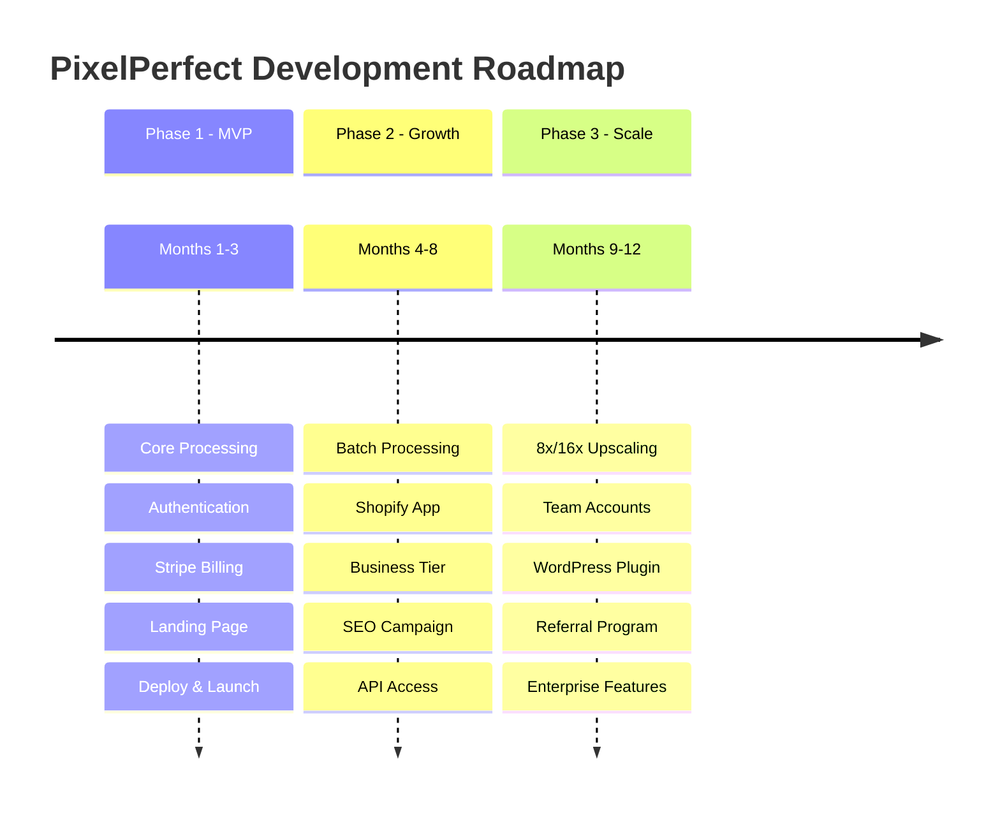

---

## Phase 1: MVP (Months 1-3)

**Goal**: Launch working product, validate market, achieve first paying customers.

**Target Metrics**:

- 1,000 free users
- 20-50 paying customers
- $500-1,500 MRR
- 2-5% conversion rate

### Milestone 1.1: Foundation (Weeks 1-2)

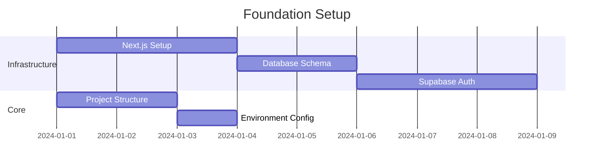

- [x] **Next.js 14+ with App Router** (P0)
  - [x] Initialize project with `create-next-app`
  - [x] Configure `next.config.js`
- [x] **PostgreSQL schema (profiles, subscriptions)** (P0)
  - [x] Create `profiles` table with `credits_balance`
  - [x] Create `subscriptions` table matching Stripe model
  - [x] Set up RLS policies
- [x] **Supabase Auth (email/password)** (P0)
  - [x] Configure Supabase client (`src/lib/supabase`)
  - [x] Implement Auth Provider wrapper
- [x] **Google OAuth integration** (P1)
  - [x] Configure Google Cloud Console credentials
  - [x] Add Google provider to Supabase
- [x] **Environment configuration** (P0)
  - [x] Set up `.env.local` and `.env.example`
  - [ ] Configure production variables in Cloudflare
- [x] **Development tooling (ESLint, Prettier)** (P0)
  - [x] Configure `.eslintrc.json` and `.prettierrc`
  - [x] Add pre-commit hooks (lint-staged + husky)
- [x] **API Middleware (Rate Limiting, Security Headers)** (P0)
  - [x] Create `middleware.ts`
  - [x] Implement `middleware/getAuthenticatedUser.ts` helper
  - [x] Add security headers (CSP, X-Frame-Options)
- [x] **Rate Limiting Setup** (P0)
  - [x] Implement `src/lib/rateLimit.ts` with sliding window algorithm
  - [x] Configure rate limits for public/authenticated routes

### Milestone 1.2: Core Processing (Weeks 3-4)

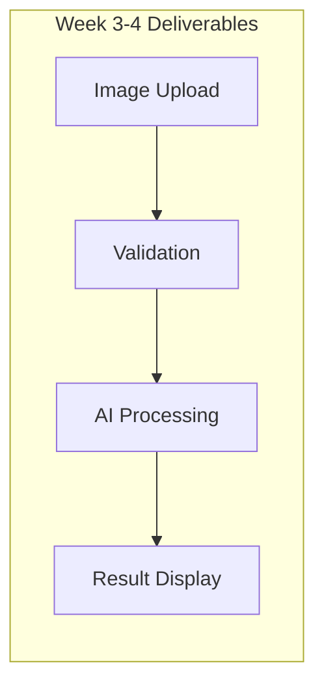

- [x] **Image upload component (drag & drop)** (P0)
  - [x] Create `Dropzone` component
  - [x] Implement file type and size validation
- [x] **Client-side validation (size, format)** (P0)
  - [x] Enforce 5MB limit for free tier
  - [x] Allow JPG, PNG, WEBP formats
- [x] **Migrate Template to Next.js App Router** (P0)
  - [x] Move components to `src/components/pixelperfect`
  - [x] Create `app/upscaler/page.tsx`
  - [x] Remove `template` directory
- [x] **Server-side Gemini Integration (`/api/upscale`)** (P0)
  - [x] Create `app/api/upscale/route.ts`
  - [x] Install `@google/genai` SDK
  - [x] Implement prompt engineering for text preservation
- [ ] **OpenRouter fallback** (P1)
  - [ ] Implement error handling for Gemini API
  - [ ] Add OpenRouter client as backup
- [x] **Text/logo preservation prompts** (P0)
  - [x] Refine system instructions for Gemini
- [x] **Before/after comparison UI** (P0)
  - [x] Implement slider component for image comparison
- [x] **Processing progress indicator** (P0)
  - [x] Add loading states and toast notifications
- [x] **Download functionality** (P0)
  - [x] Implement `download.ts` utility
  - [x] Support original format download
  - [x] Batch ZIP download for multiple images

### Milestone 1.3: Billing & Credits (Weeks 5-6)

- [x] **Stripe integration** (P0)
  - [x] Install `stripe` npm package
  - [x] Configure Stripe keys in environment
- [x] **Profiles & Subscriptions Schema** (P0)
  - [x] Update `profiles` table with `stripe_customer_id`
  - [x] Create `subscriptions` table
- [x] **Checkout flow** (P0)
  - [x] Create `app/api/checkout/route.ts`
  - [x] Implement Stripe checkout components on frontend
- [x] **Webhook handlers (Signature Verification)** (P0)
  - [x] Create `app/api/webhooks/stripe/route.ts`
  - [x] Implement `checkout.session.completed` handler
  - [x] Implement subscription lifecycle handlers
  - [x] Verify Stripe signatures
- [x] **Credit system implementation** (P0)
  - [x] Create `increment_credits` RPC function
  - [x] Create `decrement_credits` RPC function
  - [x] Implement credit deduction logic in `/api/upscale`
- [ ] **Usage tracking** (P1)
  - [ ] Log usage in `usage_logs` table (optional for MVP)
- [x] **Customer portal** (P0)
  - [x] Create portal session endpoint
- [x] **Pricing tiers (Free/Starter/Pro)** (P0)
  - [x] Define products and prices in Stripe
  - [x] Create pricing page with tier cards

### Milestone 1.4: Communication (Weeks 6-7)

- [ ] **Email System Setup (Resend + React Email)** (P0)
  - [ ] Install `resend` and `@react-email/components`
  - [ ] Configure `RESEND_API_KEY`
  - [ ] Create `src/lib/email/EmailService.ts`
- [ ] **Transactional Templates (Welcome, Reset Password)** (P0)
  - [ ] Create `emails/WelcomeEmail.tsx`
  - [ ] Create `emails/PasswordResetEmail.tsx`
  - [ ] Set up React Email preview server
- [ ] **Notification Preferences Schema** (P1)
  - [ ] Create `email_preferences` table
  - [ ] Add database trigger for new users
- [ ] **Stripe Receipt Emails** (P1)
  - [ ] Enable automatic receipts in Stripe Dashboard
  - [ ] Or implement `PaymentSuccessEmail.tsx` template

### Milestone 1.5: SEO & Landing (Weeks 7-8)

- [x] **Landing page with interactive demo** (P0)
  - [x] Migrate landing page components to `src`
  - [x] Optimize hero section for conversion
  - [x] Add features section and how-it-works section
- [x] **SEO metadata (title, description, OG)** (P0)
  - [x] Configure `metadata` object in `layout.tsx` and `page.tsx`
- [x] **Sitemap.xml generation** (P0)
  - [x] Add `sitemap.ts` route
- [x] **Robots.txt configuration** (P0)
  - [x] Add `robots.ts` route
- [x] **Structured data (JSON-LD)** (P1)
  - [x] Add `SoftwareApplication` schema
- [ ] **4 foundation blog posts** (P1)
  - [ ] Write and publish initial content
- [ ] **Lighthouse score optimization (>90)** (P0)
  - [ ] Optimize images and scripts
  - [ ] Verify Core Web Vitals

### Milestone 1.6: Deployment (Week 8)

- [x] **Cloudflare Pages setup** (P0)
  - [ ] Connect GitHub repo to Cloudflare Pages
- [x] **Wrangler Configuration (`wrangler.toml`)** (P0)
  - [x] Create `wrangler.toml`
  - [x] Set `compatibility_flags = ["nodejs_compat"]`
- [ ] **Domain configuration** (P0)
  - [ ] Configure DNS records for `pixelperfect.app`
- [ ] **SSL certificate** (P0)
  - [ ] Verify automatic SSL provisioning
- [ ] **Environment variables (production)** (P0)
  - [ ] Add secrets to Cloudflare Pages settings
- [x] **CI/CD pipeline (GitHub Actions)** (P0)
  - [x] Create `.github/workflows/code-quality.yml`
  - [ ] Create `.github/workflows/deploy.yml` for production
- [x] **Health check endpoint (`/api/health`)** (P0)
  - [x] Create simple status endpoint
- [ ] **Error monitoring (Sentry)** (P0)
  - [ ] Install `@sentry/nextjs`
  - [ ] Configure DSN

### Milestone 1.7: Launch Prep (Week 9)

- [ ] **Mobile responsive testing** (P0)
  - [ ] Verify UI on iOS and Android
- [ ] **Security audit** (P0)
  - [ ] Review RLS policies
  - [ ] Test API rate limiting
- [ ] **Privacy policy & terms** (P0)
  - [ ] Generate and publish legal docs
- [ ] **Help documentation** (P0)
  - [ ] Create FAQ page
- [ ] **Product Hunt preparation** (P1)
  - [ ] Prepare launch assets and copy

### Phase 1 Feature Summary

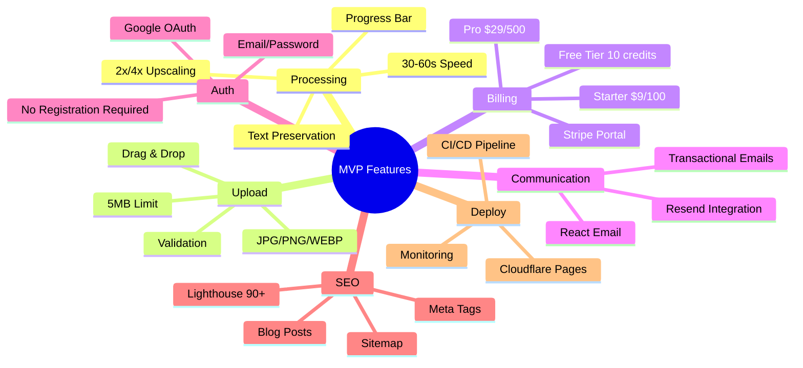

---

## Manual Validation Checklists

Each feature must be manually validated before marking as complete.

### Authentication Validation

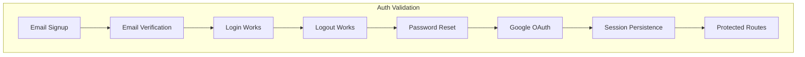

| Test Case                      | Expected Result                          | Validated |
| ------------------------------ | ---------------------------------------- | --------- |
| Sign up with email/password    | Account created, verification email sent | [ ]       |
| Click verification link        | Email confirmed, can login               | [ ]       |
| Login with correct credentials | Redirected to dashboard                  | [ ]       |
| Login with wrong password      | Error message shown                      | [ ]       |
| Logout                         | Session cleared, redirected to home      | [ ]       |
| Request password reset         | Reset email received                     | [ ]       |
| Reset password via link        | Password updated, can login              | [ ]       |
| Sign in with Google            | Account created/linked                   | [ ]       |
| Refresh page while logged in   | Session persists                         | [ ]       |
| Access /dashboard without auth | Redirected to login                      | [ ]       |
| Access /upscaler without auth  | Redirected to login                      | [ ]       |
| JWT token expiry               | Auto-refresh or re-login prompt          | [ ]       |

### Payment & Billing Validation

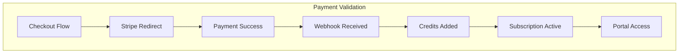

| Test Case                                  | Expected Result              | Validated |
| ------------------------------------------ | ---------------------------- | --------- |
| Click upgrade to Starter ($9)              | Stripe checkout opens        | [ ]       |
| Complete payment (test card 4242...)       | Success page shown           | [ ]       |
| Webhook `checkout.session.completed` fires | Logged in system             | [ ]       |
| Credits added after payment                | Balance shows 100 credits    | [ ]       |
| Subscription status updated                | Profile shows "active"       | [ ]       |
| Access customer portal                     | Stripe portal opens          | [ ]       |
| Cancel subscription in portal              | Status changes to "canceled" | [ ]       |
| Upgrade from Starter to Pro                | Credits updated to 500       | [ ]       |
| Payment failure (test card 4000...)        | Error handled gracefully     | [ ]       |
| Webhook signature validation               | Invalid signatures rejected  | [ ]       |
| Invoice payment succeeded                  | Credits renewed monthly      | [ ]       |

### Credit System Validation

| Test Case                      | Expected Result                | Validated |
| ------------------------------ | ------------------------------ | --------- |
| New user gets 10 free credits  | Balance shows 10               | [ ]       |
| Process image deducts 1 credit | Balance decreases by 1         | [ ]       |
| Process with 0 credits         | Error: "Insufficient credits"  | [ ]       |
| Credit transaction logged      | Transaction visible in history | [ ]       |
| Monthly renewal adds credits   | Balance increases              | [ ]       |
| Rollover respects 6x cap       | Doesn't exceed max             | [ ]       |
| Refund on processing failure   | Credit returned                | [ ]       |

### Image Processing Validation

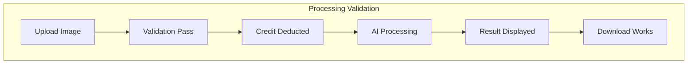

| Test Case                   | Expected Result                 | Validated |
| --------------------------- | ------------------------------- | --------- |
| Upload JPG image            | Accepted, preview shown         | [ ]       |
| Upload PNG image            | Accepted, preview shown         | [ ]       |
| Upload WEBP image           | Accepted, preview shown         | [ ]       |
| Upload GIF (invalid)        | Error: "Format not supported"   | [ ]       |
| Upload >5MB (free tier)     | Error: "File too large"         | [ ]       |
| Upload valid image, process | Result returned <60s            | [ ]       |
| Text preservation works     | Text remains sharp in output    | [ ]       |
| Before/after comparison     | Side-by-side display works      | [ ]       |
| Download processed image    | File downloads correctly        | [ ]       |
| 2x upscale                  | Output is 2x dimensions         | [ ]       |
| 4x upscale                  | Output is 4x dimensions         | [ ]       |
| Processing with 0 credits   | Blocked before API call         | [ ]       |
| AI API failure              | Graceful error, credit refunded | [ ]       |
| Fallback to OpenRouter      | Works when Gemini fails         | [ ]       |

### SEO Validation

| Test Case                     | Expected Result                 | Validated |
| ----------------------------- | ------------------------------- | --------- |
| Homepage has meta title       | Correct title in `<head>`       | [ ]       |
| Homepage has meta description | Description present             | [ ]       |
| OG tags present               | Facebook/Twitter cards work     | [ ]       |
| Sitemap.xml accessible        | Returns valid XML               | [ ]       |
| Robots.txt accessible         | Correct directives              | [ ]       |
| Canonical URLs set            | No duplicate content issues     | [ ]       |
| Lighthouse SEO score          | >90                             | [ ]       |
| Lighthouse Performance score  | >80                             | [ ]       |
| Mobile-friendly test          | Passes Google test              | [ ]       |
| Core Web Vitals               | LCP <2.5s, FID <100ms, CLS <0.1 | [ ]       |

### Deployment Validation

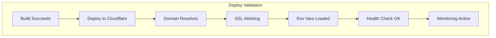

| Test Case                       | Expected Result                 | Validated |
| ------------------------------- | ------------------------------- | --------- |
| `npm run build` succeeds        | No errors                       | [ ]       |
| Push to main triggers deploy    | GitHub Action runs              | [ ]       |
| Cloudflare deployment completes | Site accessible                 | [ ]       |
| Custom domain works             | pixelperfect.app loads          | [ ]       |
| HTTPS enforced                  | HTTP redirects to HTTPS         | [ ]       |
| Environment variables loaded    | API keys work                   | [ ]       |
| `/api/health` returns 200       | Health check passes             | [ ]       |
| Sentry captures errors          | Test error appears in dashboard | [ ]       |
| Cloudflare Analytics active     | Traffic visible                 | [ ]       |
| Edge caching works              | Static assets cached            | [ ]       |

### Security Validation

| Test Case                        | Expected Result            | Validated |
| -------------------------------- | -------------------------- | --------- |
| CORS blocks unauthorized origins | Request rejected           | [ ]       |
| Rate limiting works              | 429 after limit exceeded   | [ ]       |
| SQL injection attempt            | Request sanitized/blocked  | [ ]       |
| XSS attempt in input             | Escaped/blocked            | [ ]       |
| JWT tampering detected           | Request rejected           | [ ]       |
| API without auth rejected        | 401 Unauthorized           | [ ]       |
| Stripe webhook without signature | 401 rejected               | [ ]       |
| Security headers present         | CSP, X-Frame-Options, etc. | [ ]       |

---

## SEO Roadmap

### Phase 1: Foundation (Month 1-3)

- [ ] **Technical SEO setup (meta, sitemap, robots)** (Week 6-7)
- [ ] **Landing page optimization** (Week 6-7)
- [ ] **4 foundation blog posts** (Week 7-8)
- [ ] **Google Search Console setup** (Week 7)
- [ ] **Google Analytics 4 setup** (Week 7)

**Foundation Blog Posts**:

1. "How to Upscale Images Without Losing Quality"
2. "AI Image Enhancement for E-commerce: Complete Guide"
3. "Best Free Image Upscalers in 2024 (Comparison)"
4. "How to Keep Text Sharp When Upscaling Product Photos"

### Phase 2: Growth (Month 4-8)

- [ ] **2 blog posts/week** (Ongoing)
- [ ] **10 competitor comparison pages** (Month 5-6)
- [ ] **5 use case landing pages** (Month 6-7)
- [ ] **Backlink outreach campaign** (Month 5-8)
- [ ] **Schema markup expansion** (Month 5)

**Comparison Pages**:

- PixelPerfect vs Topaz Gigapixel
- PixelPerfect vs Let's Enhance
- PixelPerfect vs Magnific AI
- PixelPerfect vs Upscale.media
- PixelPerfect vs Bigjpg
- PixelPerfect vs ImgUpscaler
- PixelPerfect vs Waifu2x
- PixelPerfect vs Adobe Enhance
- PixelPerfect vs VanceAI
- PixelPerfect vs Icons8 Upscaler

**Use Case Landing Pages**:

- `/use-cases/ecommerce` - Product photo enhancement
- `/use-cases/real-estate` - Property listing images
- `/use-cases/content-creators` - Social media graphics
- `/use-cases/photographers` - Photo restoration
- `/use-cases/print` - Print-ready upscaling

### Phase 3: Authority (Month 9-12)

- [ ] **Guest posting campaign** (Month 9-10)
- [ ] **User showcase/gallery** (Month 10)
- [ ] **Case studies (3-5)** (Month 11)
- [ ] **Industry partnerships** (Month 11-12)
- [ ] **Video content (YouTube)** (Month 12)

### SEO Metrics

| Metric                    | Phase 1 | Phase 2  | Phase 3   |
| ------------------------- | ------- | -------- | --------- |
| Organic traffic           | 500/mo  | 5,000/mo | 20,000/mo |
| Indexed pages             | 10      | 50       | 100+      |
| Domain authority          | 10      | 25       | 40        |
| Keyword rankings (top 10) | 5       | 25       | 100       |
| Backlinks                 | 20      | 100      | 500       |

---

## Deployment Roadmap

### Phase 1: MVP Deployment

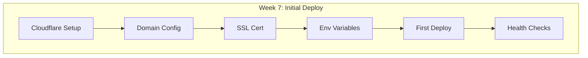

- [ ] **Cloudflare Pages project** (Day 1)
- [ ] **`@cloudflare/next-on-pages` setup** (Day 1)
- [ ] **`wrangler.toml` configuration** (Day 1)
- [ ] **Custom domain (pixelperfect.app)** (Day 2)
- [ ] **DNS configuration** (Day 2)
- [ ] **SSL/TLS certificate** (Day 2)
- [ ] **Production environment variables** (Day 2)
- [ ] **GitHub Actions workflow** (Day 3)
- [ ] **`/api/health` endpoint** (Day 3)
- [ ] **Sentry error tracking** (Day 3)
- [ ] **Cloudflare Analytics** (Day 3)

### CI/CD Pipeline

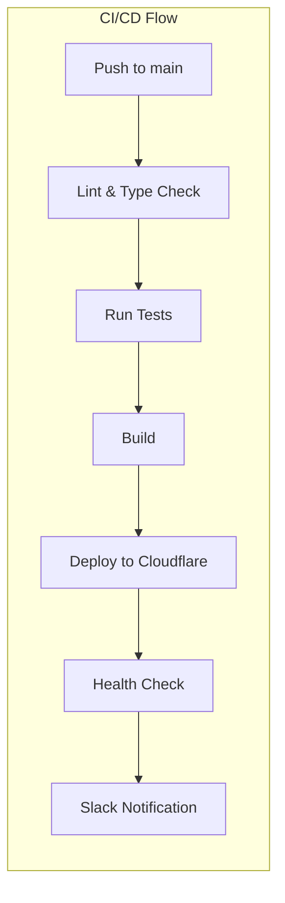

**GitHub Actions Workflow**:

```yaml
# Triggers on push to main
# 1. Install dependencies
# 2. Run linting (ESLint)
# 3. Run type checking (tsc)
# 4. Run tests (if any)
# 5. Build with next build
# 6. Deploy via wrangler pages deploy
# 7. Verify health endpoint
# 8. Notify on success/failure
```

### Deployment Environments

| Environment | URL                          | Purpose           |
| ----------- | ---------------------------- | ----------------- |
| Development | localhost:3000               | Local development |
| Preview     | pr-\*.pixelperfect.pages.dev | PR previews       |
| Production  | pixelperfect.app             | Live site         |

### Rollback Strategy

| Scenario                 | Action                         |
| ------------------------ | ------------------------------ |
| Failed deployment        | Auto-rollback to previous      |
| Bug in production        | Manual rollback via Cloudflare |
| Database migration issue | Restore from backup            |

---

## Phase 2: Growth (Months 4-8)

**Goal**: Scale user base, launch integrations, achieve break-even.

**Target Metrics**:

- 10,000 free users
- 200-500 paying customers
- $5K-15K MRR
- 100+ Shopify app installs
- Break-even achieved

### Milestone 2.1: Enhanced Processing (Month 4)

- [ ] **Batch processing (up to 50 images)** (P1)
- [ ] **Portrait mode enhancement** (P1)
- [ ] **Product mode (e-commerce focus)** (P1)
- [ ] **Processing mode selection** (P1)
- [ ] **Batch ZIP download** (P1)
- [ ] **HEIC support** (P1)

### Milestone 2.2: Business Features (Month 5-6)

- [ ] **Business tier ($99/2,500 credits)** (P2)
- [ ] **API access for Business tier** (P2)
- [ ] **API documentation** (P2)
- [ ] **Advanced Rate limiting by tier (Upstash)** (P2)
- [ ] **Annual billing (20% discount)** (P2)
- [ ] **Credit rollover (6x monthly)** (P1)

### Milestone 2.3: Shopify Integration (Month 6-7)

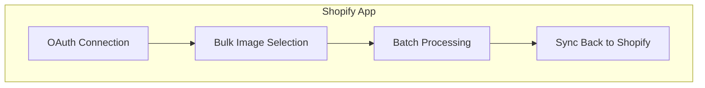

- [ ] **Shopify app foundation** (P2)
- [ ] **OAuth integration** (P2)
- [ ] **Bulk operations API** (P2)
- [ ] **Product image sync** (P2)
- [ ] **App store listing** (P2)

---

## Phase 3: Scale (Months 9-12)

**Goal**: Market leadership, profitability, enterprise readiness.

**Target Metrics**:

- 50,000+ free users
- 1,000+ paying customers
- $25K-50K MRR
- Self-sustaining profitability
- 99.9% uptime

### Milestone 3.1: Advanced Processing (Month 9-10)

- [ ] **8x upscaling** (P2)
- [ ] **16x upscaling** (P3)
- [ ] **Custom resolution targeting** (P2)
- [ ] **Priority processing (A100 GPU)** (P3)
- [ ] **Advanced queue management** (P2)

### Milestone 3.2: Platform Expansion (Month 10-11)

- [ ] **WordPress plugin** (P3)
- [ ] **Browser extensions** (P3)
- [ ] **Team/multi-user accounts** (P3)
- [ ] **Admin dashboard** (P3)

### Milestone 3.3: Growth Features (Month 11-12)

- [ ] **Referral program (10-20% incentive)** (P3)
- [ ] **User showcase gallery** (P3)
- [ ] **Advanced analytics dashboard** (P3)

---

## Priority Classification

### P0 - Must Have (MVP Launch)

Critical for product to function. No launch without these.

| Feature                | Phase | Description         |
| ---------------------- | ----- | ------------------- |
| 2x/4x Upscaling        | 1     | Core functionality  |
| Text/Logo Preservation | 1     | Hero differentiator |
| Drag & Drop Upload     | 1     | Basic UX            |
| Credit System          | 1     | Monetization        |
| Stripe Billing         | 1     | Payment processing  |
| Authentication         | 1     | User management     |
| Before/After Compare   | 1     | Result display      |
| Mobile Responsive      | 1     | 40%+ traffic        |
| SEO Foundation         | 1     | Discoverability     |
| Cloudflare Deploy      | 1     | Production hosting  |

### P1 - Should Have (Weeks 3-4)

High priority for competitive positioning.

| Feature          | Phase | Description            |
| ---------------- | ----- | ---------------------- |
| Batch Processing | 1/2   | E-commerce requirement |
| Google OAuth     | 1     | Reduced friction       |
| Portrait Mode    | 1/2   | Popular use case       |
| Credit Rollover  | 2     | Churn reduction        |
| No Watermark     | 1     | Differentiator         |
| Blog Content     | 1/2   | SEO growth             |

### P2 - Nice to Have (Phase 2)

Valuable additions for growth.

| Feature          | Phase | Description          |
| ---------------- | ----- | -------------------- |
| Business Tier    | 2     | Enterprise segment   |
| API Access       | 2     | Developer segment    |
| Shopify App      | 2     | Distribution channel |
| 8x Upscaling     | 2/3   | Power users          |
| Annual Billing   | 2     | Cash flow            |
| Comparison Pages | 2     | SEO authority        |

### P3 - Future (Phase 3+)

Advanced features for scale.

| Feature          | Phase | Description      |
| ---------------- | ----- | ---------------- |
| 16x Upscaling    | 3     | Niche use case   |
| WordPress Plugin | 3     | Content creators |
| Team Accounts    | 3     | Enterprise       |
| Referral Program | 3     | Growth lever     |
| Self-Hosting     | 3     | High volume      |

---

## Success Metrics

### User Growth

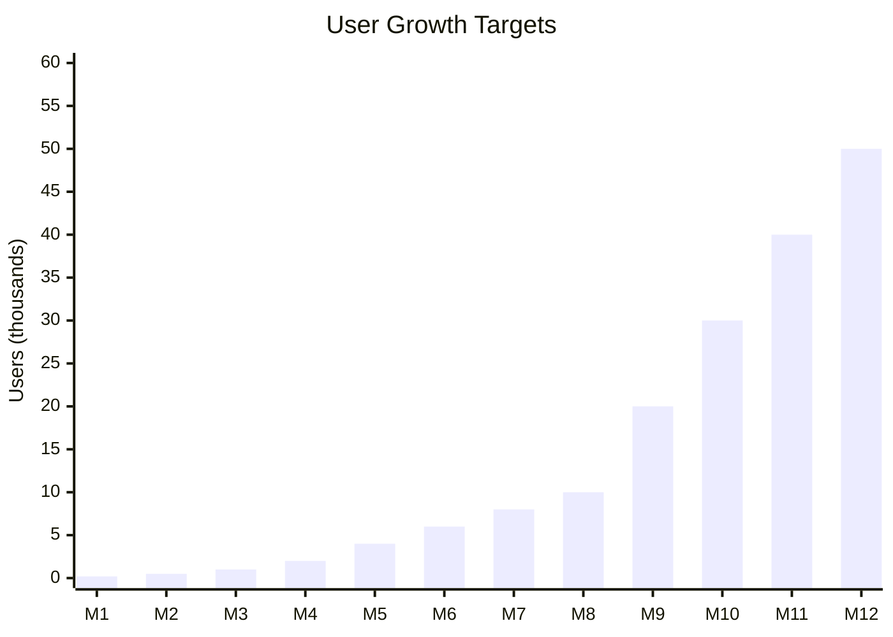

| Phase         | Free Users | Paid Customers | Conversion |
| ------------- | ---------- | -------------- | ---------- |
| Phase 1 (M3)  | 1,000      | 20-50          | 2-5%       |
| Phase 2 (M8)  | 10,000     | 200-500        | 2-5%       |
| Phase 3 (M12) | 50,000     | 1,000+         | 2-5%       |

### Revenue Targets

| Phase   | MRR Target | Infrastructure Cost | Net Margin |
| ------- | ---------- | ------------------- | ---------- |
| Phase 1 | $500-1,500 | $30-70/mo           | 85%+       |
| Phase 2 | $5K-15K    | $50-200/mo          | 90%+       |
| Phase 3 | $25K-50K   | $200-500/mo         | 95%+       |

### Product Metrics

| Metric           | Target                     | Measurement            |
| ---------------- | -------------------------- | ---------------------- |
| Processing Speed | 30-60s                     | End-to-end time        |
| Uptime           | 99.5% (MVP), 99.9% (Scale) | Monitoring             |
| API Response     | <100ms                     | Excluding processing   |
| Lighthouse SEO   | >90                        | Google PageSpeed       |
| NPS Score        | 45-55                      | User surveys           |
| Churn Rate       | <5%/month                  | Subscription analytics |

---

## Risk Mitigation

| Risk                  | Impact | Mitigation                                   |
| --------------------- | ------ | -------------------------------------------- |
| API price increase    | High   | Multi-provider strategy, OpenRouter fallback |
| Quality inconsistency | High   | User feedback system, refund policy          |
| Low conversion        | High   | A/B testing, upgrade prompt optimization     |
| Competitor parity     | Medium | Text preservation moat, rapid iteration      |
| Processing delays     | High   | Queue management, retry logic                |
| High CAC              | Medium | Focus on SEO, PLG optimization               |
| Deployment failures   | Medium | Rollback strategy, health checks             |
| SEO penalties         | Medium | White-hat practices only                     |

---

## Current Status

### Completed

- [x] Business model canvas
- [x] Feature requirements documentation
- [x] Technical PRDs (7 documents)
- [x] Technical documentation
- [x] Next.js 15 App Router setup
- [x] Database schema implementation (profiles, subscriptions, RLS)
- [x] Authentication setup (email/password + Google OAuth)
- [x] Gemini API integration with text preservation
- [x] Image processing pipeline (upload, validate, process, download)
- [x] Credit system (increment/decrement RPC functions)
- [x] Stripe integration (checkout, webhooks, pricing tiers)
- [x] SEO foundation (metadata, sitemap, robots.txt, JSON-LD)
- [x] Landing page with interactive demo
- [x] Wrangler configuration for Cloudflare Pages
- [x] Health check endpoint
- [x] Rate limiting middleware
- [x] Security headers

### In Progress

- [ ] Production deployment to Cloudflare Pages
- [ ] Domain configuration (pixelperfect.app)

### Next Up

- [ ] Email system (Resend + React Email)
- [ ] Sentry error monitoring
- [ ] 4 foundation blog posts
- [ ] Lighthouse score optimization
- [ ] Production environment variables
- [ ] CI/CD deployment workflow

---

## Changelog

| Date       | Version | Changes                                                      |
| ---------- | ------- | ------------------------------------------------------------ |
| 2024-01    | 1.0     | Initial roadmap creation                                     |
| 2024-01    | 1.1     | Added validation checklists, SEO roadmap, deployment roadmap |
| 2025-11-21 | 1.2     | Updated completion status based on codebase audit            |
