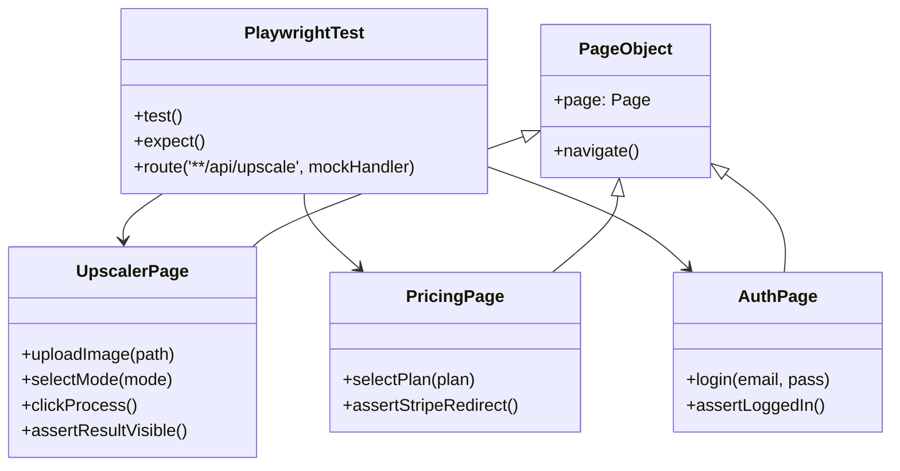
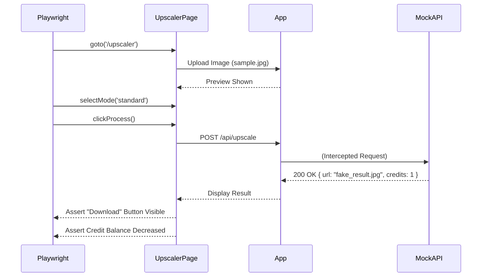

# Implementation Plan - E2E Testing Strategy & Hotspots

🧠 Principal Architect Mode: Engaged. Analyzing testing coverage gaps for PixelPerfect SaaS...

## 1. Context Analysis

### 1.1 Files Analyzed

- `docs/technical/user-flow.md`: Defined critical user journeys (Upload, Auth, Upgrade).
- `docs/technical/systems/image-processing.md`: Understood the core "Hero" feature logic.
- `app/upscaler/page.tsx`: Identified the main interaction point (`Workspace`).
- `playwright.config.ts`: Confirmed test infrastructure.
- `package.json`: Validated stack (Next.js 15, Supabase, Stripe).

### 1.2 Component & Dependency Overview

```mermaid
graph TD
    Test[Playwright Runner] -->|E2E| App[Application Boundary]

    subgraph "Hotspots (Critical Paths)"
    App --> Upscaler[Image Processing Workspace]
    App --> Auth[Authentication & Session]
    App --> Billing[Credits & Subscriptions]
    App --> Dashboard[User History & Profile]
    end

    Upscaler --> API[Next.js API Routes]
    API --> AI[Gemini/OpenRouter (Mocked)]
    Billing --> Stripe[Stripe Test Mode]
    Auth --> Supabase[Supabase Auth]
```

### 1.3 Current Behavior Summary

- **Infrastructure:** Playwright is set up but likely contains placeholder tests.
- **Core Logic:** The application revolves around the `Workspace` component where users upload images, select modes (Standard, Enhanced), and consume credits.
- **Risk:** The "Hero" feature (Image Upscaling) involves complex async states (Upload -> Processing -> Result) and credit deductions, which are prone to regressions.

### 1.4 Problem Statement

The application lacks rigorous automated verification for its revenue-generating flows (Image Upscaling, Credit Purchase) and critical user journeys, creating a high risk of shipping broken core features.

---

## 2. Proposed Solution

### 2.1 Strategy Summary

- **Tooling:** **Playwright** for E2E and Integration tests.
- **Pattern:** **Page Object Model (POM)** for all critical pages (`UpscalerPage`, `PricingPage`, `LoginPage`).
- **Mocking Strategy:**
  - **AI API:** **MUST** be mocked to avoid burning real credits/money during CI runs.
  - **Stripe:** Use Stripe Test Mode and mocked webhooks.
  - **Supabase:** Use a dedicated test user seeded via API.
- **Scope:** Focus on the "Happy Paths" that directly impact user value and revenue.

### 2.2 Testing Architecture (Mermaid)



### 2.3 Key Technical Decisions

- **Mocking AI Responses (UI Layer):**
  - **Primary Strategy:** Intercept `/api/upscale` network requests in Playwright.
  - **Why:** This completely bypasses the Next.js backend and Gemini API, ensuring 0% cost and 100% determinism for UI tests.
  - **Implementation:** `page.route('**/api/upscale', ...)` returns a fixed JSON response.
- **Mocking AI Responses (Server Layer - Optional):**
  - **Secondary Strategy:** If testing API logic directly (`tests/api/`), use **Module Alias** or **Dependency Injection** to swap `GoogleGenAI` with a mock.
  - **Note:** For this E2E plan, we prioritize the UI Layer mock.
- **Test Data:** Use `tests/helpers/fixtures.ts` to inject consistent mock data.
- **Visual Regression:** Limited use for the "Workspace" to catch layout shifts.

---

### 2.4 Runtime Execution Flow (Upscaling Test)



---

## 3. Detailed Implementation Spec (Hotspots)

### A. Hotspot 1: Core Image Processing (The "Hero" Flow)

- **Risk Level:** Critical (Core Value)
- **File:** `tests/e2e/upscaler.e2e.spec.ts`
- **Mocking Requirement:** STRICT. Must use `page.route` to intercept `/api/upscale`.
- **Scenarios:**
  1.  **Guest Flow:** Upload -> Process -> Login Wall (if applicable) or Free Tier success.
  2.  **Auth Flow:** Login -> Upload -> Process -> Success.
  3.  **Validation:** Uploading a non-image file or >25MB file triggers error UI.
  4.  **Insufficient Credits:** Mock API returning 402 -> Verify "Upgrade" modal appears.
- **POM:** `tests/pages/UpscalerPage.ts`

### B. Hotspot 2: Authentication & Session

- **Risk Level:** High (Blocker)
- **File:** `tests/e2e/auth.e2e.spec.ts`
- **Scenarios:**
  1.  **Login/Signup:** Verify Supabase Auth flow (using Email/Password for stability).
  2.  **Protected Routes:** Accessing `/dashboard` while logged out redirects to `/login`.
  3.  **Logout:** Verify session clear.
- **POM:** `tests/pages/LoginPage.ts`

### C. Hotspot 3: Billing & Credits

- **Risk Level:** Critical (Revenue)
- **File:** `tests/e2e/billing.e2e.spec.ts`
- **Scenarios:**
  1.  **Plan Selection:** Clicking "Buy Credits" or "Upgrade" redirects to Stripe (or mock checkout).
  2.  **UI Feedback:** After a successful (mocked) payment webhook, verify the Credit Balance in the header updates.
- **POM:** `tests/pages/PricingPage.ts`

---

## 4. Step-by-Step Execution Plan

### Phase 1: Setup & Mocks

- [x] **Fixtures:** Create `tests/fixtures/sample.jpg` (small 100x100px) and `tests/fixtures/ai-success.json`.
- [x] **Base POM:** Create `tests/pages/BasePage.ts`.
- [x] **Upscaler POM:** Implement `uploadImage()` and `processImage()` helpers in `tests/pages/UpscalerPage.ts`.

### Phase 2: Critical Path Implementation

- [x] **Upscaler Test:** Implement `upscaler.e2e.spec.ts` with network interception for `/api/upscale`.
- [x] **Auth Test:** Implement `auth.e2e.spec.ts`.

### Phase 3: Edge Cases & Revenue

- [x] **Billing Test:** Implement `billing.e2e.spec.ts` (focus on UI triggers, not real credit card entry).
- [x] **Error Handling:** Add test case for API 500 (AI Service Down) -> Verify User Friendly Error Message.

---

## 5. Testing Strategy

### Unit vs E2E

- **Unit:** `src/lib/pixelperfect/prompt-utils.ts` (Prompt generation logic), `src/utils/image-validation.ts`.
- **E2E:** The full user flow (Clicking buttons, waiting for async results, navigation).

### Edge Cases (Markdown Table)

| Scenario           | Expected Behavior                                 | Test Type        |
| ------------------ | ------------------------------------------------- | ---------------- |
| AI Service Timeout | "Processing taking longer than expected..." toast | E2E (Mock delay) |
| Zero Credits       | Block processing + Show Pricing Modal             | E2E (Mock 402)   |
| Invalid File Type  | "Invalid file format" error message               | E2E              |

---

## 6. Acceptance Criteria

- [x] `npm run test:e2e` passes 100%.
- [x] Upscaler tests **DO NOT** make real calls to Gemini/OpenRouter (verified by checking usage logs or network tab during debug).
- [x] **Mock Verification:**
  - **Frontend Tests:** Ensure `page.route` handles all `/api/upscale` traffic.
  - **API Tests (If added):** Must mock `GoogleGenAI` constructor or use a fake API key that fails safely if not mocked.
- [x] Critical flows (Auth, Upscale, Upgrade) are covered.
- [x] Tests run reliably (retries configured for network flakes).

---

## 7. Verification & Rollback

- **Success Criteria:** CI pipeline passes on PR.
- **Rollback:** Revert to previous Playwright config/tests if strictly failing.
