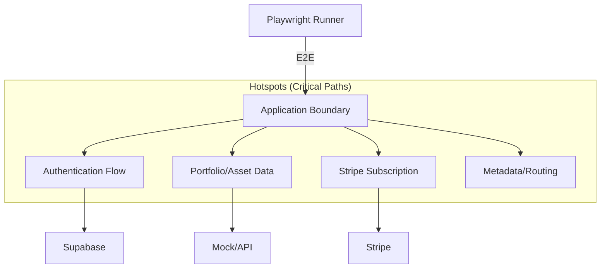
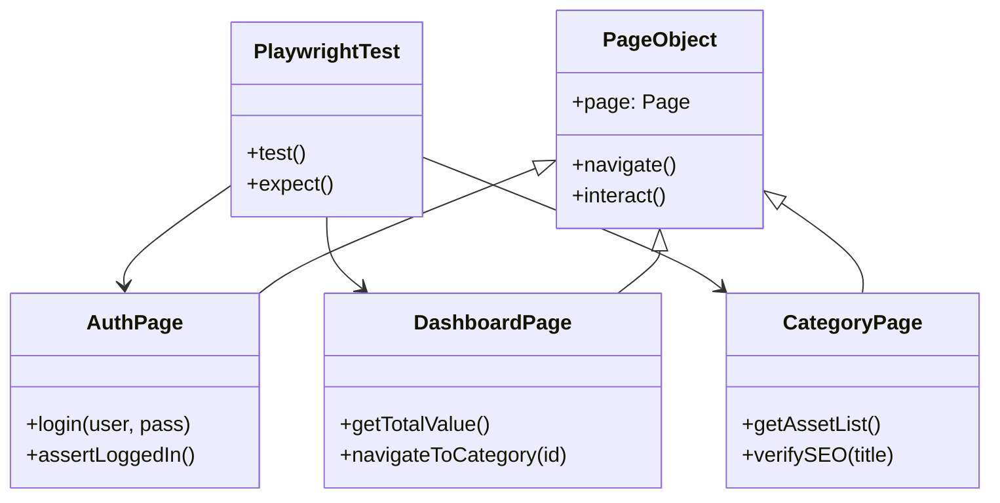
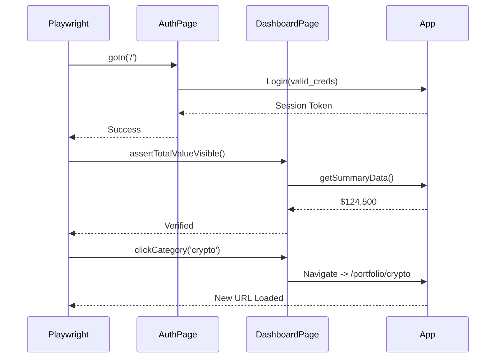

# Implementation Plan - E2E Testing Strategy & Hotspots

🧠 Principal Architect Mode: Engaged. Analyzing testing coverage gaps...

## 1. Context Analysis

### 1.1 Files Analyzed

- `package.json`: Confirmed Next.js 15 + Playwright setup.
- `src/views/SummaryView.tsx`: Core dashboard logic.
- `src/views/CategoryView.tsx`: Detailed portfolio logic.
- `tests/e2e/auth.e2e.spec.ts`: Existing minimal auth coverage.
- `tests/e2e/billing.e2e.spec.ts`: Existing billing placeholder.
- `src/App.tsx`: Current entry point (Vite).
- `playwright.config.ts`: Current test configuration.

### 1.2 Component & Dependency Overview

### 1.3 Current Behavior Summary

- **Infrastructure:** Playwright is installed and configured (`playwright.config.ts`) for Chromium and API testing.
- **Coverage:** Minimal. `auth.e2e.spec.ts` only checks if the login modal appears. `billing.e2e.spec.ts` exists but coverage is unknown.
- **Application State:** Hybrid. Logic resides in `src/views` (Vite-style), but the project is transitioning to Next.js App Router (`src/app`).
- **Risk:** The migration to Next.js App Router introduces high regression risks for routing, state preservation, and SEO tags.

### 1.4 Problem Statement

The application lacks rigorous automated verification for its core value loops (Portfolio Management) and critical business functions (Auth, Billing), creating a high risk of regression during the Next.js migration.

---

## 2. Proposed Solution

### 2.1 Strategy Summary

- **Tooling:** Standardize on **Playwright** for all E2E and Integration tests.
- **Pattern:** Enforce **Page Object Model (POM)** to decouple tests from UI implementation details (critical during migration).
- **Scope:** Focus on "Hotspots" — areas where failure causes data loss, revenue loss, or complete blocker.
- **Validation:** Tests must run against both the current Vite build and the future Next.js build to ensure parity.

### 2.2 Testing Architecture (Mermaid)

### 2.3 Key Technical Decisions

- **POM Enforcement:** All selectors must live in `tests/pages/`. No `page.locator('.class')` inside spec files.
- **Test Data:** Use `tests/helpers/fixtures.ts` to inject consistent mock data for Portfolio tests, ensuring deterministic results (avoid flaky tests relying on external APIs).
- **Visual Regression:** Limited use for the "Summary" view to catch layout shifts during CSS migration.

### 2.4 Data Model Implications

- **No Schema Changes.**
- **Test Data:** Needs a dedicated `mock-user` in Supabase and `mock-subscription` in Stripe Test Mode.

---

### 2.5 Runtime Execution Flow (Happy Path)

---

## 3. Detailed Implementation Spec (Hotspots)

### A. Hotspot 1: Authentication & Session

- **Risk Level:** Critical (Blocker)
- **File:** `tests/e2e/auth.e2e.spec.ts`
- **Scenarios:**
  1.  **Login Success:** Valid credentials redirect to Dashboard.
  2.  **Login Failure:** Invalid credentials show error toast.
  3.  **Persisted Session:** Reloading page maintains login state.
  4.  **Logout:** Clears session and redirects to landing.
- **POM:** Enhance `tests/pages/LoginPage.ts` with `login(email, pass)` and `logout()`.

### B. Hotspot 2: Portfolio Summary (Dashboard)

- **Risk Level:** High (Core Value)
- **File:** `tests/e2e/dashboard.e2e.spec.ts` (New)
- **Scenarios:**
  1.  **Data Loading:** Verify "Total Net Worth" is a valid number/currency string.
  2.  **Category Breakdown:** Verify all 3 categories (Summary, Crypto, Stocks) are clickable.
  3.  **Empty State:** (If possible) Verify UI when user has 0 assets.
- **POM:** Create `tests/pages/DashboardPage.ts`.

### C. Hotspot 3: Category Detail & Navigation

- **Risk Level:** High (Migration Risk)
- **File:** `tests/e2e/category.e2e.spec.ts` (New)
- **Scenarios:**
  1.  **Routing:** Clicking "Crypto" tab changes URL to `/portfolio/crypto` (Next.js target) or updates active state (Vite current).
  2.  **Asset List:** Verify list contains items (e.g., "Bitcoin", "Ethereum").
  3.  **SEO Verification:** Verify `<title>` tag updates to "Crypto Portfolio | PixelPerfect".
- **POM:** Create `tests/pages/CategoryPage.ts`.

### D. Hotspot 4: Billing (Stripe)

- **Risk Level:** Critical (Revenue)
- **File:** `tests/e2e/billing.e2e.spec.ts`
- **Scenarios:**
  1.  **Upgrade Flow:** Clicking "Upgrade" opens Stripe Checkout (mocked or test mode).
  2.  **Gated Content:** Verify non-pro users cannot access "Pro" charts/features.

---

## 4. Step-by-Step Execution Plan

### Phase 1: Foundation (POM Setup)

- [ ] Create/Update `tests/pages/BasePage.ts` (Shared helpers).
- [ ] Implement `tests/pages/LoginPage.ts` (Complete selectors).
- [ ] Implement `tests/pages/DashboardPage.ts` (Summary view selectors).

### Phase 2: Critical Path Coverage

- [ ] **Auth:** Expand `auth.e2e.spec.ts` to cover Login/Logout/Persist.
- [ ] **Dashboard:** Create `dashboard.e2e.spec.ts` for verifying data display.
- [ ] **Navigation:** Create `category.e2e.spec.ts` to test switching tabs/routes.

### Phase 3: Migration Safeguards

- [ ] **SEO:** Add checks for Metadata (Title/Description) in `category.e2e.spec.ts`.
- [ ] **API:** Add `tests/api/data.spec.ts` to verify the new `lib/data.ts` logic (if applicable).

---

## 5. Testing Strategy

### Unit Tests vs E2E

- **Unit:** Logic in `utils/*.ts` (e.g., currency formatting, asset summation).
- **E2E:** User flows, routing, auth integration, data rendering.

### Edge Cases (Markdown Table)

| Scenario      | Expected Behavior           | Test Type                |
| ------------- | --------------------------- | ------------------------ |
| Slow Network  | Loading skeletons displayed | E2E (Network throttling) |
| Invalid Route | 404 Page (Next.js default)  | E2E                      |
| API Failure   | Error Toast / Retry Button  | E2E (Mocked 500)         |

---

## 6. Acceptance Criteria

- [ ] `npm run test:e2e` passes with 100% success rate.
- [ ] Page Object Models exist for Login, Dashboard, and Category views.
- [ ] "Smoke Suite" defined (Login -> Check Dashboard -> Logout) runs in <30s.
- [ ] CI pipeline configured to run these tests on PR.

---

## 7. Verification & Rollback

- **Success Criteria:**
  - All critical paths covered.
  - Tests pass on both local Vite dev and Next.js build.
- **Rollback Plan:**
  - If tests are flaky, mark as `.skip` and create a ticket to fix.
  - Do not merge broken tests into main.
