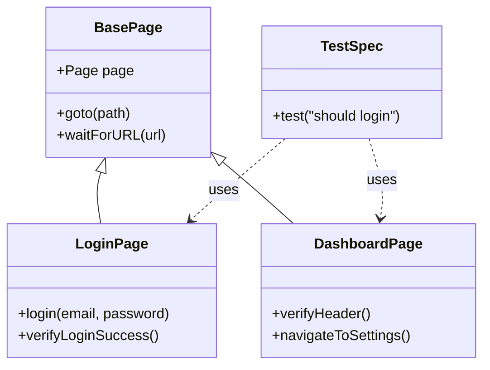
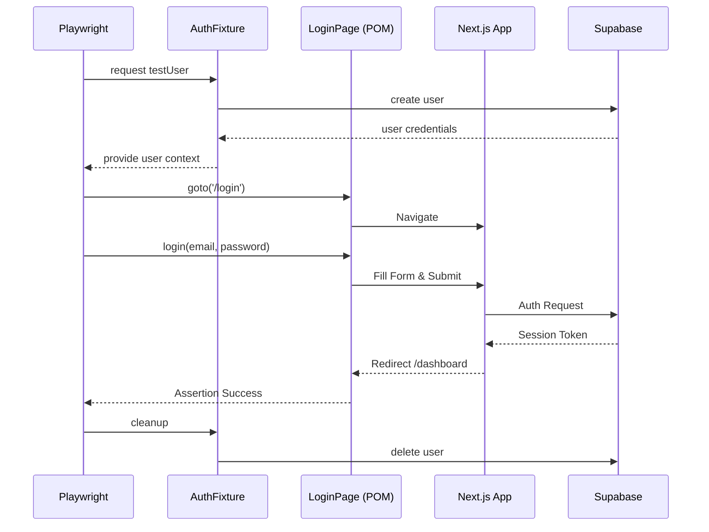

# Plan: Playwright E2E Integration Architecture

## 1. Context Analysis

### 1.1 Files Analyzed

- `/home/joao/projects/myimageupscaler.com/package.json`
- `/home/joao/projects/myimageupscaler.com/playwright.config.ts`
- `/home/joao/projects/myimageupscaler.com/tests/e2e/auth.spec.ts`
- `/home/joao/projects/myimageupscaler.com/tests/helpers/auth.ts`
- `/home/joao/projects/myimageupscaler.com/next.config.js`
- `/home/joao/projects/myimageupscaler.com/vite.config.ts`

### 1.2 Component & Dependency Overview

```mermaid
graph TD
    A[Playwright Runner] --> B[Test Specs /tests/e2e/*.spec.ts]
    B --> C[Page Objects /tests/pages/*.ts]
    B --> D[Fixtures /tests/helpers/*.ts]
    C --> E[Next.js App (localhost:3000)]
    D --> F[Supabase Auth API]
    E --> F
```

### 1.3 Current Behavior Summary

- Playwright is installed and configured to use `http://localhost:3000`, but individual specs open `localhost:5173`.
- Minimal existing tests rely on hardcoded selectors and manual DOM navigation, violating SRP/DRY.
- A `tests/helpers/auth.ts` fixture already creates Supabase users for auth flows.
- No dedicated page abstractions, meaning UI knowledge is duplicated across specs.

### 1.4 Problem Statement

Playwright FE tests are brittle and inconsistent due to hardcoded URLs and duplicated UI logic, hindering reliable regression coverage.

## 2. Proposed Solution

### 2.1 Architecture Summary

- Introduce a Page Object Model (POM) for UI interactions to keep each page’s selectors and actions grouped (SRP + DRY).
- Rely on `playwright.config.ts` `baseURL` for navigation and use relative paths to avoid port drift.
- Extend fixtures to manage authenticated users via Supabase, keeping tests setup-focused and simple (KISS).
- Keep each spec self-contained, using the proper fixtures and POMs for readability and reuse.

### 2.2 Architecture Diagram



### 2.3 Key Technical Decisions

- **Pattern:** Page Object Model keeps UI locators and interactions centralized, preventing duplication.
- **Selectors:** Prefer accessibility-driven selectors (`getByRole`, `getByLabel`) for resilient tests.
- **State Management:** Use existing Supabase fixtures to create and clean up users per test.
- **Navigation:** Always call `page.goto('/relative-path')` so the shared `baseURL` governs the actual host/port.

### 2.4 Data Model Changes

No Data Changes.

### 2.5 Runtime Execution Flow



## 3. Detailed Implementation Spec

### A. `tests/pages/BasePage.ts` (New)

- **Changes Needed:** Create helper with shared navigation/assertion wrappers.
- **Pseudo-code:**

```typescript
export class BasePage {
  constructor(protected readonly page: Page) {}
  async goto(path: string) {
    await this.page.goto(path);
    await this.page.waitForLoadState('networkidle');
  }
}
```

- **Justification:** Ensures all POM classes share a consistent navigation contract.

### B. `tests/pages/LoginPage.ts` (New)

- **Changes Needed:** Encapsulate login form selectors/actions using `getByRole`.
- **Pseudo-code:**

```typescript
export class LoginPage extends BasePage {
  async login(email: string, password: string) {
    await this.page.getByLabel('Email').fill(email);
    await this.page.getByLabel('Password').fill(password);
    await this.page.getByRole('button', { name: /sign in/i }).click();
  }
  async assertLoginSuccess() {
    await expect(this.page.getByRole('heading', { name: /dashboard/i })).toBeVisible();
  }
}
```

- **Justification:** Keeps authentication flow logic isolated and reusable across specs.

### C. `tests/e2e/auth.spec.ts`

- **Changes Needed:** Replace DOM-heavy steps with POM usage and fixture data.
- **Pseudo-code:**

```typescript
test('user can sign in', async ({ page, testUser }) => {
  const login = new LoginPage(page);
  await login.goto('/login');
  await login.login(testUser.email, 'test-password-123');
  await login.assertLoginSuccess();
});
```

- **Justification:** Reduces duplication, references only relative paths, and relies on fixture data.

### D. `tests/helpers/auth.ts`

- **Changes Needed:** Ensure exported fixtures align with new tests. No new logic required unless additional helpers are needed.

## 4. Step-by-Step Execution Plan

### Phase 1: Foundation (POM Setup)

- [ ] Create `tests/pages` directory and `BasePage.ts`.
- [ ] Implement `LoginPage.ts` inheriting `BasePage`.

### Phase 2: Refactoring

- [ ] Refactor `tests/e2e/auth.spec.ts` to use `LoginPage` and `testUser`.
- [ ] Remove hardcoded URLs from specs and rely on `baseURL` in `playwright.config.ts`.

### Phase 3: Expansion

- [ ] Add `DashboardPage.ts` to cover protected route flows.
- [ ] Add spec(s) for authorized user behaviors via fixtures.

## 5. Testing Strategy

### Integration / E2E Tests

- Sign-in happy path via `LoginPage` + Supabase fixture.
- Authenticated guard access to dashboard or settings.

### Edge Cases

| Scenario                 | Expected Behavior             |
| ------------------------ | ----------------------------- |
| Invalid credentials      | Login error message shown     |
| Network failure on login | Graceful toast or modal error |
| Token expiry mid-flow    | Redirect back to login        |

## 6. Acceptance Criteria

- [ ] `npm run test:e2e` passes with relative navigation and no hardcoded ports.
- [ ] All selectors are encapsulated in POM classes.
- [ ] Supabase fixtures still clean up created users.
- [ ] Tests remain single-responsibility and avoid repeated DOM queries.

## 7. Verification & Rollback

- **Success:** E2E suite completes locally within minutes with clean playbooks.
- **Rollback:** Delete new POM files, restore `auth.spec.ts` to manual selectors.
