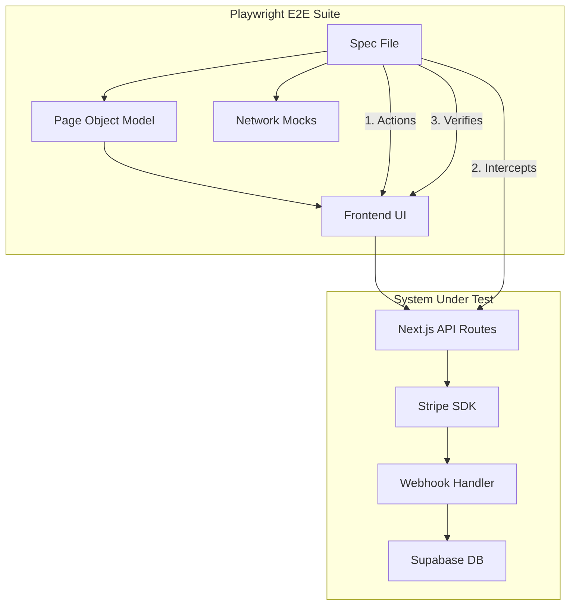
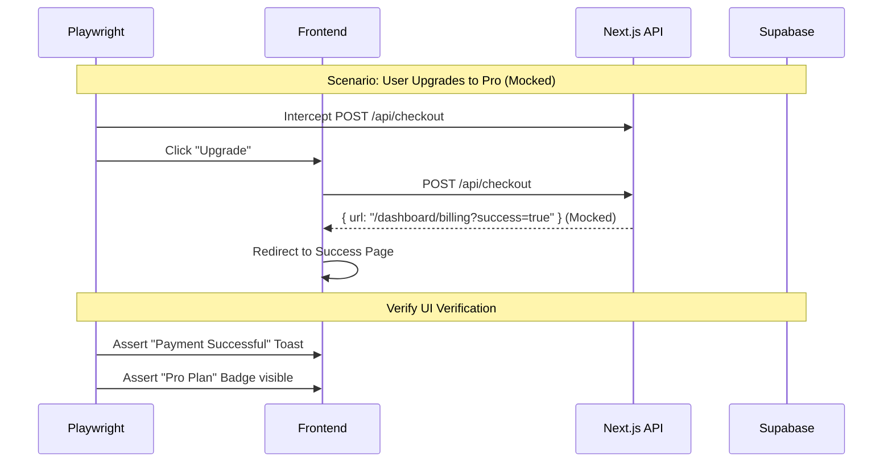

# Implementation Plan - Payment/Billing System E2E Testing

## 1. Context Analysis

### 1.1 Files Analyzed

- `playwright.config.ts`
- `tests/e2e/auth.e2e.spec.ts`
- `tests/pages/LoginPage.ts`
- `src/config/stripe.ts`
- `app/api/webhooks/stripe/route.ts`
- `docs/technical/systems/billing.md`

### 1.2 Component & Dependency Overview

### 1.3 Current Behavior Summary

- **Billing System:** Fully implemented (Credits, Subscriptions, Stripe integration).
- **Testing:** Playwright is configured with a Page Object Model (POM) pattern.
- **Gap:** No automated tests exist for the billing flows. Testing is currently manual and error-prone.
- **Risk:** Regressions in billing logic (e.g., credits not updating, subscription status failing) directly impact revenue.

### 1.4 Problem Statement

The billing system lacks automated End-to-End (E2E) verification, creating a high risk of revenue-impacting regressions during deployments. We need a robust testing strategy that validates the purchase flow without relying on flaky external Stripe UI automation.

---

## 2. Proposed Solution

### 2.1 Architecture Summary

- **Hybrid Testing Strategy:**
  - **Frontend E2E:** Mock the Stripe Checkout Session creation to return a direct redirect to the success URL. This validates the _application's_ handling of the success state (UI updates, toasts) without interacting with the external Stripe hosted page.
  - **API Integration:** Test the Webhook endpoint directly with simulated Stripe events to guarantee database correctness (credits added, subscription status updated).
- **Page Object Model:** Extend the existing POM pattern with `BillingPage` and `PricingPage`.
- **Database Seeding:** Use Supabase Admin client in test setup to seed test users with specific states (e.g., free user, pro user).

### 2.2 Architecture Diagram

### 2.3 Key Technical Decisions

- **Mocking Stripe UI:** We explicitly REJECT automating the Stripe Hosted Checkout page. It is brittle, slow, and tests Stripe's platform rather than our code.
- **Supabase Test Helpers:** We will create a `TestDataManager` helper to programmatically inject credits or subscriptions directly into the DB for setup/teardown, avoiding UI-based setup.
- **Playwright Fixtures:** Custom fixtures to provide logged-in contexts with different subscription tiers.

### 2.4 Data Model Changes

- **No Data Changes.** This is a testing-only implementation.

---

## 3. Detailed Implementation Spec

### A. `tests/helpers/test-data-manager.ts` (New)

- **Purpose:** Helper class to interact with Supabase directly for test setup.
- **Methods:**
  - `createTestUser()`: Creates a fresh auth user.
  - `setSubscriptionStatus(userId, status)`: Manually sets subscription state.
  - `addCredits(userId, amount)`: Manually adds credits.
  - `cleanupUser(userId)`: Deletes test data.

### B. `tests/pages/BillingPage.ts` (New)

- **Purpose:** Encapsulate Billing Dashboard interactions.
- **Selectors:**
  - `creditsDisplay`: The credit balance element.
  - `currentPlanBadge`: The plan status indicator.
  - `manageSubscriptionButton`: Button to open customer portal.
  - `buyCreditsButton`: Button to trigger one-time purchase.

### C. `tests/pages/PricingPage.ts` (New)

- **Purpose:** Encapsulate Pricing/Upgrade interactions.
- **Selectors:**
  - `planCard(planName)`: Locator for specific plan cards.
  - `subscribeButton(planName)`: The CTA for a specific plan.

### D. `tests/e2e/billing.e2e.spec.ts` (New)

- **Scenarios:**
  1.  **Free User Upgrade:** Mock checkout -> Verify success UI.
  2.  **Credit Purchase:** Mock checkout -> Verify success message.
  3.  **Subscription Management:** Verify "Manage Subscription" link appears for Pro users.
  4.  **UI State:** Verify correct plan badge and credit count display based on seeded data.

### E. `tests/api/webhooks.spec.ts` (New)

- **Purpose:** Validate the actual business logic via Webhooks.
- **Scenarios:**
  - POST `checkout.session.completed` -> Verify DB: Subscription created, Credits added.
  - POST `invoice.payment_succeeded` -> Verify DB: Subscription renewed.
  - POST `customer.subscription.deleted` -> Verify DB: Status set to canceled.

---

## 4. Step-by-Step Execution Plan

#### Phase 1: Test Infrastructure & Helpers

- [ ] Implement `TestDataManager` (Supabase Admin wrapper).
- [ ] Create `BillingPage` and `PricingPage` POMs.
- [ ] Configure Playwright to handle/mock the `/api/checkout` route.

#### Phase 2: Frontend E2E Tests

- [ ] Implement "View Billing State" test (verify credits/plan display).
- [ ] Implement "Mocked Upgrade Flow" test.
- [ ] Implement "Mocked Credit Purchase" test.

#### Phase 3: Webhook Integration Tests

- [ ] Create mock payloads for Stripe events.
- [ ] Implement API tests hitting `/api/webhooks/stripe`.
- [ ] Verify database state changes after webhook execution.

---

## 5. Testing Strategy

### Unit Tests

- N/A (Focus is on E2E/Integration)

### Integration Tests (API)

- **Webhook Reliability:** Ensure signature verification logic allows test signatures (or we bypass verification in test mode via env var `STRIPE_WEBHOOK_SECRET_TEST`).

### Edge Cases

| Scenario                  | Expected Behavior                                |
| ------------------------- | ------------------------------------------------ |
| Network Error on Checkout | Show toast error "Failed to initialize checkout" |
| User already subscribed   | Disable upgrade button or show "Manage"          |
| Webhook duplicate event   | Idempotency check (ignore duplicate)             |

---

## 6. Acceptance Criteria

- [ ] `npm run test:e2e` passes for all new billing scenarios.
- [ ] API tests confirm database updates for `checkout.session.completed`.
- [ ] CI/CD pipeline runs these tests successfully.
- [ ] No flakiness in the mocked checkout flow.
