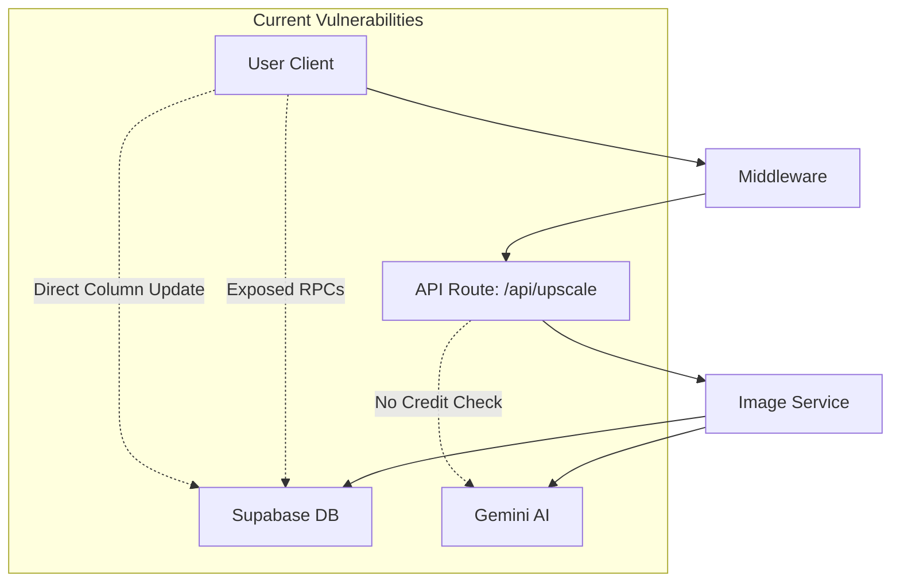
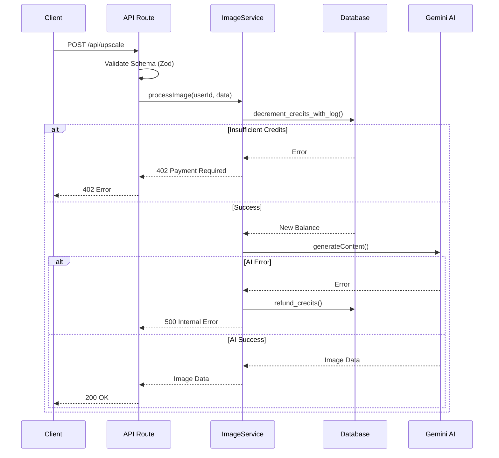

# Security Audit & Remediation Plan: Credit System & API

## Role & Objectives

**Role:** Principal Software Architect
**Objective:** Secure the billing and AI generation pipeline against free usage exploits and unauthorized credit manipulation.

---

### 1. Context Analysis

#### 1.1 Files Analyzed

- `app/api/upscale/route.ts` (AI Endpoint)
- `supabase/combined_setup.sql` (DB Schema & RPCs)
- `middleware.ts` (Auth Layer)
- `app/api/webhooks/stripe/route.ts` (Payment Processing)

#### 1.2 Component & Dependency Overview



#### 1.3 Current Behavior Summary

- **Middleware** protects routes but `app/api/upscale` does not utilize the authenticated user context to enforce business rules.
- **Database** exposes `increment_credits` and `decrement_credits` RPCs to all authenticated users.
- **Database** RLS allows users to update their own `profiles` row, potentially including the `credits_balance` column.
- **API Endpoint** generates images without checking or deducting credits.

#### 1.4 Problem Statement

The application allows **unlimited free AI generation** and **unauthorized credit manipulation** due to exposed database functions and missing business logic checks.

---

### 2. Proposed Solution

#### 2.1 Architecture Summary

1.  **Database Lockdown:** Revoke public access to credit-modifying RPCs. Implement a trigger to protect the `credits_balance` column from direct updates.
2.  **Service Layer Encapsulation:** Create a dedicated `ImageGenerationService` that handles the transaction lifecycle: Deduct -> Generate -> Refund (on error).
3.  **Strict Validation:** Enforce Zod schema validation for all API inputs.
4.  **Authorized Execution:** Refactor the API route to strictly use the `X-User-Id` provided by middleware.

#### 2.2 Architecture Diagram



#### 2.3 Key Technical Decisions

- **Supabase Admin Client:** The Service Layer will use `supabaseAdmin` (Service Role) to execute credit deductions, ensuring the client cannot bypass checks.
- **Atomic Transactions:** Using the existing `_with_log` RPCs ensures that credit history is maintained.
- **Fail-Safe:** Implementing automatic refunds for AI failures prevents user frustration and support tickets.

#### 2.4 Data Model Changes

- **SQL Migration:**
  - `REVOKE EXECUTE` on credit RPCs for `authenticated` role.
  - `CREATE TRIGGER` to prevent updates to `credits_balance` on `profiles`.

---

### 3. Detailed Implementation Spec

#### A. `supabase/migrations/20250221_secure_credits.sql`

```sql
-- 1. Revoke access to sensitive RPCs
REVOKE EXECUTE ON FUNCTION public.increment_credits FROM authenticated;
REVOKE EXECUTE ON FUNCTION public.decrement_credits FROM authenticated;
REVOKE EXECUTE ON FUNCTION public.increment_credits_with_log FROM authenticated;
REVOKE EXECUTE ON FUNCTION public.decrement_credits_with_log FROM authenticated;

-- 2. Protect credits_balance column
CREATE OR REPLACE FUNCTION public.prevent_credit_update()
RETURNS TRIGGER AS $$
BEGIN
  IF NEW.credits_balance IS DISTINCT FROM OLD.credits_balance AND auth.role() != 'service_role' THEN
    RAISE EXCEPTION 'Cannot update credits_balance directly';
  END IF;
  RETURN NEW;
END;
$$ LANGUAGE plpgsql;

CREATE TRIGGER protect_credits_balance
BEFORE UPDATE ON public.profiles
FOR EACH ROW
EXECUTE FUNCTION public.prevent_credit_update();
```

#### B. `src/validation/upscale.schema.ts`

```typescript
import { z } from 'zod';

export const upscaleSchema = z.object({
  imageData: z.string().min(1, 'Image data is required'),
  mimeType: z.string().default('image/jpeg'),
  config: z.object({
    mode: z.enum(['upscale', 'enhance', 'both', 'custom']),
    scale: z.number().min(1).max(4).default(2),
    denoise: z.boolean().default(false),
    enhanceFace: z.boolean().default(false),
    preserveText: z.boolean().default(false),
    customPrompt: z.string().optional(),
  }),
});

export type UpscaleInput = z.infer<typeof upscaleSchema>;
```

#### C. `src/services/image-generation.service.ts`

```typescript
import { supabaseAdmin } from '@/lib/supabase/supabaseAdmin';
import { GoogleGenAI } from '@google/genai';
import { UpscaleInput } from '@/validation/upscale.schema';

export class ImageGenerationService {
  async processImage(userId: string, input: UpscaleInput) {
    // 1. Deduct Credit
    const { data: balance, error: creditError } = await supabaseAdmin.rpc(
      'decrement_credits_with_log',
      {
        target_user_id: userId,
        amount: 1,
        transaction_type: 'usage',
        ref_id: 'gen_' + Date.now(),
        description: 'Image Upscale',
      }
    );

    if (creditError) throw new Error('Insufficient credits');

    try {
      // 2. Generate Image
      const result = await this.callGemini(input);
      return result;
    } catch (err) {
      // 3. Refund on Failure
      await supabaseAdmin.rpc('refund_credits', {
        target_user_id: userId,
        amount: 1,
        reason: 'Generation Failed',
      });
      throw err;
    }
  }

  private async callGemini(input: UpscaleInput) {
    /* ... */
  }
}
```

#### D. `app/api/upscale/route.ts`

- Remove inline logic.
- Extract `X-User-Id`.
- Validate with `upscaleSchema`.
- Call `ImageGenerationService`.

---

### 4. Step-by-Step Execution Plan

#### Phase 1: Database Lockdown

- [ ] Create and apply migration `20250221_secure_credits.sql`.
- [ ] Verify RPCs are inaccessible to authenticated users.

#### Phase 2: Core Logic Implementation

- [ ] Create `src/validation/upscale.schema.ts`.
- [ ] Create `src/services/image-generation.service.ts`.
- [ ] Implement `processImage` with deduction and refund logic.

#### Phase 3: API Refactor

- [ ] Update `app/api/upscale/route.ts` to use the new service.
- [ ] Add error handling for 402 (Payment Required) and 422 (Validation).

---

### 5. Testing Strategy

#### Unit Tests

- **Service:** Mock `supabaseAdmin.rpc` to simulate success/fail scenarios. Verify refunds are called when generation fails.
- **Validation:** Test `upscaleSchema` with missing data, invalid modes, etc.

#### Integration Tests

- **E2E:**
  1.  User with 0 credits -> Expect 402.
  2.  User with 1 credit -> Expect 200, Balance 0.
  3.  User with 1 credit, Mock AI Failure -> Expect 500, Balance 1 (Refunded).

#### Edge Cases

| Scenario                            | Expected Behavior          |
| ----------------------------------- | -------------------------- |
| Network timeout during AI call      | Refund credits, return 504 |
| User hacks valid JWT but no credits | 402 Payment Required       |
| Invalid Base64 image                | 400 Bad Request (Zod)      |

---

### 6. Acceptance Criteria

- [ ] `increment_credits` RPC fails when called from browser console.
- [ ] Direct update to `credits_balance` in `profiles` table fails for users.
- [ ] `/api/upscale` returns 402 if user has 0 credits.
- [ ] `/api/upscale` decrements 1 credit on success.
- [ ] Credits are restored if the AI generation throws an error.
