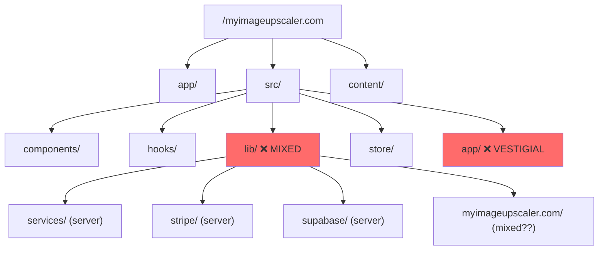
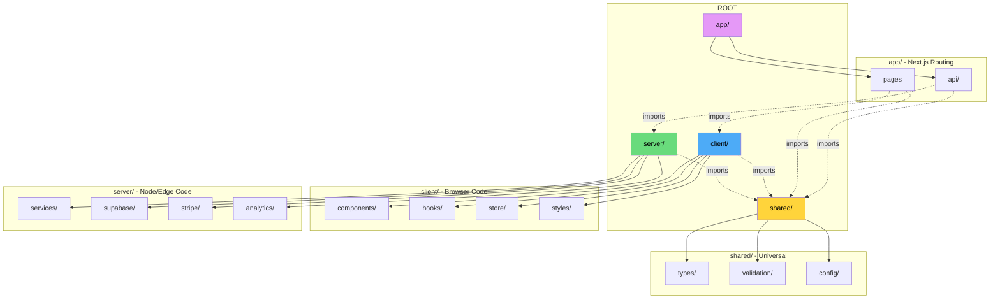

# File Structure Reorganization Plan

> **Goal:** Clear separation of client/server code at the root level

---

## 1. Context Analysis

### 1.1 Files Analyzed

| Path               | Purpose                                       |
| ------------------ | --------------------------------------------- |
| `/app/`            | Next.js App Router (pages + API routes mixed) |
| `/src/components/` | React components                              |
| `/src/hooks/`      | React hooks                                   |
| `/src/store/`      | Zustand stores                                |
| `/src/lib/`        | Mixed client/server code (confusing!)         |
| `/src/types/`      | TypeScript types                              |
| `/src/validation/` | Zod schemas                                   |
| `/src/config/`     | Environment config                            |
| `/content/`        | Blog MDX files                                |
| `/middleware.ts`   | Next.js middleware                            |

### 1.2 Current Structure (Confusing)



### 1.3 Problems

| Issue                                 | Why It's Bad                                      |
| ------------------------------------- | ------------------------------------------------- |
| `app/` and `src/` both at root        | Unclear which is "the code"                       |
| `src/lib/` has server + client code   | Can't tell what runs where                        |
| `src/app/` exists with only CLAUDE.md | Vestigial, confusing                              |
| No clear client/server boundary       | Easy to accidentally import server code in client |

---

## 2. Proposed Solution

### 2.1 New Structure (Clear)

```
myimageupscaler.com/
├── client/                    # ← FRONTEND (browser code)
│   ├── components/
│   │   ├── auth/
│   │   ├── common/
│   │   ├── dashboard/
│   │   ├── form/
│   │   ├── layout/
│   │   ├── modal/
│   │   ├── navigation/
│   │   ├── pages/
│   │   ├── myimageupscaler.com/
│   │   ├── seo/
│   │   ├── stripe/
│   │   └── ...
│   ├── hooks/
│   │   ├── myimageupscaler.com/
│   │   ├── useGoogleSignIn.ts
│   │   └── ...
│   ├── store/
│   │   ├── authStore.ts
│   │   ├── modalStore.ts
│   │   └── ...
│   └── styles/
│       └── index.css
│
├── server/                    # ← BACKEND (Node.js/Edge code)
│   ├── services/
│   │   └── image-generation.service.ts
│   ├── supabase/
│   │   ├── supabaseAdmin.ts
│   │   └── ...
│   ├── stripe/
│   │   └── config.ts
│   ├── analytics/
│   │   └── index.ts
│   ├── monitoring/
│   │   └── logger.ts
│   ├── middleware/
│   │   └── ...
│   ├── blog.ts
│   └── rateLimit.ts
│
├── shared/                    # ← BOTH (types, validation, config)
│   ├── types/
│   │   ├── api.ts
│   │   ├── user.ts
│   │   └── ...
│   ├── validation/
│   │   ├── upscale.schema.ts
│   │   └── ...
│   ├── config/
│   │   └── env.ts
│   └── utils/
│       └── supabase/
│
├── app/                       # ← NEXT.JS ROUTING (thin layer)
│   ├── api/                   # API routes → call server/
│   │   ├── upscale/
│   │   ├── checkout/
│   │   ├── webhooks/
│   │   └── ...
│   ├── dashboard/             # Pages → render client/
│   ├── blog/
│   ├── layout.tsx
│   ├── page.tsx
│   └── ...
│
├── content/                   # Blog MDX content
├── public/                    # Static assets
├── tests/                     # All tests
├── docs/                      # Documentation
├── supabase/                  # Database migrations
├── scripts/                   # Setup scripts
└── [config files]
```

### 2.2 Architecture Diagram



### 2.3 Import Rules

| From          | Can Import           |
| ------------- | -------------------- |
| `client/`     | `shared/` only       |
| `server/`     | `shared/` only       |
| `app/api/`    | `server/`, `shared/` |
| `app/(pages)` | `client/`, `shared/` |

**❌ NEVER:** `client/` importing from `server/` or vice versa

### 2.4 Key Decisions

| Decision                          | Rationale                                             |
| --------------------------------- | ----------------------------------------------------- |
| `client/server/shared` at root    | Maximum clarity - see folder = know context           |
| `app/` stays at root              | Next.js requires this folder name                     |
| `app/` is a thin layer            | Routes only import/call, logic lives in client/server |
| Delete `src/` entirely            | No more confusion about what's source code            |
| Merge `environment/` → `scripts/` | Both contain setup scripts                            |

---

## 3. Migration Mapping

### 3.1 File Moves

| Current Path           | New Path                                              |
| ---------------------- | ----------------------------------------------------- |
| `src/components/`      | `client/components/`                                  |
| `src/hooks/`           | `client/hooks/`                                       |
| `src/store/`           | `client/store/`                                       |
| `src/index.css`        | `client/styles/index.css`                             |
| `src/lib/services/`    | `server/services/`                                    |
| `src/lib/supabase/`    | `server/supabase/`                                    |
| `src/lib/stripe/`      | `server/stripe/`                                      |
| `src/lib/analytics/`   | `server/analytics/`                                   |
| `src/lib/monitoring/`  | `server/monitoring/`                                  |
| `src/lib/middleware/`  | `server/middleware/`                                  |
| `src/lib/rateLimit.ts` | `server/rateLimit.ts`                                 |
| `src/lib/blog.ts`      | `server/blog.ts`                                      |
| `src/types/`           | `shared/types/`                                       |
| `src/validation/`      | `shared/validation/`                                  |
| `src/config/`          | `shared/config/`                                      |
| `src/utils/`           | `shared/utils/`                                       |
| `middleware.ts`        | `middleware.ts` (stays at root - Next.js requirement) |
| `src/app/`             | **DELETE** (vestigial)                                |
| `environment/`         | Merge into `scripts/setup/`                           |

### 3.2 Special Cases

| Current                        | Decision                                                         |
| ------------------------------ | ---------------------------------------------------------------- |
| `src/lib/myimageupscaler.com/` | Analyze contents - split between client/server                   |
| `src/components/analytics/`    | Move to `client/components/analytics/` (client-side tracking UI) |
| `src/components/monitoring/`   | Move to `client/components/monitoring/`                          |

---

## 4. Configuration Updates

### 4.1 tsconfig.json

```json
{
  "compilerOptions": {
    "baseUrl": ".",
    "paths": {
      "@client/*": ["./client/*"],
      "@server/*": ["./server/*"],
      "@shared/*": ["./shared/*"],
      "@app/*": ["./app/*"]
    }
  },
  "include": [
    "client/**/*",
    "server/**/*",
    "shared/**/*",
    "app/**/*",
    "middleware.ts",
    ".next/types/**/*.ts"
  ]
}
```

### 4.2 Import Updates (Examples)

**Before:**

```typescript
// In app/api/upscale/route.ts
import { upscaleSchema } from '@/validation/upscale.schema';
import { ImageGenerationService } from '@/lib/services/image-generation.service';
import { createLogger } from '@/lib/monitoring/logger';
```

**After:**

```typescript
// In app/api/upscale/route.ts
import { upscaleSchema } from '@shared/validation/upscale.schema';
import { ImageGenerationService } from '@server/services/image-generation.service';
import { createLogger } from '@server/monitoring/logger';
```

**Before:**

```typescript
// In app/layout.tsx
import { ClientProviders } from '../src/components/ClientProviders';
import { Layout } from '../src/components/layout/Layout';
import '../src/index.css';
```

**After:**

```typescript
// In app/layout.tsx
import { ClientProviders } from '@client/components/ClientProviders';
import { Layout } from '@client/components/layout/Layout';
import '@client/styles/index.css';
```

### 4.3 ESLint/Prettier

Update paths in:

- `package.json` scripts
- `eslint.config.js`
- Any lint-staged config

---

## 5. Step-by-Step Execution Plan

### Phase 1: Create New Structure

- [ ] Create `client/`, `server/`, `shared/` directories
- [ ] Create subdirectories in each

### Phase 2: Move Client Code

- [ ] Move `src/components/` → `client/components/`
- [ ] Move `src/hooks/` → `client/hooks/`
- [ ] Move `src/store/` → `client/store/`
- [ ] Move `src/index.css` → `client/styles/index.css`

### Phase 3: Move Server Code

- [ ] Move `src/lib/services/` → `server/services/`
- [ ] Move `src/lib/supabase/` → `server/supabase/`
- [ ] Move `src/lib/stripe/` → `server/stripe/`
- [ ] Move `src/lib/analytics/` → `server/analytics/`
- [ ] Move `src/lib/monitoring/` → `server/monitoring/`
- [ ] Move `src/lib/middleware/` → `server/middleware/`
- [ ] Move `src/lib/rateLimit.ts` → `server/rateLimit.ts`
- [ ] Move `src/lib/blog.ts` → `server/blog.ts`

### Phase 4: Move Shared Code

- [ ] Move `src/types/` → `shared/types/`
- [ ] Move `src/validation/` → `shared/validation/`
- [ ] Move `src/config/` → `shared/config/`
- [ ] Move `src/utils/` → `shared/utils/`

### Phase 5: Update Configuration

- [ ] Update `tsconfig.json` paths
- [ ] Update `package.json` scripts
- [ ] Update `eslint.config.js`

### Phase 6: Fix All Imports

- [ ] Update imports in `app/` (pages and API routes)
- [ ] Update imports in `client/`
- [ ] Update imports in `server/`
- [ ] Update imports in `middleware.ts`
- [ ] Update imports in `tests/`

### Phase 7: Cleanup

- [ ] Delete empty `src/` directory
- [ ] Delete `src/app/` (vestigial)
- [ ] Merge `environment/` into `scripts/`
- [ ] Run `tsc --noEmit` to verify
- [ ] Run `yarn lint` to verify
- [ ] Run tests to verify

---

## 6. Testing Strategy

### Verification Steps

1. **TypeScript compilation:** `yarn tsc`
2. **Linting:** `yarn lint`
3. **Unit tests:** `yarn test:unit`
4. **E2E tests:** `yarn test:e2e`
5. **Dev server:** `yarn dev` - verify pages load
6. **Build:** `yarn build` - verify production build

### Edge Cases

| Scenario        | Verification                           |
| --------------- | -------------------------------------- |
| Dynamic imports | Search for `import()` and verify paths |
| CSS imports     | Verify `@client/styles/` resolves      |
| Test fixtures   | Update test import paths               |
| Middleware      | Verify `middleware.ts` imports work    |

---

## 7. Acceptance Criteria

- [ ] No `src/` folder exists
- [ ] All code in `client/`, `server/`, `shared/`, or `app/`
- [ ] `yarn tsc` passes with no errors
- [ ] `yarn lint` passes
- [ ] `yarn test:unit` passes
- [ ] `yarn test:e2e` passes
- [ ] `yarn build` succeeds
- [ ] All imports use new path aliases (`@client/`, `@server/`, `@shared/`)
- [ ] No relative imports crossing boundaries (e.g., `../../../server/`)

---

## 8. Rollback Plan

If issues arise:

1. Git revert the restructuring commits
2. Restore original `src/` and `app/` structure
3. Revert `tsconfig.json` changes

**Recommendation:** Do this in a feature branch, test thoroughly before merging.
