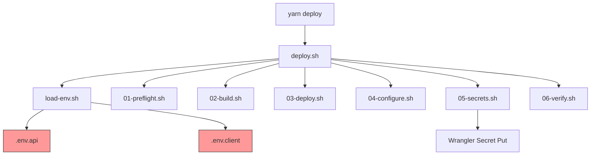
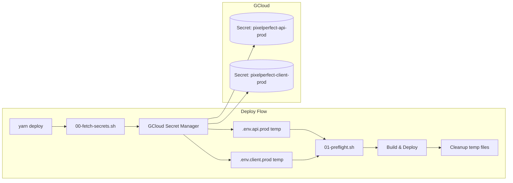
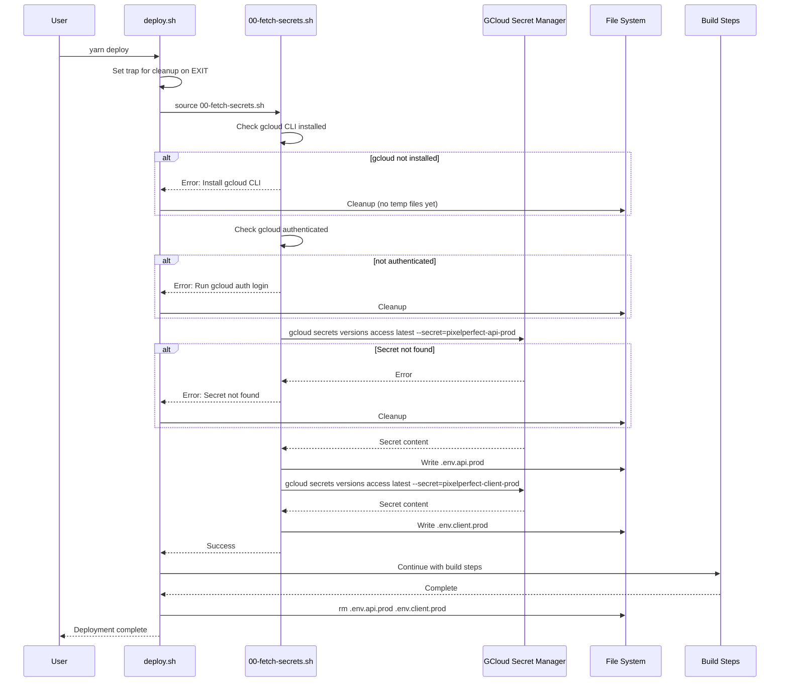

# Production Secrets Management via Google Cloud Secret Manager

## 1. Context Analysis

### 1.1 Files Analyzed

```
scripts/deploy/deploy.sh
scripts/deploy/common.sh
scripts/deploy/steps/01-preflight.sh
scripts/deploy/steps/02-build.sh
scripts/deploy/steps/05-secrets.sh
scripts/load-env.sh
.env.api
.env.api.prod
.env.client
.gitignore
.github/workflows/deploy.yml
package.json
```

### 1.2 Component & Dependency Overview



### 1.3 Current Behavior Summary

- `yarn deploy` runs `scripts/deploy/deploy.sh`
- Environment variables loaded from local `.env.api` and `.env.client` files
- Same keys used for both development and production deployments
- Secrets uploaded to Cloudflare Workers via `wrangler secret put`
- `.env.api.prod` exists but contains duplicate (dev) values with `ENV=production`
- `.gitignore` already excludes `.env.api.prod` and `.env.client.prod`

### 1.4 Problem Statement

Production secrets are stored locally alongside development secrets, creating security risks and making secret rotation difficult. Production secrets should be fetched from Google Cloud Secret Manager during deployment only.

---

## 2. Proposed Solution

### 2.1 Architecture Summary

- Store production secrets in Google Cloud Secret Manager
- Create a new script `scripts/deploy/steps/00-fetch-secrets.sh` to fetch secrets at deploy start
- Write fetched secrets to temporary `.env.api.prod` and `.env.client.prod` files
- Modify `load-env.sh` to accept an environment parameter (`dev` | `prod`)
- Add cleanup in deploy.sh to remove temporary prod files after deployment (success or failure)

**Alternatives Considered:**

1. **Environment variables only** - Rejected: Too many secrets to manage as env vars, error-prone
2. **Fetch secrets inline per variable** - Rejected: Slow (one API call per secret), complex error handling
3. **Store secrets in CI/CD only** - Rejected: Doesn't support local production deploys, less flexible

### 2.2 Architecture Diagram



### 2.3 Key Technical Decisions

| Decision              | Choice                                              | Rationale                                                       |
| --------------------- | --------------------------------------------------- | --------------------------------------------------------------- |
| Secret storage format | Single secret per env file                          | Simplicity - one `gcloud secrets versions access` call per file |
| GCloud project        | Use default from `gcloud config`                    | Avoids hardcoding, respects user's gcloud auth                  |
| Secret names          | `pixelperfect-api-prod`, `pixelperfect-client-prod` | Clear naming, matches file convention                           |
| Cleanup strategy      | trap on EXIT                                        | Ensures cleanup on success, failure, or interrupt               |
| Local fallback        | None                                                | Force gcloud usage for prod deploys - no silent fallbacks       |

### 2.4 Data Model Changes

**No Data Changes.** This affects deployment scripts only.

---

## 2.5 Runtime Execution Flow



---

## 3. Detailed Implementation Spec

### A. `scripts/deploy/steps/00-fetch-secrets.sh` (NEW)

**Purpose:** Fetch production secrets from GCloud Secret Manager and write to temp files.

```bash
#!/bin/bash

# Configuration
GCLOUD_SECRET_API="pixelperfect-api-prod"
GCLOUD_SECRET_CLIENT="pixelperfect-client-prod"
ENV_API_PROD="$PROJECT_ROOT/.env.api.prod"
ENV_CLIENT_PROD="$PROJECT_ROOT/.env.client.prod"

step_fetch_secrets() {
    log_step 0 "Fetching production secrets"

    # Check gcloud CLI
    if ! command -v gcloud &> /dev/null; then
        log_error "gcloud CLI not installed. Install from: https://cloud.google.com/sdk/docs/install"
    fi
    log_success "gcloud CLI found"

    # Check authentication
    if ! gcloud auth print-identity-token &> /dev/null; then
        log_error "Not authenticated. Run: gcloud auth login"
    fi
    log_success "gcloud authenticated"

    # Fetch API secrets
    log_info "Fetching $GCLOUD_SECRET_API..."
    if ! gcloud secrets versions access latest --secret="$GCLOUD_SECRET_API" > "$ENV_API_PROD" 2>/dev/null; then
        log_error "Failed to fetch secret '$GCLOUD_SECRET_API'. Ensure it exists in GCloud Secret Manager."
    fi
    log_success ".env.api.prod written"

    # Fetch client secrets
    log_info "Fetching $GCLOUD_SECRET_CLIENT..."
    if ! gcloud secrets versions access latest --secret="$GCLOUD_SECRET_CLIENT" > "$ENV_CLIENT_PROD" 2>/dev/null; then
        rm -f "$ENV_API_PROD"  # Cleanup partial state
        log_error "Failed to fetch secret '$GCLOUD_SECRET_CLIENT'. Ensure it exists in GCloud Secret Manager."
    fi
    log_success ".env.client.prod written"
}
```

**Justification:** Separate step enables clear error messages, atomic operations, and easy debugging.

---

### B. `scripts/deploy/deploy.sh` (MODIFY)

**Changes Needed:**

1. Add cleanup trap at the start
2. Source and run `00-fetch-secrets.sh` before other steps
3. Load prod env files instead of dev files

```bash
#!/bin/bash
set -euo pipefail

SCRIPT_DIR="$(cd "$(dirname "${BASH_SOURCE[0]}")" && pwd)"
PROJECT_ROOT="$(dirname "$(dirname "$SCRIPT_DIR")")"

# Parse flags
export SKIP_SECRETS="false"
export SKIP_TESTS="false"
for arg in "$@"; do
    case $arg in
        --skip-secrets) SKIP_SECRETS="true" ;;
        --skip-tests) SKIP_TESTS="true" ;;
    esac
done

source "$SCRIPT_DIR/common.sh"

# === NEW: Cleanup function ===
cleanup_prod_secrets() {
    local exit_code=$?
    log_info "Cleaning up temporary production secrets..."
    rm -f "$PROJECT_ROOT/.env.api.prod" "$PROJECT_ROOT/.env.client.prod"
    log_success "Cleanup complete"
    exit $exit_code
}

# === NEW: Set trap for cleanup on any exit ===
trap cleanup_prod_secrets EXIT

echo ""
echo -e "${CYAN}══════════════════════════════════════${NC}"
echo -e "${CYAN}  MyImageUpscaler Deploy${NC}"
echo -e "${CYAN}══════════════════════════════════════${NC}"
echo ""

START_TIME=$(date +%s)

# === NEW: Fetch production secrets from GCloud ===
source "$SCRIPT_DIR/steps/00-fetch-secrets.sh" && step_fetch_secrets

# === MODIFIED: Load prod env files instead of dev ===
source "$PROJECT_ROOT/scripts/load-env.sh" --prod

# Run tests unless skipped
if [ "$SKIP_TESTS" = "false" ]; then
    echo -e "${CYAN}▸ Running tests...${NC}"
    cd "$PROJECT_ROOT"
    if ! yarn test; then
        echo -e "${RED}✗ Tests failed. Deployment blocked.${NC}"
        echo -e "${YELLOW}  Use --skip-tests to bypass test checking${NC}"
        exit 1
    fi
    echo -e "${GREEN}✓ All tests passed${NC}"
    echo ""
else
    echo -e "${YELLOW}▸ Skipping tests (--skip-tests flag)${NC}"
    echo ""
fi

source "$SCRIPT_DIR/steps/01-preflight.sh" && step_preflight
source "$SCRIPT_DIR/steps/02-build.sh" && step_build
source "$SCRIPT_DIR/steps/03-deploy.sh" && step_deploy
source "$SCRIPT_DIR/steps/04-configure.sh" && step_configure
source "$SCRIPT_DIR/steps/05-secrets.sh" && step_secrets
source "$SCRIPT_DIR/steps/06-verify.sh" && step_verify

END_TIME=$(date +%s)
DURATION=$((END_TIME - START_TIME))

echo ""
echo -e "${GREEN}══════════════════════════════════════${NC}"
echo -e "${GREEN}  Done in ${DURATION}s${NC}"
echo -e "${GREEN}  https://${DOMAIN_NAME}${NC}"
echo -e "${GREEN}══════════════════════════════════════${NC}"
echo ""
```

**Justification:** Trap ensures cleanup even on Ctrl+C or script errors.

---

### C. `scripts/load-env.sh` (MODIFY)

**Changes Needed:** Accept `--prod` flag to load `.env.*.prod` files instead of default dev files.

```bash
#!/bin/bash

set -euo pipefail

# === NEW: Determine environment based on flag ===
ENV_SUFFIX=""
if [[ "${1:-}" == "--prod" ]]; then
    ENV_SUFFIX=".prod"
    shift
fi

ENV_CLIENT=".env.client${ENV_SUFFIX}"
ENV_API=".env.api${ENV_SUFFIX}"

# Function to load a single env file
load_env_file() {
    local file=$1

    if [ -f "$file" ]; then
        echo "✅ Loading environment variables from $file"

        while IFS= read -r line; do
            [[ $line =~ ^[[:space:]]*# ]] && continue
            [[ $line =~ ^[[:space:]]*$ ]] && continue

            if [[ $line =~ ^[A-Z_][A-Z0-9_]*= ]]; then
                export "$line"
            fi
        done < "$file"

        return 0
    else
        return 1
    fi
}

# Load client vars
if ! load_env_file "$ENV_CLIENT"; then
    echo "❌ Environment file '$ENV_CLIENT' not found!"
    if [[ -n "$ENV_SUFFIX" ]]; then
        echo "💡 Production env files are generated by the deploy script"
    else
        echo "💡 Copy .env.client.example to .env.client and fill in your values"
    fi
    exit 1
fi

# Load API vars
if ! load_env_file "$ENV_API"; then
    echo "❌ Environment file '$ENV_API' not found!"
    if [[ -n "$ENV_SUFFIX" ]]; then
        echo "💡 Production env files are generated by the deploy script"
    else
        echo "💡 Copy .env.api.example to .env.api and fill in your values"
    fi
    exit 1
fi

echo "✅ All environment variables loaded successfully"

# ... rest of file unchanged (validate_required_vars, print_loaded_vars functions)
```

---

### D. `scripts/deploy/common.sh` (MODIFY)

**Changes Needed:** Update step count from 6 to 7 to account for new step 0.

```bash
#!/bin/bash

RED='\033[0;31m'
GREEN='\033[0;32m'
YELLOW='\033[1;33m'
CYAN='\033[0;36m'
NC='\033[0m'

# === MODIFIED: Step numbering now includes step 0 ===
log_step()    { echo -e "\n${CYAN}[$1/6]${NC} $2"; }  # Keep as /6, step 0 is "pre-step"
log_info()    { echo -e "  ${CYAN}→${NC} $1"; }
log_success() { echo -e "  ${GREEN}✓${NC} $1"; }
log_warn()    { echo -e "  ${YELLOW}⚠${NC} $1"; }
log_error()   { echo -e "  ${RED}✗${NC} $1"; exit 1; }

cf_api() {
    curl -s -X "$1" "https://api.cloudflare.com/client/v4$2" \
        -H "Authorization: Bearer $CLOUDFLARE_API_TOKEN" \
        -H "Content-Type: application/json" \
        ${3:+-d "$3"}
}
```

**Justification:** Step 0 is a "pre-step" for fetching secrets, doesn't need to increment total.

---

## 4. Step-by-Step Execution Plan

### Phase 1: GCloud Secret Setup (Manual - User Action)

- [ ] Create GCloud project or select existing one
- [ ] Enable Secret Manager API: `gcloud services enable secretmanager.googleapis.com`
- [ ] Create API secrets:
  ```bash
  # Copy current .env.api.prod content, update values as needed
  gcloud secrets create pixelperfect-api-prod --data-file=.env.api.prod
  ```
- [ ] Create client secrets:
  ```bash
  # Create .env.client.prod with production values
  gcloud secrets create pixelperfect-client-prod --data-file=.env.client.prod
  ```
- [ ] Verify secrets exist: `gcloud secrets list`

### Phase 2: Script Implementation (Parallel-safe)

- [ ] Create `scripts/deploy/steps/00-fetch-secrets.sh`
- [ ] Modify `scripts/deploy/deploy.sh` (add trap, source new step, use --prod flag)
- [ ] Modify `scripts/load-env.sh` (add --prod flag support)
- [ ] Update `scripts/deploy/common.sh` if needed

### Phase 3: Testing & Verification

- [ ] Test gcloud auth: `gcloud auth print-identity-token`
- [ ] Test secret fetch: `gcloud secrets versions access latest --secret=pixelperfect-api-prod`
- [ ] Run deploy with verbose output
- [ ] Verify temp files are cleaned up after deploy (success case)
- [ ] Verify temp files are cleaned up after deploy (failure case - Ctrl+C)

---

## 5. Testing Strategy

### Unit Tests

N/A - Shell scripts, tested manually.

### Integration Tests

- Run `yarn deploy --skip-tests` and verify:
  1. Secrets fetched from gcloud
  2. Temp files created
  3. Build uses production values
  4. Temp files deleted after completion

### Edge Cases

| Scenario                 | Expected Behavior                             |
| ------------------------ | --------------------------------------------- |
| gcloud not installed     | Clear error message with install link         |
| gcloud not authenticated | Clear error message: "Run gcloud auth login"  |
| Secret doesn't exist     | Error with secret name, no partial files left |
| Ctrl+C during deploy     | Trap fires, temp files cleaned up             |
| Deploy fails mid-build   | Trap fires, temp files cleaned up             |

---

## 6. Acceptance Criteria

- [ ] `yarn deploy` fetches secrets from GCloud Secret Manager
- [ ] `.env.api.prod` and `.env.client.prod` are created temporarily during deploy
- [ ] Temp files are removed after deploy completes (success or failure)
- [ ] Clear error messages when gcloud is not installed or not authenticated
- [ ] Clear error messages when secrets don't exist
- [ ] No production secrets remain on disk after deployment

---

## 7. Verification & Rollback

### Success Criteria

- Deploy completes successfully
- `ls -la .env*.prod` shows no files after deploy
- Production site uses correct production values (ENV=production)

### Rollback Plan

1. Revert changes to deploy.sh and load-env.sh
2. Delete 00-fetch-secrets.sh
3. Continue using local .env files (current behavior)

GCloud secrets remain available for future use - no cleanup needed there.

---

## Appendix: GCloud Commands Reference

```bash
# One-time setup
gcloud auth login
gcloud config set project YOUR_PROJECT_ID
gcloud services enable secretmanager.googleapis.com

# Create secrets (first time)
gcloud secrets create pixelperfect-api-prod --data-file=.env.api.prod
gcloud secrets create pixelperfect-client-prod --data-file=.env.client.prod

# Update secrets (subsequent updates)
gcloud secrets versions add pixelperfect-api-prod --data-file=.env.api.prod
gcloud secrets versions add pixelperfect-client-prod --data-file=.env.client.prod

# View secrets
gcloud secrets list
gcloud secrets versions access latest --secret=pixelperfect-api-prod

# Delete secrets (if needed)
gcloud secrets delete pixelperfect-api-prod
gcloud secrets delete pixelperfect-client-prod
```
