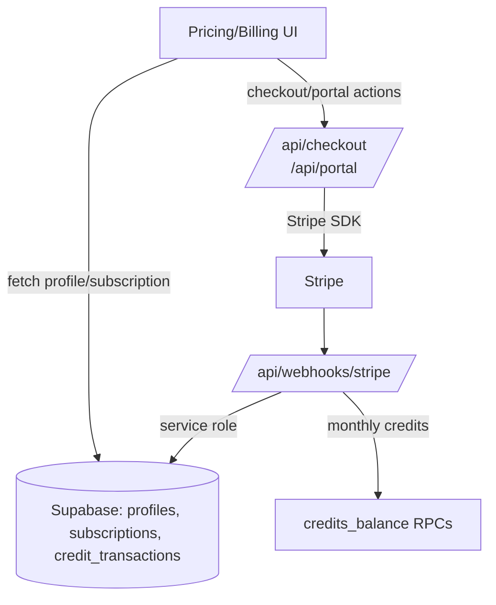
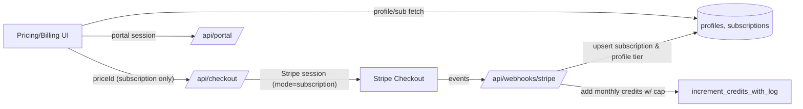
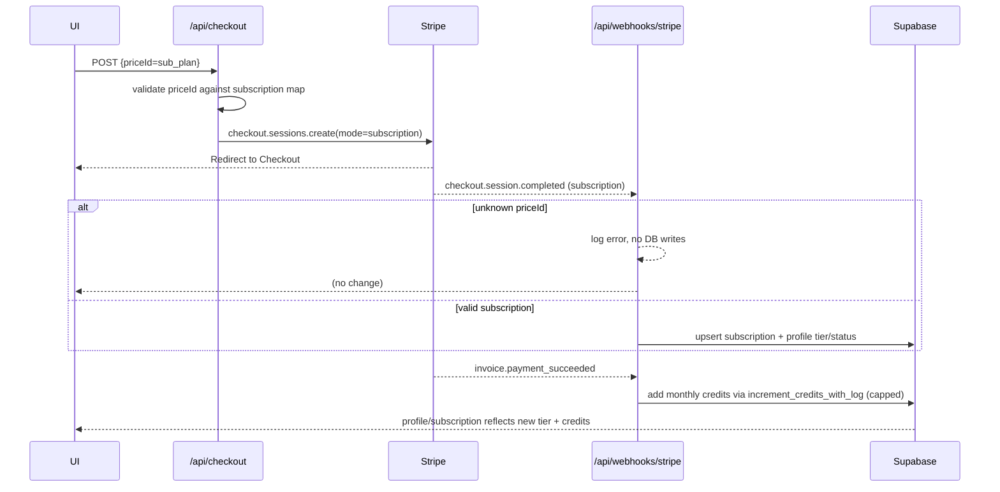

✅ **IMPLEMENTATION COMPLETED** - All tasks finished successfully 🎉

# Subscription-Only Payments & Billing Hardening Plan

## 1. Context Analysis

### 1.1 Files Analyzed
- /home/joao/projects/pixelperfect/shared/config/stripe.ts
- /home/joao/projects/pixelperfect/server/stripe/stripeService.ts
- /home/joao/projects/pixelperfect/server/stripe/config.ts
- /home/joao/projects/pixelperfect/app/api/checkout/route.ts
- /home/joao/projects/pixelperfect/app/api/webhooks/stripe/route.ts
- /home/joao/projects/pixelperfect/app/api/portal/route.ts
- /home/joao/projects/pixelperfect/app/pricing/page.tsx
- /home/joao/projects/pixelperfect/client/components/stripe/PricingCard.tsx
- /home/joao/projects/pixelperfect/client/components/pixelperfect/Pricing.tsx
- /home/joao/projects/pixelperfect/client/components/stripe/BuyCreditsButton.tsx
- /home/joao/projects/pixelperfect/app/dashboard/billing/page.tsx
- /home/joao/projects/pixelperfect/client/components/stripe/SubscriptionStatus.tsx
- /home/joao/projects/pixelperfect/app/success/page.tsx
- /home/joao/projects/pixelperfect/supabase/migrations/20250120_create_profiles_table.sql
- /home/joao/projects/pixelperfect/supabase/migrations/20250120_create_subscriptions_table.sql

### 1.2 Component & Dependency Overview


### 1.3 Current Behavior Summary
- Checkout route accepts any Stripe price ID, infers mode from Stripe price type, and allows one-time credit packs via metadata.
- Webhook handler increments credits for `mode=payment` sessions, updates subscriptions for recurring, and sets profile subscription fields to raw price IDs.
- Frontend pricing surfaces both credit packs and subscriptions; billing UI shows price IDs instead of human-friendly plan names and still prompts to “Buy Credits”.
- Success page polls for credit balance assuming one-time credit top-ups; subscription lifecycle messaging is minimal.
- Config still exposes credit pack price IDs, and UI/exports include a BuyCreditsButton even though subscriptions are the desired flow.

### 1.4 Problem Statement
Subscription checkout, activation, renewal, and management must be the only payment path; credit pack purchases should be removed/blocked and the end-to-end subscription cycle must reliably grant credits and show accurate plan status.

## 2. Proposed Solution

### 2.1 Architecture Summary
- Enforce an allowlist of subscription price IDs and block one-time prices at the API layer; drop credit-pack metadata and payment mode handling.
- Normalize plan metadata (plan key, display name, credits/month, rollover cap) in shared config and reuse it for checkout, webhook processing, and UI labels.
- Simplify webhooks to subscription-only flows: ensure subscription records and profile status use friendly plan identifiers; add deterministic credit grants on invoice success with rollover caps.
- Update UI to present only subscription plans (homepage + pricing + billing), remove buy-credit CTA/components, and tighten success messaging around subscriptions.
- Keep portal access intact but align button copy and plan names with subscription-only model.

### 2.2 Architecture Diagram


### 2.3 Key Technical Decisions
- Use shared plan map keyed by Stripe subscription price IDs to validate checkout and resolve plan names/credit allowances; reject non-subscription prices early.
- Remove one-time payment handling from webhooks; treat missing/unknown price IDs as errors with logging and no credit mutation.
- Keep data model unchanged; store price_id in subscriptions but write human-readable `subscription_tier` via plan map for UI clarity.
- Maintain idempotent credit grants via existing `increment_credits_with_log` RPC while enforcing rollover cap derived from plan metadata.

### 2.4 Data Model Changes
- No Data Changes.

### 2.5 Runtime Execution Flow


## 3. Detailed Implementation Spec

### A. `shared/config/stripe.ts`
- **Changes Needed:** Drop credit pack exports and exports referencing one-time prices; add `SUBSCRIPTION_PRICE_MAP` helper (priceId → plan key, name, credits/month, rollover cap).
- **New Methods:** `getPlanForPriceId(priceId)` returning normalized metadata; `subscriptionPriceIds` array for validation.
- **Pseudo-code:**
```ts
export const SUBSCRIPTION_PRICE_MAP = {
  [STRIPE_PRICES.HOBBY_MONTHLY]: { key: 'hobby', name: 'Hobby', creditsPerMonth: 200, maxRollover: 1200 },
  ...
} as const;

export function getPlanForPriceId(priceId: string) {
  return SUBSCRIPTION_PRICE_MAP[priceId] ?? null;
}

export const SUBSCRIPTION_PRICE_IDS = Object.keys(SUBSCRIPTION_PRICE_MAP);
```
- **Justification:** Single source of truth for plan validation, labeling, and credit calculations.

### B. `app/api/checkout/route.ts`
- **Changes Needed:** Enforce subscription-only checkout; reject non-allowlisted price IDs; attach plan metadata to session; remove payment/credit-pack handling.
- **Pseudo-code:**
```ts
const plan = getPlanForPriceId(priceId);
if (!plan) return 400 INVALID_PRICE;
const price = await stripe.prices.retrieve(priceId);
if (price.type !== 'recurring') return 400 INVALID_PRICE;
const session = await stripe.checkout.sessions.create({
  mode: 'subscription',
  metadata: { user_id: user.id, plan_key: plan.key },
  subscription_data: { metadata: { user_id: user.id, plan_key: plan.key } },
  ...
});
```
- **Justification:** Prevents regression into one-time mode and gives webhooks deterministic plan context.

### C. `app/api/webhooks/stripe/route.ts`
- **Changes Needed:** Remove one-time credit branch; rely on plan map for credits + labels; normalize `subscription_tier` to plan key/name; harden error handling for unknown price IDs.
- **Pseudo-code:**
```ts
const plan = getPlanForPriceId(priceId);
if (!plan) { log; return; }
await supabaseAdmin.from('subscriptions').upsert({... price_id: priceId, plan_key: plan.key });
await supabaseAdmin.from('profiles').update({ subscription_status: status, subscription_tier: plan.name });
// invoice.payment_succeeded: creditsToAdd = plan.creditsPerMonth; cap at plan.maxRollover
```
- **Justification:** Aligns webhook side-effects with subscription-only model and fixes UI-facing tier naming.

### D. `app/api/portal/route.ts`
- **Changes Needed:** Update messaging to reflect subscription-only; optionally include plan validation guard (no code path change beyond errors).
- **Pseudo-code:** Adjust error message to “Activate a subscription to manage billing”.
- **Justification:** UX alignment; low risk.

### E. `client/components/pixelperfect/Pricing.tsx`
- **Changes Needed:** Show only subscription tiers; remove free-tier checkout coupling; ensure CTA copy speaks to subscriptions.
- **Pseudo-code:** Map over `HOMEPAGE_TIERS` without credit packs; copy tweaks.
- **Justification:** Prevents users from seeing/buying credit packs.

### F. `app/pricing/page.tsx`
- **Changes Needed:** Remove credit pack section entirely; update hero/FAQ copy; ensure subscription cards use plan map and friendly names.
- **Pseudo-code:** Delete credit pack grid; adjust CTA to “Choose plan”; display current plan name via plan map.
- **Justification:** UI consistency with subscription-only offering.

### G. `client/components/stripe/PricingCard.tsx`
- **Changes Needed:** Remove credit-specific props/metadata; enforce subscription wording; optionally accept `planKey` to set metadata.
- **Pseudo-code:** Drop `creditsAmount`; button text always “Subscribe”; call checkout with plan metadata only.
- **Justification:** Prevents accidental credit metadata leaking into checkout.

### H. `client/components/stripe/BuyCreditsButton.tsx`
- **Changes Needed:** Deprecate/remove export; warn or replace with subscription CTA.
- **Pseudo-code:** Remove from index export and adjust usages (none in code) to avoid resurrection.
- **Justification:** Eliminates one-time purchase entry points.

### I. `app/dashboard/billing/page.tsx`
- **Changes Needed:** Update CTA copy (“Manage plan”/“Upgrade plan”), show human-readable plan name, remove “Buy More Credits” text, and surface link to pricing for upgrades.
- **Pseudo-code:** `const plan = planForPriceId(profile.subscription_tier || subscription.price_id)` then display plan.name.
- **Justification:** Billing UX aligned to subscription lifecycle.

### J. `client/components/stripe/SubscriptionStatus.tsx` & `app/success/page.tsx`
- **Changes Needed:** Use plan map for names; adjust success messaging to indicate subscription activation + credit refresh polling fallback.
- **Pseudo-code:** `const plan = getPlanForPriceId(profile.subscription_tier ?? subscription.price_id)`; copy updates.
- **Justification:** Consistent plan labeling and expectations post-checkout.

### K. Tests & Docs (scope note)
- **Changes Needed:** Update/skip credit-pack specific tests and docs references; add subscription-only happy path test for checkout/webhook.
- **Justification:** Prevent CI from expecting removed behaviors.

## 4. Step-by-Step Execution Plan

### Phase 1: Shared Config & Backend Guards
- [x] Refactor `shared/config/stripe.ts` to expose subscription-only map/helpers; remove credit pack exports.
- [x] Update `/api/checkout` to validate allowlisted subscription prices and drop payment mode.
- [x] Simplify `/api/webhooks/stripe` to subscription-only logic with plan-aware profile/subscription updates and credit grants.

### Phase 2: Frontend Subscription-Only UI
- [x] Remove credit pack UI (pricing page + homepage component) and deprecate `BuyCreditsButton`.
- [x] Update pricing/billing components to use plan names from map and subscription-specific copy/CTAs.
- [x] Refresh success/subscription status views to reflect subscription activation and credit availability.

### Phase 3: Validation & Cleanup
- [x] Adjust or remove credit-pack tests/docs; add/align subscription-only tests where feasible.
- [ ] Manual sanity: create checkout session with subscription price, verify webhook path handles events, and portal CTA works.
- [x] Run lint/tsc or targeted tests if time permits.

## 5. DRY/SRP/YAGNI Refactors (UI + Backend cohesion) - COMPLETED ✅
- ✅ **Central plan map:** Added `SUBSCRIPTION_PRICE_MAP` in `shared/config/stripe.ts` (priceId → {key,name,creditsPerMonth,maxRollover,features,recommended}) plus helpers `getPlanForPriceId`, `getPlanByKey`, and `SUBSCRIPTION_PRICE_IDS`. Reused everywhere for validation, display names, credits, rollover.
- ✅ **Display name resolver:** Added `getPlanDisplayName()` helper to render plan names from `subscription_tier/price_id` and consumed it in Billing, SubscriptionStatus components so no raw price IDs appear in UI.
- ✅ **Remove YAGNI credit flows:** Deprecated `CREDIT_PACKS`, removed `BuyCreditsButton` export, eliminated one-time payment branches in checkout/webhooks. This reduces dead code and surface area.
- ✅ **Webhook SRP:** Simplified webhook logic with early validation using `getPlanForPriceId` to bail on unknown price IDs, focusing on subscription-only event handling.
- ✅ **CTA/link consistency:** Centralized the "manage subscription" path (/dashboard/billing) and reused across SubscriptionStatus, Billing, Success components.
- ✅ **Error/copy constants:** Created `BILLING_COPY` constants in `shared/constants/billing.ts` to centralize billing-facing strings and prevent drift across components.

### Remaining Tasks for Future Implementation
- **Single checkout helper:** Keep checkout initiation in `StripeService` with a subscription-only signature (plan key/priceId + URLs + metadata). All CTAs (homepage pricing, pricing page cards, billing upgrade) should call this helper to avoid divergent metadata/URLs.
- **Success page polling helper:** Extract shared polling/profile fetch logic so Success and any future banners reuse the same path instead of bespoke credit-only polling.
- **Portal visibility rule:** Gate "Manage Subscription" buttons on `stripe_customer_id` presence via a single helper/boolean from `StripeService.getUserProfile`.
