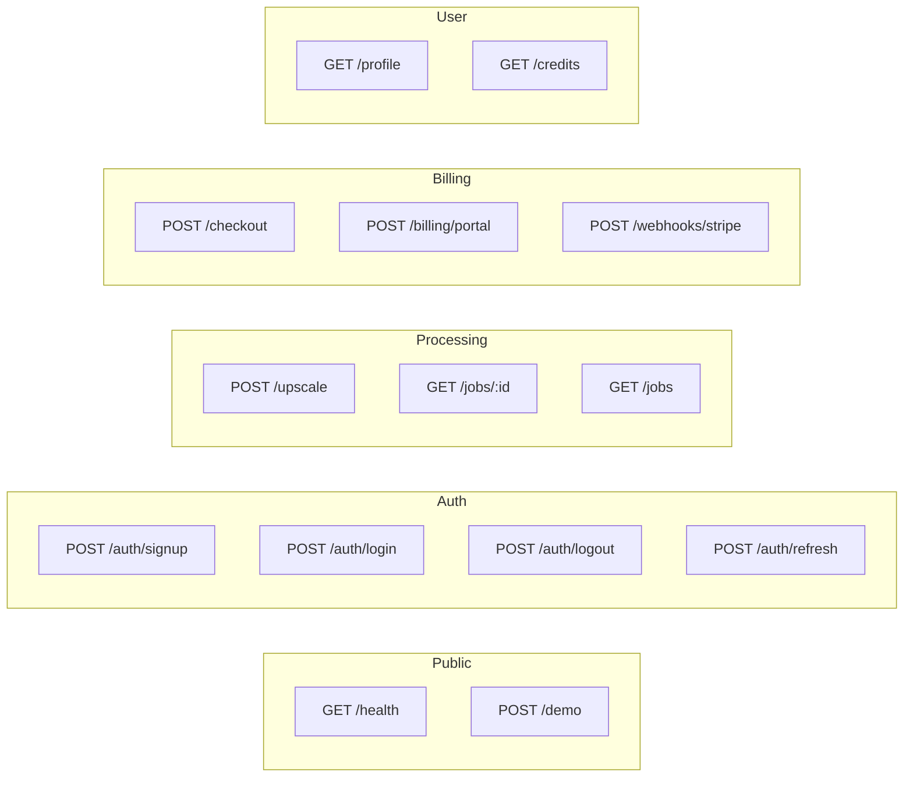
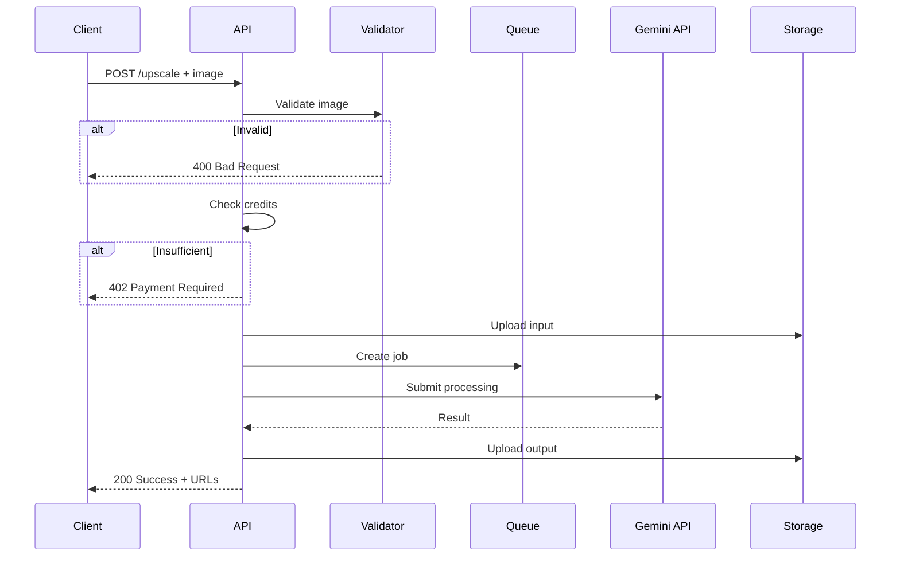
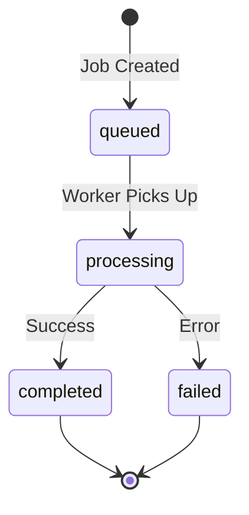
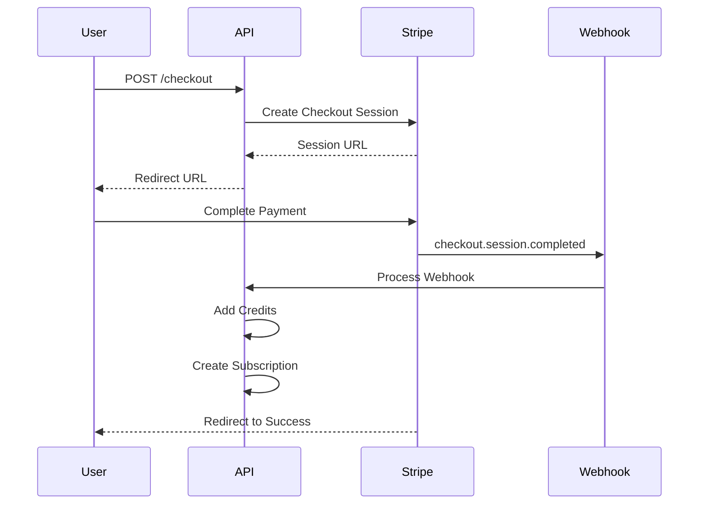
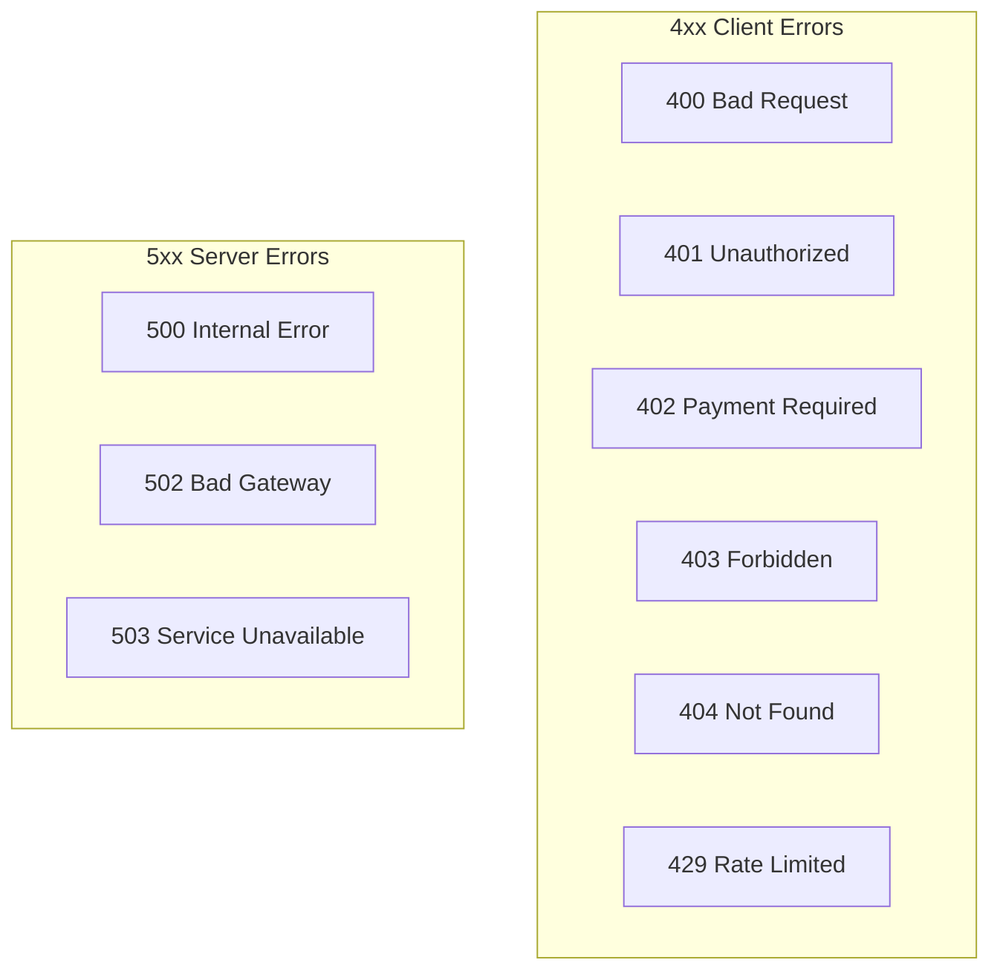

# API Reference

PixelPerfect REST API documentation for image processing and account management.

## Base URL

```
Production: https://pixelperfect.app/api
Development: http://localhost:3000/api
```

## Authentication

All protected endpoints require a valid JWT token in the Authorization header:

```
Authorization: Bearer <jwt_token>
```

For API access (Business tier), use an API key:

```
Authorization: Bearer <api_key>
```

## Rate Limits

| Tier     | Protected Routes | Public Routes |
| -------- | ---------------- | ------------- |
| Free     | 50 req/10s       | 10 req/10s    |
| Starter  | 100 req/10s      | 10 req/10s    |
| Pro      | 200 req/10s      | 10 req/10s    |
| Business | 500 req/10s      | 10 req/10s    |

Rate limit headers are included in responses:

- `X-RateLimit-Limit`: Maximum requests allowed
- `X-RateLimit-Remaining`: Requests remaining
- `X-RateLimit-Reset`: Unix timestamp when limit resets

---

## Endpoints Overview



---

## Image Processing

### POST /api/upscale

Process and upscale an image.

**Authentication:** Required

**Request:**

```typescript
// Content-Type: multipart/form-data
{
  image: File,           // Required: Image file (JPG, PNG, WEBP, HEIC)
  mode: string,          // Optional: "standard" | "enhanced" | "gentle" | "portrait" | "product"
  scale: number,         // Optional: 2 | 4 | 8 (default: 2)
  format: string,        // Optional: "jpg" | "png" | "webp" (default: original)
  preserveText: boolean, // Optional: Enable text/logo preservation (default: true)
  prompt: string         // Optional: Custom preservation instructions
}
```

**Response:**

```json
{
  "success": true,
  "data": {
    "jobId": "uuid",
    "status": "completed",
    "inputUrl": "https://cdn.pixelperfect.app/input/...",
    "outputUrl": "https://cdn.pixelperfect.app/output/...",
    "creditsUsed": 1,
    "processingTime": 45.2,
    "metadata": {
      "inputSize": { "width": 800, "height": 600 },
      "outputSize": { "width": 1600, "height": 1200 },
      "scale": 2,
      "mode": "standard"
    }
  }
}
```

**Processing Flow:**



**Error Responses:**

| Status | Code                   | Description                              |
| ------ | ---------------------- | ---------------------------------------- |
| 400    | `INVALID_FILE`         | File type not supported                  |
| 400    | `FILE_TOO_LARGE`       | Exceeds size limit (5MB free, 25MB paid) |
| 401    | `UNAUTHORIZED`         | Invalid or missing token                 |
| 402    | `INSUFFICIENT_CREDITS` | Not enough credits                       |
| 429    | `RATE_LIMITED`         | Too many requests                        |
| 500    | `PROCESSING_FAILED`    | AI processing error                      |

---

### POST /api/upscale/batch

Process multiple images in batch.

**Authentication:** Required (Pro/Business tier)

**Request:**

```typescript
// Content-Type: multipart/form-data
{
  images: File[],        // Required: Array of image files (max 50 Pro, 500 Business)
  mode: string,          // Optional: Processing mode for all images
  scale: number,         // Optional: Scale factor for all images
  format: string,        // Optional: Output format for all images
  webhook: string        // Optional: URL to receive completion callback
}
```

**Response:**

```json
{
  "success": true,
  "data": {
    "batchId": "uuid",
    "status": "processing",
    "totalImages": 25,
    "creditsReserved": 25,
    "estimatedTime": 300
  }
}
```

---

### GET /api/jobs/:id

Get processing job status.

**Authentication:** Required

**Response:**

```json
{
  "success": true,
  "data": {
    "id": "uuid",
    "status": "completed",
    "inputUrl": "https://...",
    "outputUrl": "https://...",
    "creditsUsed": 1,
    "mode": "standard",
    "scale": 2,
    "createdAt": "2024-01-15T10:30:00Z",
    "completedAt": "2024-01-15T10:30:45Z"
  }
}
```

**Job Status Flow:**



---

### GET /api/jobs

List user's processing history.

**Authentication:** Required

**Query Parameters:**

| Parameter | Type   | Description                            |
| --------- | ------ | -------------------------------------- |
| `page`    | number | Page number (default: 1)               |
| `limit`   | number | Items per page (default: 20, max: 100) |
| `status`  | string | Filter by status                       |
| `from`    | string | Start date (ISO 8601)                  |
| `to`      | string | End date (ISO 8601)                    |

**Response:**

```json
{
  "success": true,
  "data": {
    "jobs": [...],
    "pagination": {
      "page": 1,
      "limit": 20,
      "total": 156,
      "pages": 8
    }
  }
}
```

---

## Authentication

### POST /api/auth/signup

Create a new account.

**Request:**

```json
{
  "email": "user@example.com",
  "password": "securepassword123"
}
```

**Response:**

```json
{
  "success": true,
  "data": {
    "user": {
      "id": "uuid",
      "email": "user@example.com"
    },
    "message": "Verification email sent"
  }
}
```

---

### POST /api/auth/login

Authenticate user.

**Request:**

```json
{
  "email": "user@example.com",
  "password": "securepassword123"
}
```

**Response:**

```json
{
  "success": true,
  "data": {
    "user": {
      "id": "uuid",
      "email": "user@example.com"
    },
    "session": {
      "accessToken": "jwt...",
      "refreshToken": "refresh...",
      "expiresAt": 1705320000
    }
  }
}
```

---

### POST /api/auth/logout

End user session.

**Authentication:** Required

**Response:**

```json
{
  "success": true,
  "message": "Logged out successfully"
}
```

---

## Billing

### POST /api/checkout

Create Stripe checkout session.

**Authentication:** Required

**Request:**

```json
{
  "priceId": "price_xxx",
  "successUrl": "https://pixelperfect.app/dashboard?success=true",
  "cancelUrl": "https://pixelperfect.app/pricing"
}
```

**Response:**

```json
{
  "success": true,
  "data": {
    "checkoutUrl": "https://checkout.stripe.com/..."
  }
}
```

**Checkout Flow:**



---

### POST /api/billing/portal

Create Stripe customer portal session.

**Authentication:** Required

**Response:**

```json
{
  "success": true,
  "data": {
    "portalUrl": "https://billing.stripe.com/..."
  }
}
```

---

### POST /api/webhooks/stripe

Handle Stripe webhook events.

**Authentication:** Stripe signature verification

**Handled Events:**

| Event                           | Action                           |
| ------------------------------- | -------------------------------- |
| `checkout.session.completed`    | Add credits, create subscription |
| `invoice.payment_succeeded`     | Renew credits                    |
| `customer.subscription.updated` | Update tier/status               |
| `customer.subscription.deleted` | Cancel subscription              |

---

## User

### GET /api/profile

Get current user profile.

**Authentication:** Required

**Response:**

```json
{
  "success": true,
  "data": {
    "id": "uuid",
    "email": "user@example.com",
    "creditsBalance": 85,
    "subscriptionStatus": "active",
    "subscriptionTier": "pro",
    "createdAt": "2024-01-01T00:00:00Z"
  }
}
```

---

### GET /api/credits

Get credit balance and history.

**Authentication:** Required

**Response:**

```json
{
  "success": true,
  "data": {
    "balance": 85,
    "monthlyAllowance": 500,
    "used": 415,
    "rollover": 100,
    "expiresAt": "2024-02-01T00:00:00Z",
    "recentTransactions": [
      {
        "id": "uuid",
        "amount": -1,
        "type": "usage",
        "description": "Image processing",
        "createdAt": "2024-01-15T10:30:00Z"
      }
    ]
  }
}
```

---

## Error Response Format

All errors follow this format:

```json
{
  "success": false,
  "error": {
    "code": "ERROR_CODE",
    "message": "Human-readable message",
    "details": {}
  }
}
```

**Common Error Codes:**



| Code                   | HTTP Status | Description              |
| ---------------------- | ----------- | ------------------------ |
| `INVALID_REQUEST`      | 400         | Malformed request body   |
| `INVALID_FILE`         | 400         | Unsupported file type    |
| `FILE_TOO_LARGE`       | 400         | File exceeds size limit  |
| `UNAUTHORIZED`         | 401         | Missing or invalid token |
| `INSUFFICIENT_CREDITS` | 402         | Not enough credits       |
| `FORBIDDEN`            | 403         | Access denied            |
| `NOT_FOUND`            | 404         | Resource not found       |
| `RATE_LIMITED`         | 429         | Too many requests        |
| `INTERNAL_ERROR`       | 500         | Server error             |
| `AI_UNAVAILABLE`       | 503         | AI service down          |
