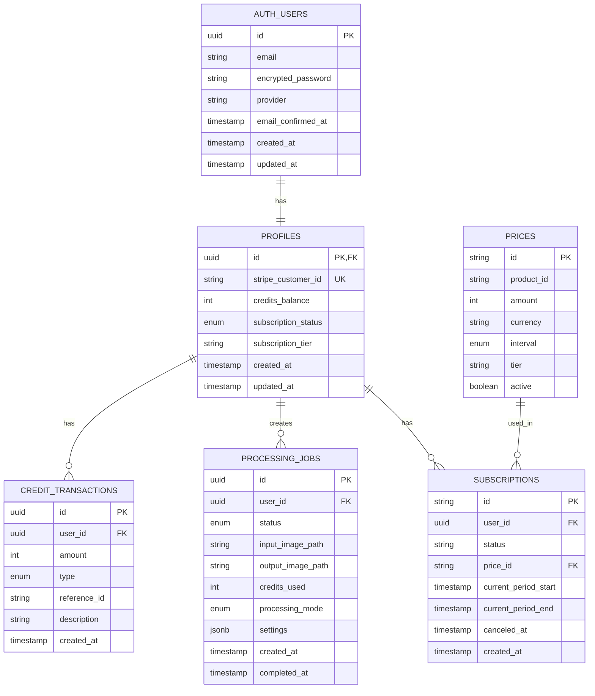

# Database Schema

myimageupscaler.com uses PostgreSQL via Supabase with Row Level Security (RLS) for data isolation.

## Entity Relationship Diagram



## Tables

### profiles

Extends Supabase `auth.users` with application-specific data.

| Column                | Type        | Constraints          | Description                                |
| --------------------- | ----------- | -------------------- | ------------------------------------------ |
| `id`                  | uuid        | PK, FK → auth.users  | User identifier                            |
| `stripe_customer_id`  | text        | UNIQUE, nullable     | Stripe customer reference                  |
| `credits_balance`     | integer     | NOT NULL, DEFAULT 10 | Available processing credits               |
| `subscription_status` | text        | DEFAULT 'free'       | active, trialing, past_due, canceled, free |
| `subscription_tier`   | text        | nullable             | starter, pro, business                     |
| `created_at`          | timestamptz | DEFAULT now()        | Record creation time                       |
| `updated_at`          | timestamptz | DEFAULT now()        | Last update time                           |

```sql
CREATE TABLE profiles (
    id UUID PRIMARY KEY REFERENCES auth.users(id) ON DELETE CASCADE,
    stripe_customer_id TEXT UNIQUE,
    credits_balance INTEGER NOT NULL DEFAULT 10,
    subscription_status TEXT DEFAULT 'free',
    subscription_tier TEXT,
    created_at TIMESTAMPTZ DEFAULT NOW(),
    updated_at TIMESTAMPTZ DEFAULT NOW()
);

-- Auto-create profile on user signup
CREATE OR REPLACE FUNCTION handle_new_user()
RETURNS TRIGGER AS $$
BEGIN
    INSERT INTO public.profiles (id, credits_balance)
    VALUES (NEW.id, 10);
    RETURN NEW;
END;
$$ LANGUAGE plpgsql SECURITY DEFINER;

CREATE TRIGGER on_auth_user_created
    AFTER INSERT ON auth.users
    FOR EACH ROW EXECUTE FUNCTION handle_new_user();
```

### subscriptions

Tracks Stripe subscription state, synced via webhooks.

| Column                 | Type        | Constraints   | Description                    |
| ---------------------- | ----------- | ------------- | ------------------------------ |
| `id`                   | text        | PK            | Stripe subscription ID         |
| `user_id`              | uuid        | FK → profiles | Owner                          |
| `status`               | text        | NOT NULL      | Stripe subscription status     |
| `price_id`             | text        | NOT NULL      | Stripe price ID                |
| `current_period_start` | timestamptz |               | Billing period start           |
| `current_period_end`   | timestamptz |               | Billing period end             |
| `canceled_at`          | timestamptz | nullable      | When subscription was canceled |
| `created_at`           | timestamptz | DEFAULT now() | Record creation time           |

```sql
CREATE TABLE subscriptions (
    id TEXT PRIMARY KEY,
    user_id UUID NOT NULL REFERENCES profiles(id) ON DELETE CASCADE,
    status TEXT NOT NULL,
    price_id TEXT NOT NULL,
    current_period_start TIMESTAMPTZ,
    current_period_end TIMESTAMPTZ,
    canceled_at TIMESTAMPTZ,
    created_at TIMESTAMPTZ DEFAULT NOW()
);

CREATE INDEX idx_subscriptions_user_id ON subscriptions(user_id);
CREATE INDEX idx_subscriptions_status ON subscriptions(status);
```

### processing_jobs

Records all image processing operations.

| Column              | Type        | Constraints                   | Description                                   |
| ------------------- | ----------- | ----------------------------- | --------------------------------------------- |
| `id`                | uuid        | PK, DEFAULT gen_random_uuid() | Job identifier                                |
| `user_id`           | uuid        | FK → profiles                 | Owner                                         |
| `status`            | text        | NOT NULL                      | queued, processing, completed, failed         |
| `input_image_path`  | text        | NOT NULL                      | R2 storage path for input                     |
| `output_image_path` | text        | nullable                      | R2 storage path for output                    |
| `credits_used`      | integer     | NOT NULL DEFAULT 1            | Credits consumed                              |
| `processing_mode`   | text        | NOT NULL                      | standard, enhanced, gentle, portrait, product |
| `settings`          | jsonb       | DEFAULT '{}'                  | Processing parameters                         |
| `error_message`     | text        | nullable                      | Error details if failed                       |
| `created_at`        | timestamptz | DEFAULT now()                 | Job creation time                             |
| `completed_at`      | timestamptz | nullable                      | Job completion time                           |

```sql
CREATE TABLE processing_jobs (
    id UUID PRIMARY KEY DEFAULT gen_random_uuid(),
    user_id UUID NOT NULL REFERENCES profiles(id) ON DELETE CASCADE,
    status TEXT NOT NULL DEFAULT 'queued',
    input_image_path TEXT NOT NULL,
    output_image_path TEXT,
    credits_used INTEGER NOT NULL DEFAULT 1,
    processing_mode TEXT NOT NULL DEFAULT 'standard',
    settings JSONB DEFAULT '{}',
    error_message TEXT,
    created_at TIMESTAMPTZ DEFAULT NOW(),
    completed_at TIMESTAMPTZ,

    CONSTRAINT valid_status CHECK (status IN ('queued', 'processing', 'completed', 'failed')),
    CONSTRAINT valid_mode CHECK (processing_mode IN ('standard', 'enhanced', 'gentle', 'portrait', 'product'))
);

CREATE INDEX idx_processing_jobs_user_id ON processing_jobs(user_id);
CREATE INDEX idx_processing_jobs_status ON processing_jobs(status);
CREATE INDEX idx_processing_jobs_created_at ON processing_jobs(created_at DESC);
```

### credit_transactions

Audit log for all credit changes.

| Column         | Type        | Constraints   | Description                                  |
| -------------- | ----------- | ------------- | -------------------------------------------- |
| `id`           | uuid        | PK            | Transaction identifier                       |
| `user_id`      | uuid        | FK → profiles | User                                         |
| `amount`       | integer     | NOT NULL      | Credits added (+) or used (-)                |
| `type`         | text        | NOT NULL      | purchase, subscription, usage, refund, bonus |
| `reference_id` | text        | nullable      | Related Stripe/job ID                        |
| `description`  | text        | nullable      | Human-readable description                   |
| `created_at`   | timestamptz | DEFAULT now() | Transaction time                             |

```sql
CREATE TABLE credit_transactions (
    id UUID PRIMARY KEY DEFAULT gen_random_uuid(),
    user_id UUID NOT NULL REFERENCES profiles(id) ON DELETE CASCADE,
    amount INTEGER NOT NULL,
    type TEXT NOT NULL,
    reference_id TEXT,
    description TEXT,
    created_at TIMESTAMPTZ DEFAULT NOW(),

    CONSTRAINT valid_type CHECK (type IN ('purchase', 'subscription', 'usage', 'refund', 'bonus'))
);

CREATE INDEX idx_credit_transactions_user_id ON credit_transactions(user_id);
CREATE INDEX idx_credit_transactions_created_at ON credit_transactions(created_at DESC);
```

### prices

Local cache of Stripe pricing (optional, for faster lookups).

| Column       | Type       | Constraints   | Description                       |
| ------------ | ---------- | ------------- | --------------------------------- |
| `id`         | text       | PK            | Stripe price ID                   |
| `product_id` | text       | NOT NULL      | Stripe product ID                 |
| `amount`     | integer    | NOT NULL      | Price in cents                    |
| `currency`   | varchar(3) | DEFAULT 'usd' | Currency code                     |
| `interval`   | text       | nullable      | month, year, or null for one-time |
| `tier`       | text       | NOT NULL      | starter, pro, business            |
| `credits`    | integer    | NOT NULL      | Credits included                  |
| `active`     | boolean    | DEFAULT true  | Whether price is available        |

```sql
CREATE TABLE prices (
    id TEXT PRIMARY KEY,
    product_id TEXT NOT NULL,
    amount INTEGER NOT NULL,
    currency VARCHAR(3) DEFAULT 'usd',
    interval TEXT,
    tier TEXT NOT NULL,
    credits INTEGER NOT NULL,
    active BOOLEAN DEFAULT TRUE,

    CONSTRAINT valid_interval CHECK (interval IS NULL OR interval IN ('month', 'year'))
);
```

## Row Level Security (RLS)

```sql
-- Enable RLS on all tables
ALTER TABLE profiles ENABLE ROW LEVEL SECURITY;
ALTER TABLE subscriptions ENABLE ROW LEVEL SECURITY;
ALTER TABLE processing_jobs ENABLE ROW LEVEL SECURITY;
ALTER TABLE credit_transactions ENABLE ROW LEVEL SECURITY;

-- Profiles: Users can only access their own profile
CREATE POLICY "Users can view own profile"
    ON profiles FOR SELECT
    USING (auth.uid() = id);

CREATE POLICY "Users can update own profile"
    ON profiles FOR UPDATE
    USING (auth.uid() = id);

-- Subscriptions: Users can only view their own subscriptions
CREATE POLICY "Users can view own subscriptions"
    ON subscriptions FOR SELECT
    USING (auth.uid() = user_id);

-- Processing Jobs: Users can only access their own jobs
CREATE POLICY "Users can view own jobs"
    ON processing_jobs FOR SELECT
    USING (auth.uid() = user_id);

CREATE POLICY "Users can create own jobs"
    ON processing_jobs FOR INSERT
    WITH CHECK (auth.uid() = user_id);

-- Credit Transactions: Users can only view their own transactions
CREATE POLICY "Users can view own transactions"
    ON credit_transactions FOR SELECT
    USING (auth.uid() = user_id);

-- Service role bypass for webhooks and background jobs
-- (Service role key automatically bypasses RLS)
```

## Indexes Summary

| Table               | Index           | Purpose                          |
| ------------------- | --------------- | -------------------------------- |
| subscriptions       | user_id         | Fast subscription lookup by user |
| subscriptions       | status          | Filter active subscriptions      |
| processing_jobs     | user_id         | User's job history               |
| processing_jobs     | status          | Queue processing                 |
| processing_jobs     | created_at DESC | Recent jobs first                |
| credit_transactions | user_id         | User's transaction history       |
| credit_transactions | created_at DESC | Recent transactions first        |
