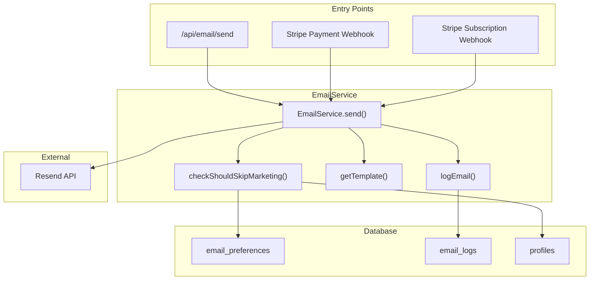
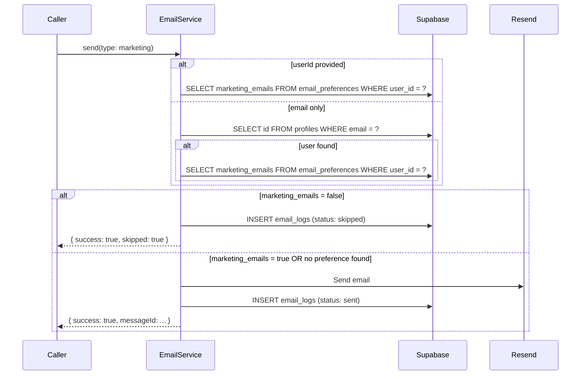

# Email System Documentation

## Overview

The email system provides transactional and marketing email capabilities via **Resend** with React Email templates. It integrates with Stripe webhooks for payment notifications, enforces user preferences for marketing opt-outs, and maintains an audit trail of all sent emails.

### Key Features

- Transactional emails (payment confirmations, password resets)
- Marketing preference enforcement with opt-out support
- User lookup by email address for preference checking
- React Email templates with consistent branding
- Comprehensive audit logging in `email_logs` table
- Integration with Stripe webhooks for payment events
- **Development mode**: Skips actual email sending and logs payload instead

### Development Mode

When `ENV=development`, the email service skips actual Resend API calls and instead:

1. Logs the complete email payload to console with `[EMAIL_DEV_MODE]` prefix
2. Records the email in `email_logs` with `{ dev_mode: true }` in `provider_response`
3. Returns a success response with a mock message ID (`dev-{timestamp}`)

This allows testing email flows without sending real emails or consuming Resend quota.

**Console output example:**

```
[EMAIL_DEV_MODE] Email would be sent: {
  from: 'noreply@myimageupscaler.com',
  to: 'user@example.com',
  subject: 'Payment Confirmed - $50',
  template: 'payment-success',
  type: 'transactional',
  userId: 'user-123',
  templateData: { amount: '$50', credits: 100, ... }
}
```

## Architecture



## Core Components

### EmailService (`/home/joao/projects/pixelperfect/server/services/email.service.ts`)

The singleton service handles all email operations.

| Method                                      | Purpose                                                               |
| ------------------------------------------- | --------------------------------------------------------------------- |
| `send(params)`                              | Main entry point for sending emails                                   |
| `checkShouldSkipMarketing(userId?, email?)` | Checks if marketing email should be skipped based on user preferences |
| `getTemplate(templateName)`                 | Dynamically loads React Email template                                |
| `getSubject(template, data)`                | Generates subject line based on template type                         |
| `logEmail(params)`                          | Records email attempt in `email_logs` table                           |

#### Singleton Pattern

```typescript
import { getEmailService } from '@server/services/email.service';

const emailService = getEmailService();
await emailService.send({ ... });
```

### Email Types

| Type            | Description                        | Preference Check                     |
| --------------- | ---------------------------------- | ------------------------------------ |
| `transactional` | Essential account emails (default) | Never skipped                        |
| `marketing`     | Promotional content                | Checks `marketing_emails` preference |

## API Endpoints

### POST `/api/email/send` (Admin Only)

**Authentication**: Requires admin role

**Request Body**:

```typescript
{
  to: string;           // Valid email address
  template: string;     // Template name (see templates below)
  data: object;         // Template-specific data
  type?: 'transactional' | 'marketing';  // Default: transactional
}
```

**Response**:

```typescript
// Success
{ success: true, messageId: string }

// Skipped (marketing opt-out)
{ success: true, skipped: true }

// Error
{
  success: false,
  error: {
    code: string,      // UNAUTHORIZED | VALIDATION_ERROR | TEMPLATE_NOT_FOUND | RESEND_ERROR | SEND_FAILED
    message: string
  }
}
```

**File**: `/home/joao/projects/pixelperfect/app/api/email/send/route.ts`

### GET/PATCH `/api/email/preferences`

**Authentication**: Requires authenticated user

**GET Response**:

```typescript
{
  success: true,
  data: {
    marketing_emails: boolean,
    product_updates: boolean,
    low_credit_alerts: boolean
  }
}
```

**PATCH Request**:

```typescript
{
  marketing_emails?: boolean,
  product_updates?: boolean,
  low_credit_alerts?: boolean
}
```

**File**: `/home/joao/projects/pixelperfect/app/api/email/preferences/route.ts`

## Database Schema

**Migration**: `/home/joao/projects/pixelperfect/supabase/migrations/20260116_create_email_tables.sql`

### email_preferences

| Column              | Type        | Default | Description              |
| ------------------- | ----------- | ------- | ------------------------ |
| `user_id`           | UUID (PK)   | -       | References `profiles.id` |
| `marketing_emails`  | BOOLEAN     | TRUE    | Marketing email opt-in   |
| `product_updates`   | BOOLEAN     | TRUE    | Product update emails    |
| `low_credit_alerts` | BOOLEAN     | TRUE    | Low credit notifications |
| `created_at`        | TIMESTAMPTZ | NOW()   | Record creation time     |
| `updated_at`        | TIMESTAMPTZ | NOW()   | Last update time         |

**RLS Policies**:

- `Users can view own preferences` - SELECT where `auth.uid() = user_id`
- `Users can update own preferences` - UPDATE where `auth.uid() = user_id`
- `Users can insert own preferences` - INSERT with CHECK `auth.uid() = user_id`

### email_logs

| Column              | Type        | Default           | Description                        |
| ------------------- | ----------- | ----------------- | ---------------------------------- |
| `id`                | UUID (PK)   | gen_random_uuid() | Log entry ID                       |
| `user_id`           | UUID        | NULL              | References `profiles.id`, nullable |
| `email_type`        | TEXT        | -                 | 'transactional' or 'marketing'     |
| `template_name`     | TEXT        | -                 | Template identifier used           |
| `recipient_email`   | TEXT        | -                 | Destination email address          |
| `status`            | TEXT        | -                 | 'sent', 'failed', or 'skipped'     |
| `provider_response` | JSONB       | NULL              | Resend API response                |
| `sent_at`           | TIMESTAMPTZ | NOW()             | Timestamp of attempt               |

**Indexes**:

- `idx_email_logs_user_id` - For user-specific queries
- `idx_email_logs_sent_at` - For chronological queries (DESC)
- `idx_email_logs_template` - For template usage analytics

**RLS Policies**:

- `Users can view own email logs` - SELECT where `auth.uid() = user_id`
- `Service role can insert logs` - INSERT with CHECK `true` (service role bypasses RLS)

### Auto-Creation Trigger

New users automatically get default email preferences:

```sql
CREATE TRIGGER on_user_created_email_prefs
  AFTER INSERT ON public.profiles
  FOR EACH ROW
  EXECUTE FUNCTION public.handle_new_user_email_prefs();
```

## Email Templates

All templates are React components using `@react-email/components`.

**Location**: `/home/joao/projects/pixelperfect/emails/templates/`

| Template              | File                          | Subject                              | Common Data Props                                         |
| --------------------- | ----------------------------- | ------------------------------------ | --------------------------------------------------------- |
| `welcome`             | `WelcomeEmail.tsx`            | "Welcome to {appName}!"              | `userName`, `verifyUrl`                                   |
| `payment-success`     | `PaymentSuccessEmail.tsx`     | "Payment confirmed - {amount}"       | `userName`, `amount`, `planName`, `credits`, `receiptUrl` |
| `subscription-update` | `SubscriptionUpdateEmail.tsx` | "Your subscription has been updated" | `userName`, `planName`, `status`, `action`, `manageUrl`   |
| `low-credits`         | `LowCreditsEmail.tsx`         | "Running low on credits"             | `userName`, `creditsRemaining`, `upgradeUrl`              |
| `password-reset`      | `PasswordResetEmail.tsx`      | "Reset your password"                | `userName`, `resetUrl`                                    |

### Common Props Injected by EmailService

All templates automatically receive:

| Prop           | Source                    | Description              |
| -------------- | ------------------------- | ------------------------ |
| `baseUrl`      | `serverEnv.BASE_URL`      | Application base URL     |
| `supportEmail` | `serverEnv.SUPPORT_EMAIL` | Support contact email    |
| `appName`      | `serverEnv.APP_NAME`      | Application display name |

### Adding a New Template

1. Create template component in `/home/joao/projects/pixelperfect/emails/templates/`
2. Add template name to schema in `/home/joao/projects/pixelperfect/shared/validation/email.schema.ts`
3. Register in `EmailService.getTemplate()` templates map
4. Add subject in `EmailService.getSubject()` subjects map
5. Add mock in unit tests

## Webhook Integration

### Payment Handler (`/home/joao/projects/pixelperfect/app/api/webhooks/stripe/handlers/payment.handler.ts`)

Sends `payment-success` emails for:

- Subscription checkout completion
- Credit pack purchases

```typescript
// Example: Subscription payment email
await emailService.send({
  to: session.customer_email || '',
  template: 'payment-success',
  data: {
    userName: session.customer_details?.name || 'there',
    amount: `$${(session.amount_total || 0) / 100}`,
    planName: planKey,
    receiptUrl: session.receipt_url,
  },
  userId,
});
```

### Subscription Handler (`/home/joao/projects/pixelperfect/app/api/webhooks/stripe/handlers/subscription.handler.ts`)

Sends `subscription-update` emails for:

- Plan upgrades/downgrades
- Subscription cancellations
- Trial ending warnings

```typescript
// Example: Plan change notification
await emailService.send({
  to: profileWithEmail.email,
  template: 'subscription-update',
  data: {
    userName: profileWithEmail.email.split('@')[0] || 'there',
    status: creditDifference > 0 ? 'upgraded' : 'changed',
    action: `Your plan has been ${creditDifference > 0 ? 'upgraded' : 'changed'} from ${previousPlanMetadata.name} to ${planMetadata.name}`,
    newPlan: planMetadata.name,
    previousPlan: previousPlanMetadata.name,
  },
  userId,
});
```

## Marketing Opt-Out Flow

### Preference Check Logic



### Key Behaviors

1. **Fail-Open Strategy**: If preference lookup fails due to database error, marketing email is still sent (fail-open for transactional integrity)
2. **Email-Based Lookup**: When `userId` is not provided, service looks up user by email address in `profiles` table
3. **New Users**: Non-registered email addresses are allowed to receive marketing emails
4. **Default Preferences**: New users default to `marketing_emails: true` via database trigger

## Client Hook

**File**: `/home/joao/projects/pixelperfect/client/hooks/useEmailPreferences.ts`

```typescript
const {
  preferences, // IEmailPreferences | null
  isLoading, // boolean
  isUpdating, // boolean
  error, // string | null
  updatePreference, // (key, value) => Promise<void>
  toggle, // (key) => void
} = useEmailPreferences();
```

### Usage Example

```typescript
import { useEmailPreferences } from '@client/hooks/useEmailPreferences';

function EmailSettings() {
  const { preferences, isLoading, toggle } = useEmailPreferences();

  if (isLoading) return <Loading />;

  return (
    <Switch
      checked={preferences?.marketing_emails ?? false}
      onCheckedChange={() => toggle('marketing_emails')}
    />
  );
}
```

## Error Handling

### Error Codes

| Code                 | Description                       | HTTP Status        |
| -------------------- | --------------------------------- | ------------------ |
| `UNAUTHORIZED`       | Missing or invalid authentication | 401                |
| `VALIDATION_ERROR`   | Request body validation failed    | 400                |
| `API_KEY_MISSING`    | `RESEND_API_KEY` not configured   | Constructor throws |
| `TEMPLATE_NOT_FOUND` | Invalid template name             | 500                |
| `RESEND_ERROR`       | Resend API returned error object  | 500                |
| `SEND_FAILED`        | Email send threw exception        | 500                |
| `FETCH_FAILED`       | Failed to fetch preferences       | 500                |
| `UPDATE_FAILED`      | Failed to update preferences      | 500                |

### Custom Error Class

```typescript
export class EmailError extends Error {
  public readonly code: string;

  constructor(message: string, code: string = 'EMAIL_ERROR') {
    super(message);
    this.name = 'EmailError';
    this.code = code;
  }
}
```

### Webhook Email Failures

Webhook handlers catch email errors separately to avoid failing the webhook:

```typescript
try {
  await emailService.send({ ... });
} catch (emailError) {
  // Log but don't fail the webhook
  console.error('Failed to send email:', emailError);
}
```

## Environment Variables

| Variable             | Required | Description                                                    |
| -------------------- | -------- | -------------------------------------------------------------- |
| `RESEND_API_KEY`     | Yes      | Resend API key for sending emails                              |
| `EMAIL_FROM_ADDRESS` | No       | Sender address (default: `noreply@myimageupscaler.com`)        |
| `SUPPORT_EMAIL`      | No       | Support contact email (default: `support@myimageupscaler.com`) |
| `BASE_URL`           | No       | Application base URL (default: `http://localhost:3000`)        |
| `APP_NAME`           | No       | Application display name (default: `MyImageUpscaler`)          |

## Validation Schema

**File**: `/home/joao/projects/pixelperfect/shared/validation/email.schema.ts`

```typescript
export const sendEmailSchema = z.object({
  to: z.string().email('Invalid email address'),
  template: z.enum([
    'welcome',
    'payment-success',
    'subscription-update',
    'low-credits',
    'password-reset',
  ]),
  data: z.record(z.unknown()).default({}),
  type: z.enum(['transactional', 'marketing']).default('transactional'),
});

export const updatePreferencesSchema = z.object({
  marketing_emails: z.boolean().optional(),
  product_updates: z.boolean().optional(),
  low_credit_alerts: z.boolean().optional(),
});
```

## Testing

### Unit Tests

**File**: `/home/joao/projects/pixelperfect/tests/unit/server/services/email.service.unit.spec.ts`

Coverage includes:

- Transactional email sending
- Marketing email preference checking
- Email lookup by address (no userId)
- Template loading for all types
- Error handling (Resend errors, template not found)
- Edge cases (null/undefined data, special characters)

### API Tests

**File**: `/home/joao/projects/pixelperfect/tests/api/email/email-api.spec.ts`

### Database Tests

**File**: `/home/joao/projects/pixelperfect/tests/api/email/email-database.spec.ts`

### Webhook Email Tests

**File**: `/home/joao/projects/pixelperfect/tests/unit/api/stripe-webhooks-email.unit.spec.ts`

## Usage Examples

### Sending from Webhook Handler

```typescript
import { getEmailService } from '@server/services/email.service';

const emailService = getEmailService();

// Payment confirmation (transactional - always sent)
await emailService.send({
  to: customerEmail,
  template: 'payment-success',
  data: {
    userName: customerName,
    amount: '$29.99',
    planName: 'Pro',
  },
  userId: userId,
  type: 'transactional', // default
});
```

### Sending Marketing Email with Preference Check

```typescript
// Marketing email - respects user preferences
await emailService.send({
  to: userEmail,
  template: 'low-credits',
  data: {
    creditsRemaining: 5,
  },
  userId: userId, // Optional - will lookup by email if not provided
  type: 'marketing',
});
```

### Sending to Non-Registered User

```typescript
// No userId - will lookup by email, allow if not found
await emailService.send({
  to: 'potential-customer@example.com',
  template: 'welcome',
  data: {},
  type: 'marketing',
});
```

## Open Questions / TODOs

1. **Bounce Handling**: No webhook handling for Resend bounce/complaint events
2. **Rate Limiting**: No rate limiting on email sending
3. **Batch Sending**: No support for sending to multiple recipients
4. **Template Preview**: No admin UI for previewing email templates
5. **Unsubscribe Links**: Templates don't include one-click unsubscribe links
6. **product_updates / low_credit_alerts**: These preference fields exist but are not currently checked by the service

---

_Last updated: 2026-01-15_
_Generated from codebase analysis_
