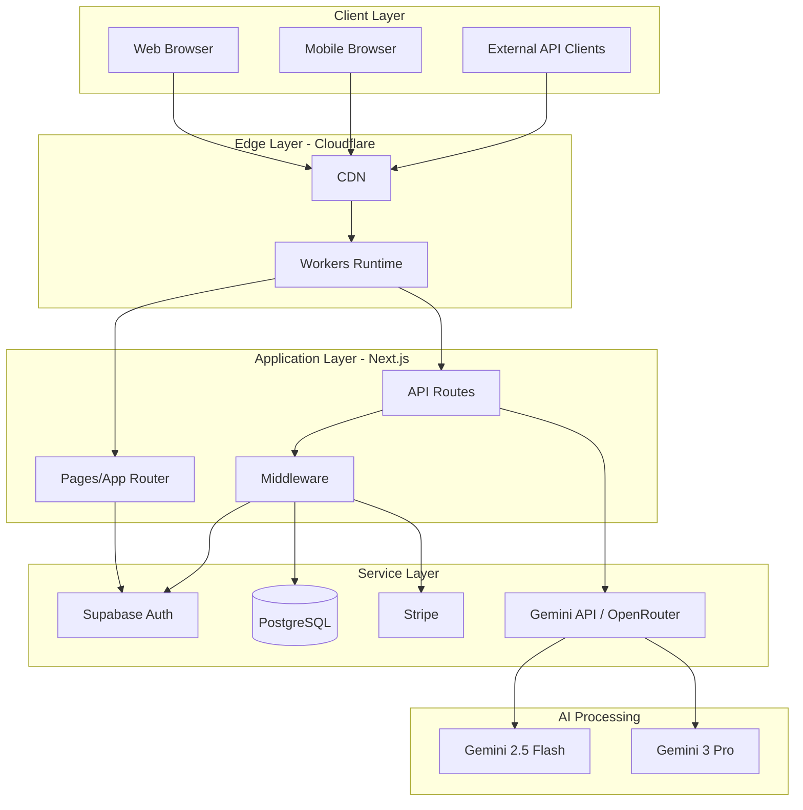
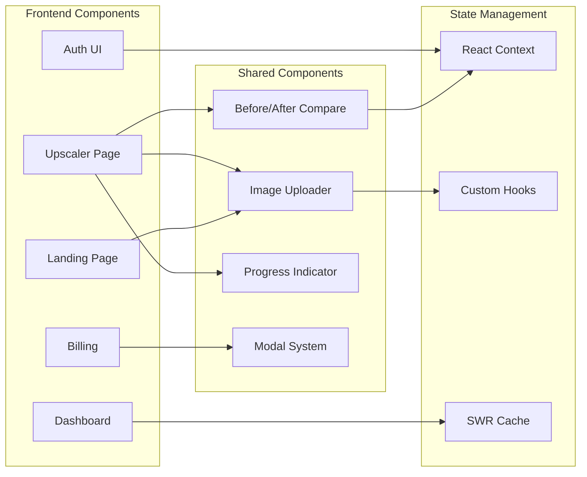
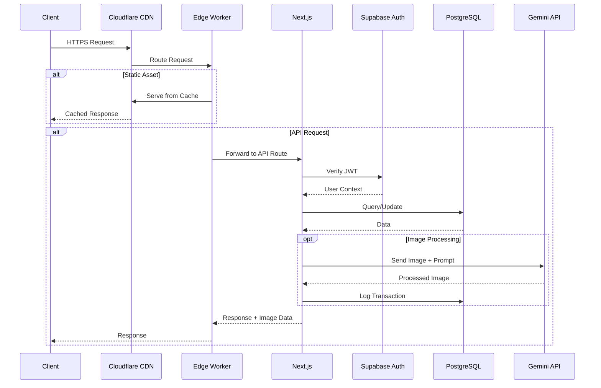
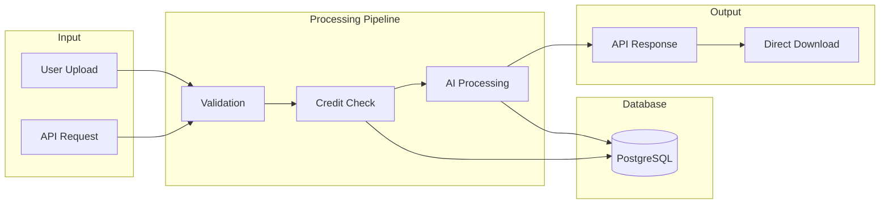
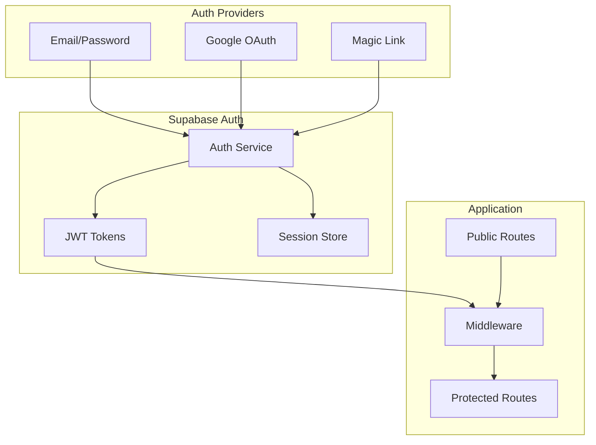
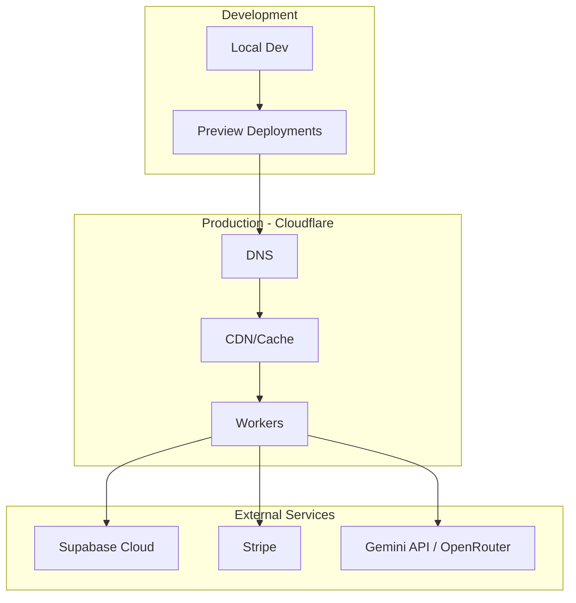
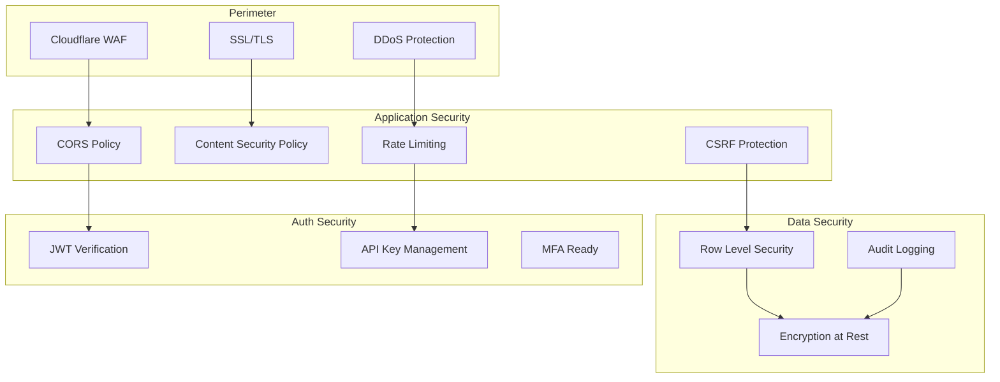
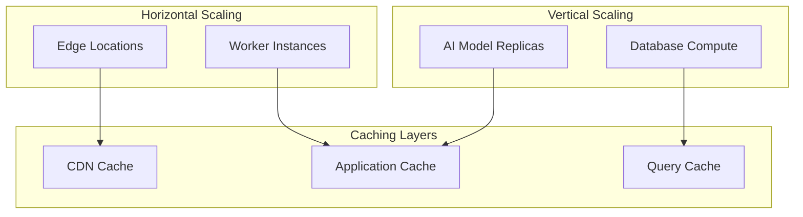
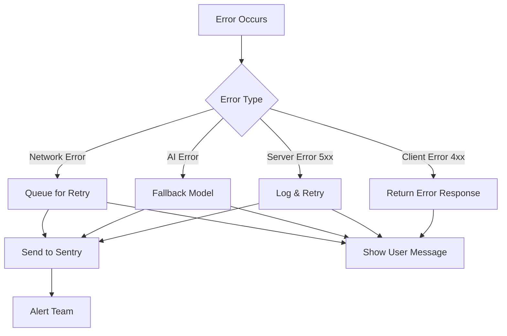
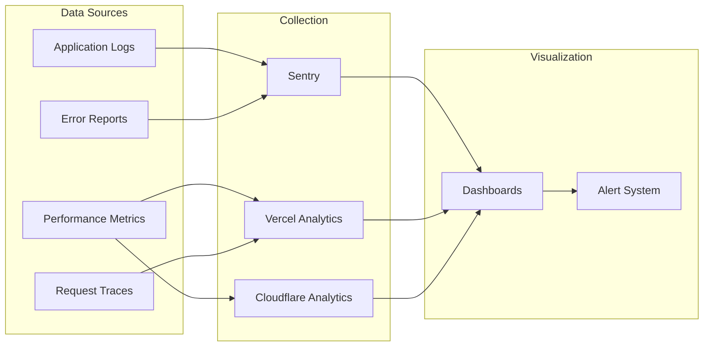

# System Architecture

High-level architecture overview for PixelPerfect AI Image Enhancer.

## Architecture Overview

## Component Architecture

## Request Flow

## Data Flow Architecture

## Authentication Architecture

## Deployment Architecture

## Security Architecture

## Scaling Architecture

## Error Handling Architecture

## Monitoring & Observability

