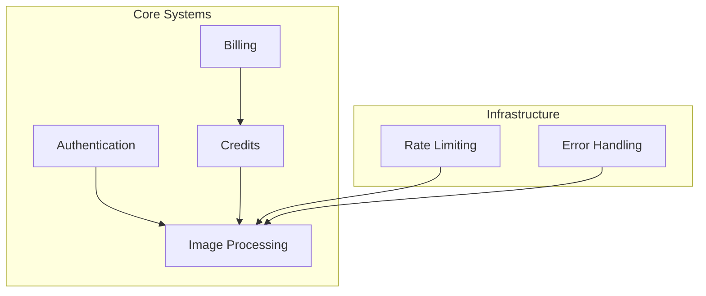
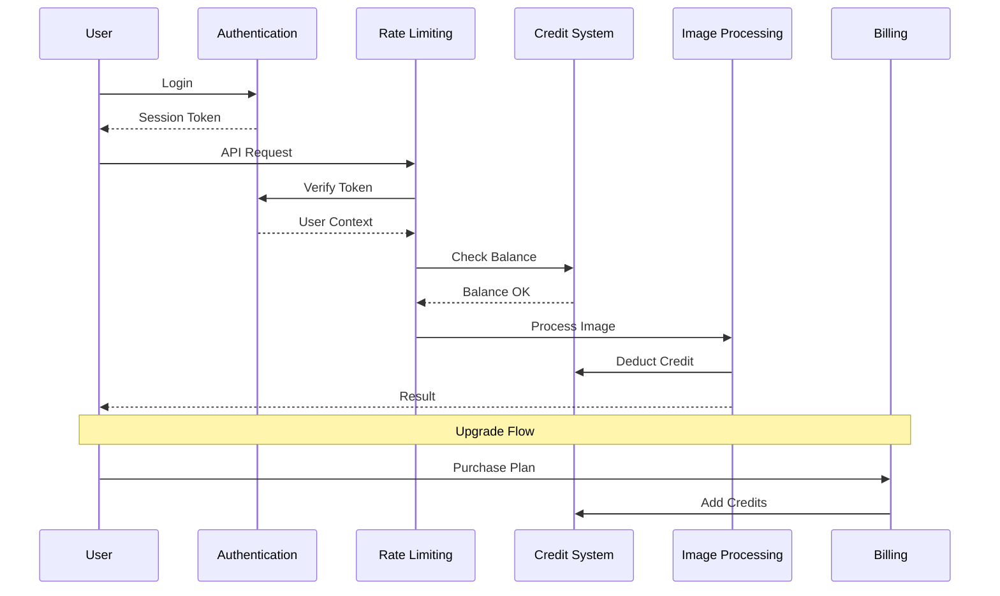

# Systems Documentation

Detailed documentation for PixelPerfect's subsystems.

## Overview

## System Documents

| Document                                     | Description                                 |
| -------------------------------------------- | ------------------------------------------- |
| [authentication.md](./authentication.md)     | User auth, OAuth, session management        |
| [image-processing.md](./image-processing.md) | AI processing flow, prompts, validation     |
| [billing.md](./billing.md)                   | Stripe integration, subscriptions, webhooks |
| [credits.md](./credits.md)                   | Credit system, transactions, rollover       |
| [rate-limiting.md](./rate-limiting.md)       | Request throttling, tier limits             |
| [error-handling.md](./error-handling.md)     | Error codes, recovery, logging              |

## System Interactions

## Key Principles

1. **Stateless Processing**: Images are processed in memory, not stored
2. **Credit-First**: Always verify credits before processing
3. **Graceful Degradation**: Fallback providers for AI failures
4. **Atomic Operations**: Credit deductions are transactional
5. **User-Centric Errors**: Clear, actionable error messages
