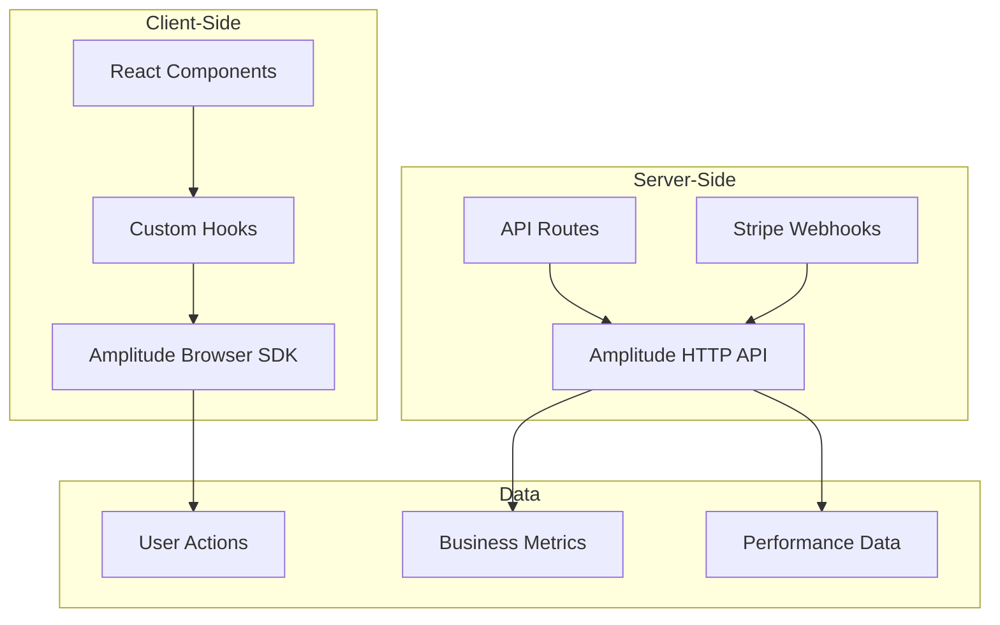
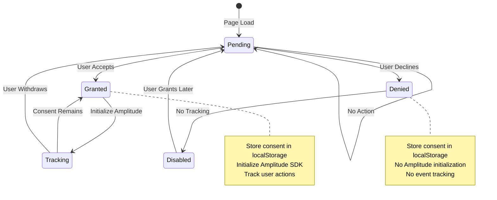
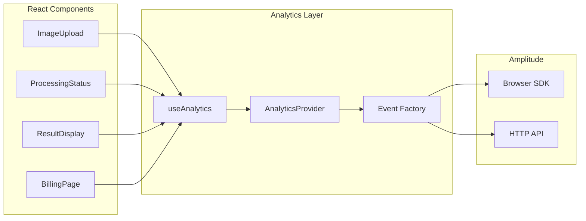

# Analytics System

Comprehensive analytics tracking using Amplitude for user behavior insights and business metrics.

## Overview



## Consent Management

### GDPR-Compliant Consent Flow



### Consent Implementation

```typescript
interface IConsentStatus {
  analytics: 'granted' | 'denied' | 'pending';
  marketing: 'granted' | 'denied' | 'pending';
  updatedAt: number;
}

// Consent management
export const analytics = {
  setConsent(status: IConsentStatus['analytics'], apiKey?: string): void {
    consentStatus = status;

    // Persist consent
    localStorage.setItem(
      CONSENT_STORAGE_KEY,
      JSON.stringify({
        analytics: status,
        updatedAt: Date.now(),
      })
    );

    if (status === 'granted' && apiKey && !isInitialized) {
      this.init(apiKey);
    } else if (status === 'denied' && isInitialized) {
      amplitude.reset();
      isInitialized = false;
    }
  },
};
```

## Event Tracking

### Client-Side Events

#### User Lifecycle Events

```typescript
// Authentication events
analytics.track('user_signed_up', {
  method: 'email', // email, google, magic_link
  referralCode?: string,
});

analytics.track('user_logged_in', {
  method: 'email', // email, google
  isNewDevice: boolean,
});

analytics.track('user_logged_out', {
  sessionDuration: number, // seconds
  actionsPerformed: number,
});
```

#### Feature Usage Events

```typescript
// Image processing events
analytics.track('image_processing_started', {
  inputFormat: 'image/jpeg',
  inputSize: { width: 512, height: 512 },
  scale: 4,
  mode: 'standard',
  preserveText: boolean,
});

analytics.track('image_processing_completed', {
  duration: 3500, // milliseconds
  outputFormat: 'image/png',
  outputSize: { width: 2048, height: 2048 },
  creditsUsed: 1,
  mode: 'standard',
});

analytics.track('image_processing_failed', {
  errorType: 'ai_timeout',
  duration: 12000,
  creditsRefunded: 1,
});
```

#### Credit System Events

```typescript
// Credit transactions
analytics.track('credits_deducted', {
  amount: 1,
  reason: 'image_processing',
  balance: 45,
  subscriptionTier: 'pro',
});

analytics.track('credits_added', {
  amount: 100,
  reason: 'subscription_renewal',
  balance: 145,
  subscriptionTier: 'pro',
});

analytics.track('low_balance_warning_shown', {
  currentBalance: 5,
  monthlyAllowance: 500,
  subscriptionTier: 'pro',
});
```

#### Billing Events

```typescript
// Subscription events
analytics.track('upgrade_started', {
  fromTier: 'free',
  toTier: 'pro',
  entryPoint: 'dashboard_banner', // dashboard_banner, processing_page, pricing_page
});

analytics.track('upgrade_completed', {
  fromTier: 'free',
  toTier: 'pro',
  paymentMethod: 'card',
  trialUsed: boolean,
});
```

### Server-Side Events

#### Payment Events (via Webhooks)

```typescript
// Stripe webhook events
await trackServerEvent('payment_completed', {
  amount: 2900, // cents
  currency: 'usd',
  subscriptionTier: 'pro',
  paymentMethod: 'card',
}, { apiKey: AMPLITUDE_API_KEY, userId: 'user_123' });

await trackServerEvent('subscription_created', {
  plan: 'pro_monthly',
  amount: 2900,
  trialPeriodDays: 0,
  customerId: 'cus_123',
}, { apiKey: AMPLITUDE_API_KEY, userId: 'user_123' });

await trackServerEvent('subscription_cancelled', {
  plan: 'pro_monthly',
  reason: 'customer_request',
  canceledAt: Date.now(),
  refundAmount: 0,
}, { apiKey: AMPLITUDE_API_KEY, userId: 'user_123' });
```

#### System Events

```typescript
// System health and performance
await trackServerEvent('ai_provider_switched', {
  fromProvider: 'gemini',
  toProvider: 'openrouter',
  reason: 'timeout',
  model: 'gemini-2.5-flash-image',
}, { apiKey: AMPLITUDE_API_KEY });

await trackServerEvent('rate_limit_exceeded', {
  endpoint: '/api/upscale',
  userId: 'user_123',
  limit: 50,
  window: 10000, // 10 seconds
}, { apiKey: AMPLITUDE_API_KEY, userId: 'user_123' });
```

## User Identification

### User Properties

```typescript
interface IUserProperties {
  userId: string;
  email?: string; // Will be hashed client-side
  emailHash?: string; // Pre-computed hash from server
  createdAt: string;
  subscriptionTier: 'free' | 'starter' | 'pro' | 'business';
  creditsBalance: number;
  signupSource?: string;
  referralCode?: string;
  country?: string;
}

// User identification
await analytics.identify({
  userId: 'user_123',
  email: 'user@example.com',
  createdAt: '2024-01-15T10:30:00Z',
  subscriptionTier: 'pro',
});
```

### Email Hashing (Privacy)

```typescript
// Client-side secure email hashing
async function hashEmail(email: string): Promise<string> {
  const normalizedEmail = email.toLowerCase().trim();
  const encoder = new TextEncoder();
  const data = encoder.encode(normalizedEmail);
  const hashBuffer = await window.crypto.subtle.digest('SHA-256', data);
  const hashArray = Array.from(new Uint8Array(hashBuffer));
  return hashArray.map(b => b.toString(16).padStart(2, '0')).join('');
}
```

## Page Tracking

### SPA Navigation

```typescript
// Automatic page view tracking
analytics.trackPageView('/upscaler', {
  pageTitle: 'AI Image Upscaler',
  referrer: document.referrer,
  utmSource: url.searchParams.get('utm_source'),
  utmMedium: url.searchParams.get('utm_medium'),
  utmCampaign: url.searchParams.get('utm_campaign'),
});
```

### Session Management

```typescript
// Session tracking
function getSessionId(): string {
  let sessionId = sessionStorage.getItem(SESSION_ID_KEY);
  if (!sessionId) {
    sessionId = `${Date.now()}-${Math.random().toString(36).substring(2, 9)}`;
    sessionStorage.setItem(SESSION_ID_KEY, sessionId);
  }
  return sessionId;
}
```

## Data Schema

### Event Properties Standard

```typescript
interface IStandardEventProperties {
  timestamp: number;
  sessionId: string;
  userId?: string;
  userAgent?: string;
  url?: string;
  referrer?: string;
  utmSource?: string;
  utmMedium?: string;
  utmCampaign?: string;
  utmTerm?: string;
  utmContent?: string;
}
```

### Business Metrics Schema

```typescript
interface IBusinessMetrics {
  // User Metrics
  dailyActiveUsers: number;
  weeklyActiveUsers: number;
  monthlyActiveUsers: number;
  newSignups: number;
  userRetentionRate: number;

  // Usage Metrics
  imagesProcessed: number;
  totalCreditsUsed: number;
  averageProcessingTime: number;
  successRate: number;

  // Revenue Metrics
  mrr: number; // Monthly Recurring Revenue
  arr: number; // Annual Recurring Revenue
  averageRevenuePerUser: number;
  subscriptionConversionRate: number;

  // Feature Metrics
  textPreservationUsage: number;
  batchProcessingUsage: number;
  differentModesUsage: Record<string, number>;
}
```

## Integration Architecture

### Component Integration



### Custom Hook Implementation

```typescript
// useAnalytics hook
export function useAnalytics() {
  return {
    trackUpgrade: (fromTier: string, toTier: string, entryPoint: string) => {
      analytics.track('upgrade_started', {
        fromTier,
        toTier,
        entryPoint,
        timestamp: Date.now(),
      });
    },

    trackProcessingComplete: (metadata: ProcessingMetadata) => {
      analytics.track('image_processing_completed', {
        duration: metadata.duration,
        creditsUsed: metadata.creditsUsed,
        mode: metadata.mode,
        scale: metadata.scale,
        success: metadata.success,
      });
    },

    trackError: (error: Error, context?: object) => {
      analytics.track('error_occurred', {
        errorType: error.name,
        errorMessage: error.message,
        context,
        timestamp: Date.now(),
      });
    },
  };
}
```

## Privacy & Compliance

### Data Collection Policy

| Data Type           | Collection | Purpose                          | Retention |
| ------------------- | ---------- | -------------------------------- | --------- |
| **User Actions**    | Opt-in     | Product improvement              | 24 months |
| **Performance Data**| Automatic  | Service optimization             | 12 months |
| **Email Hash**      | Opt-in     | User identification              | 24 months |
| **IP Address**      | None       | Not collected                    | N/A       |
| **Location Data**   | Opt-in     | Regional analytics (country only)| 24 months |

### Anonymization Strategies

```typescript
// PII removal
function sanitizeEventData(data: Record<string, unknown>): Record<string, unknown> {
  const sensitiveKeys = ['email', 'name', 'phone', 'address'];
  const sanitized = { ...data };

  for (const key of sensitiveKeys) {
    if (key in sanitized) {
      delete sanitized[key];
    }
  }

  return sanitized;
}
```

## Performance Optimization

### Event Batching

```typescript
// Batch multiple events before sending
class EventBatcher {
  private batch: IAnalyticsEvent[] = [];
  private flushInterval: number = 5000; // 5 seconds

  constructor(private batchSize: number = 10) {
    setInterval(() => this.flush(), this.flushInterval);
  }

  add(event: IAnalyticsEvent): void {
    this.batch.push(event);
    if (this.batch.length >= this.batchSize) {
      this.flush();
    }
  }

  private flush(): void {
    if (this.batch.length === 0) return;

    // Send batch to Amplitude
    amplitude.track(this.batch);
    this.batch = [];
  }
}
```

### Sampling Strategy

```typescript
// Sample high-frequency events
const shouldSample = (eventType: string): boolean => {
  const sampleRates: Record<string, number> = {
    'page_view': 1.0,        // 100% of page views
    'mouse_movement': 0.01,  // 1% of mouse movements
    'scroll_event': 0.1,     // 10% of scroll events
    'click_event': 0.5,      // 50% of click events
  };

  const rate = sampleRates[eventType] || 1.0;
  return Math.random() < rate;
};
```

## Debugging & Testing

### Development Mode

```typescript
// Debug logging in development
if (process.env.NODE_ENV === 'development') {
  console.log('[Analytics]', 'Event tracked:', name, properties);
}

// Test environment detection
if (process.env.NODE_ENV === 'test') {
  // Don't send events in tests
  return;
}
```

### Event Validation

```typescript
// Validate event schema
function validateEvent(name: string, properties: Record<string, unknown>): boolean {
  const validEvents = [
    'user_signed_up',
    'image_processing_completed',
    'upgrade_completed',
    // ... etc
  ];

  if (!validEvents.includes(name)) {
    console.warn('[Analytics] Invalid event name:', name);
    return false;
  }

  return true;
}
```

## Environment Configuration

```typescript
// Environment-specific setup
const ANALYTICS_CONFIG = {
  development: {
    apiKey: 'test_amplitude_api_key',
    debug: true,
    trackingEnabled: false,
  },
  staging: {
    apiKey: process.env.NEXT_PUBLIC_AMPLITUDE_API_KEY_STAGING,
    debug: true,
    trackingEnabled: true,
  },
  production: {
    apiKey: process.env.NEXT_PUBLIC_AMPLITUDE_API_KEY,
    debug: false,
    trackingEnabled: true,
  },
};
```

## Dashboard & Reports

### Key Performance Indicators

```typescript
interface IKPIs {
  // User Engagement
  dailyActiveUsers: number;
  sessionDuration: number;
  bounceRate: number;
  retentionRate: number;

  // Product Metrics
  conversionRate: number;
  averageImagesPerSession: number;
  processingSuccessRate: number;

  // Business Metrics
  mrr: number;
  churnRate: number;
  customerLifetimeValue: number;

  // Technical Metrics
  errorRate: number;
  averageResponseTime: number;
  uptime: number;
}
```

### Custom Reports

1. **User Journey Analysis**: Track signups to first image processing
2. **Feature Adoption**: Monitor usage of different processing modes
3. **Conversion Funnel**: Analyze upgrade flow drop-off points
4. **Usage Patterns**: Identify peak usage times and patterns
5. **Error Analysis**: Track processing failures and error rates