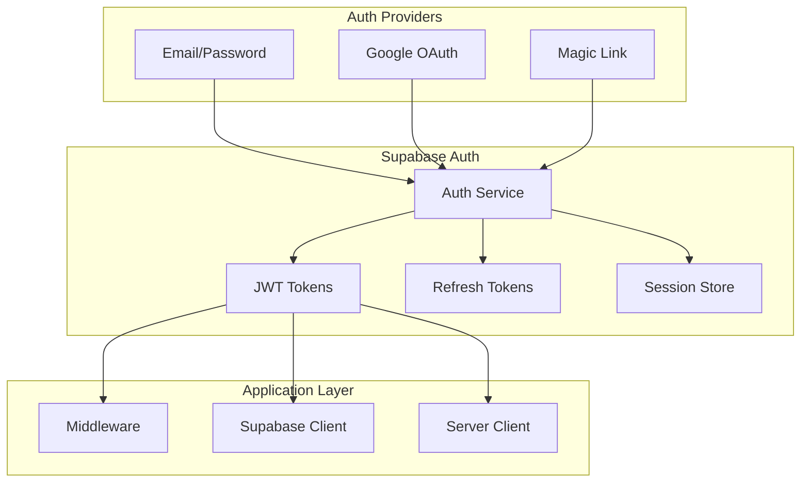
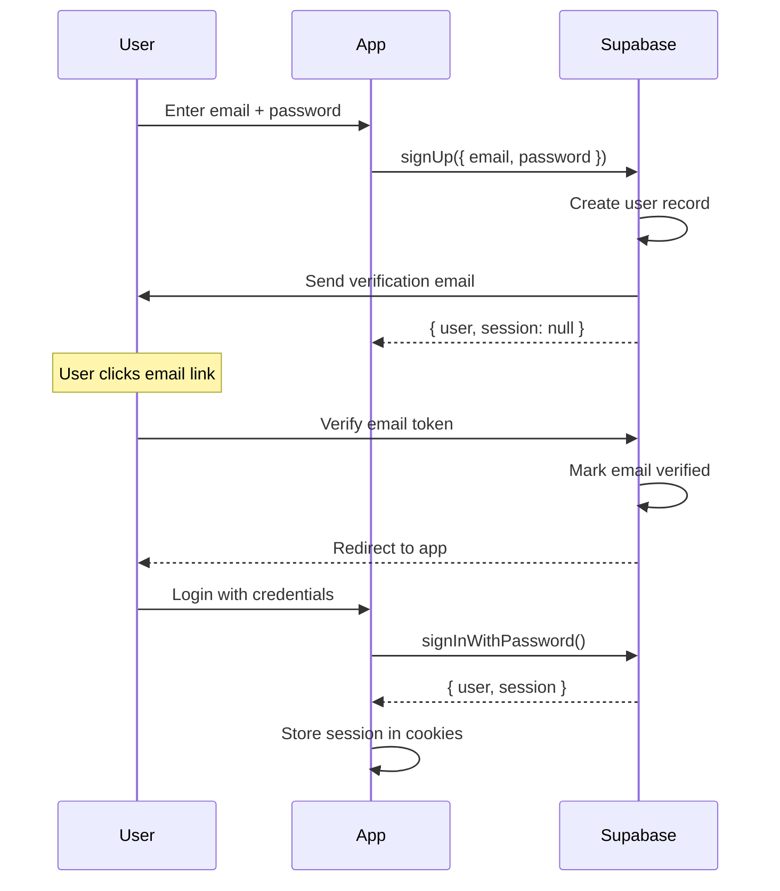
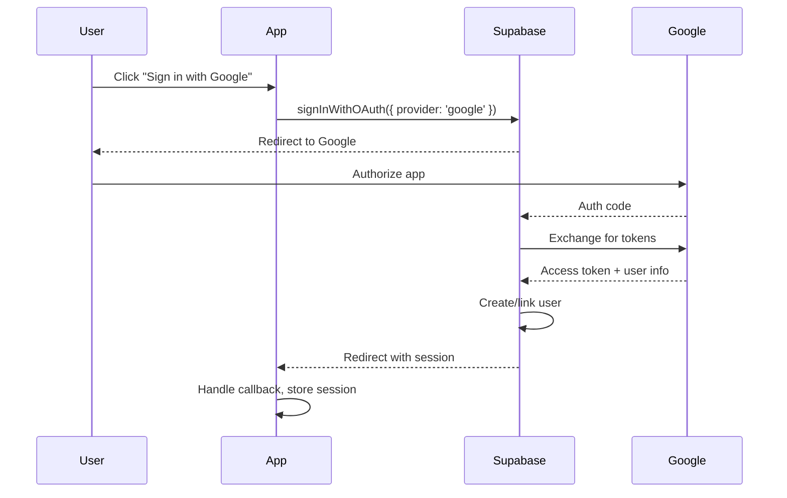
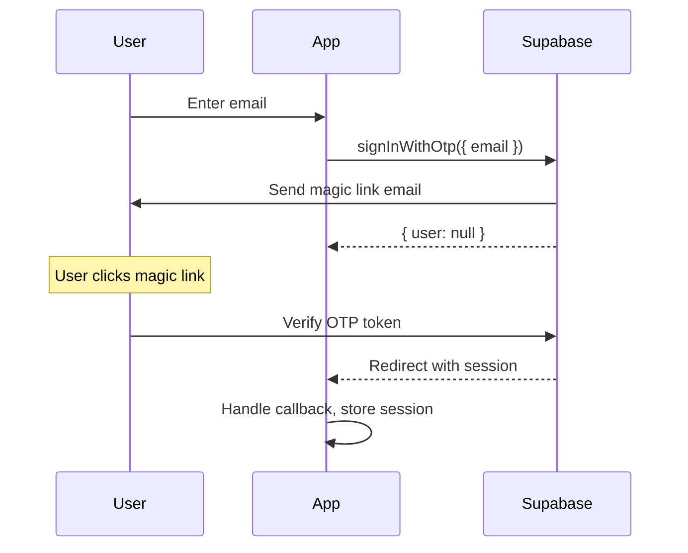
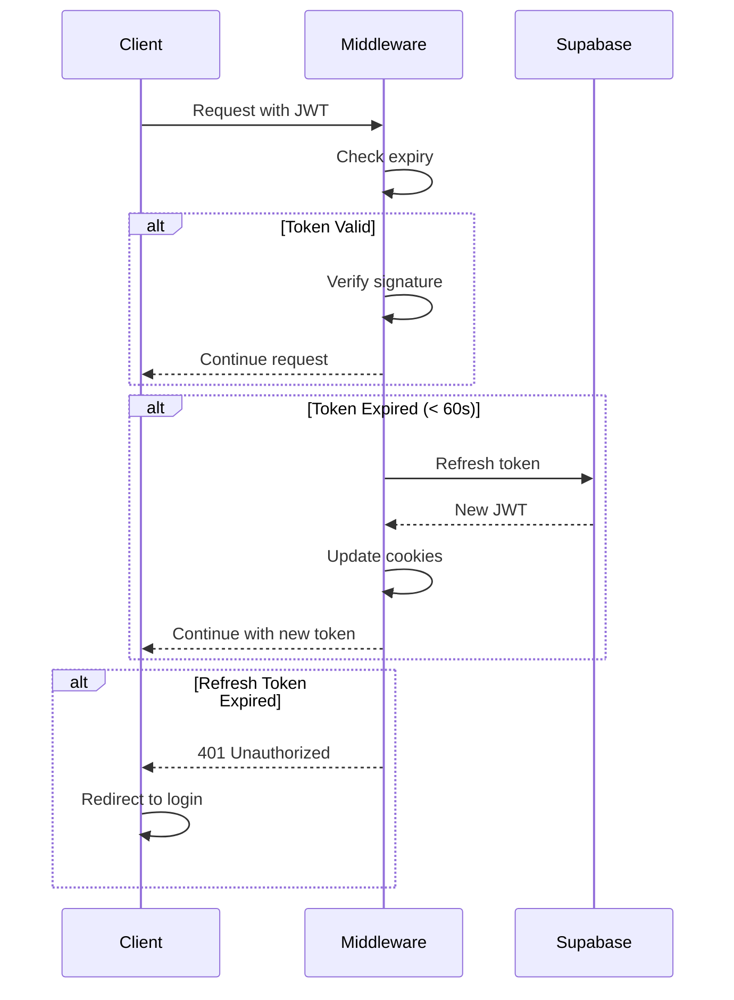
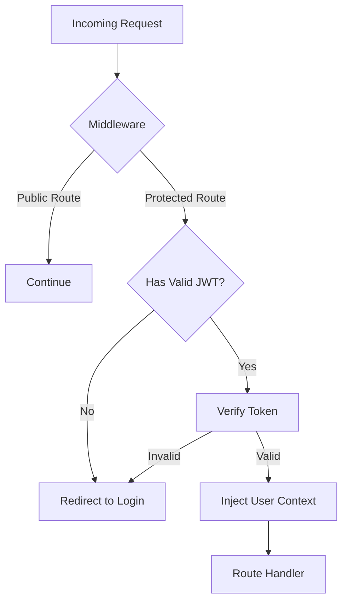
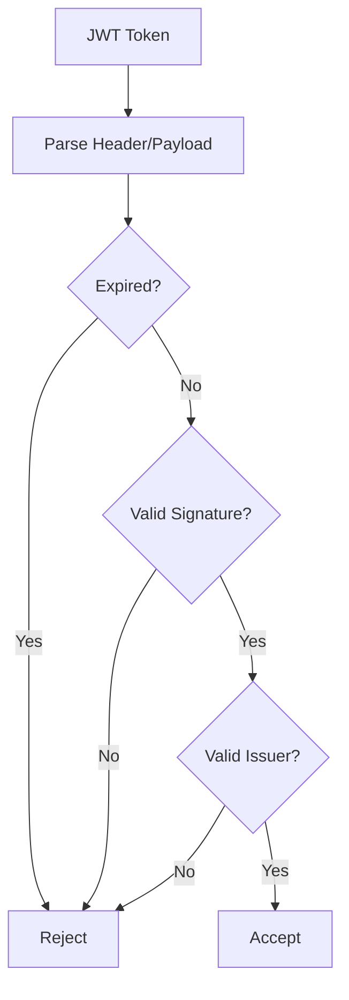

# Authentication System

Authentication and authorization implementation using Supabase Auth.

## Overview



## Authentication Methods

### 1. Email/Password



### 2. Google OAuth



### 3. Magic Link



## Session Management

### Token Structure

```typescript
interface Session {
  access_token: string; // JWT (expires in 1 hour)
  refresh_token: string; // Long-lived (expires in 7 days)
  expires_at: number; // Unix timestamp
  expires_in: number; // Seconds until expiry
  token_type: 'bearer';
  user: User;
}

interface User {
  id: string; // UUID
  email: string;
  email_confirmed_at: string;
  created_at: string;
  updated_at: string;
  user_metadata: {
    full_name?: string;
    avatar_url?: string;
  };
  app_metadata: {
    provider: string;
    providers: string[];
  };
}
```

### Token Refresh Flow



## Implementation

### Client-Side (Browser)

```typescript
// lib/supabase/client.ts
import { createBrowserClient } from '@supabase/ssr';

export function createClient() {
  return createBrowserClient(
    process.env.NEXT_PUBLIC_SUPABASE_URL!,
    process.env.NEXT_PUBLIC_SUPABASE_ANON_KEY!
  );
}
```

### Server-Side (API Routes)

```typescript
// lib/supabase/server.ts
import { createServerClient } from '@supabase/ssr';
import { cookies } from 'next/headers';

export async function createClient() {
  const cookieStore = await cookies();

  return createServerClient(
    process.env.NEXT_PUBLIC_SUPABASE_URL!,
    process.env.NEXT_PUBLIC_SUPABASE_ANON_KEY!,
    {
      cookies: {
        getAll() {
          return cookieStore.getAll();
        },
        setAll(cookiesToSet) {
          cookiesToSet.forEach(({ name, value, options }) => {
            cookieStore.set(name, value, options);
          });
        },
      },
    }
  );
}
```

### Middleware

```typescript
// middleware.ts
import { createServerClient } from '@supabase/ssr';
import { NextResponse } from 'next/server';
import type { NextRequest } from 'next/server';

export async function middleware(request: NextRequest) {
  const response = NextResponse.next();

  const supabase = createServerClient(
    process.env.NEXT_PUBLIC_SUPABASE_URL!,
    process.env.NEXT_PUBLIC_SUPABASE_ANON_KEY!,
    {
      cookies: {
        getAll() {
          return request.cookies.getAll();
        },
        setAll(cookiesToSet) {
          cookiesToSet.forEach(({ name, value, options }) => {
            response.cookies.set(name, value, options);
          });
        },
      },
    }
  );

  // Refresh session if needed
  const {
    data: { user },
  } = await supabase.auth.getUser();

  // Protect routes
  const protectedPaths = ['/dashboard', '/upscaler', '/api/upscale'];
  const isProtected = protectedPaths.some(path => request.nextUrl.pathname.startsWith(path));

  if (isProtected && !user) {
    return NextResponse.redirect(new URL('/login', request.url));
  }

  return response;
}
```

## Protected Routes



### Route Protection Matrix

| Path              | Auth Required | Description       |
| ----------------- | ------------- | ----------------- |
| `/`               | No            | Landing page      |
| `/login`          | No            | Login page        |
| `/signup`         | No            | Registration page |
| `/pricing`        | No            | Pricing page      |
| `/dashboard`      | Yes           | User dashboard    |
| `/upscaler`       | Yes           | Processing page   |
| `/api/upscale`    | Yes           | Processing API    |
| `/api/checkout`   | Yes           | Billing API       |
| `/api/profile`    | Yes           | User API          |
| `/api/webhooks/*` | No            | Stripe webhooks   |

## Security Considerations

### JWT Validation



### Security Headers

```typescript
const securityHeaders = {
  'Strict-Transport-Security': 'max-age=31536000; includeSubDomains',
  'X-Frame-Options': 'DENY',
  'X-Content-Type-Options': 'nosniff',
  'Referrer-Policy': 'strict-origin-when-cross-origin',
  'X-XSS-Protection': '1; mode=block',
};
```

### Cookie Configuration

```typescript
const cookieOptions = {
  httpOnly: true, // Prevent XSS access
  secure: true, // HTTPS only
  sameSite: 'lax', // CSRF protection
  path: '/',
  maxAge: 60 * 60 * 24 * 7, // 7 days
};
```

## Error Handling

| Error Code            | Description           | User Action         |
| --------------------- | --------------------- | ------------------- |
| `invalid_credentials` | Wrong email/password  | Show error message  |
| `email_not_confirmed` | Email not verified    | Resend verification |
| `user_already_exists` | Duplicate email       | Redirect to login   |
| `invalid_grant`       | Expired refresh token | Force re-login      |
| `otp_expired`         | Magic link expired    | Request new link    |
