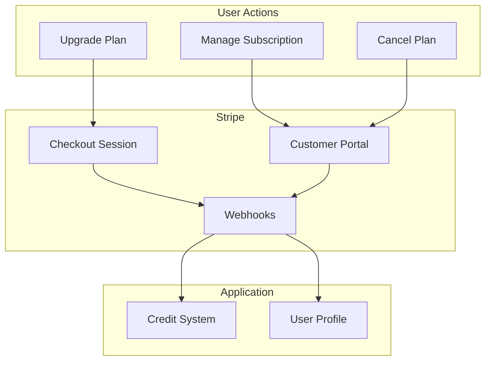
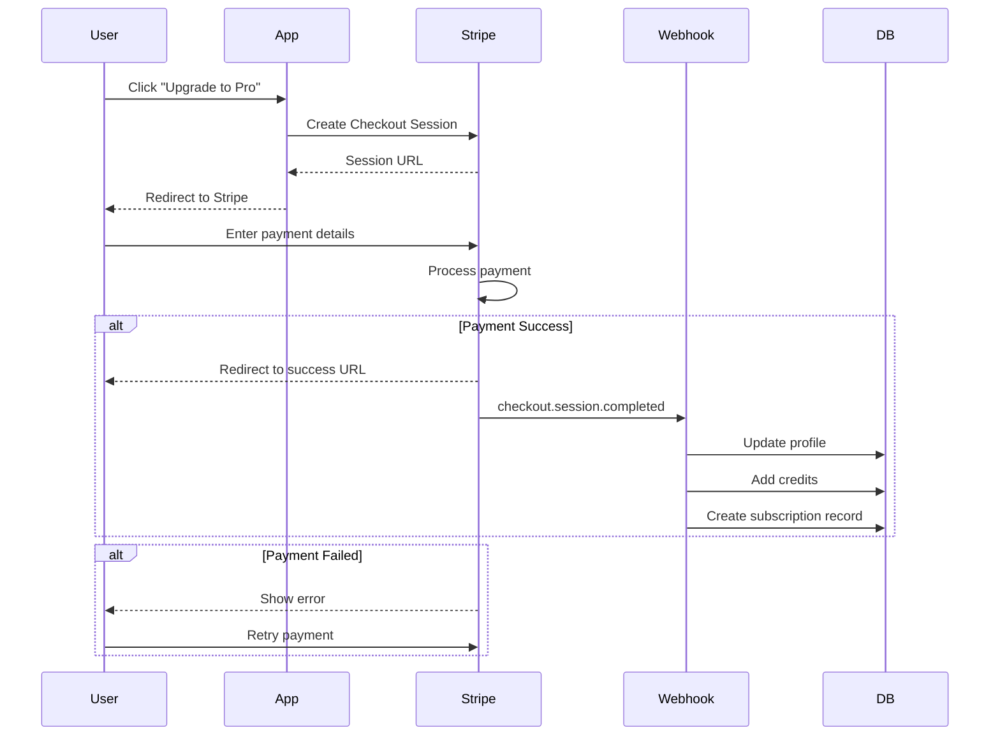
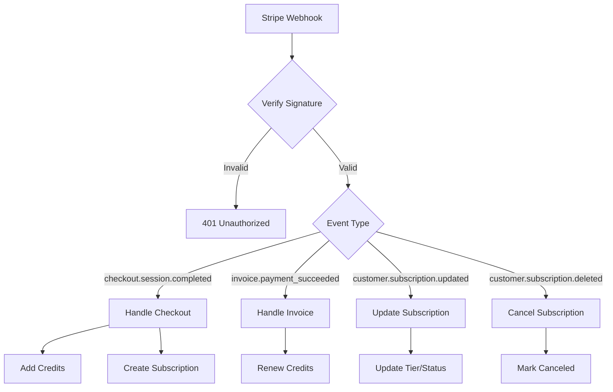
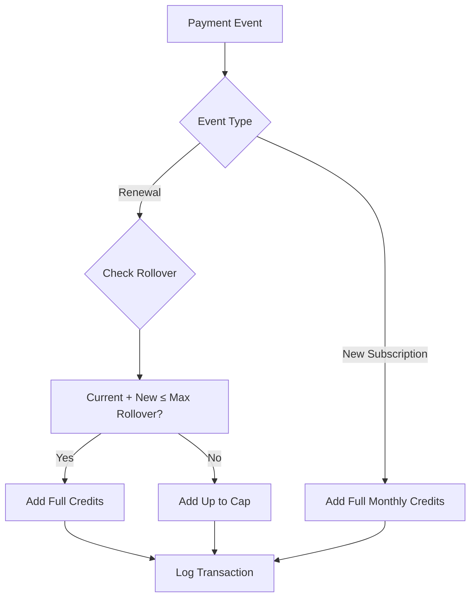
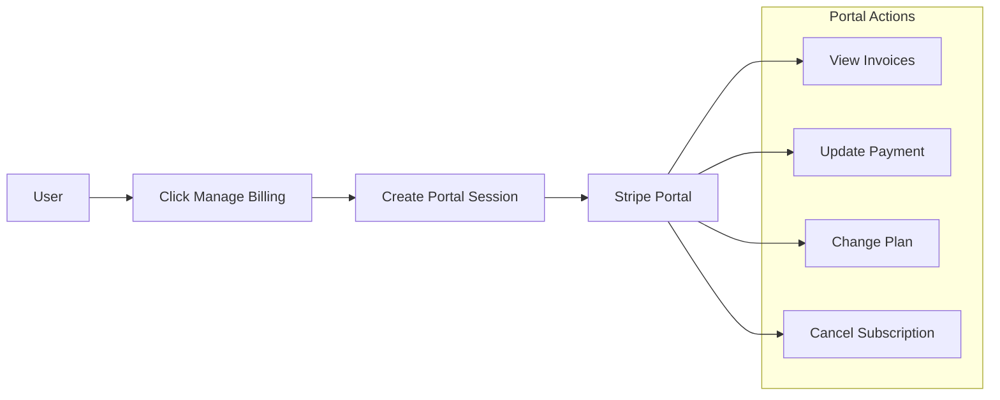
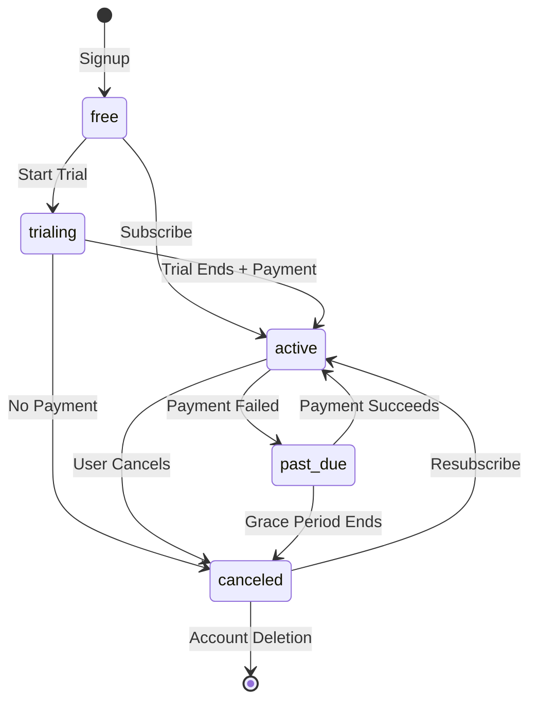

# Billing System

Subscription and credit management using Stripe.

## Overview



## Pricing Tiers

| Tier         | Price  | Credits/Month | Features                       |
| ------------ | ------ | ------------- | ------------------------------ |
| **Free**     | $0     | 10 (one-time) | Basic processing, 5MB limit    |
| **Starter**  | $9/mo  | 100           | 25MB limit, batch processing   |
| **Pro**      | $29/mo | 500           | All features, priority support |
| **Business** | $99/mo | 2,500         | API access, dedicated support  |

### Credit Rollover

- Unused credits roll over for up to 6x monthly allowance
- Example: Pro user can accumulate up to 3,000 credits
- Credits expire when subscription is canceled

## Checkout Flow



## Webhook Events



### Handled Events

| Event                           | Action                                   |
| ------------------------------- | ---------------------------------------- |
| `checkout.session.completed`    | Create subscription, add initial credits |
| `invoice.payment_succeeded`     | Renew monthly credits                    |
| `customer.subscription.updated` | Update tier, status changes              |
| `customer.subscription.deleted` | Mark subscription as canceled            |
| `invoice.payment_failed`        | Mark as past_due, send notification      |

## Webhook Handler

```typescript
// api/webhooks/stripe/route.ts
import Stripe from 'stripe';

const stripe = new Stripe(process.env.STRIPE_SECRET_KEY!);

export async function POST(request: Request) {
  const body = await request.text();
  const signature = request.headers.get('stripe-signature')!;

  let event: Stripe.Event;

  try {
    event = stripe.webhooks.constructEvent(body, signature, process.env.STRIPE_WEBHOOK_SECRET!);
  } catch (err) {
    return new Response('Invalid signature', { status: 401 });
  }

  switch (event.type) {
    case 'checkout.session.completed':
      await handleCheckoutComplete(event.data.object);
      break;
    case 'invoice.payment_succeeded':
      await handleInvoicePaid(event.data.object);
      break;
    case 'customer.subscription.updated':
      await handleSubscriptionUpdate(event.data.object);
      break;
    case 'customer.subscription.deleted':
      await handleSubscriptionDeleted(event.data.object);
      break;
  }

  return new Response('OK', { status: 200 });
}
```

## Credit Management

### Credit Allocation



### Credit Deduction

```typescript
async function deductCredits(userId: string, amount: number) {
  const { data: profile, error } = await supabase
    .from('profiles')
    .select('credits_balance')
    .eq('id', userId)
    .single();

  if (profile.credits_balance < amount) {
    throw new Error('INSUFFICIENT_CREDITS');
  }

  // Atomic deduction
  const { error: updateError } = await supabase
    .from('profiles')
    .update({
      credits_balance: profile.credits_balance - amount,
    })
    .eq('id', userId)
    .eq('credits_balance', profile.credits_balance); // Optimistic lock

  if (updateError) {
    throw new Error('DEDUCTION_FAILED');
  }

  // Log transaction
  await supabase.from('credit_transactions').insert({
    user_id: userId,
    amount: -amount,
    type: 'usage',
    description: 'Image processing',
  });
}
```

## Customer Portal

Users can manage their subscription through Stripe's hosted portal:



### Portal Session Creation

```typescript
// api/billing/portal/route.ts
export async function POST(request: Request) {
  const user = await getUser(request);

  const { data: profile } = await supabase
    .from('profiles')
    .select('stripe_customer_id')
    .eq('id', user.id)
    .single();

  const session = await stripe.billingPortal.sessions.create({
    customer: profile.stripe_customer_id,
    return_url: `${process.env.NEXT_PUBLIC_APP_URL}/dashboard`,
  });

  return Response.json({ portalUrl: session.url });
}
```

## Subscription States



## Database Schema

```sql
-- Subscriptions table
CREATE TABLE subscriptions (
    id TEXT PRIMARY KEY,                    -- Stripe subscription ID
    user_id UUID REFERENCES profiles(id),
    status TEXT NOT NULL,                   -- active, past_due, canceled, etc.
    price_id TEXT NOT NULL,                 -- Stripe price ID
    current_period_start TIMESTAMPTZ,
    current_period_end TIMESTAMPTZ,
    canceled_at TIMESTAMPTZ,
    created_at TIMESTAMPTZ DEFAULT NOW()
);

-- Credit transactions
CREATE TABLE credit_transactions (
    id UUID PRIMARY KEY DEFAULT gen_random_uuid(),
    user_id UUID REFERENCES profiles(id),
    amount INTEGER NOT NULL,                -- Positive or negative
    type TEXT NOT NULL,                     -- purchase, subscription, usage, refund
    reference_id TEXT,                      -- Stripe ID or job ID
    description TEXT,
    created_at TIMESTAMPTZ DEFAULT NOW()
);
```

## Security

### Webhook Verification

```typescript
// Always verify Stripe signatures
const isValidSignature = (payload: string, signature: string): boolean => {
  try {
    stripe.webhooks.constructEvent(payload, signature, process.env.STRIPE_WEBHOOK_SECRET!);
    return true;
  } catch {
    return false;
  }
};
```

### Price Validation

```typescript
// Only allow known price IDs
const VALID_PRICES = ['price_starter_monthly', 'price_pro_monthly', 'price_business_monthly'];

const isValidPrice = (priceId: string): boolean => {
  return VALID_PRICES.includes(priceId);
};
```

## Error Handling

| Scenario          | Action                         |
| ----------------- | ------------------------------ |
| Payment fails     | Mark as `past_due`, send email |
| Card expired      | Notify user, retry in 3 days   |
| Webhook timeout   | Stripe auto-retries            |
| Duplicate webhook | Idempotent handlers            |
| Invalid price     | Reject checkout                |
