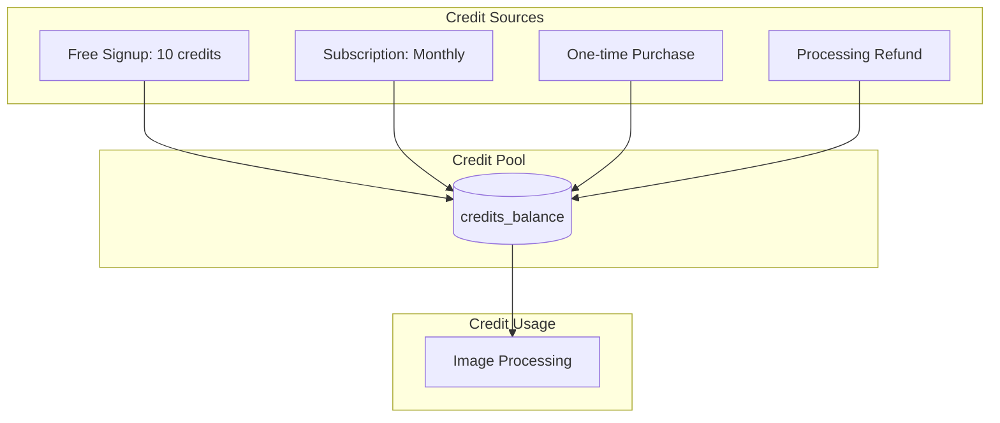
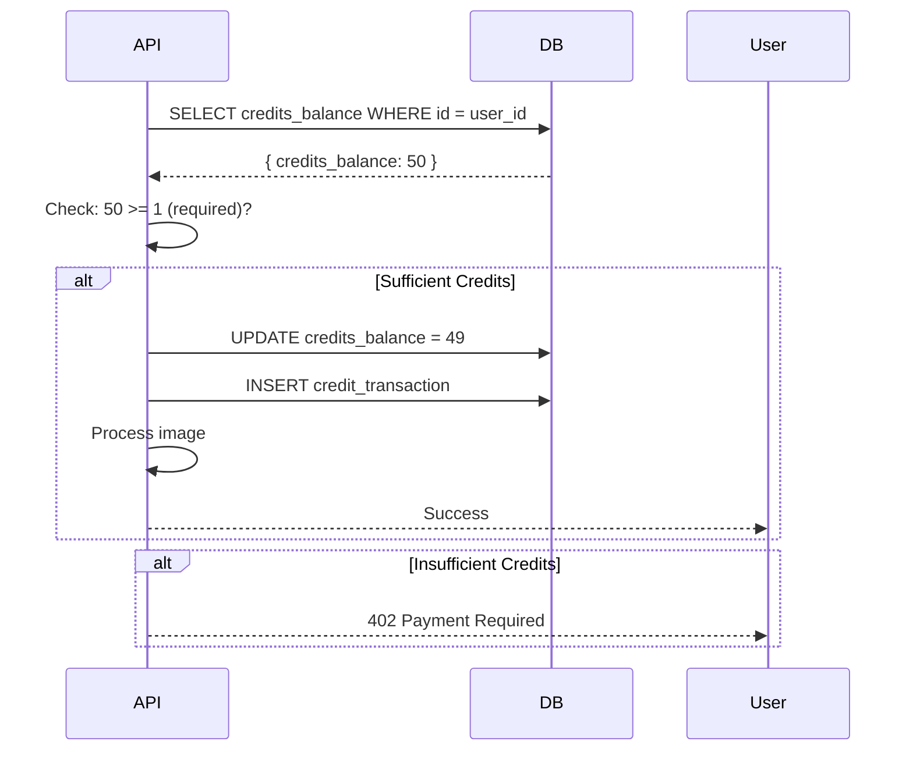
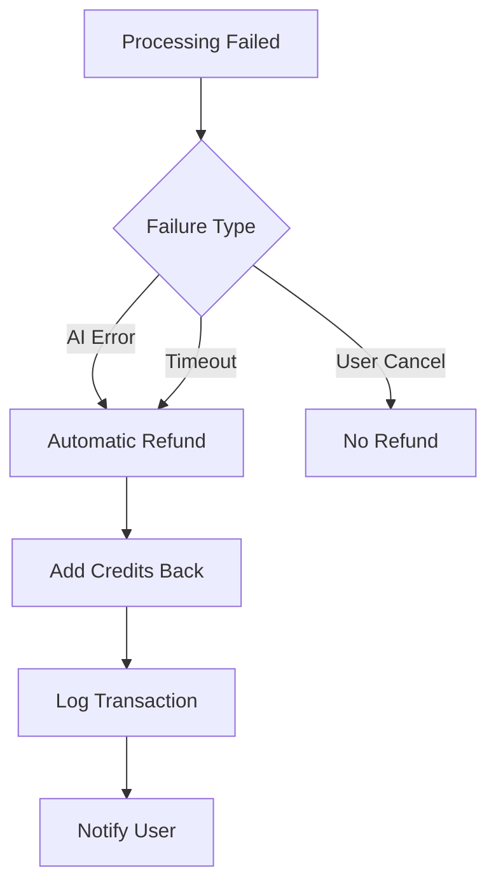
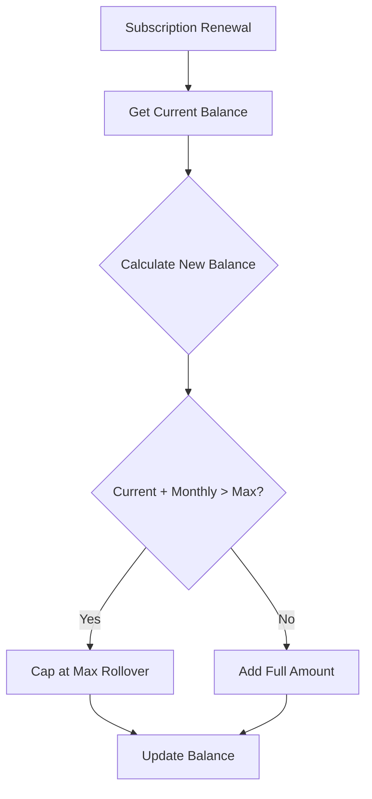
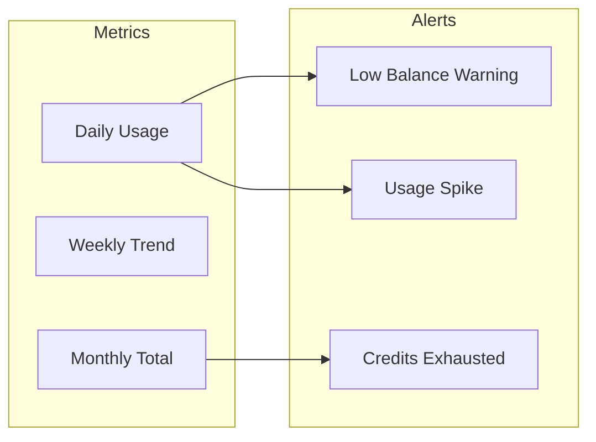

# Credit System

Credit-based usage tracking and management.

## Overview

myimageupscaler.com uses a credit system to manage image processing quotas. Each action costs a specific number of credits based on the processing mode and options selected.



## Credit Costs

| Action            | Mode    | Cost           |
| ----------------- | ------- | -------------- |
| Image Upscaling   | upscale | 1 credit       |
| Image Enhancement | enhance | 2 credits      |
| Upscale + Enhance | both    | 2 credits      |
| Custom Processing | custom  | 2 credits      |
| Batch Processing  | any     | per-image cost |

## Credit Allocation by Tier

| Tier     | Monthly Credits | Max Rollover | Price  |
| -------- | --------------- | ------------ | ------ |
| Free     | 10 (one-time)   | -            | $0     |
| Starter  | 100             | 600          | $9/mo  |
| Pro      | 500             | 3,000        | $29/mo |
| Business | 2,500           | 15,000       | $99/mo |

## Credit Flow

### Deduction Flow



### Refund Flow



## Database Operations

### Check Balance

```typescript
async function getCreditsBalance(userId: string): Promise<number> {
  const { data, error } = await supabase
    .from('profiles')
    .select('credits_balance')
    .eq('id', userId)
    .single();

  if (error) throw error;
  return data.credits_balance;
}
```

### Deduct Credits (Atomic)

```typescript
async function deductCredits(userId: string, amount: number, description: string): Promise<void> {
  // Use RPC for atomic operation
  const { error } = await supabase.rpc('deduct_credits', {
    p_user_id: userId,
    p_amount: amount,
    p_description: description,
  });

  if (error) {
    if (error.message.includes('insufficient')) {
      throw new Error('INSUFFICIENT_CREDITS');
    }
    throw error;
  }
}
```

### Database Function

```sql
CREATE OR REPLACE FUNCTION deduct_credits(
  p_user_id UUID,
  p_amount INTEGER,
  p_description TEXT
) RETURNS void AS $$
DECLARE
  current_balance INTEGER;
BEGIN
  -- Lock row and get current balance
  SELECT credits_balance INTO current_balance
  FROM profiles
  WHERE id = p_user_id
  FOR UPDATE;

  IF current_balance < p_amount THEN
    RAISE EXCEPTION 'insufficient credits';
  END IF;

  -- Deduct credits
  UPDATE profiles
  SET credits_balance = credits_balance - p_amount,
      updated_at = NOW()
  WHERE id = p_user_id;

  -- Log transaction
  INSERT INTO credit_transactions (user_id, amount, type, description)
  VALUES (p_user_id, -p_amount, 'usage', p_description);
END;
$$ LANGUAGE plpgsql;
```

### Add Credits

```typescript
// Note: This is typically handled via Stripe webhooks using the increment_credits_with_log RPC
async function addCredits(
  userId: string,
  amount: number,
  type: 'subscription' | 'purchase' | 'refund' | 'bonus',
  referenceId?: string
): Promise<void> {
  const { error } = await supabase.rpc('increment_credits_with_log', {
    target_user_id: userId,
    amount: amount,
    transaction_type: type,
    ref_id: referenceId,
    description: `${type} - ${amount} credits`,
  });

  if (error) throw error;
}
```

## Rollover Logic



### Rollover Calculation

```typescript
function calculateNewBalance(currentBalance: number, monthlyCredits: number, tier: string): number {
  const maxRollover: Record<string, number> = {
    starter: 600, // 6x monthly
    pro: 3000, // 6x monthly
    business: 15000, // 6x monthly
  };

  const max = maxRollover[tier] || monthlyCredits;
  return Math.min(currentBalance + monthlyCredits, max);
}
```

## Transaction Types

| Type           | Description         | Amount   |
| -------------- | ------------------- | -------- |
| `usage`        | Image processing    | Negative |
| `subscription` | Monthly renewal     | Positive |
| `purchase`     | One-time purchase   | Positive |
| `refund`       | Processing failure  | Positive |
| `bonus`        | Promotional credits | Positive |

## Transaction Log Schema

```sql
CREATE TABLE credit_transactions (
    id UUID PRIMARY KEY DEFAULT gen_random_uuid(),
    user_id UUID NOT NULL REFERENCES profiles(id),
    amount INTEGER NOT NULL,          -- Positive or negative
    type TEXT NOT NULL,               -- usage, subscription, purchase, refund, bonus
    reference_id TEXT,                -- Job ID, Stripe ID, etc.
    description TEXT,
    created_at TIMESTAMPTZ DEFAULT NOW(),

    CONSTRAINT valid_type CHECK (
      type IN ('usage', 'subscription', 'purchase', 'refund', 'bonus')
    )
);

CREATE INDEX idx_credit_transactions_user_id ON credit_transactions(user_id);
CREATE INDEX idx_credit_transactions_created_at ON credit_transactions(created_at DESC);
```

## API Endpoints

### GET /api/credits

Returns credit balance and recent transactions.

```json
{
  "success": true,
  "data": {
    "balance": 85,
    "monthlyAllowance": 500,
    "usedThisMonth": 15,
    "maxRollover": 3000,
    "tier": "pro",
    "recentTransactions": [
      {
        "id": "uuid",
        "amount": -1,
        "type": "usage",
        "description": "Image processing",
        "createdAt": "2024-01-15T10:30:00Z"
      }
    ]
  }
}
```

## Usage Analytics



### Low Balance Warning

```typescript
// Trigger when balance falls below 20% of monthly
function shouldWarnLowBalance(balance: number, monthlyAllowance: number): boolean {
  return balance < monthlyAllowance * 0.2;
}
```
