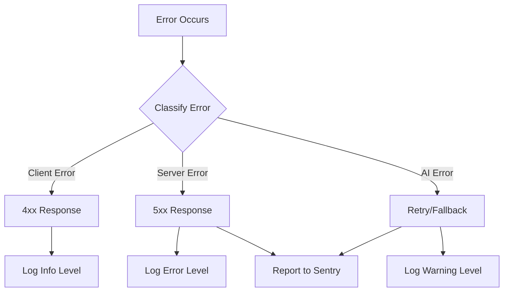
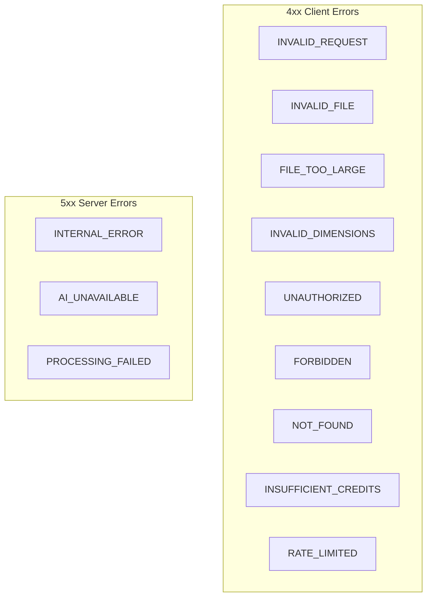
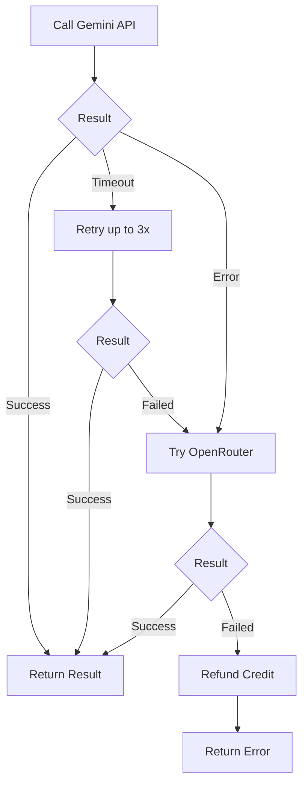
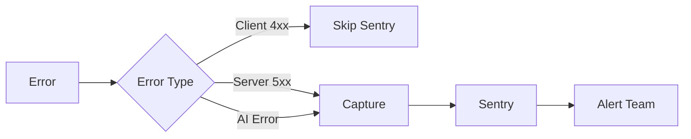

# Error Handling System

Standardized error handling, logging, and recovery patterns.

## Overview



## Error Classification

| Category         | HTTP Status | Recovery          | Logging |
| ---------------- | ----------- | ----------------- | ------- |
| Validation       | 400         | None (user fix)   | Info    |
| Authentication   | 401         | Re-login          | Info    |
| Authorization    | 403         | None              | Warning |
| Not Found        | 404         | None              | Info    |
| Payment Required | 402         | Upgrade prompt    | Info    |
| Rate Limited     | 429         | Wait & retry      | Warning |
| AI Timeout       | 500         | Auto-retry        | Warning |
| AI Failure       | 500         | Fallback provider | Error   |
| Internal Error   | 500         | None              | Error   |

## Error Response Format

All API errors follow a consistent structure:

```typescript
interface ErrorResponse {
  success: false;
  error: {
    code: string; // Machine-readable code
    message: string; // Human-readable message
    details?: object; // Additional context
    requestId?: string; // For support reference
  };
}
```

### Example Responses

**Validation Error (400)**

```json
{
  "success": false,
  "error": {
    "code": "INVALID_FILE",
    "message": "File type not supported. Please upload JPG, PNG, WEBP, or HEIC.",
    "details": {
      "receivedType": "image/gif",
      "allowedTypes": ["image/jpeg", "image/png", "image/webp", "image/heic"]
    }
  }
}
```

**Insufficient Credits (402)**

```json
{
  "success": false,
  "error": {
    "code": "INSUFFICIENT_CREDITS",
    "message": "Not enough credits. You have 0 credits, but this action requires 1.",
    "details": {
      "currentBalance": 0,
      "required": 1
    }
  }
}
```

**Rate Limited (429)**

```json
{
  "success": false,
  "error": {
    "code": "RATE_LIMITED",
    "message": "Too many requests. Please try again in 5 seconds.",
    "details": {
      "retryAfter": 5
    }
  }
}
```

## Error Codes



### Complete Error Code Reference

| Code                   | Status | Description                          |
| ---------------------- | ------ | ------------------------------------ |
| `INVALID_REQUEST`      | 400    | Malformed request body or parameters |
| `INVALID_FILE`         | 400    | Unsupported file type                |
| `FILE_TOO_LARGE`       | 400    | File exceeds size limit              |
| `INVALID_DIMENSIONS`   | 400    | Image dimensions out of bounds       |
| `UNAUTHORIZED`         | 401    | Missing or invalid authentication    |
| `FORBIDDEN`            | 403    | Authenticated but not authorized     |
| `NOT_FOUND`            | 404    | Resource does not exist              |
| `INSUFFICIENT_CREDITS` | 402    | Not enough credits for action        |
| `RATE_LIMITED`         | 429    | Too many requests                    |
| `INTERNAL_ERROR`       | 500    | Unexpected server error              |
| `AI_UNAVAILABLE`       | 503    | AI service unavailable               |
| `PROCESSING_FAILED`    | 500    | Image processing failed              |

## Error Handling Implementation

### API Route Error Handler

```typescript
// lib/errors.ts
export class AppError extends Error {
  constructor(
    public code: string,
    public message: string,
    public statusCode: number = 500,
    public details?: object
  ) {
    super(message);
    this.name = 'AppError';
  }
}

export function handleError(error: unknown): Response {
  // Known application error
  if (error instanceof AppError) {
    return Response.json(
      {
        success: false,
        error: {
          code: error.code,
          message: error.message,
          details: error.details,
        },
      },
      { status: error.statusCode }
    );
  }

  // Log unknown errors
  console.error('Unhandled error:', error);

  // Return generic error
  return Response.json(
    {
      success: false,
      error: {
        code: 'INTERNAL_ERROR',
        message: 'An unexpected error occurred. Please try again.',
      },
    },
    { status: 500 }
  );
}
```

### Usage in API Routes

```typescript
// api/upscale/route.ts
import { AppError, handleError } from '@/lib/errors';

export async function POST(request: Request) {
  try {
    const user = await getUser(request);
    if (!user) {
      throw new AppError('UNAUTHORIZED', 'Please log in to continue.', 401);
    }

    const credits = await getCreditsBalance(user.id);
    if (credits < 1) {
      throw new AppError(
        'INSUFFICIENT_CREDITS',
        'Not enough credits. Please upgrade your plan.',
        402,
        { currentBalance: credits, required: 1 }
      );
    }

    // Process image...
    return Response.json({ success: true, data: result });
  } catch (error) {
    return handleError(error);
  }
}
```

## AI Error Recovery



### Retry Logic

```typescript
async function processWithRetry<T>(
  fn: () => Promise<T>,
  maxRetries: number = 3,
  delay: number = 1000
): Promise<T> {
  let lastError: Error;

  for (let attempt = 1; attempt <= maxRetries; attempt++) {
    try {
      return await fn();
    } catch (error) {
      lastError = error as Error;

      if (attempt < maxRetries) {
        await new Promise(resolve => setTimeout(resolve, delay * attempt));
      }
    }
  }

  throw lastError!;
}
```

### Fallback Chain

```typescript
async function processImage(image: Buffer, options: ProcessOptions) {
  // Try primary provider
  try {
    return await geminiApi.process(image, options);
  } catch (primaryError) {
    console.warn('Primary AI failed, trying fallback:', primaryError);

    // Try fallback provider
    try {
      return await openRouter.process(image, options);
    } catch (fallbackError) {
      console.error('All providers failed:', fallbackError);

      // Refund credit
      await refundCredit(options.userId, 1, 'Processing failure');

      throw new AppError(
        'PROCESSING_FAILED',
        'Image processing failed. Your credit has been refunded.',
        500
      );
    }
  }
}
```

## Logging Strategy

### Log Levels

| Level   | When to Use        | Example                 |
| ------- | ------------------ | ----------------------- |
| `debug` | Development only   | Request payload details |
| `info`  | Normal operations  | Successful processing   |
| `warn`  | Recoverable issues | Rate limit hit, retry   |
| `error` | Failures           | Unhandled exceptions    |

### Structured Logging

```typescript
interface LogEntry {
  level: 'debug' | 'info' | 'warn' | 'error';
  message: string;
  timestamp: string;
  requestId?: string;
  userId?: string;
  error?: {
    code: string;
    message: string;
    stack?: string;
  };
  metadata?: object;
}
```

## Error Monitoring with Sentry

```typescript
// lib/sentry.ts
import * as Sentry from '@sentry/nextjs';

export function captureError(error: Error, context?: { user?: string; extra?: object }) {
  Sentry.captureException(error, {
    user: context?.user ? { id: context.user } : undefined,
    extra: context?.extra,
  });
}
```

### Integration Points



## Client-Side Error Handling

### Error Boundary

```typescript
// components/ErrorBoundary.tsx
export function ErrorFallback({ error, reset }: FallbackProps) {
  return (
    <div className="error-container">
      <h2>Something went wrong</h2>
      <p>{error.message}</p>
      <button onClick={reset}>Try again</button>
    </div>
  );
}
```

### API Error Display

```typescript
function getErrorMessage(error: ApiError): string {
  const messages: Record<string, string> = {
    INVALID_FILE: 'Please upload a valid image file (JPG, PNG, WEBP, or HEIC).',
    FILE_TOO_LARGE: 'Image is too large. Maximum size is 5MB for free users.',
    INSUFFICIENT_CREDITS: 'You need more credits. Upgrade your plan to continue.',
    RATE_LIMITED: 'Too many requests. Please wait a moment.',
    PROCESSING_FAILED: 'Processing failed. Your credit has been refunded.',
  };

  return messages[error.code] || 'An unexpected error occurred. Please try again.';
}
```
