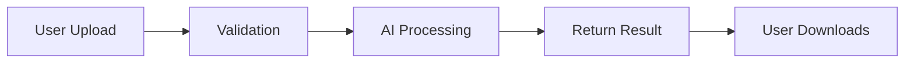
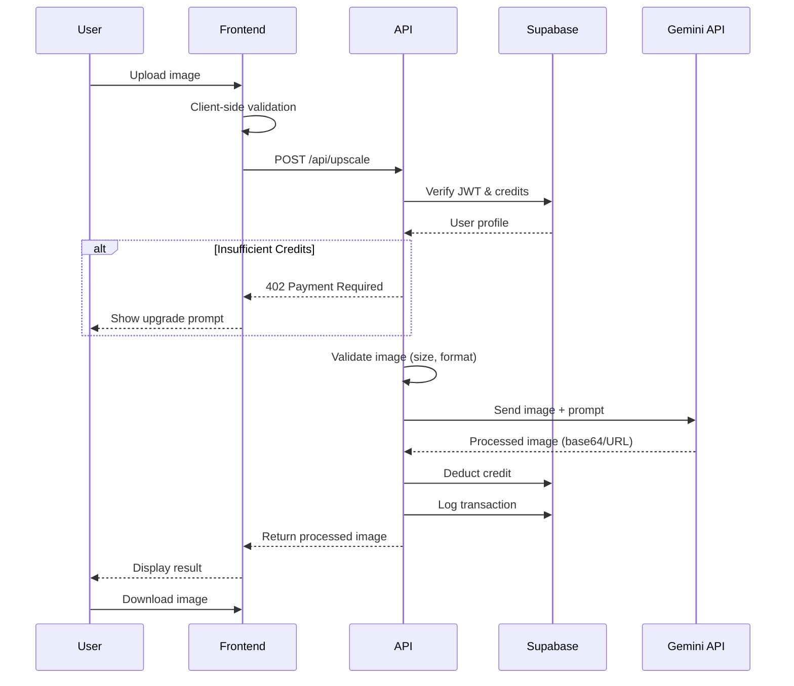
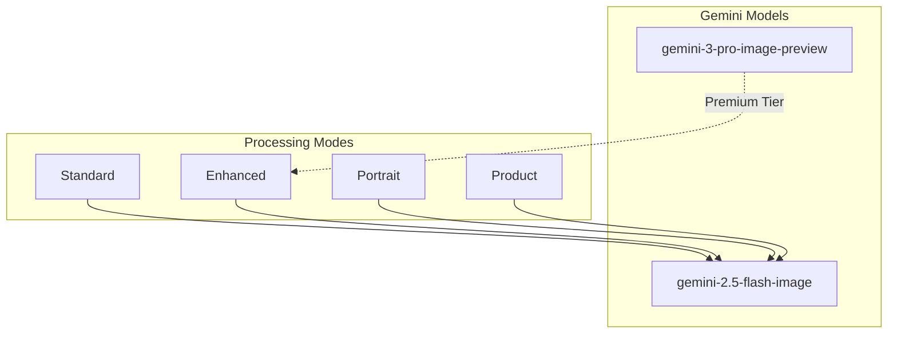
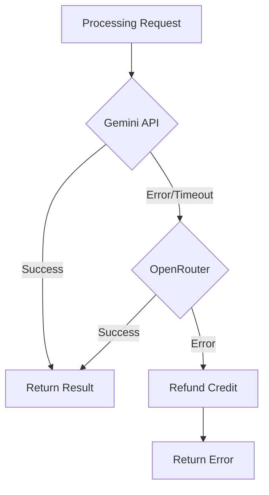
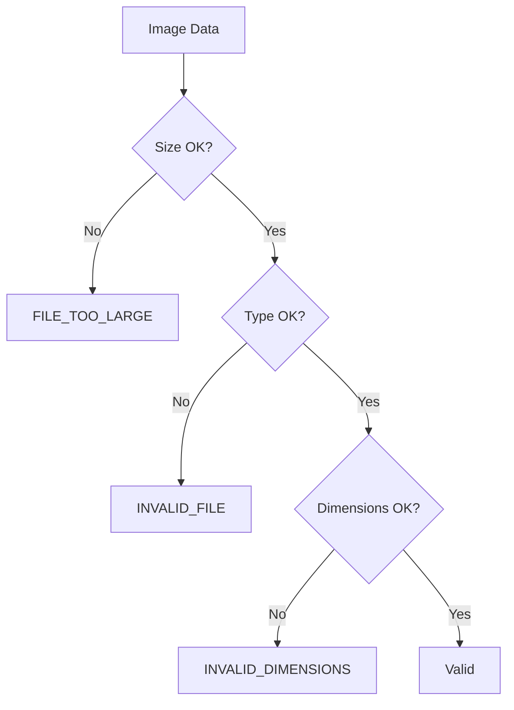
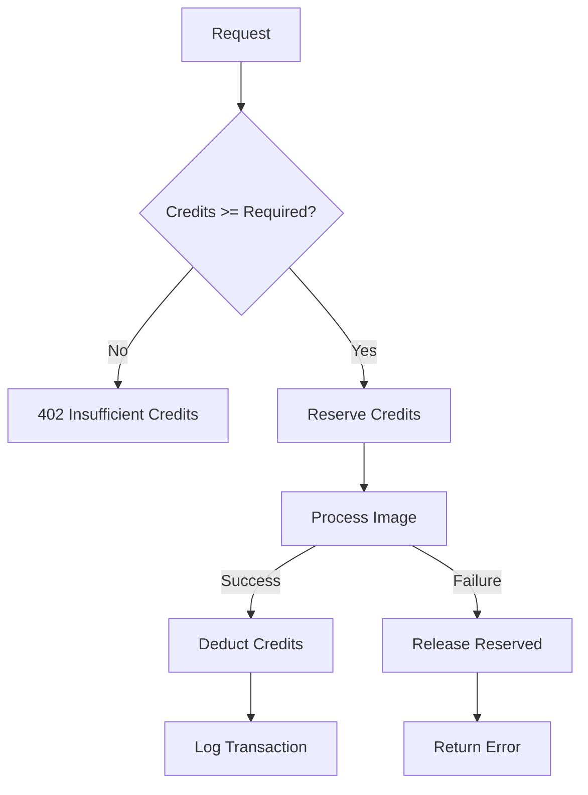
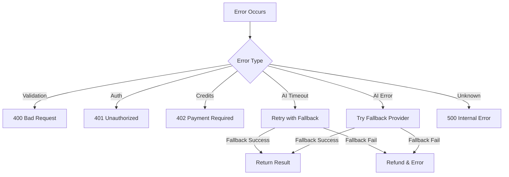
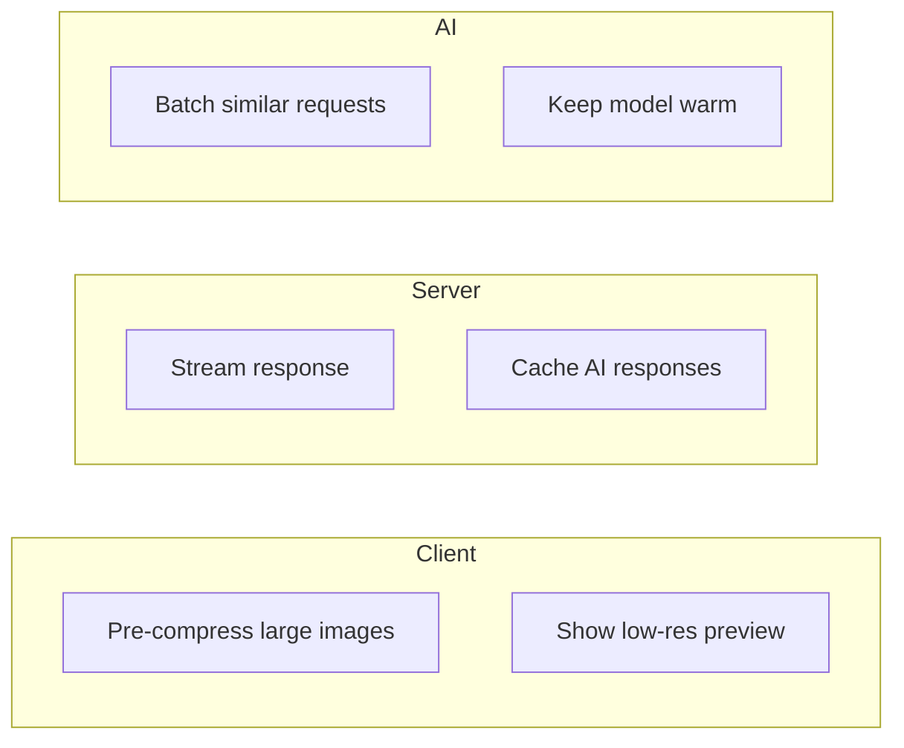

# Image Processing System

AI-powered image enhancement and upscaling using Gemini API / OpenRouter.

## Overview

The image processing system follows a simple, stateless flow: user uploads an image, it gets processed by the AI, and the result is returned directly for download. No images are stored on the server.



## Processing Flow



## AI Integration

### Primary Provider: Gemini API



### Fallback: OpenRouter



## API Request Structure

### Request

```typescript
interface UpscaleRequest {
  image: File; // Image file (JPG, PNG, WEBP, HEIC)
  mode?: ProcessingMode; // Processing mode
  scale?: 2 | 4 | 8; // Upscale factor
  preserveText?: boolean; // Text/logo preservation
  prompt?: string; // Custom instructions
}

type ProcessingMode =
  | 'standard' // General enhancement
  | 'enhanced' // Higher quality (more credits)
  | 'gentle' // Minimal changes
  | 'portrait' // Face optimization
  | 'product'; // E-commerce focus
```

### Response

```typescript
interface UpscaleResponse {
  success: boolean;
  data: {
    imageUrl: string; // Direct URL to processed image
    imageBase64?: string; // Optional base64 data
    creditsUsed: number;
    processingTime: number; // Milliseconds
    metadata: {
      inputSize: { width: number; height: number };
      outputSize: { width: number; height: number };
      scale: number;
      mode: ProcessingMode;
    };
  };
}
```

## Prompt Engineering

### Text & Logo Preservation (Hero Feature)

```typescript
const buildPrompt = (options: ProcessingOptions): string => {
  const basePrompt = `Enhance and upscale this image by ${options.scale}x while maintaining quality.`;

  if (options.preserveText) {
    return `${basePrompt}
    IMPORTANT: Preserve all text, logos, labels, and brand elements with perfect clarity.
    Keep text sharp and readable. Do not modify, blur, or distort any text content.
    ${options.prompt || ''}`;
  }

  return `${basePrompt} ${options.prompt || ''}`;
};
```

### Mode-Specific Prompts

| Mode         | Prompt Focus                                    |
| ------------ | ----------------------------------------------- |
| **standard** | General enhancement, balanced                   |
| **enhanced** | Maximum quality, detail preservation            |
| **gentle**   | Minimal changes, noise reduction only           |
| **portrait** | Face detail, skin smoothing, eye clarity        |
| **product**  | Sharp edges, accurate colors, text preservation |

## Validation

### Client-Side

```typescript
const VALIDATION_RULES = {
  maxSize: {
    free: 5 * 1024 * 1024, // 5MB
    paid: 25 * 1024 * 1024, // 25MB
  },
  allowedTypes: ['image/jpeg', 'image/png', 'image/webp', 'image/heic'],
  maxDimension: 8192, // Max width/height in pixels
  minDimension: 64, // Min width/height in pixels
};
```

### Server-Side



## Credit System Integration



### Credit Costs

| Mode     | Scale | Credits |
| -------- | ----- | ------- |
| standard | 2x    | 1       |
| standard | 4x    | 1       |
| standard | 8x    | 2       |
| enhanced | 2x    | 2       |
| enhanced | 4x    | 2       |
| enhanced | 8x    | 3       |
| portrait | any   | 1       |
| product  | any   | 1       |

## Error Handling



### Error Responses

| Code                   | HTTP Status | Cause                 |
| ---------------------- | ----------- | --------------------- |
| `INVALID_FILE`         | 400         | Unsupported format    |
| `FILE_TOO_LARGE`       | 400         | Exceeds size limit    |
| `INVALID_DIMENSIONS`   | 400         | Image too small/large |
| `UNAUTHORIZED`         | 401         | Missing/invalid token |
| `INSUFFICIENT_CREDITS` | 402         | Not enough credits    |
| `PROCESSING_FAILED`    | 500         | AI processing error   |
| `AI_UNAVAILABLE`       | 503         | All providers down    |

## Performance

### Typical Processing Times

| Scale | Mode     | Approximate Time |
| ----- | -------- | ---------------- |
| 2x    | standard | 10-20s           |
| 4x    | standard | 15-30s           |
| 8x    | standard | 30-60s           |
| any   | enhanced | +10-20s          |

### Optimization Strategies


