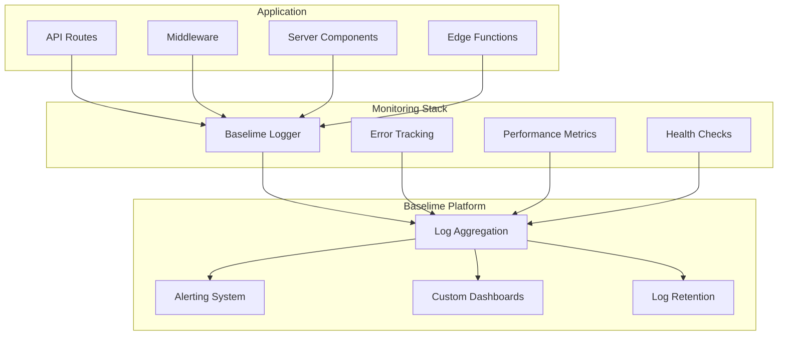
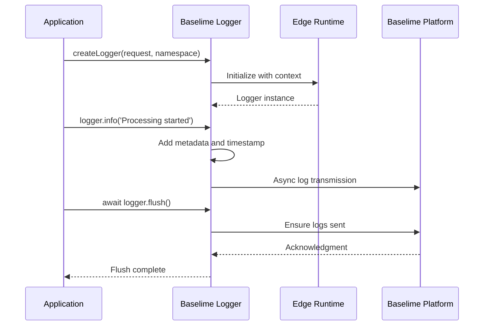
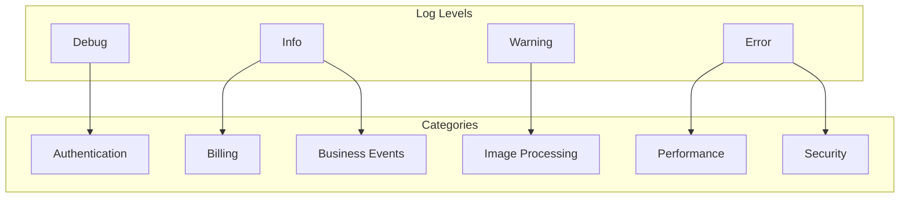
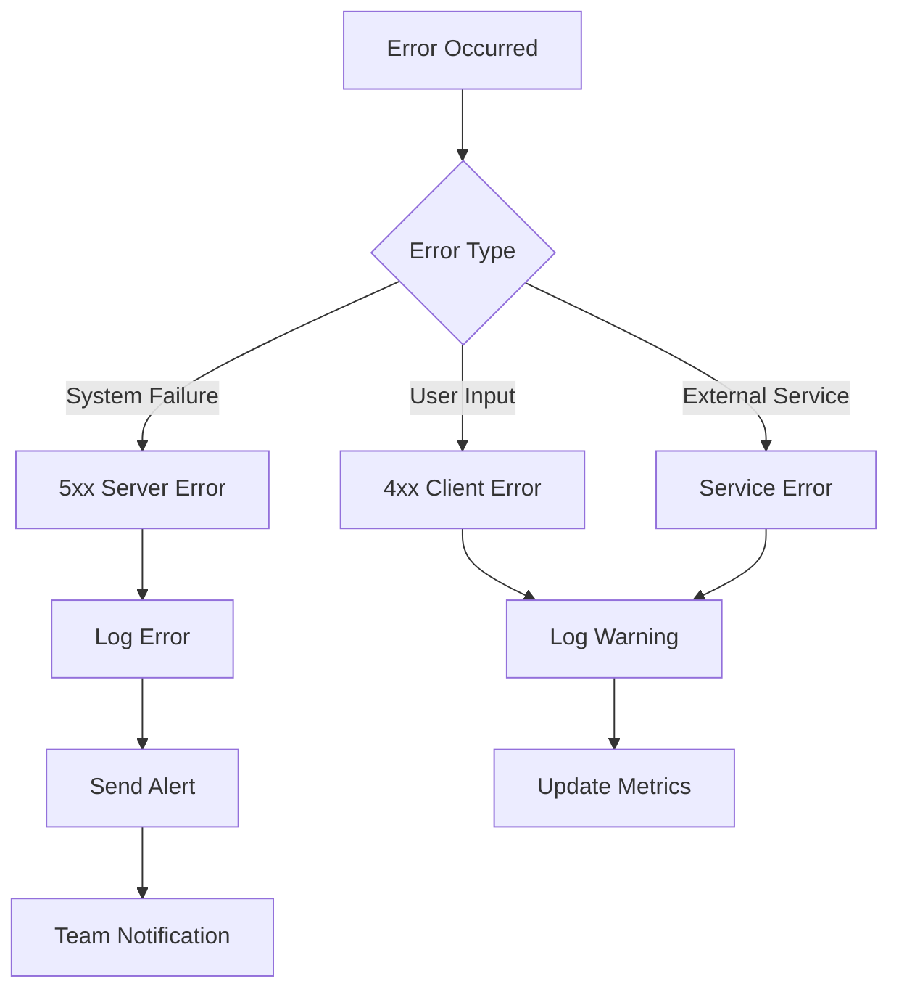
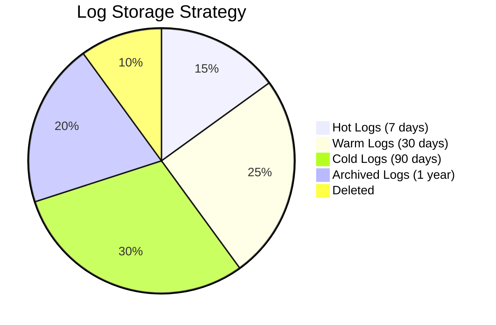

# Monitoring System

Comprehensive error monitoring and logging using Baselime for application health and performance insights.

## Overview



## Logging Architecture

### Baselime Integration



### Logger Configuration

```typescript
interface ILoggerConfig {
  service: string; // 'myimageupscaler.com-api'
  namespace: string; // Specific API endpoint or feature
  apiKey: string; // Baselime API key
  isLocalDev: boolean; // Skip external calls in development
  ctx: {
    url: string; // Request URL
    method: string; // HTTP method
    requestId?: string; // Unique request identifier
    userId?: string; // Authenticated user ID
    [key: string]: unknown; // Additional context
  };
}
```

## Logging Implementation

### Logger Factory

```typescript
// server/monitoring/logger.ts
export function createLogger(
  request: Request,
  namespace: string,
  context?: ILogContext
): BaselimeLogger {
  const apiKey = serverEnv.BASELIME_API_KEY;

  const logger = new BaselimeLogger({
    service: 'myimageupscaler.com-api',
    namespace,
    apiKey: apiKey || '',
    ctx: {
      url: request.url,
      method: request.method,
      ...context,
    },
    isLocalDev: !apiKey || isDevelopment(),
  });

  return logger;
}
```

### Logging Wrapper

```typescript
// Automatic logging wrapper for API handlers
export function withLogging(
  namespace: string,
  handler: (request: Request, logger: BaselimeLogger) => Promise<Response>
): (request: Request) => Promise<Response> {
  return async (request: Request) => {
    const logger = createLogger(request, namespace);

    try {
      logger.info('Request started', {
        userAgent: request.headers.get('user-agent'),
        contentLength: request.headers.get('content-length'),
      });

      const response = await handler(request, logger);

      logger.info('Request completed', {
        status: response.status,
        responseTime: Date.now() - startTime,
      });

      return response;
    } catch (error) {
      logger.error('Request failed', {
        error: error instanceof Error ? error.message : String(error),
        stack: error instanceof Error ? error.stack : undefined,
        responseTime: Date.now() - startTime,
      });

      return Response.json({ error: 'Internal server error' }, { status: 500 });
    } finally {
      await logger.flush();
    }
  };
}
```

## Log Levels & Categories

### Log Hierarchy



### Logging Patterns

#### Request Lifecycle Logging

```typescript
// API route with comprehensive logging
export const POST = withLogging('upscale-api', async (request, logger) => {
  const startTime = Date.now();
  const user = await getUser(request);

  logger.info('Image processing request', {
    userId: user?.id,
    contentType: request.headers.get('content-type'),
  });

  // Validate request
  if (!user) {
    logger.warn('Unauthorized processing attempt', {
      ip: getClientIP(request),
      userAgent: request.headers.get('user-agent'),
    });
    return new Response('Unauthorized', { status: 401 });
  }

  // Process image
  try {
    const result = await processImage(image, options);

    logger.info('Image processing completed', {
      userId: user.id,
      duration: Date.now() - startTime,
      inputSize: options.inputSize,
      outputSize: result.outputSize,
      creditsUsed: result.creditsUsed,
      mode: options.mode,
    });

    return Response.json({ success: true, data: result });
  } catch (processingError) {
    logger.error('Image processing failed', {
      userId: user.id,
      error: processingError.message,
      duration: Date.now() - startTime,
      inputSize: options.inputSize,
      mode: options.mode,
    });

    throw processingError;
  }
});
```

#### Business Event Logging

```typescript
// Billing events
logger.info('Payment processed', {
  userId: user.id,
  amount: payment.amount,
  currency: payment.currency,
  stripePaymentIntentId: payment.id,
  subscriptionTier: user.subscriptionTier,
  eventCategory: 'billing',
});

// Credit transactions
logger.info('Credits transaction', {
  userId: user.id,
  amount: -1,
  type: 'usage',
  balance: newBalance,
  reason: 'image_processing',
  eventCategory: 'credits',
});
```

## Error Monitoring

### Error Classification



### Error Context

```typescript
interface IErrorContext {
  requestId?: string;
  userId?: string;
  endpoint?: string;
  method?: string;
  userAgent?: string;
  ip?: string;
  timestamp?: number;
  stackTrace?: string;
  additionalContext?: Record<string, unknown>;
}

// Enhanced error logging
logger.error('Unexpected error occurred', {
  error: error.message,
  stack: error.stack,
  requestId: context.requestId,
  userId: context.userId,
  endpoint: request.url,
  method: request.method,
  userAgent: request.headers.get('user-agent'),
  ip: getClientIP(request),
  timestamp: Date.now(),
  service: 'image-processing',
  severity: 'high',
});
```

## Performance Monitoring

### Request Timing

```typescript
// Performance tracking middleware
export function withPerformanceTracking(
  namespace: string,
  handler: (request: Request, logger: BaselimeLogger) => Promise<Response>
) {
  return async (request: Request) => {
    const logger = createLogger(request, `${namespace}-performance`);
    const startTime = performance.now();
    const startMemory = getMemoryUsage();

    try {
      const response = await handler(request, logger);
      const duration = performance.now() - startTime;
      const memoryUsed = getMemoryUsage() - startMemory;

      logger.info('Performance metrics', {
        duration: Math.round(duration),
        memoryUsed,
        statusCode: response.status,
        endpoint: new URL(request.url).pathname,
        method: request.method,
        category: 'performance',
      });

      return response;
    } catch (error) {
      const duration = performance.now() - startTime;

      logger.error('Performance impact from error', {
        duration: Math.round(duration),
        error: error.message,
        category: 'performance',
      });

      throw error;
    } finally {
      await logger.flush();
    }
  };
}

function getMemoryUsage(): number {
  if (typeof process !== 'undefined' && process.memoryUsage) {
    return process.memoryUsage().heapUsed;
  }
  return 0;
}
```

### AI Processing Metrics

```typescript
// AI service performance logging
logger.info('AI processing metrics', {
  provider: 'gemini',
  model: 'gemini-2.5-flash-image',
  requestSize: inputBuffer.length,
  responseSize: outputBuffer.length,
  duration: processingTime,
  success: true,
  category: 'ai_performance',
});

logger.warn('AI fallback triggered', {
  primaryProvider: 'gemini',
  fallbackProvider: 'openrouter',
  reason: 'timeout',
  originalDuration: timeoutDuration,
  category: 'ai_reliability',
});
```

## Health Checks

### System Health Monitoring

```typescript
// Health check endpoint
export async function GET() {
  const logger = createLogger(new Request('http://localhost/api/health'), 'health-check');
  const startTime = Date.now();

  const health = {
    status: 'healthy',
    timestamp: new Date().toISOString(),
    uptime: process.uptime(),
    checks: {} as Record<string, { status: string; duration?: number; error?: string }>,
  };

  try {
    // Database connectivity
    const dbStart = Date.now();
    await supabase.from('profiles').select('id').limit(1);
    health.checks.database = {
      status: 'healthy',
      duration: Date.now() - dbStart,
    };

    // External service health
    const geminiStart = Date.now();
    const geminiHealth = await checkGeminiHealth();
    health.checks.gemini = {
      status: geminiHealth ? 'healthy' : 'unhealthy',
      duration: Date.now() - geminiStart,
    };

    // Rate limiter health
    const rateLimiterStart = Date.now();
    await rateLimit.limit('health-check');
    health.checks.rateLimiter = {
      status: 'healthy',
      duration: Date.now() - rateLimiterStart,
    };

    const totalDuration = Date.now() - startTime;

    logger.info('Health check completed', {
      status: 'healthy',
      totalDuration,
      checks: health.checks,
      category: 'health',
    });

    return Response.json(health);
  } catch (error) {
    health.status = 'unhealthy';

    logger.error('Health check failed', {
      error: error.message,
      totalDuration: Date.now() - startTime,
      category: 'health',
    });

    return Response.json(health, { status: 503 });
  } finally {
    await logger.flush();
  }
}
```

## Alerting Strategy

### Alert Conditions

```typescript
interface IAlertRule {
  name: string;
  condition: string;
  threshold: number;
  window: string;
  severity: 'critical' | 'warning' | 'info';
  channels: string[];
}

// Alert configuration
const alertRules: IAlertRule[] = [
  {
    name: 'High Error Rate',
    condition: 'error_rate',
    threshold: 5, // 5% error rate
    window: '5m',
    severity: 'critical',
    channels: ['slack', 'email'],
  },
  {
    name: 'Slow Response Time',
    condition: 'avg_response_time',
    threshold: 5000, // 5 seconds
    window: '10m',
    severity: 'warning',
    channels: ['slack'],
  },
  {
    name: 'AI Processing Failures',
    condition: 'ai_error_rate',
    threshold: 10, // 10% failure rate
    window: '5m',
    severity: 'critical',
    channels: ['slack', 'email'],
  },
];
```

### Alert Integration

```typescript
// Custom alerting for critical events
logger.error('Critical system error', {
  error: error.message,
  impact: 'Image processing service unavailable',
  userId: user?.id,
  severity: 'critical',
  alerting: {
    enabled: true,
    channels: ['slack', 'email'],
    escalationPolicy: 'engineering_team',
  },
});

// Performance degradation alerts
logger.warn('Performance degradation detected', {
  metric: 'response_time_p95',
  value: 3500, // 3.5 seconds
  threshold: 2000, // 2 second threshold
  severity: 'warning',
  alerting: {
    enabled: true,
    channels: ['slack'],
  },
});
```

## Log Management

### Log Retention & Archiving



### Log Querying Examples

```typescript
// Query patterns for common investigations

// Find all errors for a specific user
const userErrors = await baselime.query({
  service: 'myimageupscaler.com-api',
  level: 'error',
  userId: 'user_123',
  timeRange: '24h',
});

// Monitor processing failures
const processingFailures = await baselime.query({
  service: 'myimageupscaler.com-api',
  category: 'ai_processing',
  status: 'failed',
  timeRange: '1h',
});

// Track performance issues
const slowRequests = await baselime.query({
  service: 'myimageupscaler.com-api',
  duration: { gt: 5000 }, // > 5 seconds
  timeRange: '6h',
});

// Security monitoring
const authFailures = await baselime.query({
  service: 'myimageupscaler.com-api',
  category: 'authentication',
  result: 'failed',
  timeRange: '24h',
});
```

## Environment Configuration

### Development vs Production

```typescript
// Environment-specific logging
const loggingConfig = {
  development: {
    level: 'debug',
    enableConsole: true,
    enableBaselime: false,
    samplingRate: 1.0,
  },
  staging: {
    level: 'info',
    enableConsole: true,
    enableBaselime: true,
    samplingRate: 0.5,
  },
  production: {
    level: 'info',
    enableConsole: false,
    enableBaselime: true,
    samplingRate: 0.1, // Sample debug logs
  },
};

// Conditional logging
if (loggingConfig[env].enableConsole) {
  console.log('[App]', message, metadata);
}

if (loggingConfig[env].enableBaselime && shouldLog(level)) {
  logger.info(message, metadata);
}
```

### Environment Variables

```bash
# Baselime Configuration
BASELIME_API_KEY=your_baselime_api_key
BASELIME_SERVICE=myimageupscaler.com-api
BASELIME_ENVIRONMENT=production

# Logging Configuration
LOG_LEVEL=info
LOG_SAMPLING_RATE=0.1
ENABLE_PERFORMANCE_LOGGING=true

# Alerting Configuration
ALERT_SLACK_WEBHOOK_URL=your_slack_webhook
ALERT_EMAIL_RECIPIENTS=team@example.com
```
