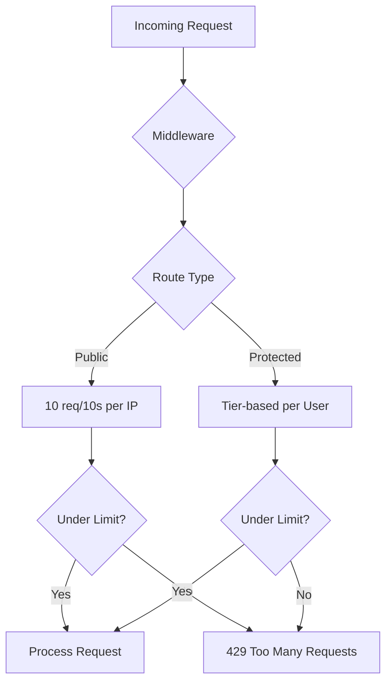
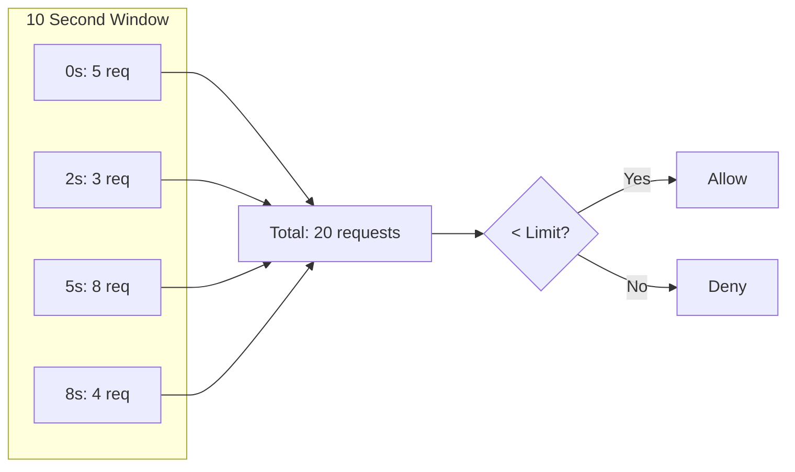
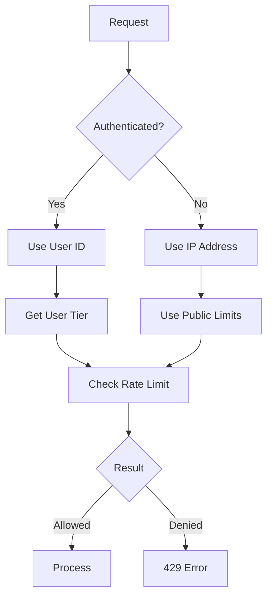
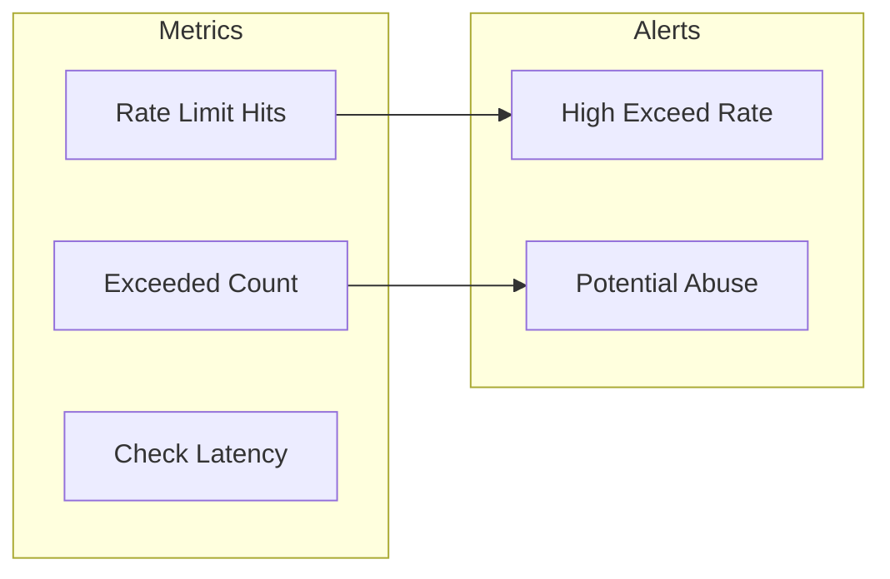

# Rate Limiting System

Request throttling and abuse prevention.

## Overview

Rate limiting protects the API from abuse and ensures fair usage across all users.



## Rate Limits by Tier

| Tier     | Protected Routes | Public Routes | Burst Allowed |
| -------- | ---------------- | ------------- | ------------- |
| Free     | 50 req/10s       | 10 req/10s    | 5             |
| Starter  | 100 req/10s      | 10 req/10s    | 10            |
| Pro      | 200 req/10s      | 10 req/10s    | 20            |
| Business | 500 req/10s      | 10 req/10s    | 50            |

## Implementation

### Sliding Window Algorithm



### Rate Limiter Class

```typescript
interface RateLimitConfig {
  windowMs: number; // Time window in milliseconds
  maxRequests: number; // Max requests per window
  burstLimit: number; // Additional burst allowance
}

const TIER_LIMITS: Record<string, RateLimitConfig> = {
  free: { windowMs: 10000, maxRequests: 50, burstLimit: 5 },
  starter: { windowMs: 10000, maxRequests: 100, burstLimit: 10 },
  pro: { windowMs: 10000, maxRequests: 200, burstLimit: 20 },
  business: { windowMs: 10000, maxRequests: 500, burstLimit: 50 },
};

const PUBLIC_LIMIT: RateLimitConfig = {
  windowMs: 10000,
  maxRequests: 10,
  burstLimit: 2,
};
```

### Middleware Implementation

```typescript
// middleware/rateLimit.ts
import { Ratelimit } from '@upstash/ratelimit';
import { Redis } from '@upstash/redis';

const redis = new Redis({
  url: process.env.UPSTASH_REDIS_URL!,
  token: process.env.UPSTASH_REDIS_TOKEN!,
});

// Create rate limiters for each tier
const limiters = {
  public: new Ratelimit({
    redis,
    limiter: Ratelimit.slidingWindow(10, '10 s'),
    prefix: 'rl:public',
  }),
  free: new Ratelimit({
    redis,
    limiter: Ratelimit.slidingWindow(50, '10 s'),
    prefix: 'rl:free',
  }),
  starter: new Ratelimit({
    redis,
    limiter: Ratelimit.slidingWindow(100, '10 s'),
    prefix: 'rl:starter',
  }),
  pro: new Ratelimit({
    redis,
    limiter: Ratelimit.slidingWindow(200, '10 s'),
    prefix: 'rl:pro',
  }),
  business: new Ratelimit({
    redis,
    limiter: Ratelimit.slidingWindow(500, '10 s'),
    prefix: 'rl:business',
  }),
};

export async function rateLimit(
  identifier: string,
  tier: string = 'public'
): Promise<{ success: boolean; remaining: number; reset: number }> {
  const limiter = limiters[tier] || limiters.public;
  const { success, remaining, reset } = await limiter.limit(identifier);

  return { success, remaining, reset };
}
```

## Response Headers

All responses include rate limit information:

```
X-RateLimit-Limit: 200
X-RateLimit-Remaining: 150
X-RateLimit-Reset: 1705320010
```

### Setting Headers

```typescript
function setRateLimitHeaders(
  response: Response,
  limit: number,
  remaining: number,
  reset: number
): Response {
  response.headers.set('X-RateLimit-Limit', limit.toString());
  response.headers.set('X-RateLimit-Remaining', remaining.toString());
  response.headers.set('X-RateLimit-Reset', reset.toString());
  return response;
}
```

## Rate Limit Exceeded Response

```json
{
  "success": false,
  "error": {
    "code": "RATE_LIMITED",
    "message": "Too many requests. Please try again later.",
    "retryAfter": 5
  }
}
```

### HTTP Response

```
HTTP/1.1 429 Too Many Requests
Retry-After: 5
X-RateLimit-Limit: 50
X-RateLimit-Remaining: 0
X-RateLimit-Reset: 1705320010
```

## Identification Strategy



### Getting Client IP

```typescript
function getClientIP(request: Request): string {
  // Cloudflare provides the real IP
  const cfIP = request.headers.get('CF-Connecting-IP');
  if (cfIP) return cfIP;

  // Fallback to X-Forwarded-For
  const forwarded = request.headers.get('X-Forwarded-For');
  if (forwarded) return forwarded.split(',')[0].trim();

  // Last resort
  return 'unknown';
}
```

## Special Cases

### Processing Endpoint

The `/api/upscale` endpoint has additional rate limiting based on concurrent requests:

```typescript
const PROCESSING_LIMITS = {
  free: 1, // 1 concurrent request
  starter: 3, // 3 concurrent requests
  pro: 5, // 5 concurrent requests
  business: 10, // 10 concurrent requests
};
```

### Webhook Endpoints

Stripe webhooks are exempt from rate limiting but have signature verification:

```typescript
const EXEMPT_PATHS = ['/api/webhooks/stripe'];
```

## Monitoring



### Key Metrics

| Metric                | Description      | Alert Threshold  |
| --------------------- | ---------------- | ---------------- |
| `rate_limit_checks`   | Total checks     | -                |
| `rate_limit_exceeded` | Blocked requests | >10% of requests |
| `rate_limit_latency`  | Check duration   | >50ms            |
