# Rate Limiting System

Simple in-memory rate limiting for API protection and abuse prevention.

## Overview


## Implementation

### Rate Limiter Algorithm

Uses sliding window algorithm with in-memory storage:

```mermaid
sequenceDiagram
    participant Client
    participant API
    participant Memory as In-Memory Store

    Client->>API: Request
    API->>Memory: Get timestamps for user/IP

    Note over Memory: Remove old timestamps<br/>outside window

    alt Under limit
        Memory-->>API: [t1, t2, t3] (count < limit)
        API->>Memory: Add current timestamp
        API-->>Client: Process request
    else Over limit
        Memory-->>API: [t1, t2, t3, t4, t5] (count ≥ limit)
        API-->>Client: 429 Too Many Requests
    end
```



### Configuration

```typescript
interface IRateLimitConfig {
  limit: number;        // Max requests allowed
  windowMs: number;     // Time window in milliseconds
}

// Rate limiters used in the application
export const rateLimit = {
  limit: createRateLimiter(50, 10 * 1000),    // 50 req/10s for authenticated users
  publicRateLimit: createRateLimiter(10, 10 * 1000), // 10 req/10s for public routes
};
```

### Rate Limit Rules

| User Type          | Limit | Window    | Use Case                          |
| ------------------ | ----- | --------- | --------------------------------- |
| Authenticated      | 50    | 10 seconds | General API usage                 |
| Public/Anonymous   | 10    | 10 seconds | Unauthenticated endpoints         |
| Image Processing   | 5     | 1 minute   | Heavy operations                  |
| Stripe Webhooks    | 100   | 1 minute   | Payment event processing          |

### Memory Management


## Integration Points

### Middleware Integration

```typescript
// middleware.ts
import { rateLimit, publicRateLimit } from '@/server/rateLimit';

export async function middleware(request: NextRequest) {
  const response = NextResponse.next();

  // Get identifier
  const user = await getUser(request);
  const identifier = user?.id || getClientIP(request);

  // Choose appropriate rate limiter
  const limiter = user ? rateLimit.limit : publicRateLimit.limit;

  // Check rate limit
  const result = await limiter(identifier);

  if (!result.success) {
    return new Response('Too Many Requests', {
      status: 429,
      headers: {
        'Retry-After': Math.ceil((result.reset - Date.now()) / 1000).toString(),
        'X-RateLimit-Limit': '50',
        'X-RateLimit-Remaining': result.remaining.toString(),
        'X-RateLimit-Reset': new Date(result.reset).toISOString(),
      },
    });
  }

  return response;
}
```

### API Route Integration

```typescript
// app/api/upscale/route.ts
import { rateLimit } from '@/server/rateLimit';

export async function POST(request: Request) {
  const user = await getUser(request);

  if (!user) {
    const result = await publicRateLimit.limit(getClientIP(request));
    if (!result.success) {
      return new Response(
        JSON.stringify({
          success: false,
          error: {
            code: 'RATE_LIMITED',
            message: 'Too many requests. Please try again later.',
            details: { retryAfter: Math.ceil((result.reset - Date.now()) / 1000) },
          },
        }),
        {
          status: 429,
          headers: {
            'Retry-After': Math.ceil((result.reset - Date.now()) / 1000).toString(),
          },
        }
      );
    }
  }

  // Continue with processing...
}
```

## Rate Limit Response Format

### HTTP Headers

```typescript
interface RateLimitHeaders {
  'X-RateLimit-Limit': string;      // Maximum requests allowed
  'X-RateLimit-Remaining': string;  // Requests remaining in window
  'X-RateLimit-Reset': string;      // Unix timestamp when window resets
  'Retry-After': string;            // Seconds until client can retry
}
```

### Error Response

```json
{
  "success": false,
  "error": {
    "code": "RATE_LIMITED",
    "message": "Too many requests. Please try again in 5 seconds.",
    "details": {
      "retryAfter": 5,
      "limit": 50,
      "remaining": 0,
      "reset": "2024-01-15T10:30:00Z"
    }
  }
}
```

## Identifier Strategy

### Priority Order

1. **User ID** (authenticated users)
2. **IP Address** (anonymous users)
3. **Session ID** (fallback)

### IP Address Extraction

```typescript
function getClientIP(request: NextRequest): string {
  return (
    request.headers.get('x-forwarded-for')?.split(',')[0] ||
    request.headers.get('x-real-ip') ||
    request.ip ||
    'unknown'
  );
}
```

## Scaling Considerations

### Single Instance Limitations


### Multi-Instance Solutions

| Solution         | Complexity | Cost    | Accuracy |
| ---------------- | ---------- | ------- | -------- |
| **Cloudflare KV**| Low        | $$      | High     |
| **Durable Objects**| Medium   | $$$     | Very High|
| **Redis**        | High       | $$      | Very High|

### Migration Path for Scale


## Monitoring

### Metrics to Track

```typescript
interface RateLimitMetrics {
  totalRequests: number;      // Total requests processed
  blockedRequests: number;    // Requests blocked
  averageUtilization: number; // Average % of limit used
  topViolators: string[];     // IPs/users most blocked
}
```

### Analytics Integration

```typescript
// Track rate limit violations
analytics.track('rate_limit_violation', {
  ip: clientIP,
  endpoint: request.url,
  userAgent: request.headers.get('user-agent'),
  limitType: user ? 'authenticated' : 'public',
});
```

## Security Considerations

### Rate Limit Evasion

| Attack Vector        | Mitigation Strategy                     |
| -------------------- | --------------------------------------- |
| IP Rotation          | Account-based limiting for auth users   |
| Distributed Requests | Account-based limiting                  |
| Header Spoofing      | Use Cloudflare's real IP detection      |
| Cookie Bypass        | IP + User ID combined identification    |

### Best Practices

1. **Layered Limits**: Apply multiple rate limits per endpoint
2. **Graceful Degradation**: Prioritize critical endpoints under load
3. **User Communication**: Clear error messages with retry times
4. **Monitoring**: Track rate limit violations for security
5. **Testing**: Load test rate limit boundaries

## Environment Configuration

```typescript
// Rate limit configuration via environment
const RATE_LIMIT_CONFIG = {
  // Override defaults for different environments
  development: {
    authenticated: { limit: 100, window: 10000 },
    public: { limit: 50, window: 10000 },
  },
  production: {
    authenticated: { limit: 50, window: 10000 },
    public: { limit: 10, window: 10000 },
  },
};
```

## Testing

### Load Testing Strategy

```typescript
// Test rate limit behavior
describe('Rate Limiting', () => {
  it('should allow requests under limit', async () => {
    // Send 49 requests in 10 seconds
    for (let i = 0; i < 49; i++) {
      const response = await sendRequest();
      expect(response.status).toBe(200);
    }
  });

  it('should block requests over limit', async () => {
    // Send 51 requests in 10 seconds
    for (let i = 0; i < 51; i++) {
      const response = await sendRequest();
    }
    // Last request should be blocked
    expect(response.status).toBe(429);
  });
});
```