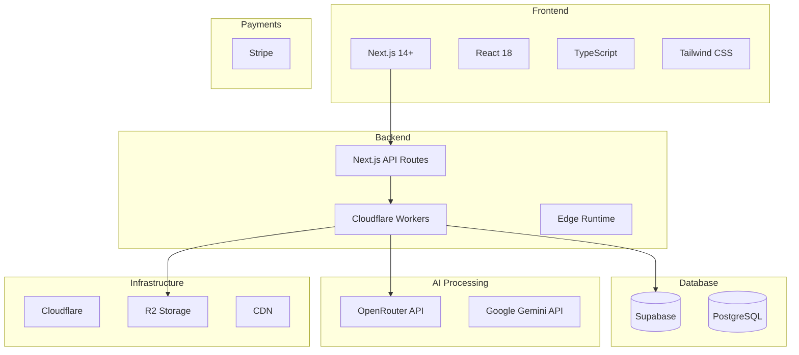
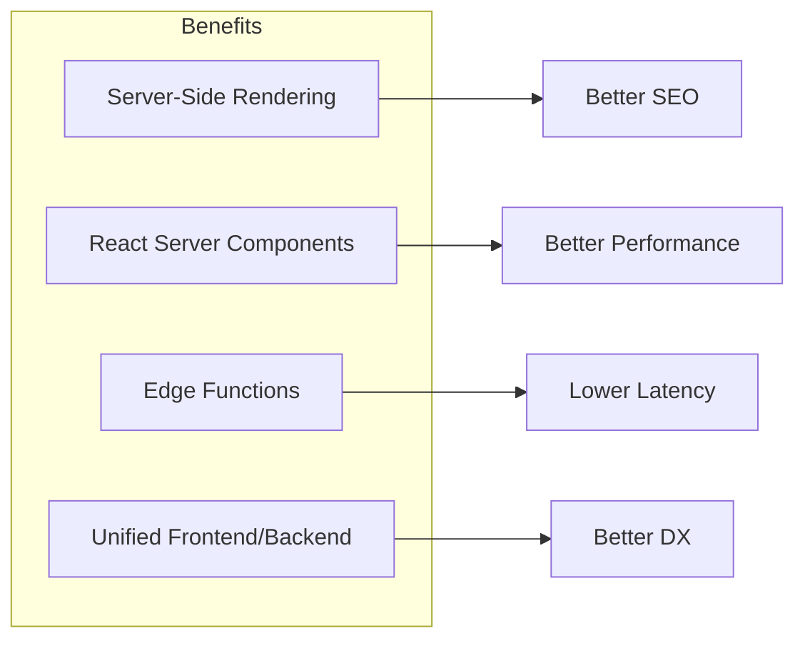
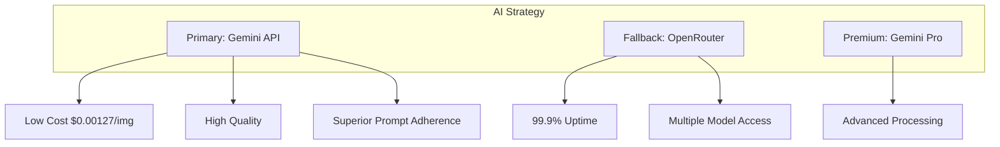
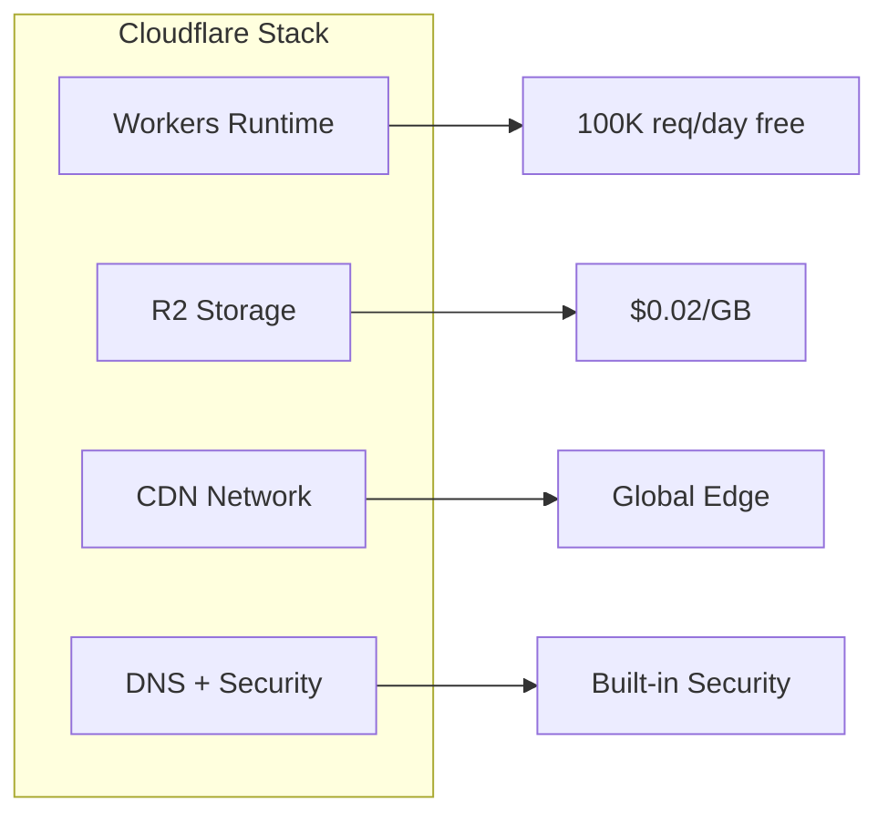
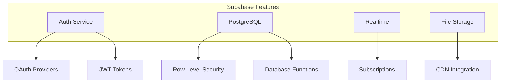
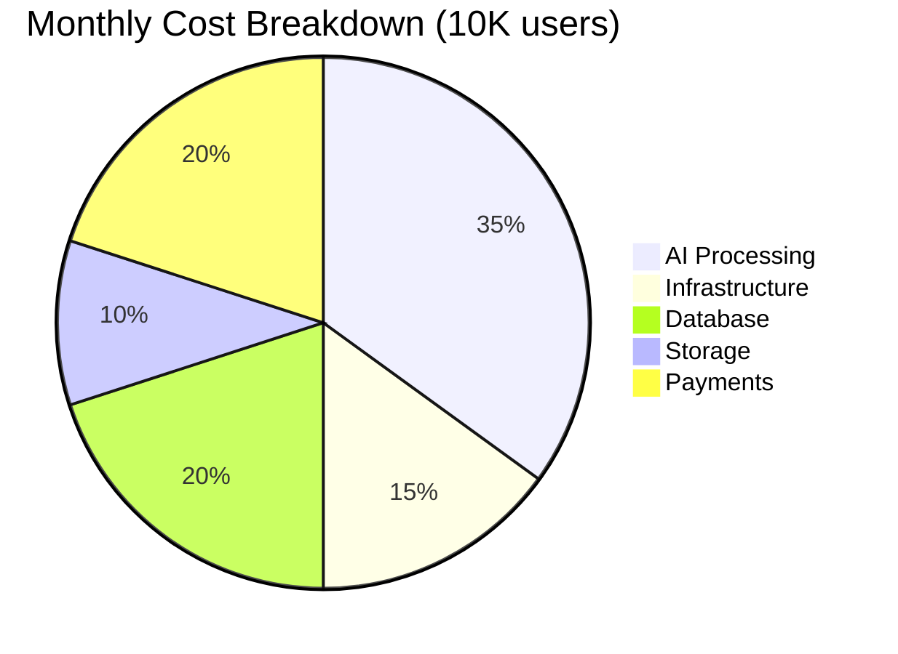
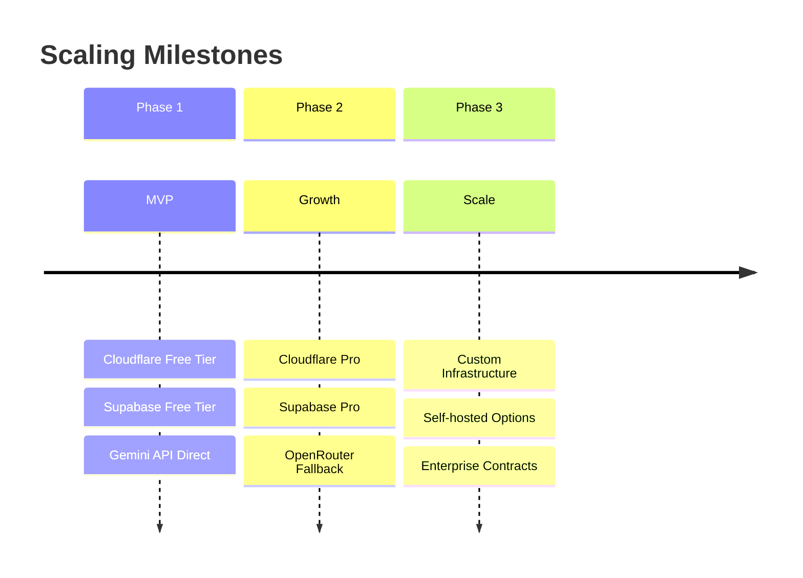

# Technology Stack

Complete technology stack for myimageupscaler.com AI Image Enhancer.

## Stack Overview



## Core Technologies

### Frontend

| Technology        | Version | Purpose                         |
| ----------------- | ------- | ------------------------------- |
| **Next.js**       | 14+     | React framework with App Router |
| **React**         | 18      | UI library                      |
| **TypeScript**    | 5.x     | Type safety                     |
| **Tailwind CSS**  | 3.x     | Utility-first styling           |
| **ShadCN/UI**     | Latest  | Component library               |
| **Framer Motion** | Latest  | Animations                      |
| **SWR**           | Latest  | Data fetching & caching         |

### Backend

| Technology                    | Version | Purpose                 |
| ----------------------------- | ------- | ----------------------- |
| **Next.js API Routes**        | 14+     | Server endpoints        |
| **Cloudflare Workers**        | Latest  | Edge runtime deployment |
| **@cloudflare/next-on-pages** | Latest  | Next.js on Cloudflare   |

### Database & Auth

| Technology             | Purpose                    |
| ---------------------- | -------------------------- |
| **Supabase**           | PostgreSQL database + Auth |
| **PostgreSQL**         | Relational database        |
| **Supabase Auth**      | Authentication service     |
| **Row Level Security** | Data isolation             |

### AI Processing

| Provider              | Model                      | Purpose                  | Cost            |
| --------------------- | -------------------------- | ------------------------ | --------------- |
| **OpenRouter**        | Various                    | AI routing & fallback    | Variable        |
| **Google Gemini API** | gemini-2.5-flash-image     | Primary image processing | ~$0.00127/image |
| **Google Gemini API** | gemini-3-pro-image-preview | Premium tier (Phase 2)   | ~$0.067/image   |

### Storage & CDN

| Service            | Purpose                   |
| ------------------ | ------------------------- |
| **Cloudflare R2**  | Object storage ($0.02/GB) |
| **Cloudflare CDN** | Global content delivery   |

### Payments

| Service                    | Purpose                  |
| -------------------------- | ------------------------ |
| **Stripe**                 | Subscriptions & payments |
| **Stripe Webhooks**        | Payment event handling   |
| **Stripe Customer Portal** | Self-service billing     |

## Architecture Decisions

### Why Next.js 14+ with App Router?



- **Server Components**: Reduce client bundle, better performance
- **Edge Runtime**: Deploy globally on Cloudflare
- **API Routes**: No separate backend needed
- **File-based Routing**: Intuitive project structure

### Why OpenRouter / Gemini API?



| Feature               | Gemini API      | OpenRouter         |
| --------------------- | --------------- | ------------------ |
| **Primary Use**       | Main processing | Fallback & routing |
| **Cost**              | Direct pricing  | Markup included    |
| **Models**            | Google models   | Multiple providers |
| **Prompt Adherence**  | 40% better      | Varies by model    |
| **Text Preservation** | Excellent       | Model dependent    |

### Why Cloudflare?



- **Cost-effective**: Generous free tier
- **Global**: 300+ edge locations
- **Integrated**: Storage, CDN, Workers in one platform
- **Fast**: Edge-first architecture

### Why Supabase?



- **All-in-one**: Auth + Database + Storage
- **PostgreSQL**: Industry-standard relational DB
- **RLS**: Built-in security at database level
- **Self-hostable**: Can migrate to own infrastructure

## Development Tools

| Tool           | Purpose          |
| -------------- | ---------------- |
| **ESLint**     | Code linting     |
| **Prettier**   | Code formatting  |
| **Husky**      | Git hooks        |
| **Jest**       | Unit testing     |
| **Playwright** | E2E testing      |
| **Sentry**     | Error monitoring |

## Environment Variables

```bash
# Supabase
NEXT_PUBLIC_SUPABASE_URL=
NEXT_PUBLIC_SUPABASE_ANON_KEY=
SUPABASE_SERVICE_ROLE_KEY=

# AI Processing
OPENROUTER_API_KEY=
GOOGLE_GEMINI_API_KEY=

# Stripe
STRIPE_SECRET_KEY=
STRIPE_WEBHOOK_SECRET=
NEXT_PUBLIC_STRIPE_PUBLISHABLE_KEY=

# Cloudflare
CLOUDFLARE_ACCOUNT_ID=
R2_ACCESS_KEY_ID=
R2_SECRET_ACCESS_KEY=
R2_BUCKET_NAME=

# App
NEXT_PUBLIC_APP_URL=
```

## Cost Analysis



| Service            | Free Tier    | Estimated Cost (10K users) |
| ------------------ | ------------ | -------------------------- |
| Cloudflare Workers | 100K req/day | $0                         |
| Cloudflare R2      | 10GB         | $10/month                  |
| Supabase           | 500MB DB     | $25/month                  |
| Gemini API         | -            | ~$127/month (100K images)  |
| Stripe             | -            | 2.9% + $0.30/txn           |

## Scalability Path


