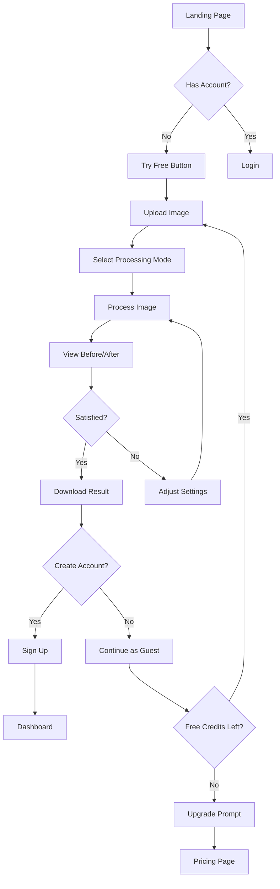
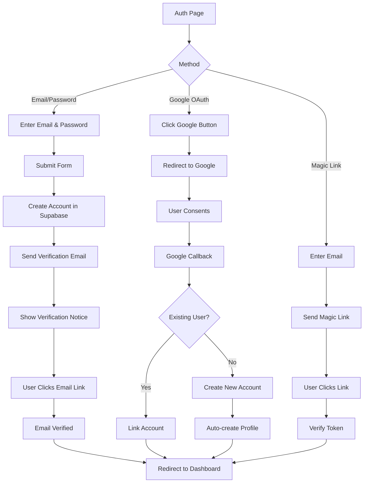
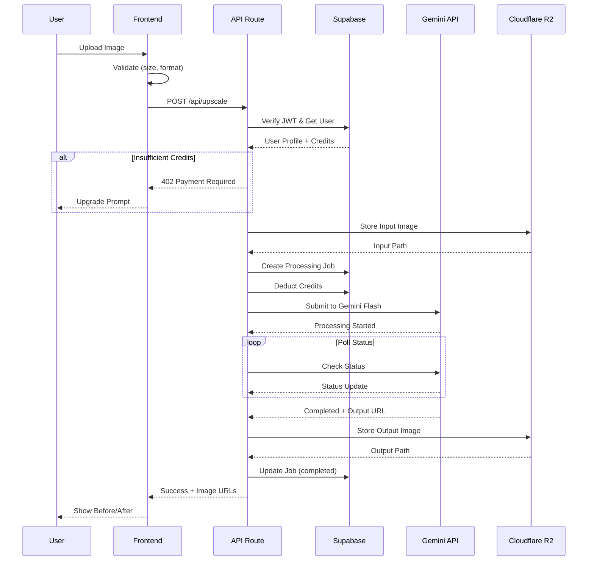
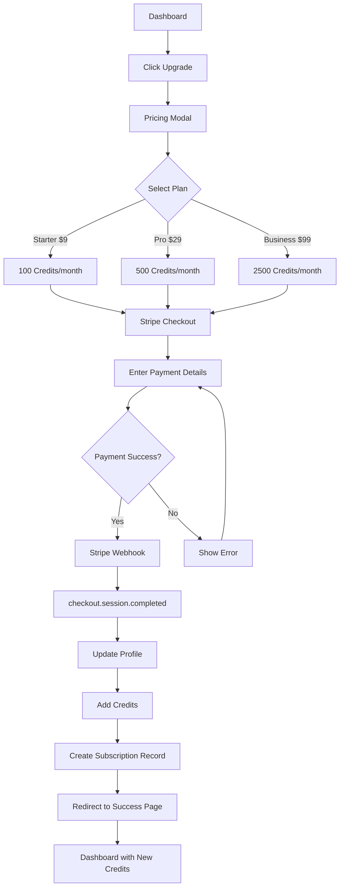
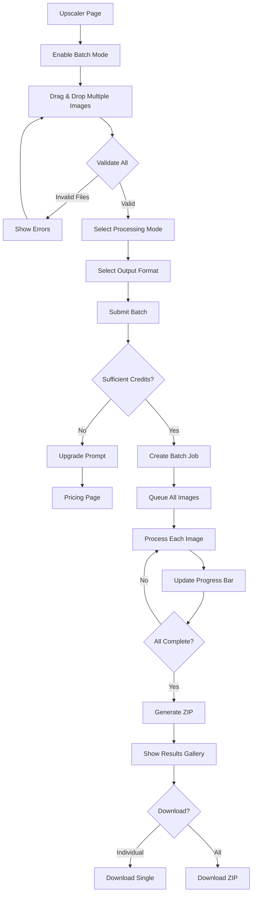
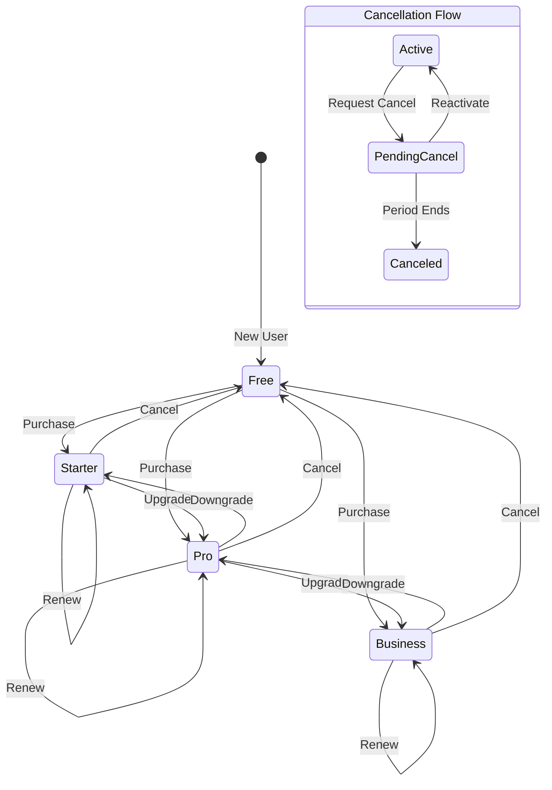
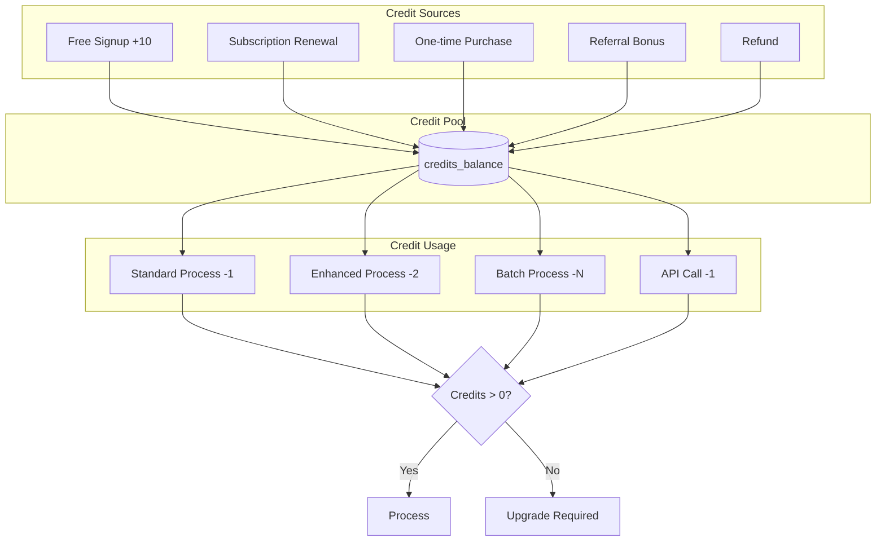
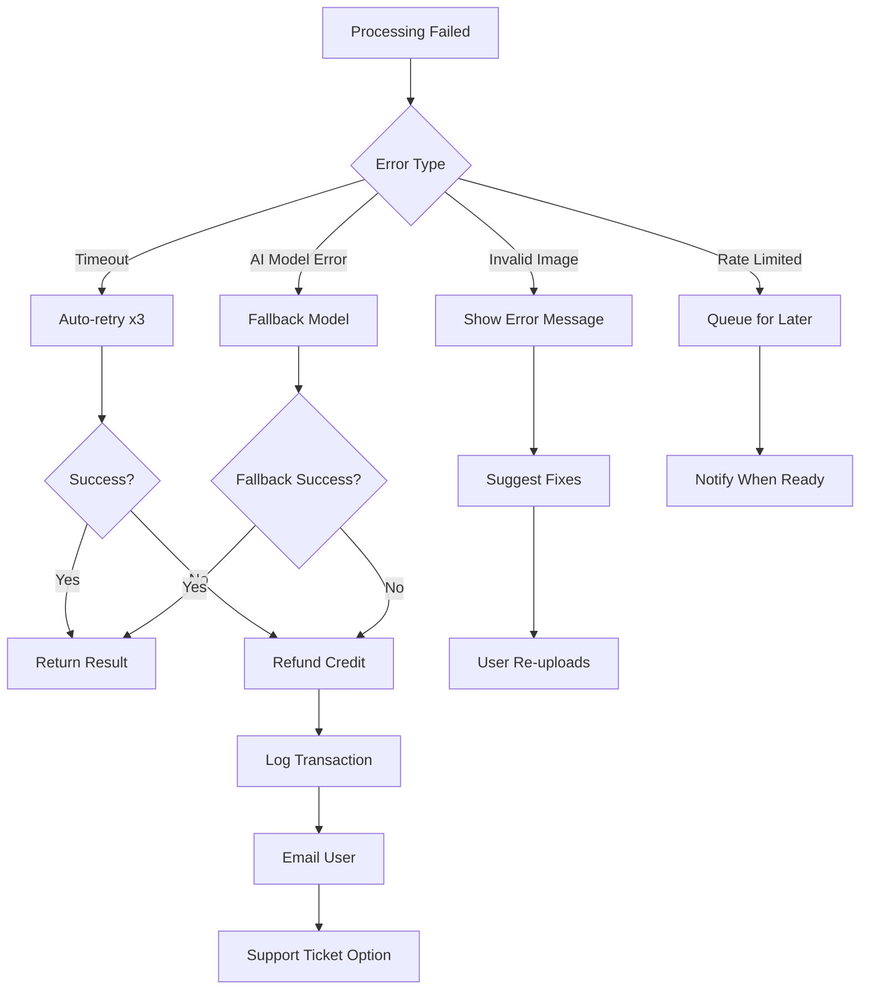
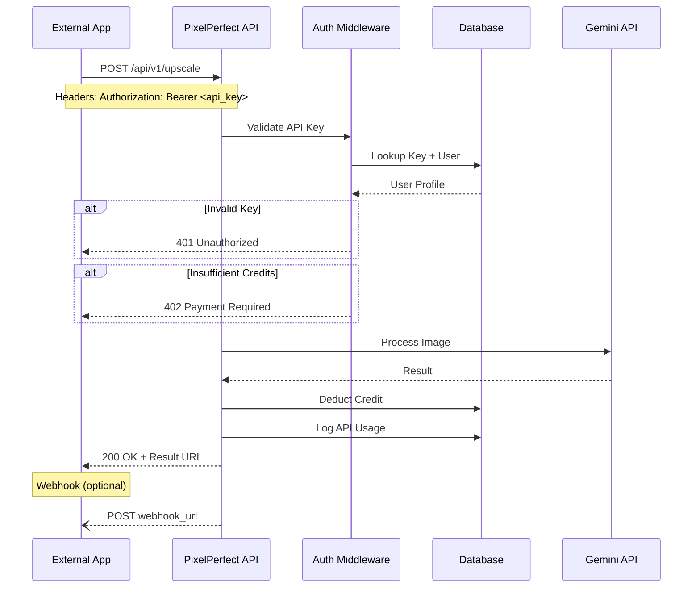
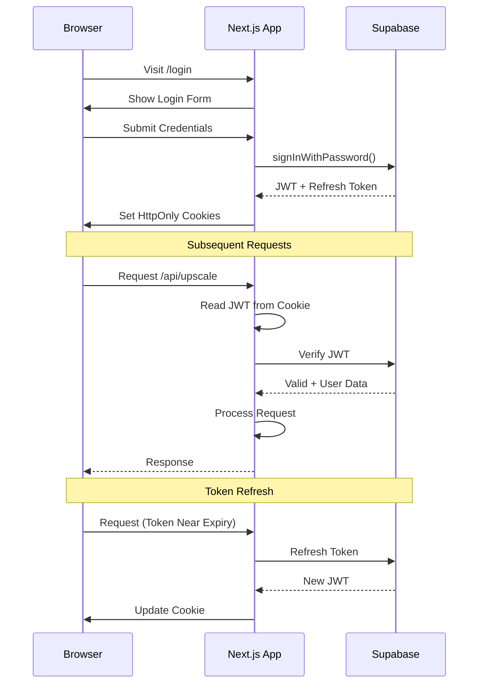

# User Flows

Detailed user journey diagrams for PixelPerfect's core features.

## 1. First-Time User (Freemium)

## 2. Registration & Authentication

## 3. Image Processing Flow

## 4. Subscription Purchase

## 5. Batch Processing (Pro/Business)

## 6. Subscription Management

## 7. Credit System Flow

## 8. Error Recovery Flow

## 9. API Integration Flow (Business Tier)

## 10. Session & Token Flow

