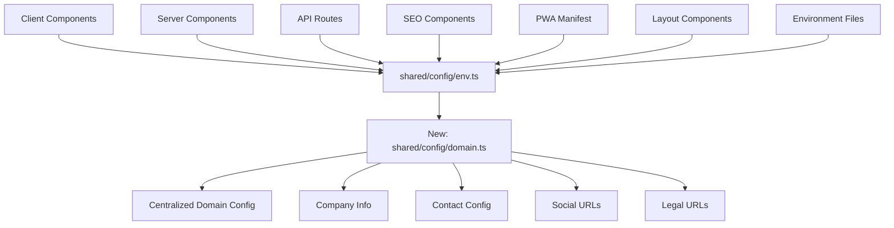
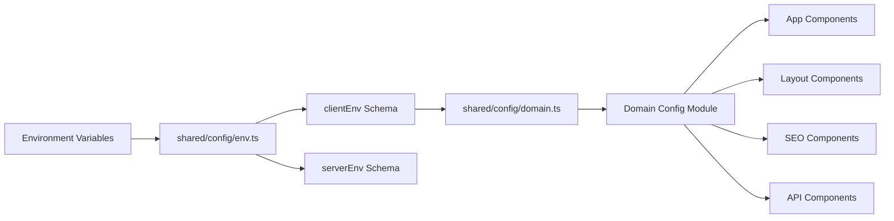
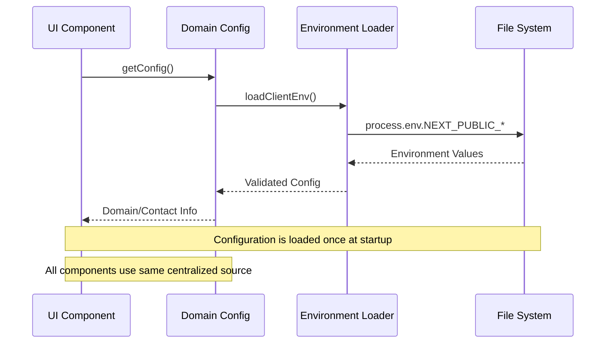

# Product Requirements Document (PRD): Centralized Domain & SaaS Configuration Management

## 1. Context Analysis

### 1.1 Files Analyzed

- `/home/joao/projects/pixelperfect/shared/config/env.ts` - Current environment configuration
- `/home/joao/projects/pixelperfect/app/layout.tsx` - Root layout with hardcoded metadata
- `/home/joao/projects/pixelperfect/app/manifest.ts` - PWA manifest with hardcoded app info
- `/home/joao/projects/pixelperfect/app/help/page.tsx` - Help page with hardcoded email addresses
- `/home/joao/projects/pixelperfect/app/canceled/page.tsx` - Payment canceled page with hardcoded email
- `/home/joao/projects/pixelperfect/app/success/page.tsx` - Payment success page with hardcoded email
- `/home/joao/projects/pixelperfect/lib/seo/schema-generator.ts` - SEO schemas with hardcoded social URLs
- `/home/joao/projects/pixelperfect/.env.client.example` - Environment variable examples
- `/home/joao/projects/pixelperfect/.env.test.example` - Test environment examples

### 1.2 Component & Dependency Overview



### 1.3 Current Behavior Summary

- **Partial centralization**: Some environment variables exist in `shared/config/env.ts` with incomplete coverage
- **Widespread hardcoding**: Email addresses, company names, social URLs, and contact information scattered throughout codebase
- **Missing configuration**: Important SaaS variables like Twitter handle, Facebook URL, support URLs not centralized
- **Inconsistent patterns**: Some files use `clientEnv`, others have hardcoded values
- **Domain fragmentation**: URLs and domain configuration spread across multiple files

### 1.4 Problem Statement

The application currently lacks centralized configuration management for essential SaaS domain and contact variables, leading to maintenance overhead and deployment risks.

## 2. Proposed Solution

### 2.1 Architecture Summary

- **Extended environment schema**: Add all required SaaS configuration variables to `shared/config/env.ts`
- **New domain config module**: Create `shared/config/domain.ts` for organized configuration access
- **Systematic refactoring**: Replace all hardcoded values with centralized configuration
- **Type safety**: Ensure all new configuration variables have proper TypeScript interfaces
- **Environment parity**: Maintain consistency between development, test, and production environments

### 2.2 Architecture Diagram



### 2.3 Key Technical Decisions

- **Zod validation**: Maintain existing Zod schema pattern for all new variables
- **Client-side safe**: All domain/contact variables are safe for client exposure
- **Backward compatibility**: Preserve existing environment variable naming patterns
- **Default values**: Provide sensible defaults for all new configuration variables
- **Type safety**: Create comprehensive TypeScript interfaces for all configuration types

### 2.4 Data Model Changes

- **No Data Changes**: This is a configuration refactoring, no database changes required
- **Environment Schema Extensions**: New fields added to `clientEnvSchema`
- **New Configuration Module**: `shared/config/domain.ts` for organized access

## 2.5 Runtime Execution Flow



## 3. Detailed Implementation Spec

### A. `shared/config/env.ts`

**Changes Needed:** Extend client environment schema with all SaaS configuration variables

**New Fields to Add:**

```typescript
// Domain URLs (extend existing)
SITE_URL: z.string().url().default('http://localhost:3000'),
DOMAIN: z.string().default('localhost:3000'),

// Complete email configuration (extend existing)
SALES_EMAIL: z.string().email().default('sales@myimageupscaler.com'),
NOREPLY_EMAIL: z.string().email().default('noreply@myimageupscaler.com'),
BILLING_SUPPORT_EMAIL: z.string().email().default('billing@myimageupscaler.com'),
PARTNERSHIPS_EMAIL: z.string().email().default('partnerships@myimageupscaler.com'),
PRESS_EMAIL: z.string().email().default('press@myimageupscaler.com'),
SECURITY_EMAIL: z.string().email().default('security@myimageupscaler.com'),
ABUSE_EMAIL: z.string().email().default('abuse@myimageupscaler.com'),
FEEDBACK_EMAIL: z.string().email().default('feedback@myimageupscaler.com'),
FEATURE_REQUEST_EMAIL: z.string().email().default('features@myimageupscaler.com'),

// Social media (new)
TWITTER_HANDLE: z.string().default('@myimageupscaler'),
FACEBOOK_URL: z.string().url().default('https://facebook.com/myimageupscaler'),
LINKEDIN_URL: z.string().url().default('https://linkedin.com/company/myimageupscaler'),
GITHUB_URL: z.string().url().default('https://github.com/joaoferro42/myimageupscaler'),

// Company information (extend existing)
COMPANY_NAME: z.string().default('MyImageUpscaler'),
PRODUCT_DESCRIPTION: z.string().default(
  'Transform your images with cutting-edge AI. Upscale, enhance, and restore details with professional quality.'
),

// Legal URLs (new)
PRIVACY_URL: z.string().url().default('/privacy'),
TERMS_URL: z.string().url().default('/terms'),
COOKIE_POLICY_URL: z.string().url().default('/cookie-policy'),

// Support URLs (new)
SUPPORT_URL: z.string().url().default('/help'),
HELP_URL: z.string().url().default('/help'),
DOCS_URL: z.string().url().default('/docs'),
FAQ_URL: z.string().url().default('/help#faq'),
```

**Justification:** Provides comprehensive coverage of all SaaS configuration needs with type safety and validation.

### B. `shared/config/domain.ts` (New File)

**Changes Needed:** Create new centralized domain configuration module

```typescript
/**
 * Centralized domain and SaaS configuration.
 *
 * This module provides organized access to all domain-related configuration
 * including company info, contact details, and URLs.
 */

import { clientEnv } from './env';

/**
 * Company information configuration
 */
export const companyConfig = {
  name: clientEnv.APP_NAME,
  fullName: clientEnv.COMPANY_NAME,
  description: clientEnv.PRODUCT_DESCRIPTION,
  baseUrl: clientEnv.BASE_URL,
  siteUrl: clientEnv.SITE_URL,
  domain: clientEnv.DOMAIN,
} as const;

/**
 * Contact information configuration
 */
export const contactConfig = {
  // General contacts
  admin: clientEnv.ADMIN_EMAIL,
  support: clientEnv.SUPPORT_EMAIL,
  sales: clientEnv.SALES_EMAIL,
  legal: clientEnv.LEGAL_EMAIL,
  privacy: clientEnv.PRIVACY_EMAIL,
  noreply: clientEnv.NOREPLY_EMAIL,

  // Business contacts
  billingSupport: clientEnv.BILLING_SUPPORT_EMAIL,
  partnerships: clientEnv.PARTNERSHIPS_EMAIL,
  press: clientEnv.PRESS_EMAIL,

  // Security contacts
  security: clientEnv.SECURITY_EMAIL,
  abuse: clientEnv.ABUSE_EMAIL,

  // Feedback contacts
  feedback: clientEnv.FEEDBACK_EMAIL,
  featureRequests: clientEnv.FEATURE_REQUEST_EMAIL,
} as const;

/**
 * Social media configuration
 */
export const socialConfig = {
  twitter: clientEnv.TWITTER_HANDLE,
  facebook: clientEnv.FACEBOOK_URL,
  linkedin: clientEnv.LINKEDIN_URL,
  github: clientEnv.GITHUB_URL,
} as const;

/**
 * Legal and support URLs
 */
export const urlConfig = {
  legal: {
    privacy: clientEnv.PRIVACY_URL,
    terms: clientEnv.TERMS_URL,
    cookiePolicy: clientEnv.COOKIE_POLICY_URL,
  },
  support: {
    support: clientEnv.SUPPORT_URL,
    help: clientEnv.HELP_URL,
    docs: clientEnv.DOCS_URL,
    faq: clientEnv.FAQ_URL,
  },
} as const;

/**
 * Export all configurations for convenience
 */
export const domainConfig = {
  company: companyConfig,
  contact: contactConfig,
  social: socialConfig,
  urls: urlConfig,
} as const;

/**
 * Type exports
 */
export type ICompanyConfig = typeof companyConfig;
export type IContactConfig = typeof contactConfig;
export type ISocialConfig = typeof socialConfig;
export type IUrlConfig = typeof urlConfig;
export type IDomainConfig = typeof domainConfig;
```

**Justification:** Provides organized, type-safe access to all domain configuration with clear categorization.

### C. `app/layout.tsx`

**Changes Needed:** Replace hardcoded values in metadata with domain configuration

**Specific Replacements:**

```typescript
// Replace hardcoded title/description with config
title: {
  default: `${domainConfig.company.fullName} - Image Upscaling & Enhancement`,
  template: `%s | ${domainConfig.company.fullName}`,
},
description: domainConfig.company.description,

// Replace hardcoded creator/publisher
authors: [{ name: domainConfig.company.fullName }],
creator: domainConfig.company.fullName,
publisher: domainConfig.company.fullName,

// Replace hardcoded Twitter handle
twitter: {
  // ... other fields
  creator: domainConfig.social.twitter,
},

// Replace hardcoded organization name
const organizationJsonLd = {
  '@context': 'https://schema.org',
  '@type': 'Organization',
  name: domainConfig.company.fullName,
  // ... other fields
};
```

**Justification:** Eliminates hardcoded values and ensures consistency across SEO metadata.

### D. `app/manifest.ts`

**Changes Needed:** Use domain configuration for PWA manifest

**Specific Replacements:**

```typescript
export default function manifest(): MetadataRoute.Manifest {
  return {
    name: `${domainConfig.company.fullName} - ${domainConfig.company.description}`,
    short_name: domainConfig.company.name,
    description: domainConfig.company.description,
    // ... rest unchanged
  };
}
```

**Justification:** Ensures PWA manifest uses consistent branding from configuration.

### E. `app/help/page.tsx`

**Changes Needed:** Replace hardcoded email addresses with configuration

**Specific Replacements:**

```typescript
// Replace: href="mailto:support@myimageupscaler.com"
href={`mailto:${domainConfig.contact.support}`}

// Replace: support@myimageupscaler.com
{domainConfig.contact.support}
```

**Justification:** Centralizes all contact information management.

### F. `app/canceled/page.tsx` and `app/success/page.tsx`

**Changes Needed:** Replace hardcoded email addresses with configuration

**Specific Replacements:**

```typescript
// Replace: href="mailto:support@myimageupscaler.com"
href={`mailto:${domainConfig.contact.support}`}
```

**Justification:** Consistent contact information across payment flow pages.

### G. `lib/seo/schema-generator.ts`

**Changes Needed:** Replace hardcoded social URLs and company name

**Specific Replacements:**

```typescript
const ORGANIZATION_SCHEMA = {
  '@type': 'Organization',
  name: domainConfig.company.fullName,
  url: domainConfig.company.baseUrl,
  // ... rest of config
  sameAs: [
    `https://twitter.com/${domainConfig.social.twitter.replace('@', '')}`,
    domainConfig.social.linkedin,
    domainConfig.social.facebook,
  ],
};
```

**Justification:** Ensures SEO schemas use consistent social media configuration.

### H. Environment Variable Files

**Changes Needed:** Add all new variables to example files

**Files to Update:**

- `.env.client.example`
- `.env.test.example`

**Additions:**

```bash
# Domain configuration
NEXT_PUBLIC_SITE_URL=http://localhost:3000
NEXT_PUBLIC_DOMAIN=localhost:3000

# Extended contact emails
NEXT_PUBLIC_SALES_EMAIL=sales@myimageupscaler.com
NEXT_PUBLIC_NOREPLY_EMAIL=noreply@myimageupscaler.com
NEXT_PUBLIC_BILLING_SUPPORT_EMAIL=billing@myimageupscaler.com
NEXT_PUBLIC_PARTNERSHIPS_EMAIL=partnerships@myimageupscaler.com
NEXT_PUBLIC_PRESS_EMAIL=press@myimageupscaler.com
NEXT_PUBLIC_SECURITY_EMAIL=security@myimageupscaler.com
NEXT_PUBLIC_ABUSE_EMAIL=abuse@myimageupscaler.com
NEXT_PUBLIC_FEEDBACK_EMAIL=feedback@myimageupscaler.com
NEXT_PUBLIC_FEATURE_REQUEST_EMAIL=features@myimageupscaler.com

# Social media
NEXT_PUBLIC_TWITTER_HANDLE=@myimageupscaler
NEXT_PUBLIC_FACEBOOK_URL=https://facebook.com/myimageupscaler
NEXT_PUBLIC_LINKEDIN_URL=https://linkedin.com/company/myimageupscaler
NEXT_PUBLIC_GITHUB_URL=https://github.com/joaoferro42/myimageupscaler

# Company information
NEXT_PUBLIC_COMPANY_NAME=MyImageUpscaler
NEXT_PUBLIC_PRODUCT_DESCRIPTION=Transform your images with cutting-edge AI...

# Legal URLs
NEXT_PUBLIC_PRIVACY_URL=/privacy
NEXT_PUBLIC_TERMS_URL=/terms
NEXT_PUBLIC_COOKIE_POLICY_URL=/cookie-policy

# Support URLs
NEXT_PUBLIC_SUPPORT_URL=/help
NEXT_PUBLIC_HELP_URL=/help
NEXT_PUBLIC_DOCS_URL=/docs
NEXT_PUBLIC_FAQ_URL=/help#faq
```

**Justification:** Provides complete environment variable examples for development and testing.

## 4. Step-by-Step Execution Plan

### Phase 1: Core Configuration Infrastructure

- [ ] **Task 1**: Extend `shared/config/env.ts` with complete SaaS configuration schema
- [ ] **Task 2**: Create `shared/config/domain.ts` with organized configuration modules
- [ ] **Task 3**: Update TypeScript interfaces and exports
- [ ] **Task 4**: Add comprehensive environment variable documentation

### Phase 2: Environment File Updates

- [ ] **Task 5**: Update `.env.client.example` with all new variables
- [ ] **Task 6**: Update `.env.test.example` with all new variables
- [ ] **Task 7**: Validate environment variable loading and validation

### Phase 3: High-Priority Refactoring (Email Addresses)

- [ ] **Task 8**: Refactor `app/help/page.tsx` - replace hardcoded email addresses
- [ ] **Task 9**: Refactor `app/canceled/page.tsx` - replace support email
- [ ] **Task 10**: Refactor `app/success/page.tsx` - replace support email
- [ ] **Task 11**: Test email links and contact forms

### Phase 4: Branding and Company Information

- [ ] **Task 12**: Refactor `app/layout.tsx` - replace hardcoded company names in metadata
- [ ] **Task 13**: Refactor `app/manifest.ts` - use configuration for app info
- [ ] **Task 14**: Update JSON-LD structured data with configuration
- [ ] **Task 15**: Test SEO metadata and PWA functionality

### Phase 5: Social Media and URL Configuration

- [ ] **Task 16**: Refactor `lib/seo/schema-generator.ts` - replace hardcoded social URLs
- [ ] **Task 17**: Update any remaining hardcoded URLs in components
- [ ] **Task 18**: Test social media links and URL generation

### Phase 6: Documentation and Testing

- [ ] **Task 19**: Update configuration documentation
- [ ] **Task 20**: Create configuration validation utilities
- [ ] **Task 21**: Add unit tests for configuration modules
- [ ] **Task 22**: Perform comprehensive integration testing

### Phase 7: Validation and Deployment

- [ ] **Task 23**: Verify all configuration values in development environment
- [ ] **Task 24**: Test configuration loading in different environments
- [ ] **Task 25**: Validate no hardcoded values remain in critical files
- [ ] **Task 26**: Prepare deployment checklist and rollback procedures

## 5. Testing Strategy

### Unit Tests

- Configuration module loading and validation
- Environment variable parsing and defaults
- Type safety and interface compliance
- Error handling for missing/invalid configurations

### Integration Tests

- Email links functionality across all pages
- SEO metadata generation with configuration
- Social media link generation
- PWA manifest configuration

### Edge Cases

| Scenario                     | Expected Behavior                              |
| ---------------------------- | ---------------------------------------------- |
| Missing environment variable | Use sensible default value                     |
| Invalid email format         | Throw Zod validation error                     |
| Invalid URL format           | Throw Zod validation error                     |
| Empty configuration          | Fallback to hardcoded defaults                 |
| Production deployment error  | Clear error logging with configuration details |

### Regression Tests

- Verify all existing functionality works with new configuration
- Test email delivery from refactored components
- Validate SEO metadata appears correctly
- Check social media sharing functionality

## 6. Acceptance Criteria

- [ ] All hardcoded email addresses replaced with `domainConfig.contact.*`
- [ ] All hardcoded company names replaced with `domainConfig.company.*`
- [ ] All hardcoded social URLs replaced with `domainConfig.social.*`
- [ ] Environment variable schemas include all new SaaS configurations
- [ ] Configuration module exports are properly typed
- [ ] No hardcoded domain/contact values remain in application code
- [ ] All configuration values have sensible defaults
- [ ] Environment example files are complete and accurate
- [ ] Email links, social links, and SEO metadata work correctly
- [ ] Configuration validation provides helpful error messages
- [ ] Rollback procedures are documented and tested

## 7. Verification & Rollback

### Success Criteria

- Configuration loading completes without errors
- All email addresses and URLs render correctly in UI
- SEO metadata validates with structured data testing tools
- PWA installation uses correct app name and description
- Environment variable changes propagate through entire application

### Rollback Plan

**Immediate Rollback (< 30 minutes):**

1. Revert `shared/config/env.ts` to previous version
2. Delete `shared/config/domain.ts`
3. Restore hardcoded values in refactored files
4. Verify application functionality

**Feature Flag Rollback:**

- Configuration module can be disabled by reverting imports
- Hardcoded values can be temporarily restored for emergency fixes
- Environment variables can be set to previous values in deployment pipeline

### Monitoring

- Configuration loading errors logged with structured format
- Email click tracking to verify link correctness
- SEO metadata validation in search console
- PWA install analytics to verify manifest configuration
- Environment variable validation in CI/CD pipeline

---

**Implementation Priority**: High - This refactoring reduces deployment risk and improves maintainability
**Estimated Timeline**: 2-3 days for complete implementation
**Risk Level**: Low - Configuration changes with backward compatibility maintained
